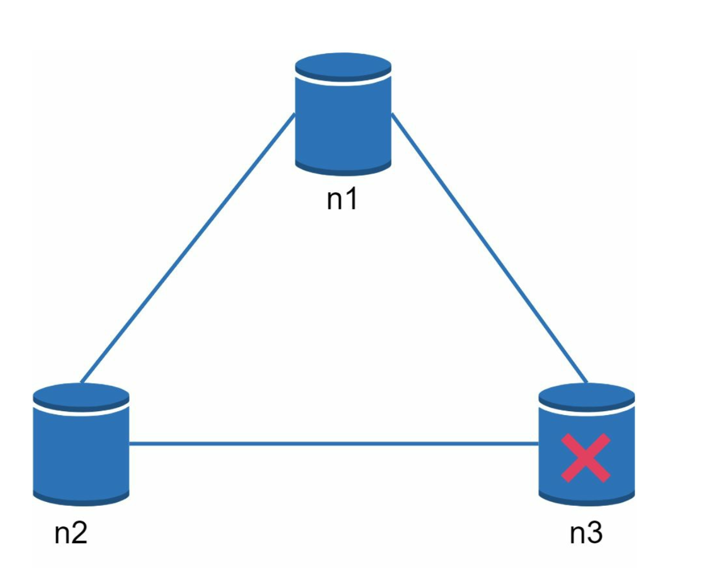
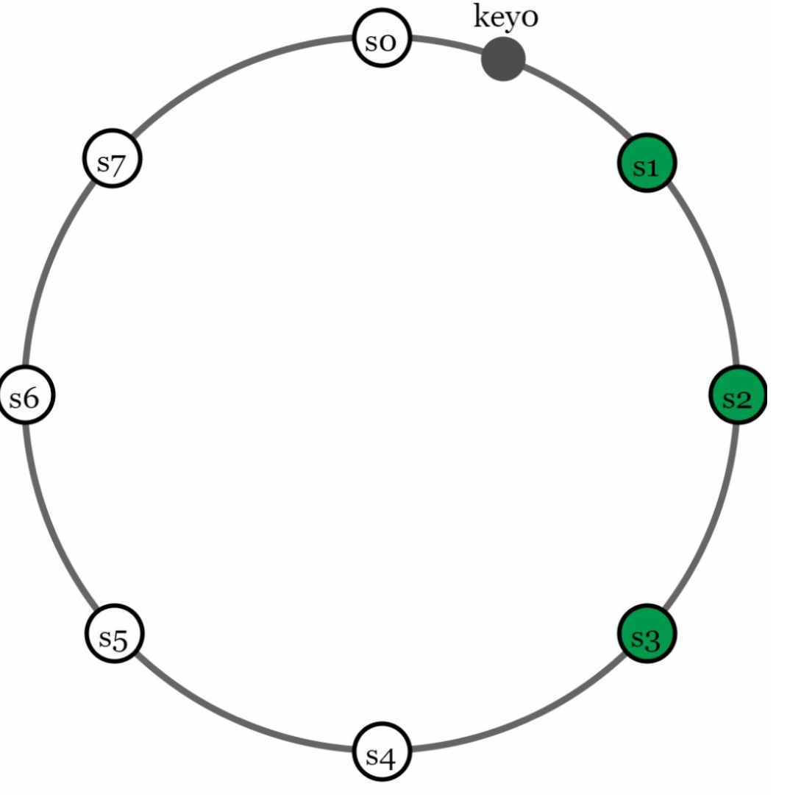
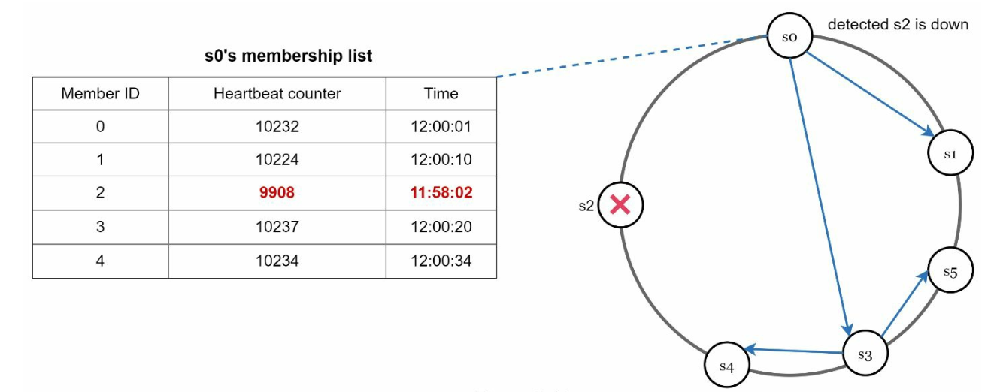
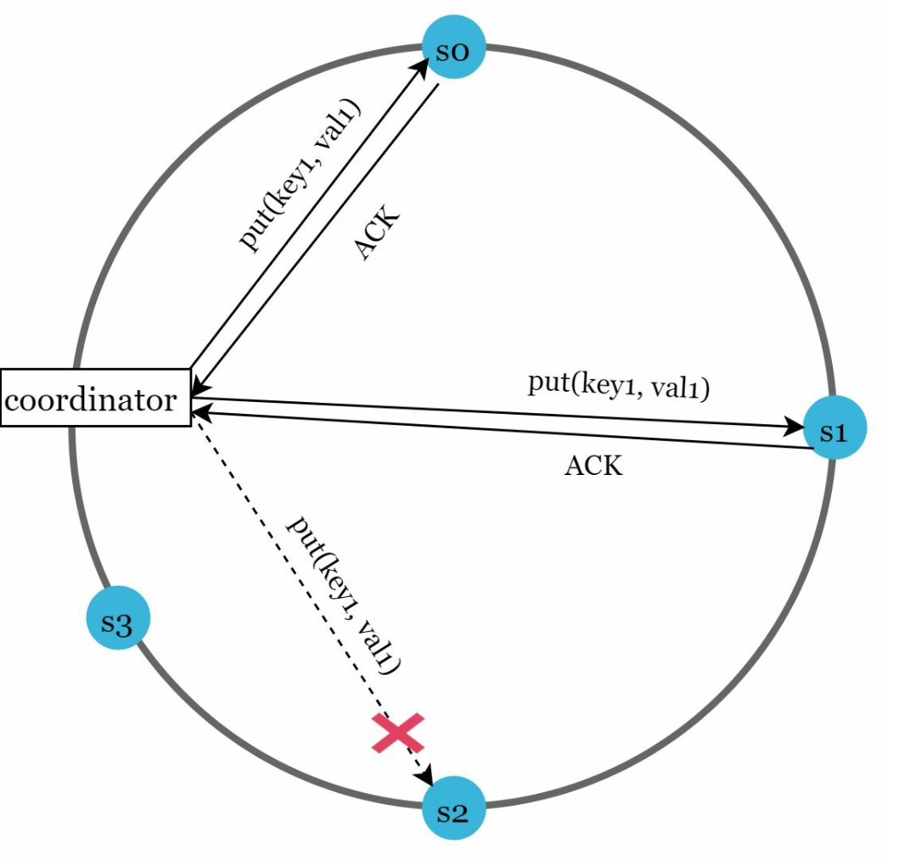
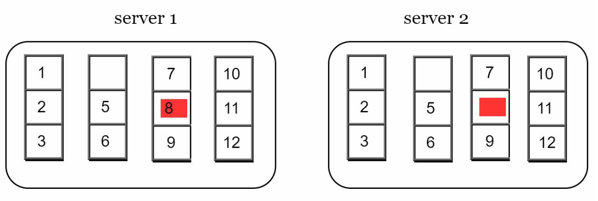
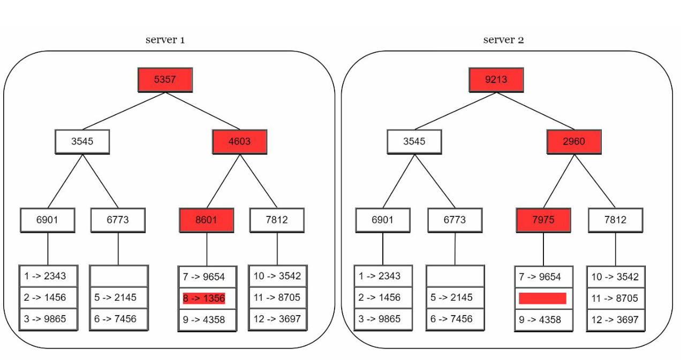

# Chapter 6: Design a Key-Value Store

## Introduction
A **key-value store** is a type of non-relational database where data is stored as key-value pairs. Each key is unique, and values are accessed using these keys. This chapter details how to design a scalable, high-availability distributed key-value store that supports operations like:
- `put(key, value)` for inserting data.
- `get(key)` for retrieving data.

### Characteristics of the Design
- Small key-value pairs (<10 KB).
- Supports big data with high availability and scalability.
- Automatic scaling and tunable consistency.
- Low latency.

---

## Single Server Key-Value Store
### Implementation
- Use a **hash table** to store key-value pairs in memory.
- Optimizations:
  - Data compression.
  - Storing less frequently accessed data on disk.

### Limitation
A single server's memory is limited, requiring a **distributed approach** for scalability.

---

## Distributed Key-Value Store
A **distributed key-value store** partitions data across multiple servers and must address trade-offs outlined by the **CAP theorem**.

### CAP Theorem
1. **Consistency:** All clients see the same data simultaneously.
2. **Availability:** The system responds to every request, even if some nodes are down.
3. **Partition Tolerance:** The system continues to operate despite network partitions.

**Trade-off:** According to CAP theorem only two of the three guarantees can be achieved.

  

#### System Types:
- **CP Systems:** Consistency and partition tolerance while sacrificing availability (e.g., banking systems).
- **AP Systems:** Availability and partition tolerance while sacrificing consistency (e.g., eventual consistency).
- **CA Systems:** Consistency and Availability while sacrificing partition tolerance.

    **Since network failure is unavoidable, a distributed system must tolerate network partition. Thus, a CA system cannot exist in real-world applications.**

    In a distributed system, partitions are inevitable. When a partition occurs, we must choose between consistency and availability. For example, if node n3 goes down, 
    any data written to nodes n1 or n2 cannot be propagated to n3. Conversely, if data is written to n3 but not yet propagated to n1 and n2, nodes n1 and n2 will have stale data.

    

    
    

    
- If we choose CP system, we must block all write operations to n1 and n2 to avoid data inconsistency.
- If we choose AP system, the system keeps accepting reads, even though it might return stale data. 
For writes, n1 and n2 keep accepting writes,
and data will be synced to n3 when the network partition is resolved.

---

## System Components
### 1. Data Partitioning
- **Technique:** Consistent Hashing is used to distribute data across multiple servers evenly.
- **Advantages:**
  - Automatic scaling with server addition/removal.
  - Heterogeneity through virtual nodes. The number of virtual nodes for a server is proportional to the server capacity.

### 2. Data Replication
- Replicate data across `N` servers for high availability.
- The N servers are chosen by walking clockwise from the server position and choose the first N servers on the ring to store data copies.Place replicas in distinct data centers to improve reliability in case of virtual nodes.

    

    
    

### 3. Consistency
Since data is replicated at multiple nodes, it must be synchronized across replicas.
- **Quorum Consensus:**
  - `N`: Total replicas.
  - `W`: Write quorum size. For a write to be considered successful, write must be acknowledged from W replicas.
  - `R`: Read quorum size. For a read to be considered as successful, read must wait for responses from at least R replicas.
  - **Rule:** `W + R > N` ensures strong consistency.
  - The configuration of W, R and N is a typical tradeoff between latency and consistency. 

    

    
    

    
    - If R = 1 and W = N, the system is optimized for a fast read.
    - If W = 1 and R = N, the system is optimized for fast write.
    - If W + R > N, strong consistency is guaranteed (Usually N = 3, W = R = 2).
    - If W + R <= N, strong consistency is not guaranteed.

- **Models**:
  - **Strong Consistency:** A read operation returns a value corresponding to the result of the most updated write data item.
  - **Weak Consistency:** Subsequent read operations may not see the most updated value.
  - **Eventual Consistency:** Given enough time, all updates are propagated, and all replicas are consisten

### 4. Inconsistency Resolution
Replication gives high availability but causes inconsistencies among replicas. Versioning and
vector locks are used to solve inconsistency problems.
- **Versioning:** 
    - Use **vector clocks** to track data versions and resolve conflicts.
    - Versioning means treating each data modification as a new immutable version of data.
        

        
        
        

    
    - Server 1 changes the name , and server 2 also changes the name. These two changes are performed simultaneously. Now, we have conflicting values, called versions v1 and v2.

- **Vector Clock**
    1. **Setup**: A vector clock is a [server, version] pair associated with a data item. It can be used to check
        if one version precedes, succeeds, or in conflict with others.
        - Assume a vector clock represented by D([S1, v1], [S2, v2], …, [Sn, vn]), If data item D is written to server
        Si, the system must perform one of the following tasks.
        - Where: `D` is the data item.`Si` is the server identifier.`vi` is the version counter for the data at server `Si`.

    2. **Updating the Vector Clock:**  When a data item is modified at a server:
        - If the server exists in the vector clock, its version counter is incremented.
        - Otherwise, a new entry is added to the vector clock.

    3. **Conflict Detection:**
        - **No Conflict:** A version X is an ancestor of version Y if all counters in X are less than or equal to those in Y.
        - **Conflict Exists:** Two versions are siblings if there is at least one counter in Y that is less than its counterpart in X.

    4. **Conflict Resolution:** When conflicts are detected (sibling versions), the system relies on application-specific logic or client intervention to   reconcile the data.

        

        
        

- **Challenges:**
  - Increased complexity for clients.
  - Vector clock size may grow with many updates, requiring trimming strategies to limit its size.

### 5. Handling Failures

#### a. Failure Detection
It is insufficient to believe that a server is down because another server says so.Usually, it requires at least two independent sources of information to mark a server down.
- **Gossip Protocol:**
    

        
    

    - Each node maintains member IDs and heartbeat counters.
    - Each node periodically increments its heartbeat counter.
    - Each node periodically sends heartbeats to a set of random nodes.
    - If the heartbeat has not increased for more than predefined periods, the member is
    considered as offline

#### b. Temporary Failures
- **Sloppy Quorum:** Use healthy nodes to maintain operations temporarily.
        

        
        

    - After detecting failures, the system needs to deploy certain mechanisms to ensure availability
    - Instead of enforcing the quorum requirement, the system chooses the first W healthy servers for writes and first R
    healthy servers for reads on the hash ring. 
    - Offline servers are ignored. If a server is unavailable, another server will process requests temporarily

- **Hinted Handoff:** Offline servers catch up with changes upon recovery.
    - When the down server is up, changes will be pushed back to achieve data consistency

#### c. Permanent Failures
- Use **Merkle Trees** for efficient synchronization between replicas.
    A **Merkle Tree** (or hash tree) is a data structure to efficiently detect and resolve inconsistencies between replicas during permanent failures. 

- Working
    1. **Structure:**
        - **Leaf Nodes** store the hash of individual data blocks.
        - **Non-Leaf Nodes** store the hash of their child nodes.
        - The **root hash** represents the combined state of all data in the tree.

    2. **Building a Merkle Tree:**
        - **Step 1:** Divide the key space into buckets.
            
            

        - **Step 2:** Hash each key in a bucket using uniform hashing.

            

        - **Step 3:** Create a single hash for each bucket.
        
            

        - **Step 4:** Combine hashes of buckets to compute higher-level hashes, culminating in the root hash.

            

    3. **Synchronization:**
        - To synchronize two replicas:
            - Compare their root hashes.
            - If the root hashes match, the replicas are consistent.
            - If the root hashes differ, compare child hashes recursively to identify inconsistent buckets.
        - Only the inconsistent data is synchronized.

- Advantages
    - **Efficiency:** Only inconsistent data is synchronized, reducing data transfer.
    - **Scalability:** Effective for large datasets with minimal synchronization overhead.
    - **Reliability:** Ensures data consistency across replicas.

### 6. Handling Data Center Outages
- Replicate data across multiple data centers to ensure availability during outages.

---

## Write and Read Paths
### 1. Write Path (Based on Cassandra architecture)

    

- Persist the write in a **commit log**.
- Save data to a **memory cache**.
- Flush data to **SSTable** (Sorted String Table) on disk when cache is full.

   

### 2. Read Path

    
    

- Check **memory cache** for the data.
- If absent, use a **Bloom Filter** to locate the data in SSTables.
- Retrieve and return the data.

---

## Final Architecture

-  Clients communicate with the key-value store through simple APIs: get(key) and put(key,
value).
- A coordinator is a node that acts as a proxy between the client and the key-value store.
- Nodes are distributed on a ring using consistent hashing.
- The system is completely decentralized so adding and moving nodes can be automatic.
- Data is replicated at multiple nodes.
- There is no single point of failure as every node has the same set of responsibilities.

---

## Most Asked Interview Questions

**Q1. What are the key design goals for a distributed key-value store?**
> (1) Low latency reads and writes; (2) High availability (system stays operational even when nodes fail); (3) Scalability to petabytes of data; (4) Tunable consistency (different use cases need different guarantees); (5) Automatic scaling and rebalancing. Real examples: Amazon DynamoDB, Apache Cassandra, Redis Cluster.

**Q2. Explain the CAP theorem in the context of a key-value store.**
> Amazon Dynamo chooses AP (Availability + Partition Tolerance), accepting eventual consistency. It always accepts writes and resolves conflicts during reads. Relational DBs choose CP (Consistency + Partition Tolerance), sacrificing availability under partitions. You cannot have all three simultaneously in a distributed system.

**Q3. How does eventual consistency work, and how do clients handle stale reads?**
> After a write, replicas converge to the same value eventually (typically milliseconds to seconds). During the window, some reads may return stale data. Clients handle this via: (1) Read-your-own-writes consistency (route reads to the same replica that accepted the write); (2) Conditional writes (e.g., compare-and-swap); (3) Application-level versioning to detect staleness.

**Q4. What is a gossip protocol and how is it used for failure detection?**
> Gossip is a peer-to-peer communication protocol where each node periodically shares its state (heartbeat counter + node list) with a few random neighbors. Neighbors propagate this information to their neighbors. If a node's heartbeat stops incrementing, it is considered failed. This allows failure detection without a centralized coordinator, though detection latency is O(log N) rounds.

**Q5. Explain quorum reads and writes. How do you choose W, R, and N values?**
> N = number of replicas; W = number of replicas that must confirm a write; R = number of replicas queried for a read. For strong consistency: W + R > N (at least one replica overlap between write and read sets). For high availability: W = 1 (fast writes, risk stale reads). Common: N=3, W=2, R=2 balances consistency and availability; N=3, W=1, R=3 favors write availability.

**Q6. What is a vector clock and how does it help resolve data conflicts?**
> A vector clock is a list of (server, version) counters attached to each data item. When a write occurs on a server, it increments its own counter. This allows the system to determine causality: if clock A is dominated by clock B, B is newer. If neither dominates (concurrent writes), there's a true conflict requiring application-level resolution (last-write-wins, merge, or user prompt).

**Q7. How does Amazon DynamoDB handle write conflicts?**
> DynamoDB uses last-write-wins (LWW) based on timestamps by default for eventual consistency tables. For strong consistency reads, it routes reads to the primary replica. For conditional writes (optimistic locking), it supports `ConditionExpression` — the write fails if the item has changed since the client last read it, allowing atomic compare-and-swap semantics.

**Q8. What is the difference between strong and eventual consistency?**
> Strong consistency: every read reflects the most recent write. Reads wait for all replicas to sync before returning data (higher latency). Eventual consistency: reads may return stale data, but will converge to the latest value over time (lower latency, higher availability). Use strong for financial data, reservations, inventory. Use eventual for social likes, page view counters, activity feeds.

**Q9. How does compaction work in an LSM-Tree?**
> An LSM-Tree (Log-Structured Merge Tree) writes data in memory (MemTable), then flushes to immutable sorted files (SSTables) on disk. As SSTables accumulate, a background process merges and compacts them: merging K sorted files into one larger sorted file, discarding deleted/overwritten values. This keeps read performance manageable (fewer files to scan) while maintaining high write throughput.

**Q10. How would you handle a hotkey problem in a key-value store?**
> (1) Shard the hot key value: split a single key's value across multiple keys (e.g., `counter:user123:shard0` through `shard9`) and aggregate on read; (2) Replicate the hot key to additional servers and load-balance reads across them; (3) Cache the hot key at an application level (local in-memory cache per server); (4) Apply request coalescing — batch multiple reads for the same key into one.

**Q11. What is the difference between a key-value store and a relational database?**
> A key-value store maps a key to an opaque value blob — no schema, no relationships, no SQL queries, no joins. This makes it extremely fast for simple get/put operations and infinitely scalable horizontally. A relational DB supports structured data, complex queries, joins, and ACID transactions but scales writes less easily. Use KV stores for caches, session stores, and high-throughput counters.

**Q12. How does data replication work in an eventual consistency key-value store like Cassandra?**
> Cassandra replicates each key to N nodes (configured via replication factor). On write, the coordinator sends the write to all N replicas. With W=1, it acknowledges after just one confirmation. Replicas sync asynchronously using hinted handoff (storing writes for offline replicas temporarily), read repair (comparing replicas during reads), and anti-entropy (Merkle tree comparison to sync diverged replicas).

**Q13. What is hinted handoff in a distributed key-value store?**
> If a target replica node is temporarily unavailable during a write, another node stores a "hint" — the data intended for the unavailable node, along with its address. When the target recovers, the hint-holder replays the write. This ensures that even during brief node failures, writes are not permanently lost and eventual consistency is maintained.

**Q14. What is a Bloom filter and how is it used in key-value stores?**
> A Bloom filter is a probabilistic data structure that answers "is this key definitely NOT in this SSTable?" with zero false negatives (but allows false positives). Since LSM-Tree reads may scan multiple SSTables, a per-SSTable Bloom filter lets the system skip scanning SSTables that definitely don't contain the key. Used by RocksDB, Cassandra, and HBase to reduce read amplification.

**Q15. What is read repair in a distributed key-value store?**
> When a client reads a key with quorum (R > 1 replica), the coordinator compares responses from all replicas. If any replica returns a stale value (detected via timestamps or version numbers), the coordinator sends a write to update the stale replica asynchronously (after returning the correct value to the client). This slowly converges replicas that have fallen behind.

**Q16. What is the Merkle tree and how is it used in anti-entropy synchronization?**
> A Merkle tree is a hash tree where each leaf is the hash of a data block and each parent node is the hash of its children. Two nodes can compare their Merkle trees to find which key ranges differ — only subtrees with mismatching root hashes need to be synchronized. This dramatically reduces the amount of data that must be compared during replica reconciliation.

**Q17. How does compaction affect read and write performance in an LSM-Tree?**
> Writes: always fast — just append to the MemTable/WAL, never update in-place. Reads: may require scanning multiple SSTables (read amplification — mitigated by Bloom filters and compaction). Compaction: runs in the background, causes write amplification (data is rewritten multiple times). The trade-off: high write throughput at the cost of background CPU/disk during compaction.

**Q18. What is write amplification and why does it matter in storage-backed KV stores?**
> Write amplification is the ratio of data actually written to disk vs. data logically written by the application. In LSM-Trees, compaction rewrites data multiple times before it reaches the bottom level — write amplification can be 10–30×. This accelerates SSD wear and consumes I/O bandwidth. RocksDB provides tuning options to balance write amplification vs. read amplification vs. space amplification.

**Q19. How would you design an in-memory key-value store with LRU eviction?**
> Combine a HashMap (O(1) get/put by key) with a Doubly Linked List (O(1) move-to-front/remove-from-tail). On get: move the accessed node to the front. On put: insert at front; if at capacity, remove the tail (LRU item). This is the classic LRU Cache design (used in Redis). The HashMap holds key → DLL node pointers; the DLL tracks recency order.

**Q20. What is the difference between a key-value store and a wide-column store like Cassandra?**
> A pure key-value store maps one key to one value blob. A wide-column store (like Cassandra/HBase) maps a row key to a map of column families — each row can have thousands of columns with individual TTLs. This supports richer query patterns (scan a range of columns, filter by column name) while retaining horizontal scalability. It's a key → {column: value} mapping.

**Q21. How do you design a TTL (Time-To-Live) feature in a key-value store?**
> Two approaches: (1) Lazy deletion — check expiry on every read and return null if expired; delete in the background; (2) Proactive scanning — a background thread scans keys sorted by expiry time and deletes them before reads. Redis uses a hybrid: lazy deletion on access + probabilistic proactive scanning to cap memory from expired-but-unread keys.

**Q22. How would you support range queries in a key-value store?**
> Pure key-value stores (hash-based) don't natively support range queries. To add range support: (1) Use a sorted data structure (B-tree or LSM-Tree sorted by key); (2) Organize keys by prefix (e.g., `userid:timestamp`) so a range scan by user is a key prefix scan; (3) Maintain a secondary sorted index. Cassandra's clustering keys enable efficient range queries within a partition.

**Q23. How does Redis achieve sub-millisecond latency?**
> Redis stores all data in memory, eliminating disk I/O for reads/writes. It uses a single-threaded event loop (no lock contention). Its data structures (hash maps, sorted sets, lists) are highly optimized. Persistence (AOF/RDB) is handled asynchronously to avoid blocking the main thread. Network is the dominant latency factor (~0.1–0.5ms for a local data center call).

**Q24. What is the difference between a cache and a key-value store?**
> A cache is a temporary, optional layer for frequently accessed data — data can be lost and re-fetched. A KV store is a persistent, authoritative data store — data loss is unacceptable. Caches use eviction (LRU/LFU); KV stores use TTL for data lifecycle but retain data until explicitly deleted. Redis serves both roles depending on configuration.

**Q25. How would you handle node addition and data migration in a KV store using consistent hashing?**
> When a new node joins: (1) Assign it virtual node positions on the hash ring; (2) Identify predecessor nodes that own key ranges now belonging to the new node; (3) Stream those keys to the new node in the background; (4) Update routing tables across the cluster (gossip propagation); (5) Predecessors can delete their copies after confirming the new node has all keys.

**Q26. What are the trade-offs between synchronous and asynchronous replication in a KV store?**
> Synchronous: write waits until W replicas confirm → stronger durability (no data loss on primary failure) but higher write latency and reduced availability (if replicas are slow/down). Asynchronous: write returns after primary only → low latency, high availability, but potential data loss if primary fails before replication. Most systems offer both (tunable via W parameter).

**Q27. How would you implement a "counter" feature (like Redis INCR) correctly in a distributed KV store?**
> A counter needs atomic increment. Options: (1) Use a single-writer pattern — route all increments for a key to one node (loses some distribution); (2) Use CAS (compare-and-swap) loop — read, increment, write with condition; (3) Use a CRDT G-Counter — each node maintains a local count; merge is sum of all node counts, enabling conflict-free distributed increments. Redis INCR uses single-threaded atomicity.

**Q28. What is the difference between soft delete and hard delete in a key-value store?**
> Hard delete: remove the key-value pair immediately. Soft delete: mark the key with a tombstone (a special deleted marker with a timestamp). Tombstones are necessary in LSM-Trees because deleted keys might still exist in older SSTables — the tombstone suppresses old values during reads and merges until compaction finally removes both the tombstone and old data.

