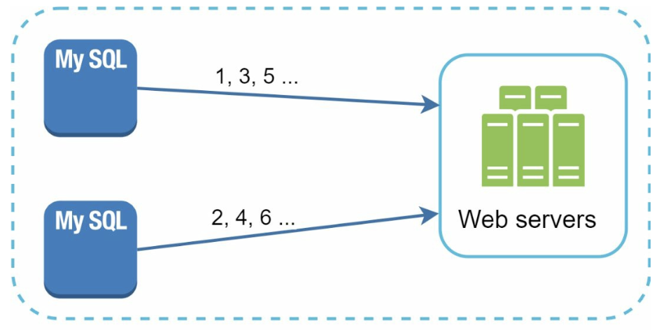
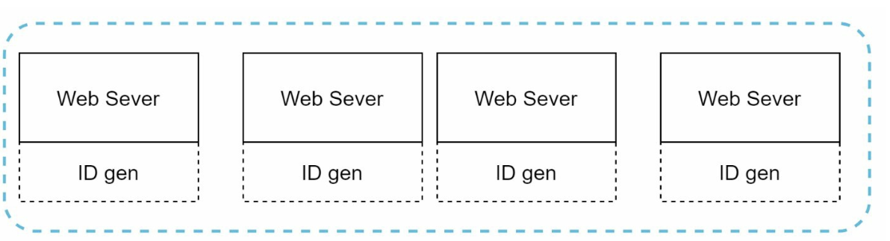
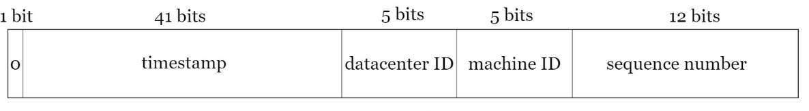

# Chapter 7: Design a Unique ID Generator in Distributed Systems

## Introduction
This chapter addresses the challenge of designing a **unique ID generator** for distributed systems. Traditional auto-increment keys are unsuitable in distributed environments due to scalability and synchronization challenges. The focus is on creating unique, sortable, 64-bit numerical IDs that meet the following requirements:
- IDs must be **unique** and **ordered by date**.
- IDs must fit within **64 bits**.
- The system should generate **over 10,000 IDs per second**.

---

## Step 1: Understanding the Problem
### Basic Requirements
- IDs must be unique and numerical and should fit in 64 bi.
- IDs increment with time but not strictly by `+1`.
- IDs should be sortable by date.
- System must handle high throughput (10,000 IDs/sec).

---

## Step 2: High-Level Design Options
### 1. Multi-Master Replication
- **Approach:** Use database `auto_increment` with step increments (e.g., `+k` for k servers).

    

    
    

- **Drawbacks:**
  - Hard to scale across data centers.
  - IDs do not always increase with time.
  - Scaling issues when servers are added/removed.

### 2. UUID (Universally Unique Identifier)
- **Approach:** 
    - Generate 128-bit unique identifiers independently on each server using UUID.
    - UUIDs can be generated independently without coordination between servers

        

        
        

- **Advantages:**
  - No coordination needed between servers.
  - Scales easily with web servers.
- **Drawbacks:**
  - Exceeds 64-bit requirement.
  - IDs are not sortable by time and may be non-numeric.

### 3. Ticket Server
- **Approach:** Use a centralized database server to increment and assign IDs.

    

    
    

- **Advantages:**
  - Simple to implement for small-scale systems.
  - Generates numeric IDs.
- **Drawbacks:**
  - Single point of failure.
  - Synchronization challenges in multi-server setups.

### 4. Twitter Snowflake Approach
- **Approach:** 

    

      
    

    

      
    

    - Divide IDs into sections to ensure uniqueness and scalability.
    - **Sign Bit (1 bit):** Always `0`, potentially distinguishing signed and unsigned numbers.
    - **Timestamp (41 bits):** Milliseconds since a custom epoch (Twitter's default is `1288834974657`, equivalent to Nov 04, 2010, 01:42:54 UTC). Ensures IDs are time-ordered.
    - **Datacenter ID (5 bits):** Identifies up to `2^5 = 32` datacenters.
    - **Machine ID (5 bits):** Identifies up to `2^5 = 32` machines within each datacenter.
    - **Sequence Number (12 bits):** Tracks IDs generated on a machine within the same millisecond, supporting up to `2^12 = 4096` IDs per millisecond. The sequence resets to `0` every millisecond.

- **Advantages:**
    - **Scalability:** Handles 10,000+ IDs per second across multiple servers.
    - **Time-Order:** Ensures IDs are sortable by time.
    - **Decentralization:** No single point of failure.

## Step 4: Additional Considerations
### 1. Clock Synchronization
- **Challenge:** ID generation assumes synchronized clocks across servers.
- **Solution:** Use **Network Time Protocol (NTP)** to minimize drift.

### 2. Section Length Tuning
- Adjust section sizes (e.g., fewer sequence bits, more timestamp bits) based on use case.

### 3. High Availability
- ID generators are mission-critical and must be fault-tolerant.
- Consider redundancy and failover mechanisms.

---

## Most Asked Interview Questions

**Q1. Why can't you use auto-increment IDs in a distributed system?**
> Auto-increment requires a central coordinator to guarantee uniqueness across nodes — a single point of failure and a bottleneck. Multiple DB shards can't each auto-increment independently without eventual collisions. Distributed systems require ID generation that works independently on each node with no coordination.

**Q2. What is Twitter's Snowflake algorithm and how does it work?**
> Snowflake generates 64-bit IDs: 1 sign bit (unused) + 41 bits timestamp (ms since epoch, lasts ~69 years) + 10 bits datacenter/machine ID (up to 1024 machines) + 12 bits sequence number (up to 4096 IDs per millisecond per machine). Combining these gives globally unique, roughly time-sortable IDs at 4M+ IDs/sec per machine. No coordination between machines is needed.

**Q3. How does the Snowflake ID encode timestamp, datacenter, machine, and sequence into 64 bits?**
> Bit layout: `[0][41-bit timestamp][5-bit datacenter id][5-bit machine id][12-bit sequence]`. The timestamp uses custom epoch (e.g., Twitter started from 2010) to maximize the 41-bit range. The sequence resets to 0 each millisecond; if it overflows (4096/ms), the generator waits for the next millisecond. The result is a 64-bit integer sortable by creation time.

**Q4. What happens when the system clock skews backward in a Snowflake generator?**
> If the clock goes backward (even by 1ms), the generator might produce duplicate IDs (same timestamp + sequence as before). Solutions: (1) Refuse to generate IDs until the clock catches up (add a small wait); (2) Track the last-used timestamp and reject clock backward jumps beyond a threshold; (3) Use a monotonic clock source that never goes backward. Most implementations use option 1 or 2.

**Q5. What is the maximum number of IDs per millisecond per machine in Snowflake?**
> The 12-bit sequence allows 2^12 = 4,096 unique IDs per millisecond per machine. Across 1,024 machines (10-bit machine ID), that's ~4.2 billion unique IDs per millisecond globally — far more than any real-world system needs.

**Q6. How do you ensure Snowflake IDs are sortable by creation time?**
> Since the most significant bits carry the timestamp, sorting the 64-bit integers numerically produces roughly time-ordered output. IDs generated within the same millisecond are ordered by sequence number (arbitrary among that microsecond window). This enables efficient time-range queries in the database by simply scanning the primary key index.

**Q7. What are the trade-offs between UUID and Snowflake IDs?**
> UUID (v4): 128 bits, random → no time ordering, large storage (16 bytes vs. 8 bytes), poor DB index locality (random inserts cause B-tree page splits). Snowflake: 64 bits, time-ordered → excellent DB index locality (sequential inserts), smaller storage, ~monotonically increasing. UUID (v7) adds a timestamp prefix to fix ordering. Use Snowflake-style for high-performance distributed systems.

**Q8. What is a ticket server and how does it generate unique IDs?**
> A ticket server is a dedicated server with a single auto-increment database (e.g., MySQL). Services request a batch of IDs (e.g., 1000 at a time) and use them locally. Advantages: simple, produces sequential IDs. Disadvantages: single point of failure (mitigated by redundant ticket servers with separate ranges), network round-trip for each batch, limited throughput.

**Q9. How would you generate unique IDs without a centralized service?**
> Options: (1) UUID v4 — random, universally unique without coordination; (2) Snowflake — each machine generates independently using machine ID; (3) Hash of content + timestamp; (4) ULIDs (Universally Unique Lexicographically Sortable Identifier) — 128-bit, time-prefix sortable, random suffix. All avoid central coordination at the cost of weaker ordering guarantees.

**Q10. How would you design a unique ID generator that survives machine failures with zero downtime?**
> Use Snowflake with multiple independent ID generator machines. Each machine has a unique machine ID (assigned via ZooKeeper or a registry). If one machine fails, other machines continue generating IDs independently. Since IDs from different machines never conflict (distinct machine ID bits), no failover coordinator is needed — just route away from the failed machine.

**Q11. What is a ULID and how does it compare to UUID and Snowflake?**
> ULID (Universally Unique Lexicographically Sortable Identifier): 128 bits = 48-bit millisecond timestamp + 80-bit random. URL-safe base32 encoded (26 chars). Advantages over UUID: sortable by creation time, no hyphens. Advantages over Snowflake: no machine ID management, 128-bit so collision risk is negligible. Trade-off: larger than Snowflake's 64 bits.

**Q12. What is the epoch in Snowflake and why does it matter?**
> The 41-bit timestamp stores milliseconds elapsed since a custom epoch (rather than Unix epoch of 1970). By choosing a recent custom epoch (e.g., Jan 1, 2010), you extend the useful lifespan of the 41-bit range. 2^41 ms ≈ 69 years. With a 2010 epoch, IDs are valid until ~2079. Without a custom epoch (using Unix 1970), you'd have only used up years of that range already.

**Q13. How does the 10-bit machine identifier work in Snowflake? How are machine IDs assigned?**
> 10 bits = up to 1,024 unique machines/workers. Machine IDs can be assigned via: (1) ZooKeeper — each worker registers and gets an assigned ID; (2) Consul or etcd with leader election; (3) Manual configuration per host; (4) Using the last 10 bits of the private IP address (risk of collision if IPs aren't unique). ZooKeeper is the most common production approach.

**Q14. How do you handle the ID generator when its clock doesn't advance fast enough?**
> If a machine generates more than 4,096 requests in a single millisecond (Snowflake sequence overflows), the generator must wait until the next millisecond before issuing more IDs. In practice, this is rare — 4,096 IDs/ms = 4M IDs/sec. If you genuinely need more, use multiple generator instances partitioned by worker ID.

**Q15. Can Snowflake IDs be decoded to extract creation time?**
> Yes — since the timestamp is embedded in the most significant bits, you can extract it: `timestamp = (snowflake_id >> 22) + custom_epoch`. This is useful for debugging (when was this record created?), TTL calculations, and partitioning. Note this only gives millisecond precision, not sub-millisecond.

**Q16. What is the difference between a globally unique ID and a monotonically increasing ID?**
> Globally unique: no two IDs are ever the same across the entire system — ensured by UUID, Snowflake, etc. Monotonically increasing: every new ID is strictly greater than all previous IDs — only possible with a single issuer. Snowflake IDs are monotonically increasing per machine (same machine ID) but not globally (different machines issue independent sequences). Database auto-increment is both if single-node.

**Q17. How do database IDs affect index performance?**
> Sequential IDs (auto-increment, Snowflake) insert at the right edge of the B-tree index — minimal page splits, excellent cache locality, sequential disk writes. Random IDs (UUID v4) insert at random positions — high page split rate, cache thrashing, fragmented index. At high insert rates (millions/day), random IDs cause measurable write amplification and index bloat.

**Q18. How would you design an ID generator for a multi-tenant SaaS application?**
> Options: (1) Global Snowflake — same generator for all tenants, IDs unique globally; (2) Per-tenant auto-increment — tenant A's records are 1,2,3; problem: exposes record count; (3) Tenant-scoped UUIDs with tenant_id prefix for URLs to avoid enumeration. Include tenant_id in composite keys, not in the ID itself, to simplify routing and avoid leaking tenant data.

**Q19. What is UUID v1 and why is it not suitable for high-security systems?**
> UUID v1 embeds the MAC address of the generating machine and a timestamp. This means: (1) UUIDs are predictable — an attacker who knows a UUID can guess nearby UUIDs (time-based sequence); (2) The MAC address leaks infrastructure information. UUID v4 (random) or UUID v7 (time-ordered random) are preferred for security-sensitive use cases.

**Q20. How does Instagram generate photo IDs?**
> Instagram uses a Postgres-based system: each shard has a two-part 64-bit ID: 41 bits for timestamp (ms since custom epoch) + 13 bits for shard ID + 10 bits for sequence. IDs are generated by a Postgres stored function using `NEXTVAL` within each shard — no centralized coordinator, but IDs are logically sortable by creation time. Documented in Instagram's 2012 engineering blog.

**Q21. How would you design an ID generator that is resistant to enumeration attacks?**
> Use UUIDs (128-bit random) for externally exposed IDs to prevent sequential guessing. Internally (for database primary keys), use Snowflake for performance. Map external UUID → internal integer ID in the API layer. This gives internal query performance without exposing enumerable IDs to attackers.

**Q22. What is the trade-off between using 64-bit vs. 128-bit IDs?**
> 64-bit: half the storage of 128-bit, fits in a long/int64 (no string conversion needed), better DB index performance. 128-bit (UUID): essentially zero collision probability without coordination, more flexibility. For a system generating 10,000 IDs/sec, 64-bit Snowflake lasts 69 years; UUID handles unlimited scale. Most distributed systems use 64-bit Snowflake internally.

**Q23. How would you handle the case where your Snowflake machine ID registry (ZooKeeper) goes down?**
> (1) Cache the assigned machine ID locally on disk — on restart, use the cached ID without re-registration; (2) Configure a TTL on the ZooKeeper lease longer than any expected downtime; (3) Fall back to UUID generation until ZooKeeper recovers (with an operational alert). The key is never to reuse a machine ID that might still be active — so cached IDs are safe; IDs from dead machines can be reused only after a safe timeout.

**Q24. What is the "guard bit" in Snowflake's 64-bit layout?**
> The most significant bit (bit 63) is always 0. This ensures the ID is a positive signed 64-bit integer in languages/databases that treat integers as signed. Without it, half the ID space would produce negative numbers in Java/Go/SQL, causing sorting and comparison bugs. The trade-off: 1 bit less, reducing the total usable space by half.

**Q25. How would you implement distributed unique ID generation without any external dependency (no ZooKeeper, no Redis)?**
> Use a combination of: (1) UUID v4 (zero coordination, just random bytes); (2) Physical machine MAC address + timestamp + counter (risky due to MAC address reuse and security concerns); (3) Snowflake with machine ID derived from the container's IP last bits (works if IP uniqueness is guaranteed by your infrastructure); (4) Timestamp + random padding (risk of collision if clock resolution is low). For most systems, UUID v4 is the simplest zero-dependency choice.

**Q26. Why is it important that IDs do not reveal business information?**
> Sequential IDs (1, 2, 3...) allow competitors or attackers to infer: total number of records, creation order, record creation rate. Use UUIDs or non-sequential Snowflake IDs for externally visible identifiers. For example, if an e-commerce order ID is sequential, competitors can determine your order volume by creating two orders a day apart and subtracting. Always obfuscate business metrics in public-facing IDs.

**Q27. How would you test a distributed unique ID generator for correctness?**
> (1) Unit test: generate 10M IDs on one machine and verify no duplicates via a hash set; (2) Concurrency test: 100 threads generating IDs simultaneously — check for duplicates; (3) Multi-node test: run 10 workers with different machine IDs, pool all IDs, verify global uniqueness; (4) Clock skew test: simulate backward-moving clock and verify the generator correctly waits or rejects; (5) Verify time-sortability by comparing IDs generated at known timestamps.

