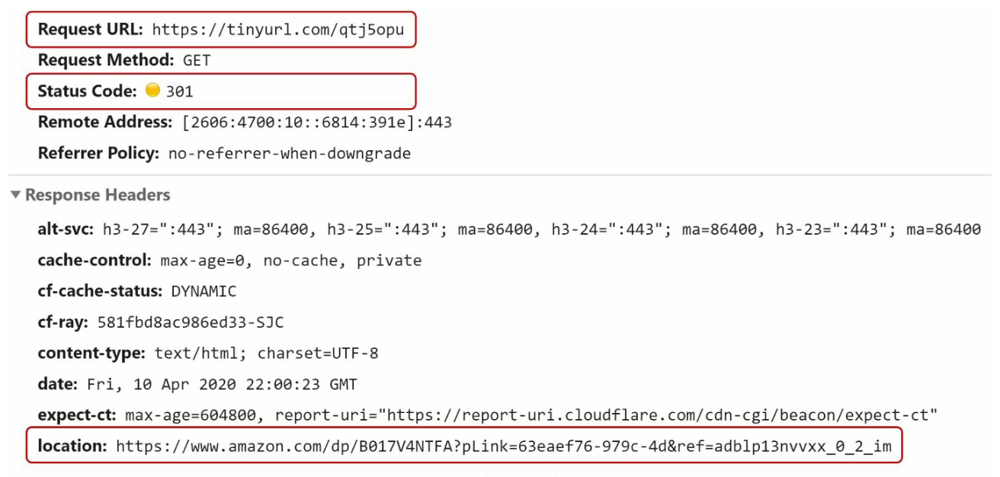
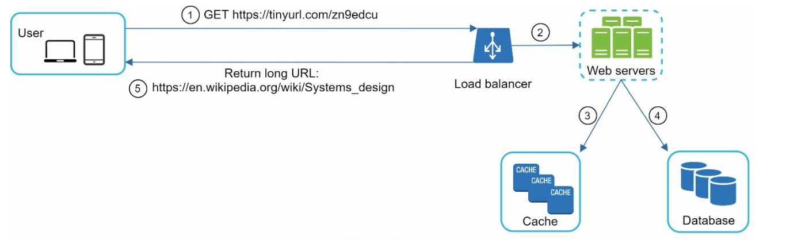

# Chapter 8: Design a URL Shortener

## Introduction
This chapter discusses the design of a URL shortening service like TinyURL. The system's main goals include **URL shortening**, **redirecting**, and **high scalability** to handle large traffic volumes.

### Requirements
- Shortened URLs must be **unique** and as **short as possible**.
- Handle **100 million URL generations per day** with a 10-year support capacity.
- Support **efficient read operations** with a 10:1 read-to-write ratio.
- Store 365 billion records, requiring approximately **365 TB** of storage over 10 years.

---

## Step 1: High-Level Design

### API Endpoints
1. **URL Shortening:**  
   - Endpoint: `POST api/v1/data/shorten`  
   - Parameters: `{longUrl: longURLString}`  
   - Returns: `shortURL`

2. **URL Redirecting:**  
   - Endpoint: `GET api/v1/shortUrl`  
   - Returns: `longURL` for redirection.

    

    
    

### URL Redirection
- **301 Redirect:**  A 301 redirect shows that the requested URL is “permanently” moved to the long URL. The browser caches the response, and
subsequent requests for the same URL will not be sent to the URL shortening service.
- **302 Redirect:** Temporary; useful for analytics like tracking clicks.

### URL Shortening

    

- Use a **hash function** to generate a short URL, mapping long URLs to unique shortened versions.
- The hash function must satisfy the following requirements:
    - Each longURL must be hashed to one hashValue.
    - Each hashValue can be mapped back to the longURL.
    

---

## Step 2: Deep Dive into Design

### Data Model
Store `<shortURL, longURL>` mappings in a relational database to optimize memory usage. The table schema includes:
- `id` (primary key),
- `shortURL`,
- `longURL`.

    

### Hash Function
#### 1. Base 62 Conversion:
- Encodes numbers using characters `[0-9, a-z, A-Z]`, providing **62 possible characters**.
- Base conversion is another approach commonly used for URL shorteners. 
- A unique id can be assigned to the short url and ID can be base 62 converted to get the short URL.
- A 7-character hash supports up to **3.5 trillion unique URLs**, enough for 365 billion URLs.

**Example:**  
Convert ID `2009215674938` to Base 62:
- `2009215674938` → `zn9edcu`.

#### 2. Hash + Collision Resolution:
- Use hash functions like CRC32, MD5, or SHA-1.

    

- One approach is to collect the first 7 characters of a hash value; however, this method can lead to hash collisions.
- To resolve collisions,recursively append a new predefined string until no more collision but this can be expensive.
- Resolve collisions with **Bloom Filters** for efficient lookup.

    

    
    

### Comparison

-  **Hash + Collision Resolution:**
    - Fixed short URL length
    - Does not need a unique ID generator
    - Collision is possbile and needs resolution
    - Not possible to find the next available short URL because it does not depend on ID

- **Base 62 Conversion**
    - The length is not fixed and goes up with ID
    - It needs a unique ID generator
    - Collision is not possbile
    - Easy to find the next short URL if ID increments by 1 (Can be a security concern)

---

### URL Shortening Flow

    

1. Check if `longURL` exists in the database.
2. If found, return the existing `shortURL`.
3. Otherwise:
   - Generate a unique ID using a **distributed ID generator**.
   - Convert the ID to `shortURL` using Base 62.
   - Store the `<id, shortURL, longURL>` mapping in the database.

---

### URL Redirecting Flow

    

1. User clicks a `shortURL`.
2. Query `<shortURL, longURL>` mapping:
   - Check the **cache** first for faster access.
   - If not in the cache, query the database.
3. Redirect the user to `longURL`.

---

## Additional Considerations
### Rate Limiter
- Prevent abuse by setting limits on requests per IP.

### Scalability
1. **Web Tier:** Stateless, scalable by adding/removing web servers.
2. **Database Tier:** Use replication and sharding.

### Analytics
- Collect data like click rates, source, and timestamps for business insights.

### High Availability and Reliability
- Ensure consistent and reliable services using database replication and fault-tolerant design.

---

## Most Asked Interview Questions

**Q1. How does a URL shortener convert a long URL to a short one?**
> Two main approaches: (1) Hash the long URL (e.g., MD5, CRC32) and take the first 7 characters — risk of collisions; (2) Use a counter: every new URL gets an auto-incrementing ID, then encode the ID into Base62 (a-z, A-Z, 0-9) to produce a short human-readable key. The Base62 key is stored in a DB mapping short → long URL.

**Q2. Why is Base62 preferred over Base64 for short URL keys?**
> Base62 (a-z, A-Z, 0-9) avoids URL-unsafe characters (`+` and `/` in Base64), eliminating the need for percent-encoding. A 7-character Base62 string gives 62^7 ≈ 3.5 trillion unique URLs, more than enough for any realistic use case. Base62 keys are also more human-friendly and easier to type.

**Q3. How would you handle hash collisions in a URL shortener?**
> For hash-based approach: after hashing, check if the short key already maps to a different long URL. If so, append a suffix (e.g., `+1`) and re-hash until finding a free slot. For counter-based approach: there are no collisions since each counter value is unique. Counter+Base62 is generally preferred over hashing for this reason.

**Q4. What is the difference between a 301 and 302 redirect, and which should you use?**
> 301 Permanent Redirect: browsers cache it — future requests for the short URL go directly to the long URL without hitting your server. 302 Temporary Redirect: browsers always check your server first. Use 301 to reduce server load (saves bandwidth); use 302 to track every click for analytics (every request reaches your server). For analytics-heavy systems, 302 is preferred despite higher load.

**Q5. How would you estimate storage requirements for a URL shortener?**
> 100M new URLs/day × 10 years = 365 billion URLs. Each record: ~100 bytes (short key + long URL + metadata) → 36.5 TB total. With indexes: ~73 TB. Database choice: a key-value store (Redis, DynamoDB) or RDBMS, typically with the short key as primary key for O(1) lookups.

**Q6. How do you ensure uniqueness of shortened URLs at high write throughput?**
> Use a counter-based approach with a centralized ID generator (or Snowflake-based distributed generator). Encode the ID into Base62. Since the ID is globally unique, the resulting Base62 key is also unique with no collision checking needed. You can pre-generate a pool of available keys and allocate them from a queue to avoid ID generator bottlenecks.

**Q7. How can you support custom short URLs (vanity URLs)?**
> Allow users to specify their preferred short key (e.g., `sho.rt/mycompany`). Check the DB for existence; if free, reserve it. Add a unique constraint on the `short_key` column. Reject or suggest alternatives for conflicts. Store a flag distinguishing auto-generated vs. user-defined keys so you can differentiate them in analytics and management.

**Q8. How would you implement click analytics (tracking clicks, source, timestamps)?**
> On each redirect (302), asynchronously publish a click event to a message queue (Kafka). A downstream consumer processes events and writes to an analytics store (ClickHouse, Redshift, or BigQuery). Capture: timestamp, short URL, referrer, user-agent (device type), IP → geo lookup. Use batch processing for aggregations (clicks per hour/day, top referrers). This avoids slowing down the redirect path.

**Q9. How would you scale the URL shortener to handle 365 billion records?**
> Shard the database by the short key (or by user ID for user-scoped URLs). Use consistent hashing to distribute shards. Keep the hot path (redirect lookups) in cache (Redis): the top 20% of URLs serve 80% of traffic → cache ~70 billion URLs × 100 bytes ≈ 700 GB (distributed Redis cluster). Read replicas handle remaining read traffic.

**Q10. What are the security considerations for a URL shortener?**
> (1) Malicious link protection: scan long URLs against a URL blocklist/malware DB before shortening; (2) Rate limiting: prevent spam URL creation; (3) Sequential ID security: if IDs are sequential, users can enumerate all short URLs — use Base62 encoding with sufficient randomness or shuffle the ID space; (4) Authorization: ensure users can only delete/edit URLs they own; (5) HTTPS-only for all redirects.

**Q11. How does caching improve URL shortener performance?**
> The read path (lookup short → long URL) is heavily read-dominant (10:1 read:write ratio). Cache popular short URLs in Redis with 24-hour TTL. Cache hit rate of 80%+ dramatically reduces DB reads. Cache the full redirect response so the redirect can be served without DB access. For cache misses, fetch from DB and populate the cache.

**Q12. What database would you use for a URL shortener and why?**
> A key-value store (DynamoDB or Redis) is ideal: primary access pattern is point lookup by short key (no complex queries, no joins). DynamoDB: durable, serverless, auto-scales. Redis: in-memory, sub-millisecond, but needs persistence (RDB/AOF) for durability. If you need transactional guarantees, analytics, or complex queries, a relational DB (PostgreSQL) with proper indexes works too.

**Q13. How would you design the URL shortener's API?**
> POST `/api/v1/shorten` → body: `{longUrl, customAlias?, expiresAt?}` → response: `{shortUrl}`. GET `/{shortKey}` → 302 redirect to long URL. DELETE `/api/v1/urls/{shortKey}` (authenticated). GET `/api/v1/urls/{shortKey}/stats` → click analytics. Authentication via JWT/API key for creation/deletion. Public redirect API needs no auth.

**Q14. How would you implement URL expiration (TTL for short URLs)?**
> Store an `expires_at` timestamp per URL in the DB. On each redirect, check if `expires_at < now` — return 410 Gone if expired. Background job (cron or scheduled Lambda) periodically deletes expired records. Cache entries should have TTL aligned with `expires_at` to prevent serving expired URLs from cache after the DB record is deleted.

**Q15. What happens if two users try to shorten the same long URL?**
> Decision depends on requirements: (1) Always create a new short URL per request — simpler, cleaner; (2) Deduplicate — hash long URL and look up existing short URL before creating. Deduplication reduces table size but requires an index on the long URL (expensive for very long URLs). Most production systems (TinyURL, bit.ly) create a new entry per request, since storage is cheap.

**Q16. How would you design rate limiting for a URL shortener?**
> Apply rate limits at multiple levels: (1) Per-IP limit on creation (e.g., 10 short URLs/minute for anonymous users); (2) Per-authenticated-user limit (higher, e.g., 1,000/minute); (3) Global rate limit to protect the DB from abuse. Use Redis token bucket. On limit exceeded, return 429 with `Retry-After` header.

**Q17. How does the redirect flow work at the infrastructure level?**
> Client → DNS (resolves `sho.rt` to load balancer IP) → Load Balancer → API Server → Redis cache lookup (hit: redirect immediately) or DB lookup (miss: cache + redirect). The redirect is a simple `Location` header + 302 status code. The entire flow should complete in <10ms. CDN can cache 301 redirects at the edge for permanent short URLs to eliminate origin hits.

**Q18. How would you handle a URL shortener going viral (one short URL getting millions of clicks/sec)?**
> A single popular URL (e.g., a celebrity's link) is a "hot key". Solutions: (1) Pin the hot key directly to all cache nodes (replica cache); (2) Add a CDN layer in front — CDN caches the redirect response at edge servers globally; (3) In-origin replication: serve the redirect from a local in-memory map on every API server (updated via pub/sub). This eliminates even Redis as a bottleneck for the hottest links.

**Q19. What is Base62 encoding and how do you decode it back to the original ID?**
> Base62 encodes an integer into a string using the character set `[0-9a-zA-Z]`. Encoding: repeatedly divide the integer by 62 and collect remainders (mapped to chars). Decoding: for each character in the string, multiply running result by 62 and add the character's index value. A 7-character Base62 string represents integers from 0 to 62^7 - 1 ≈ 3.5 trillion.

**Q20. How would you ensure the URL shortener system can survive a datacenter outage?**
> (1) Multi-region active-passive deployment: primary region handles all traffic; secondary region is a hot standby with DB replication. Failover takes 30–60 seconds via DNS switch. (2) Active-active: both regions serve traffic; writes to either region replicate to the other. Conflict risk is low (each region generates IDs with distinct ranges or uses Snowflake with different datacenter IDs).

**Q21. How would you handle deleting a short URL?**
> Mark the record as deleted (soft delete with `deleted_at` timestamp) rather than hard deleting. This preserves analytics history. Serve a 410 Gone to new requests. A background job hard-deletes records after a retention period. If the short key needs to be recycled, ensure the old cache entries are invalidated (send a delete/tombstone event to the cache layer via pub/sub).

**Q22. What is the difference between a URL shortener and a URL router/redirector?**
> A URL shortener creates short keys that are meaningless (e.g., `sho.rt/8fX3k2`). A URL router/redirector (e.g., feature flags or A/B test redirectors) maps logical names to destinations, often with business logic (e.g., redirect 50% of traffic to variant A, 50% to variant B). Both use the same redirect mechanics but serve different purposes in the application architecture.

**Q23. How would you design the data model for a URL shortener?**
> Table `urls`: `short_key VARCHAR(10) PRIMARY KEY`, `long_url TEXT NOT NULL`, `user_id BIGINT`, `created_at TIMESTAMP`, `expires_at TIMESTAMP`, `click_count BIGINT DEFAULT 0`, `is_deleted BOOLEAN`. Index on `user_id` for user's-own-URLs queries. Analytics stored separately. `short_key` as primary key ensures O(log N) or O(1) lookup depending on DB engine.

**Q24. How do you prevent abuse of a URL shortener (creating billions of spam URLs)?**
> (1) CAPTCHA for unauthenticated creation; (2) Email verification before API access; (3) Rate limiting per IP and per account; (4) URL scanning (Google Safe Browsing API) to block malware/phishing links before shortening; (5) Require authentication for bulk creation; (6) Monitor for spam patterns (many short URLs pointing to the same domain) and auto-ban.

**Q25. How would you implement a URL shortener using a counter-based approach without a central DB?**
> Use a distributed ID generator (Snowflake) to assign a globally unique monotonic ID per short URL request. Each node has a unique machine ID, so IDs are globally unique without coordination. Encode to Base62. Store the mapping in a distributed KV store (DynamoDB/Cassandra) sharded by the short key. This eliminates the single-writer bottleneck of a central auto-increment DB.

**Q26. How would you implement geo-targeted URL shortening (redirect to different URLs based on user location)?**
> Store multiple destination URLs per short key with geographic conditions: `{short_key: "abc123", rules: [{geo: "US", url: "..."}, {geo: "EU", url: "..."}, {default: "..."}]}`. On redirect, look up the user's country from their IP (using a GeoIP DB like MaxMind). Apply the first matching rule. Cache lookups keyed by `short_key + country_code` for performance.

**Q27. What are the trade-offs of a key-value store vs. a relational database for a URL shortener?**
> KV store (DynamoDB/Redis): O(1) point lookups, easily scalable horizontally, minimal operational overhead, no complex queries needed. Relational DB (PostgreSQL): enables complex analytics queries (`GROUP BY`, `JOIN`), supports transactions, familiar tooling but requires careful indexing and sharding at large scale. For a URL shortener's core redirect path, KV is superior; a relational DB may be kept for analytics/admin alongside the KV store.
