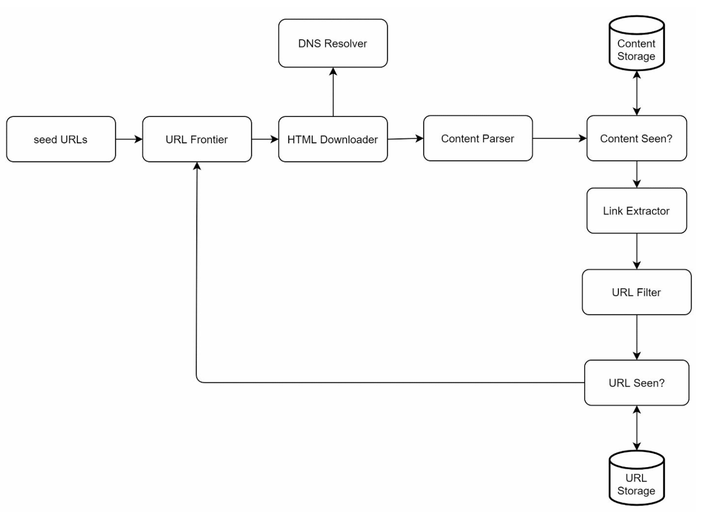

# Chapter 9: Design a Web Crawler

## Introduction
A **web crawler**, also known as a spider or robot, is used to discover and collect web content, such as web pages, images, and videos. This chapter focuses on designing a scalable web crawler for **search engine indexing**.

### Applications of Web Crawlers
1. **Search Engine Indexing:** Collect web pages to create searchable indexes (e.g., Googlebot).
2. **Web Archiving:** Preserve web data for future use (e.g., US Library of Congress).
3. **Web Mining:** Extract knowledge from web data (e.g., financial analysis of shareholder reports).
4. **Web Monitoring:** Detect copyright or trademark infringements.

### Design Challenges
A good web crawler must address:
- **Scalability:** Handle billions of pages using parallelization.
- **Robustness:** Manage bad HTML, crashes, and malicious links.
- **Politeness:** Avoid overwhelming servers with too many requests.
- **Extensibility:** Support new content types with minimal changes.

---

## Step 1: Understanding the Problem

### Requirements
1. Crawl **1 billion web pages per month** (400 pages/second, peak 800 QPS).
2. Collect **HTML-only content**.
3. Track new and updated pages.
4. Ignore duplicate content.
5. Store crawled data for **5 years**, requiring ~30 PB of storage.

---

## Step 2: High-Level Design

### Components

1. **Seed URLs:** Starting points for the crawler.
    - Need to selective as a good starting point that a crawler can utilize to traverse as many links as possible.
    - Can be based on locality based on different popular website or based on topics.
    - Strategies: Categorize by locality or topic (e.g., sports, healthcare).

2. **URL Frontier:** Stores URLs to be downloaded.
   - Implemented as a **FIFO queue**.

3. **HTML Downloader:** Downloads web pages from URLs provided by the URL Frontier.

4. **DNS Resolver:** Converts URLs to IP addresses.

5. **Content Parser:** Validates and parses web pages.
   - Discards malformed pages.

6. **Content Seen?:** Checks for duplicate content using hash comparisons (compare the hash values of the two web pages).

7. **Content Storage:** Stores HTML pages on disk (popular content in memory to reduce latency).

8. **URL Extractor:** Extracts new links from parsed pages.

9. **URL Filter:** Excludes blacklisted or erroneous URLs.

10. **URL Seen?** Tracks visited URLs to avoid duplication.

11. **URL Storage:** Stores already visited URLs.

---

### Workflow
1. Add **Seed URLs** to the URL Frontier.
2. **HTML Downloader** fetches URLs and resolves their IPs via the DNS Resolver.
3. **Content Parser** validates and passes content to the "Content Seen?" component.
4. If the content is new, extract links via the **URL Extractor**.
5. Filter and add unique links to the URL Frontier.

---

## Step 3: Deep Dive into Key Components
### DFS/BFS
-  The web can be though of as a directed graph where web pages are nodes and hyperlinks (URLs) as edges.
-  BFS is usually used for graph traversal as the depth can be be very deep thus DFS is not ideal.
-  Standard BFS does not take the priority of a URL into consideration, not every page has the same level of quality and importance.

### URL Frontier
- **Politeness:** 
    - Ensure only one request per host at a time. Add a dealy b/w two download tasks.
    - Use a mapping from hostnames to queues and worker (download) threads.
    - Each downloader thread has a separate FIFO queue and only downloads URLs from that queue.

        

    - **Queue router:** Ensures that each queue (b1, b2, … bn) only contains URLs from the same host.
    - **Mapping table:** It maps each host to a queue.
    - **Queue selector:** Each worker thread is mapped to a FIFO queue, and it only downloads URLs from that queue. The queue selection logic is done by the Queue selector.
    - **Worker thread 1 to N.** A worker thread downloads web pages sequentially from the same host. A delay can be added between two download tasks.

- **Priority:** 
    - Assign higher priority to important pages (e.g., by PageRank or update frequency).

        
    
    - **Prioritizer:** It takes URLs as input and computes the priorities.
    - **Queue f1 to fn:** Each queue has an assigned priority. Queues with high priority are selected with higher probability.
    - **Queue selector:** Randomly choose a queue with a bias towards queues with higher priority.
    - **Front queues:** manage prioritization
    - **Back queues:** manage politeness

- **Freshness:** Recrawl based on update history or importance.

### HTML Downloader
- **Robots.txt Compliance:** Respect rules in robots.txt files.
- **Performance Optimizations:**
  1. Distributed crawling using multiple servers.
  2. Use a **DNS cache** to avoid repeated lookups.
  3. Geographically distribute crawl servers for faster downloads.
  4. Use a short timeout to avoid slow or unresponsive servers.

### Robustness
1. **Consistent Hashing:** Distribute load among servers effectively.
2. **Error Handling:** Prevent system crashes from exceptions.
3. **Data Validation:** Ensure content integrity.

### Extensibility
- Add modules for new content types (e.g., PNG downloader, web monitor).
- Example: Plug in a module to monitor web content for copyright violations.

    
---

### Avoiding Problematic Content
1. **Duplicate Content:** Detect using hash comparisons.
2. **Spider Traps:** Avoid infinite loops with techniques like URL length limits.
3. **Data Noise:** Filter irrelevant content like ads or spam.

---

## Step 4: Wrap Up
### Key Takeaways
1. Web crawlers must balance scalability, robustness, politeness, and extensibility.
2. **Politeness** prevents overloading servers, while **priority** ensures important pages are crawled first.
3. Efficient storage and error handling are crucial for handling large-scale crawling.

### Additional Considerations
- **Server-Side Rendering:** Handle dynamic content generated by JavaScript or AJAX.
- **Anti-Spam Measures:** Exclude low-quality or irrelevant pages.
- **Database Sharding:** Scale the data layer using replication and sharding.
- **Horizontal Scaling:** Use stateless servers to scale crawl jobs efficiently.
- **Analytics:** Collect and analyze data for insights.

---

## Most Asked Interview Questions

**Q1. What are the main components of a web crawler?**
> (1) Seed URLs to start from; (2) URL Frontier (priority queue of URLs to crawl); (3) DNS Resolver (batch DNS lookups); (4) HTML Downloader (fetches content, respects robots.txt); (5) Content Parser (extracts links, content type); (6) Deduplication Filter (Bloom filter or hash set for seen URLs/content); (7) URL Filter (domain blacklist, spam filter); (8) Content Store (object storage for raw HTML); (9) Link Extractor (feeds new URLs back to Frontier).

**Q2. How do you detect and avoid crawling duplicate URLs?**
> Use a Bloom filter for probabilistic, memory-efficient deduplication (some false positives accepted — miss rare pages rather than re-crawl billions). For stricter deduplication, store URL hashes (MD5/SHA-1) in a distributed hash set (Redis or Cassandra). Also deduplicate content: hash the extracted text to detect mirror pages with different URLs.

**Q3. What is "politeness" in web crawling?**
> Politeness means not overwhelming a host server with too many requests too fast. Implementations: (1) Respect `Crawl-Delay` in `robots.txt`; (2) Enforce per-domain rate limits (e.g., max 1 request/second per domain); (3) Organize the URL Frontier by domain and process domains round-robin; (4) Use a dedicated download worker per domain to easily enforce domain-level delays.

**Q4. How do you handle spider traps?**
> Spider traps are URLs that generate infinite sequences (e.g., calendars with infinite next-day links, session-parameterized URLs). Solutions: (1) Set a max URL depth limit; (2) Set a per-domain max crawl count; (3) Normalize URLs (remove irrelevant query parameters); (4) Detect patterns (URLs with 10+ query parameters, URLs that differ only in a counter value) and skip them.

**Q5. What data structures are used for the URL Frontier?**
> The URL Frontier uses a priority queue to balance politeness and importance: (1) Front queues: multiple FIFO queues, one per priority level, populated by a Prioritizer (based on PageRank, update frequency); (2) Back queues: one per host/domain to enforce per-domain download delays. A Mapping Table maps each domain to its back queue. The Selector picks from ready back queues.

**Q6. How do you handle JavaScript-rendered content in a web crawler?**
> Standard HTTP crawlers fetch raw HTML and miss JavaScript-rendered (SPA) content. Solutions: (1) Use a headless browser (Puppeteer/Playwright) to execute JavaScript before extracting content — expensive but accurate; (2) Maintain a separate rendering cluster for JS-heavy URLs detected by the parser; (3) Use Splash (a lightweight browser as a service) or Rendertron as a rendering proxy.

**Q7. How would you scale a web crawler to handle billions of pages?**
> Distribute via a message queue (Kafka) to N worker pods. Each worker handles the full pipeline for assigned URLs. Use consistent hashing to assign domains to specific workers (to enforce per-domain politeness without coordination). Store crawled content in distributed object storage (S3). Distribute the URL frontier across multiple server shards. Scale the DNS resolver tier independently.

**Q8. What is the robots.txt protocol?**
> `robots.txt` is a file at the root of a domain instructing crawlers which paths are allowed/disallowed. Example: `User-agent: *; Disallow: /private/`. Responsible crawlers must fetch and cache `robots.txt` per domain before crawling any page on that domain. Ignoring `robots.txt` is unethical and can result in IP banning or legal issues. The `Crawl-Delay` directive specifies minimum sleep between requests.

**Q9. How do you filter out low-quality, duplicate, or spam content?**
> (1) Exact content deduplication: hash page body and skip if seen before; (2) Near-duplicate detection: SimHash detects pages that are ~80% similar without reading full content; (3) Language detection: skip non-target languages; (4) Content quality signals: skip pages with low word count, high ad density, or keyword stuffing; (5) Domain blocklist: skip known spam/malware domains.

**Q10. How would you design the storage for raw HTML and extracted data?**
> Raw HTML: object storage (S3) — cheap, durable, accessible for re-processing. Extracted links: URL frontier queue (Kafka/Redis). Extracted metadata (title, body text, links): write to a distributed document store (Elasticsearch for search indexing, or Cassandra for structured storage). Use separate storage tiers: hot storage for recently crawled (indexed), warm for periodic refresh, cold archive for historical snapshots.

**Q11. How does a web crawler decide which pages to re-crawl and when?**
> Track `last_crawled_at` and inferred update frequency per page. Frequently updated pages (news, Wikipedia) re-crawl more often. Signals for prioritization: (1) Sitemap-indicated update frequency; (2) `Last-Modified` HTTP header from previous crawl; (3) Content diff rate from crawl history; (4) PageRank (high-rank pages re-crawl more often). Cap robots.txt-specified crawl delay.

**Q12. How does deduplication work for content (not just URLs)?**
> SimHash: compute a compact fingerprint (64-bit) of the page's feature set (word n-grams weighted by TF-IDF). Pages with SimHash Hamming distance < 3 bits are near-duplicates. Store fingerprints in a lookup table; compare incoming fingerprints with existing ones in O(1) using hash table lookup with bit-masking tricks. Used by Google for near-duplicate detection at web scale.

**Q13. How do you avoid cascading failures in a distributed web crawler?**
> (1) Use circuit breakers when a host is slow or returning errors — pause crawling from that host; (2) Retry with exponential backoff for transient errors (503, network timeout); (3) Dead letter queue for persistently failing URLs; (4) Per-domain failure counters — if a domain returns 10+ consecutive 4xx/5xx, deprioritize it; (5) Resource limits per worker to prevent a single bad domain from consuming all resources.

**Q14. How do you handle DNS at scale in a web crawler?**
> DNS lookups are slow (10–200ms each). Solutions: (1) Batch DNS resolver — submit 100s of lookups in parallel; (2) DNS cache with TTL-aligned expiry to avoid redundant lookups; (3) Run your own local DNS resolver (BIND) to bypass upstream DNS rate limits; (4) Pre-resolve DNS for URLs in the frontier before they are needed (lookahead resolution). Google uses custom DNS infrastructure for Googlebot.

**Q15. What is the difference between discovering and indexing in a web crawler?**
> Discovery: finding new URLs (following links, processing sitemaps). Indexing: extracting and storing content (title, body text, entities) for search engine use. A crawler can discover billions of URLs but only fully index the highest-quality subset (based on PageRank, freshness, authority). The discovery layer must be extremely efficient; the indexing layer can be selective and slower.

**Q16. How do you handle login-protected or JavaScript-required pages?**
> Crawlers generally skip these: (1) Login-protected pages are inaccessible without credentials — irrelevant for public search indexing; (2) JavaScript-heavy pages require a headless browser, which is expensive. Deploy a small headless browser tier for high-value JS-rendered URLs (detected by 404s in raw HTML parse, or by known SPA domains) and process the rest with lightweight HTML parsers.

**Q17. How do you estimate the resources required to crawl 1 billion pages per day?**
> 1B pages/day ÷ 86,400 sec ≈ 11,574 pages/sec. If each page takes 1 second to download (network + process), you need ~11,574 parallel workers. With 10 threads per worker: ~1,160 machines. Storage: 1B pages × 100 KB avg = 100 TB/day. DNS: 1B unique domains/day is unrealistic; most pages share domains, so DNS cache hit rate is high. Actual Googlebot uses millions of parallel crawlers.

**Q18. What is the role of the URL Prioritizer in a web crawler?**
> The Prioritizer assigns a priority score to each discovered URL based on signals like PageRank, update frequency, domain authority, and content category. High-priority URLs are placed in front queues processed more frequently. This ensures the crawler focuses its limited resources on the most valuable pages rather than crawling equally across all discovered URLs.

**Q19. How does a web crawler handle redirects?**
> Follow the redirect chain (301/302) up to a max depth (e.g., 5 redirects) to reach the canonical URL. Normalize and deduplicate the final canonical URL. Store the redirect chain mapping in the URL store (short URL → canonical URL) to avoid re-traversing redirects on subsequent crawls. Detect redirect loops (A→B→A) and abort.

**Q20. How do you detect and handle crawl traps from adversarial websites?**
> Adversarial sites may dynamically generate unique URLs to consume crawler resources. Detection: (1) Cap pages crawled per domain (e.g., 100K max per domain); (2) Detect URL patterns generating infinite sequences; (3) Monitor crawl rate per domain and flag abnormally high page counts; (4) Score pages by content uniqueness — many near-identical pages from one domain = trap signal.

**Q21. What is the role of a URL normalizer in a web crawler?**
> Normalizers convert URLs to a canonical form to reduce duplicates: (1) Convert `HTTP://EXAMPLE.COM/PAGE` to `http://example.com/page` (case normalization); (2) Remove default ports (`:80`, `:443`); (3) Remove irrelevant query parameters (`utm_source=google`); (4) Resolve relative URLs to absolute; (5) Sort query parameters. Without normalization, `page?a=1&b=2` and `page?b=2&a=1` would be crawled twice.

**Q22. How would you design the seed URL selection strategy for a new crawler?**
> Start with authoritative seeds: Wikipedia's main page, DMOZ directory, Alexa top 1M domains, major news sites, and government portals. These have high PageRank and link to many other quality pages, ensuring rapid discovery of the highest-value content first. Avoid low-quality seeds (spam sites, link farms) that lead into content wastelands.

**Q23. How do you handle server errors (404, 503) during crawling?**
> 404 Not Found: mark the URL as dead; don't re-crawl; remove from index if previously indexed. 503 Service Unavailable: back off with exponential delay and retry (the server is temporarily overloaded). 429 Too Many Requests: reduce crawl rate for that domain immediately. 5xx persistent errors: deprioritize the domain and alert the operations team.

**Q24. What is a sitemap and how does it help a web crawler?**
> A sitemap (`/sitemap.xml`) is a file provided by website owners listing all URLs they want indexed, with optional metadata (update frequency, last-modified date, priority). Using sitemaps guarantees discovery of all canonical content (especially pages not heavily linked internally), helps estimate update frequency, and reduces crawl waste on dynamic/session URLs.

**Q25. How does Google scale Googlebot to crawl the entire discoverable web?**
> Google uses distributed datacenters worldwide, with millions of parallel crawlers. Key optimizations: custom DNS resolvers, aggressive caching, per-domain bandwidth throttling managed by a central scheduling system, separate pipelines for fresh crawls vs. deep crawls, machine learning-based URL prioritization, and separate treatment of mobile vs. desktop content. Estimates suggest Googlebot crawls hundreds of billions of pages.

**Q26. What ethical and legal issues should a web crawler respect?**
> (1) Respect `robots.txt` always; (2) Honor `Crawl-Delay` to avoid overloading servers; (3) Identify the crawler via a descriptive `User-Agent` string with contact info; (4) Comply with GDPR/CCPA when storing personal data from web pages; (5) Don't circumvent paywalls or login walls; (6) Honor `noindex` and `nofollow` meta tags; (7) Limit crawl load to a fraction of the target server's capacity.

**Q27. How do you implement distributed URL frontier management across multiple crawl workers?**
> Partition the URL Frontier by domain using consistent hashing: all URLs for domain X always go to worker Y. This enforces per-domain politeness without inter-worker coordination. Use Kafka topics per partition for durable queuing. Each worker reads from its assigned Kafka partition, processes URLs, and publishes discovered links back to a central link extractor service that routes new URLs to the correct partition via consistent hashing.
