# System Design: Amazon Prime Video (Beginner-Friendly Guide)

---

## What Are We Building?

Think of Netflix or Amazon Prime Video — a global video streaming service where users can:
- Browse and search millions of movies/TV shows
- Stream video content with high quality and minimal buffering
- Resume watching from where they left off
- Get personalized recommendations
- Download content for offline viewing
- Stream to multiple devices simultaneously

The interesting engineering challenges hidden in this simple flow:
- **Scale** — millions of concurrent users streaming simultaneously, each needing different quality levels
- **Bandwidth efficiency** — video streaming consumes massive bandwidth; adaptive bitrate is critical
- **Low latency** — users expect playback to start within 2 seconds; latency degrades UX significantly
- **Global distribution** — users worldwide need content delivered from nearby edge servers to minimize latency
- **Quality adaptation** — network conditions change; the system must seamlessly switch between quality levels
- **Concurrent streaming** — same user streaming on multiple devices with shared subscription limits

---

## Step 1: Design Scope

**Scale:**
| Parameter | Value |
|-----------|-------|
| Monthly active users | 200 million |
| Concurrent viewers (peak) | 2 million |
| Total video library | 500,000 titles |
| Average video length | 120 minutes |
| Average watch duration per day | 2 hours |
| Peak concurrent streams per user | 4 (multi-device) |
| Streaming QPS (peak) | ~500,000 streams |
| Metadata queries QPS | ~1M/sec (browsing/search) |

**Key feature:** Video quality adapts to network conditions. Same user may stream at 480p on mobile or 4K on desktop.

**QPS Funnel:**

```
Browse catalog:         QPS = 5M     (high volume, cached)
Search videos:          QPS = 2M     (high volume, Elasticsearch)
Get recommendations:    QPS = 500K   (medium, cached)
Start playback:         QPS = 500K   (streaming initialization)
Get video segments:     QPS = 50M+   (very high, CDN-served)
```

**Non-functional requirements:**
- Playback starts within 2 seconds
- Support 4K quality up to 1080p minimum
- 99.99% availability (video must play)
- Sub-100ms latency for video delivery
- Handle peak load (Friday evenings, new releases)
- Cost-efficient for massive bandwidth usage

---

## Step 2: API Design

**Catalog & Metadata APIs:**
```
GET    /v1/videos/search?query=marvel          ← search videos
GET    /v1/videos/{videoId}                    ← video details (title, genres, cast)
GET    /v1/recommendations?userId={id}        ← personalized recommendations
GET    /v1/watch-history?userId={id}          ← user's watch history
```

**Streaming APIs:**
```
POST   /v1/playback/start                      ← initialize playback session
GET    /v1/playback/{sessionId}/segment/{num}  ← get video segment
POST   /v1/playback/{sessionId}/progress       ← report watch progress
```

**Example: Start Playback Request:**
```json
{
  "userId": "user123",
  "videoId": "video456",
  "deviceType": "mobile",
  "clientBandwidth": "10mbps",
  "supportedQualities": ["480p", "720p", "1080p"]
}
```

**Response (streaming manifest):**
```json
{
  "sessionId": "session789",
  "videoId": "video456",
  "duration": 7200,
  "initialQuality": "720p",
  "manifestUrl": "https://cdn.example.com/video456/manifest.m3u8",
  "segments": [
    {"num": 0, "quality": "720p", "url": "https://cdn.example.com/.../segment-0.m4s"},
    {"num": 1, "quality": "720p", "url": "https://cdn.example.com/.../segment-1.m4s"}
  ]
}
```

> **Note:** Video is delivered as small **10-second segments**. The client requests the next segment based on detected bandwidth, enabling adaptive bitrate streaming.

---

## Step 3: Database Choice — Why Hybrid?

| Requirement | Solution |
|-------------|----------|
| Video metadata (title, cast, genres) | NoSQL (MongoDB/DynamoDB) — flexible schema, fast reads |
| User profiles & subscriptions | SQL (PostgreSQL) — ACID, important consistency |
| Watch history | NoSQL (Cassandra) — write-heavy, time-series data |
| Video catalog search | Elasticsearch — full-text search, relevance ranking |
| User recommendations | In-memory (Redis) — pre-computed, low-latency access |

> **Why not purely SQL?** Video metadata is unstructured (different fields per video type). Watch history is append-only and write-heavy (millions of events/sec). Cassandra excels at this. We use **polyglot persistence** — right tool for each job.

---

## Step 4: Data Schema

### Core Tables

**Users Table (SQL)**
```
user_id (PK) | email | subscription_tier | device_limit | created_at | last_login
   "u123"    | user@ | "premium"         | 4            | 2026-01-15 | 2026-06-18
```

**Videos Table (NoSQL)**
```
{
  "_id": "v456",
  "title": "Avengers",
  "genres": ["action", "sci-fi"],
  "duration": 7200,
  "releaseDate": "2019-04-26",
  "cast": ["Robert Downey Jr.", ...],
  "rating": 8.4,
  "encodedVersions": {
    "480p": {"bitrate": "1.5mbps", "codec": "h264", "size": "900MB"},
    "720p": {"bitrate": "4mbps", "codec": "h264", "size": "2.4GB"},
    "1080p": {"bitrate": "6mbps", "codec": "h264", "size": "3.6GB"},
    "4k": {"bitrate": "15mbps", "codec": "h265", "size": "9GB"}
  }
}
```

**Watch History (Cassandra - Time-Series)**
```
user_id (PK) | video_id | timestamp (CK) | watch_duration | last_position
   "u123"    | "v456"   | 2026-06-18...  | 6000           | 5800
```

**Storage Estimation:**
```
500,000 videos × 4 quality levels = 2M encoded files
Average file size: 3GB
Total: 6 petabytes (or use tiered storage: hot/warm/cold)

Watch history: 200M users × 2 videos/day × 365 days × 100 bytes = 14.6 billion rows
```

---

## Step 5: High-Level Architecture



```
User (phone/browser/TV)
       ↓
    [CDN]              ← Edge servers distribute video segments globally
       ↓
[API Gateway]          ← Auth, rate limiting, request routing
  ↓         ↓          ↓          ↓
[Metadata  [Playback  [Recommend [User
 Service]   Service]   Service]   Service]
  ↓         ↓          ↓          ↓
[MongoDB] [Redis]    [ML Model]  [PostgreSQL]
          [Cassandra]
          [S3 Video Storage]
```

**Microservices:**

| Service | Responsibility | Tech Stack |
|---------|---------------|-----------|
| **Metadata Service** | Video catalog, search, details | MongoDB + Elasticsearch |
| **Playback Service** | Streaming sessions, segment delivery, quality adaptation | Node.js, Redis |
| **Recommendation Engine** | Personalized recommendations, watch history | ML (TensorFlow), Redis |
| **User Service** | Authentication, profiles, subscriptions, device management | PostgreSQL, JWT |
| **Upload Service** | Ingest new videos, trigger encoding pipeline | S3 + message queue |
| **Encoding Service** | Convert videos to multiple qualities/codecs | FFmpeg, workers |

---

## Step 6: Video Streaming — Adaptive Bitrate Explained

### The Problem
Users have different network speeds:
- Mobile on 4G: 5-10 Mbps
- Home WiFi: 50-100 Mbps
- Slow rural connection: 2-5 Mbps

If we always stream at 4K (15 Mbps), slow users buffer constantly. If we always stream at 480p, high-speed users waste their bandwidth.

### Solution: Adaptive Bitrate Streaming (ABR)

**Step-by-step process:**

1. **Initialize playback:** Client sends device type, bandwidth estimate
2. **Server responds with manifest:** List of available quality levels and segment URLs
3. **Client detects real bandwidth:** Downloads first segment, measures time
4. **Dynamic quality switching:** Client requests higher/lower quality for next segment
5. **Seamless playback:** Different quality segments play back-to-back without interruption

**Segment structure:**
```
Video split into 10-second segments
├── quality-480p/
│   ├── segment-0.m4s (1.5 MB, 10 seconds)
│   ├── segment-1.m4s (1.5 MB, 10 seconds)
│   └── ...
├── quality-720p/
│   ├── segment-0.m4s (4 MB, 10 seconds)
│   ├── segment-1.m4s (4 MB, 10 seconds)
│   └── ...
└── quality-1080p/
    ├── segment-0.m4s (6 MB, 10 seconds)
    └── ...
```

**Example: Adaptive switching during playback**
```
Second 0-10:   Request 720p segment 0 (bandwidth = 7 Mbps) ✓ plays smoothly
Second 10-20:  Network slows to 3 Mbps → Request 480p segment 1 ✓ prevents buffering
Second 20-30:  Network improves to 8 Mbps → Request 720p segment 2 ✓ quality restored
```

---

## Step 7: Scalability & Optimization

### Caching Strategy

**Content Delivery Network (CDN):**
- Edge servers worldwide cache popular videos
- Users download from nearest edge location
- Reduces latency to <100ms globally

**Example (CDN offload):**
```
Daily segment requests: 10 billion
CDN hit ratio: 92%

Served by CDN:     9.2 billion
Served by origin:  0.8 billion

Result:
- Origin bandwidth cost drops massively
- Playback startup time improves (e.g., 1.8s -> 0.7s in peak regions)
```

**In-Memory Cache (Redis):**
- User watch history (frequently accessed)
- Personalized recommendations (pre-computed)
- Video metadata (title, genres, ratings)

**Example (metadata cache):**
```
Product detail lookups: 200K QPS
Cache hit: 95%

DB queries without cache: 200K QPS
DB queries with cache:    10K QPS

Result: DB load reduced by 20x
```

**Database Optimization:**
- Sharding watch history by userId
- Elasticsearch for full-text search with caching
- Read replicas for high-traffic queries

**Example (read replica split):**
```
Traffic profile:
- 90% reads (browse, search, recommendations)
- 10% writes (watch progress, likes, ratings)

Setup:
- 1 primary for writes
- 6 replicas for reads

Result:
- Read throughput scales almost linearly
- Primary stays stable for write latency-sensitive operations
```

### Request-Level Optimization

**1. Segment prefetching**
- Client prefetches next 1-2 video segments while current segment plays
- Reduces rebuffering on moderate network jitter

**Example:**
```
Without prefetch: buffering ratio = 3.8%
With prefetch:    buffering ratio = 1.4%
```

**2. Adaptive manifest minimization**
- Return only relevant quality ladders for current device/network
- Mobile low bandwidth user should not receive 4K profile metadata

**Example:**
```
Manifest payload before: 120 KB
After optimization:       35 KB
Startup latency gain:    ~120ms on 4G
```

**3. Connection reuse (HTTP/2/keep-alive)**
- Avoid TCP/TLS handshake for every segment request
- Improves battery and reduces per-request overhead

### Hotspot and Fanout Handling

**Problem:** A newly released episode causes sudden traffic spikes (hot key pattern).

**Mitigation:**
1. Pre-warm CDN in top geographies before release
Pre-populate first N segments of the new episode in top traffic regions (for example: US-East, EU-West, AP-South) 10-20 minutes before launch.

2. Cache-locking to avoid cache stampede on miss
When a hot key expires, only one request recomputes/refetches content while others wait briefly or serve stale data.

3. Stagger recommendation refresh jobs to avoid thundering herd
Spread heavy recomputation jobs across a time window with jitter instead of running at a single cron boundary.

Why this matters (simple explanation):
- If all refresh jobs run at 00:00, every worker hits DB/cache together and creates a traffic spike.
- Staggering means spreading jobs over a window (for example, 30 minutes).
- Jitter means adding a small random delay per job so they do not align on the same second.
- Total work is the same, but peak load is much lower, so latency and failures reduce.

Simple flow:
1. Pick refresh window: 00:00-00:30
2. Split users into batches
3. Assign each batch a different minute in this window
4. Add random delay (for example, 0-180 seconds)
5. Retry failures with exponential backoff + random delay

One-line analogy:
Everyone leaving a stadium at once causes a jam; leaving in staggered groups keeps traffic smooth.

**Mini examples:**
```
Pre-warm effect:
Cold launch origin QPS: 220K
Pre-warmed origin QPS: 60K

Cache lock effect:
Without lock: 8K parallel misses hit origin for same key
With lock: 1 origin fetch + queued readers

Staggered jobs effect:
Single 00:00 batch: recommendation DB CPU peaks at 92%
Jittered over 30 min: CPU stays ~55-65%
```

**Example (new release at 8 PM):**
```
Concurrent viewers jump: 300K -> 2.5M in 10 minutes

Without pre-warm:
- Origin 5xx spikes to 4%

With pre-warm + cache-lock:
- Origin 5xx stays <0.3%
- p95 segment latency remains <180ms
```

### Database Sharding Strategy

```
Shard by userId (watch history):
Range Hash: userId → SHA256(userId) → mod(numShards)

Example:
user123 → SHA256 hash → mod(256) → shard-45
user456 → SHA256 hash → mod(256) → shard-127
```

### Why userId is the shard key

- Most critical queries are user-centric: continue watching, watch history, likes, watch progress.
- These reads/writes become single-shard operations, so latency stays predictable.
- User sessions are independent, which naturally parallelizes load across shards.

### Read and Write Paths

**Write path (watch progress update):**
1. API receives progress update (`userId`, `videoId`, `timestamp`)
2. Router computes shard from `userId`
3. Write goes to shard primary
4. Replication applies update to read replicas

**Read path (home page continue watching):**
1. API gets `userId`
2. Router computes same shard
3. Read from nearest replica (or primary if strict consistency needed)

### Example: How Data Looks Across Different Shards

Assume same logical table exists in every shard DB:

```sql
watch_history(
  user_id VARCHAR,
  video_id VARCHAR,
  last_position_seconds INT,
  updated_at TIMESTAMP,
  PRIMARY KEY (user_id, video_id)
)
```

Routing rule (simplified for example):
```
shard_id = hash(user_id) mod 3
```

**Shard 0 (`watch_history_s0`)**

| user_id | video_id | last_position_seconds | updated_at           |
|---------|----------|-----------------------|----------------------|
| u102    | v9001    | 1240                  | 2026-06-18 20:01:10 |
| u330    | v7712    | 340                   | 2026-06-18 20:02:45 |

**Shard 1 (`watch_history_s1`)**

| user_id | video_id | last_position_seconds | updated_at           |
|---------|----------|-----------------------|----------------------|
| u123    | v1001    | 620                   | 2026-06-18 20:00:12 |
| u901    | v5542    | 40                    | 2026-06-18 20:03:51 |

**Shard 2 (`watch_history_s2`)**

| user_id | video_id | last_position_seconds | updated_at           |
|---------|----------|-----------------------|----------------------|
| u456    | v1001    | 95                    | 2026-06-18 20:00:43 |
| u777    | v2210    | 1800                  | 2026-06-18 20:04:08 |

What to notice:
- Same table structure in all shards.
- A single user's rows go to one shard only (fast point reads/writes).
- Global analytics across all users requires fanout query (or ETL to warehouse).

### Capacity Planning Example

```
DAU = 120M
Avg watch-progress writes per active user/day = 20
Total writes/day = 2.4B

Write rate ~= 27,800 writes/sec average
Peak factor = 4x
Peak writes/sec ~= 111,000

With 256 shards:
Peak per shard ~= 434 writes/sec
```

This keeps per-shard write pressure manageable and gives room for burst traffic.

**Why this works:**
- Uniform distribution avoids hotspot shards
- Easy horizontal scale: add shards and rebalance
- Localizes user history queries (single-shard reads for most operations)

### Metadata and Directory Service

- Use a shard map service (`virtualShard -> physicalShard`) instead of hardcoding `% numShards` everywhere.
- Store map in strongly consistent config store and cache in API nodes.
- Roll out map changes gradually to avoid split-brain routing.

**Example (virtual shards):**
```
1024 virtual shards mapped to 256 physical shards initially
When scaling, remap only selected virtual shards to new physical nodes
This avoids moving 100% of data during expansion
```

**Re-sharding example:**
```
Initial: 64 shards, each ~80% full
Growth: +40% traffic in 6 months
Action: expand to 128 shards

Result:
- Storage pressure per shard drops
- Query p99 improves due to smaller shard working set
```

### Hot Partition Mitigation

Even with userId hashing, hotspots can happen (regional spikes, heavy binge traffic windows).

Mitigations:
- Over-shard with virtual shards and rebalance hot ranges quickly
- Rate-limit noisy clients at API edge
- Write-behind buffering for non-critical events (for example, view analytics)

### Multi-Entity Sharding Note

- Watch history: shard by `userId`
- Video metadata catalog: shard by `videoId` (or keep in replicated store + cache)
- Search index: separate Elasticsearch cluster, not same shard topology as OLTP store

This separation prevents one access pattern from degrading another.

---

## Step 8: Video Encoding Pipeline

### Encoding Flow

```
User uploads video (200MB)
           ↓
    [Upload Service]
           ↓
   Stored in S3 (raw)
           ↓
[Message Queue (Kafka)]
   enqueues encoding job
           ↓
[Encoding Workers] (parallel)
   ├─ Encode to 480p
   ├─ Encode to 720p
   ├─ Encode to 1080p
   └─ Encode to 4K (slow, ~1 hour)
           ↓
  [Store in S3] (encoded)
           ↓
[Update Metadata]
   Mark video as "ready for streaming"
```

### Why Parallel Encoding?
- Same video encoded to 4 quality levels simultaneously
- With 100 worker servers, can process 1000 uploads/hour
- Estimated encoding time: 480p (5min) + 720p (10min) + 1080p (20min) + 4K (60min) = **90 minutes total** (parallelized, not sequential)

---

## Step 9: Handling Peak Traffic (Friday Evenings)

### Auto-scaling
1. **Monitor:** Track CPU, memory, request latency
2. **Trigger:** If latency > 500ms, spin up more servers
3. **Cool down:** After 30 minutes of low load, scale down

### Request Queuing
```
Normal load:     Serve immediately
High load (2x):  Queue with <1 second wait
Extreme (10x):   Queue with possible rejection (graceful degradation)
```

### Graceful Degradation
```
If server overloaded:
├─ Reduce video quality automatically (1080p → 720p)
├─ Compress metadata payloads
├─ Disable recommendations temporarily
└─ Keep streaming core intact
```

### Geographic Distribution
```
Global users → Route to nearest region
               ├─ US East → us-east.example.com
               ├─ Europe → eu-west.example.com
               ├─ Asia-Pacific → ap-southeast.example.com
               └─ Load balance within region
```

---

## Architecture Overview


---

## Step 9: Fault Tolerance

### Redundancy
- Multi-region deployment
- Database replication
- CDN failover to backup edge servers
- API gateway clustering

### Failure Scenarios
- **Video Service Down:** Route to backup region
- **Database Unavailable:** Use read replicas
- **CDN Degradation:** Serve from origin with rate limiting
- **Encoding Failure:** Retry with exponential backoff

---

## Step 10: Monitoring & Observability

### Metrics to Track
- Startup latency (time to first frame)
- Buffering ratio
- Video quality distribution
- User engagement (completion rate)
- API response times
- Database query times

### Logging
- Stream logs to centralized system (ELK stack)
- Monitor error rates and anomalies
- Track user behavior for ML models

---

## Step 11: Key Design Decisions & Tradeoffs

| Decision | Why? | Tradeoff |
|----------|------|----------|
| Use CDN for video delivery | Reduce latency globally; offload traffic from origin | Higher cost; need to manage cache invalidation |
| Adaptive bitrate streaming (HLS/DASH) | Smooth playback regardless of bandwidth | More encodings needed; higher storage/encoding cost |
| Separate metadata and storage services | Scalability; can optimize each independently | Operational complexity; data consistency |
| ML-based recommendations | Increase engagement; personalize experience | Complex to build; requires data; privacy concerns |
| Multi-region deployment | Geo-redundancy; reduced latency | Operational overhead; complexity; cost |

## Interview Cheat Sheet Q&A

**Q: Why use HLS/DASH instead of just encoding one quality?**  
A: Network conditions vary wildly. A user on 4G gets 10Mbps, another on WiFi gets 100Mbps. Forcing 1080p to a 4G user causes buffering. HLS lets us send the right quality for each user's bandwidth dynamically.

**Q: Can we serve the video from S3 directly without a CDN?**  
A: Technically yes, but you'd have problems. S3 has limited concurrent connections per user. If millions watch simultaneously, S3 becomes the bottleneck. CDN has thousands of edge servers globally, so requests are distributed.

**Q: Why not just store the video in the database?**  
A: Databases are optimized for small, structured data. A 4K movie is 50GB+. Databases would crawl storing/retrieving that. Object storage (S3) is cheap and fast for large blobs. Keep metadata in DB, video in object storage.

**Q: How do we handle videos deleted by the studio?**  
A: Store an `is_available` flag on videos. When a video should disappear, set it to false. Users with access (watch history) can still see it in their library temporarily, but new users can't search/find it. Eventually purge it after legal hold period.

**Q: What if recommendation engine suggests 100 videos per user per day?**  
A: Pre-compute recommendations offline (not real-time). Run daily ML jobs that output "for user 123, recommend these 50 videos." Cache that in Redis. When user opens app, instantly return top-N cached recommendations. Update recommendations nightly.

**Q: Isn't 99.99% uptime impossible?**  
A: Almost, but not quite. 99.99% = ~45 seconds downtime per month. Achievable with: multi-region failover, redundant databases with replication, load balancers, and no single points of failure. Still hard, but Amazon has the scale to do it.

## Full Flow (Start to End)

### Happy Path
1. Client request enters API Gateway and is authenticated/authorized.
2. Orchestrator service validates input and routing context.
3. Core service executes primary business logic and required checks.
4. Read path uses cache first; fallback goes to durable database/store.
5. Write path updates fast layer first (where applicable) and publishes async events.
6. Downstream consumers persist durable state and trigger secondary effects.
7. Response is returned to client with final status and metadata.

### Failure and Retry Paths
1. Cache miss: read from durable store, then repopulate cache.
2. Dependency timeout: retry with backoff or circuit-breaker fallback.
3. Async event failure: retry queue and dead-letter queue (DLQ) handling.
4. Duplicate request: idempotency key returns prior successful outcome.
5. Concurrent updates: version/lock conflict triggers re-read and safe retry.

### End-State Guarantees
- Low-latency user operations on the hot path.
- Durable correctness in the source-of-truth datastore.
- Eventual consistency for non-critical async side effects.
- Strict correctness at critical boundaries (commit/payment/finalization).

---
## Summary

A successful Amazon Prime Video-like system requires:
- ✅ Global CDN for fast content delivery
- ✅ Adaptive bitrate streaming for quality user experience
- ✅ Scalable microservices architecture
- ✅ Efficient video encoding and storage
- ✅ ML-powered recommendations
- ✅ High availability and fault tolerance
- ✅ Continuous monitoring and optimization


