# System Design: Shopping Cart System (Beginner-Friendly Guide)

---

## What Are We Building?

Think of Amazon.com or eBay — an e-commerce platform's shopping cart where users can:
- Browse products and add items to cart
- View cart contents and update quantities
- See real-time pricing and availability
- Persist cart across sessions and devices
- Checkout and convert cart to order

The interesting engineering challenges hidden in this simple flow:
- **Concurrency** — what if the user adds an item from two devices simultaneously?
- **Inventory consistency** — if the last item is added to two carts at the same moment, which order wins?
- **Price freshness** — product prices change constantly; should cart show old or new prices?
- **Cart persistence** — user closes tab, comes back next week; cart must still be there
- **Performance** — viewing cart (read) must be < 100ms; adding items (write) should be near-instant
- **Scale** — millions of concurrent carts, with high read/write ratio

---

## Step 1: Design Scope

**Scale:**
| Parameter | Value |
|-----------|-------|
| Monthly active users | 1 billion |
| Concurrent shoppers (peak) | 10 million |
| Total products in catalog | 100 million |
| Average items per cart | 4 |
| Cart view QPS | 1M/sec |
| Add/remove item QPS | 500K/sec |
| Cart checkout QPS | 50K/sec |
| Read:write ratio | 20:1 (mostly browsing) |

**Key feature:** Cart items have dynamic prices. Same product in cart may cost $10 today and $8 tomorrow.

**QPS Funnel:**
```
Browse products:        QPS = 10M     (high, cached heavily)
View cart:              QPS = 1M      (high, must be fast)
Add item to cart:       QPS = 500K    (medium, inventory check needed)
Update quantity:        QPS = 100K    (low, less common)
Checkout:               QPS = 50K     (low, critical path)
```

**Non-functional requirements:**
- Add item to cart: < 100ms latency
- View cart: < 50ms latency
- High availability (cart loss = lost sale)
- Handle concurrent updates from same user (multiple devices)
- Survive server restarts (persistence required)

---

## Step 2: API Design

**Cart Viewing APIs:**
```
GET    /v1/cart                     ← get current user's cart
GET    /v1/cart/item-count          ← quick count for UI badge
```

**Cart Modification APIs:**
```
POST   /v1/cart/items               ← add item to cart
PUT    /v1/cart/items/{itemId}      ← update item quantity
DELETE /v1/cart/items/{itemId}      ← remove item from cart
POST   /v1/cart/clear               ← empty entire cart
```

**Add Item Request:**
```json
{
  "productId": "prod_789",
  "quantity": 2,
  "variantId": "color-red-size-m"    // e.g., for clothing
}
```

**Add Item Response:**
```json
{
  "success": true,
  "cartId": "cart_456",
  "itemId": "item_1001",
  "items": [
    {
      "itemId": "item_1001",
      "productId": "prod_789",
      "name": "Nike Shoes",
      "quantity": 2,
      "pricePerUnit": 89.99,
      "totalPrice": 179.98,
      "inStock": true
    }
  ],
  "cartTotal": 179.98,
  "itemCount": 2,
  "lastUpdated": "2026-06-18T10:35:00Z"
}
```

> **Note:** When adding item, we return the full updated cart to keep client in sync.

---

## Step 3: Database Choice — Why Hybrid?

| Requirement | Solution |
|-------------|----------|
| Cart storage | Redis (in-memory, fast reads/writes) + SQL (persistence) |
| Product catalog | SQL (PostgreSQL) — static data, ACID not critical |
| Inventory levels | Redis (real-time, frequently updated) |
| Order history | SQL (immutable, audit trail) |

> **Why cache-first?** Most operations are reads (viewing cart). Redis serves reads in < 1ms. Database serves as backup for cache misses and persistence. For writes, we use **write-behind caching**: update cache immediately, persist to DB asynchronously.

---

## Step 4: Data Schema

### Cart Model (Redis)

**Key:** `cart:{userId}`  
**Value:** JSON object  
**TTL:** 30 days (user can access old cart)

```json
{
  "userId": "user_123",
  "cartId": "cart_456",
  "items": [
    {
      "itemId": "item_1001",
      "productId": "prod_789",
      "name": "Nike Shoes",
      "quantity": 2,
      "pricePerUnit": 89.99,
      "addedAt": "2026-06-10T08:00:00Z",
      "variantId": "color-red-size-m"
    },
    {
      "itemId": "item_1002",
      "productId": "prod_102",
      "name": "Socks (6-pack)",
      "quantity": 1,
      "pricePerUnit": 12.99,
      "addedAt": "2026-06-15T14:30:00Z"
    }
  ],
  "totalPrice": 192.97,
  "itemCount": 3,
  "lastUpdated": "2026-06-18T10:35:00Z",
  "version": 42  // for optimistic locking
}
```

### Cart Table (SQL - PostgreSQL)

```
user_id (PK) | cart_id | items_json | total_price | 
item_count | version | updated_at | created_at
```

### Inventory Table (Redis + SQL)

**Redis Key:** `inventory:{productId}`  
**Redis Value:** `45` (available units)  
**TTL:** 5 minutes (refresh from DB)

**SQL Table:**
```
product_id (PK) | quantity_available | quantity_reserved | 
last_updated | warehouse_location
```

---

## Step 5: High-Level Architecture



```
User (phone/browser)
       ↓
[API Gateway]        ← auth, rate limiting
       ↓
[Cart Service]       ← business logic (add/remove/update)
  ↓              ↓
[Redis Cache]   [PostgreSQL DB]
  ↓              (persistence)
[Inventory Service] ← checks stock levels
```

**Microservices:**

| Service | Responsibility | Tech Stack |
|---------|---------------|-----------|
| **Cart Service** | Add/remove/view items, validation | Node.js/Go, REST API |
| **Inventory Service** | Stock levels, reservations | PostgreSQL, Redis |
| **Product Service** | Product details, prices, catalog | PostgreSQL, caching |
| **Order Service** | Checkout, convert cart to order | PostgreSQL, transactional |
| **Cache Layer** | Fast reads, write-behind persistence | Redis cluster |

---

## Step 6: Concurrency Problem — Cart Updates

### Scenario: Multi-Device User

Alice has cart with 1 laptop ($999):
- **Device A (mobile):** Adds shoes ($50)
- **Device B (desktop):** Updates quantity to 2 (total = $1,998)

Both happen simultaneously. What's the final cart state?

### Solution: Optimistic Locking with Versioning

**Step 1: Read cart with version**
```
GET /v1/cart
Response: 
{
  "items": [...],
  "version": 42
}
```

**Step 2: Update locally**
Device A adds shoes, wants to increment version to 43.

**Step 3: Write with version check**
```
PUT /v1/cart/items
Body: { "itemId": "new_item", "version": 42 }

Server checks:
  if (current_version == 42) {
    apply change
    increment version to 43
    return success
  } else {
    return conflict (version mismatch)
    client retries with new version
  }
```

**Result:**
- Device A succeeds (version 42 → 43), cart has shoes
- Device B's request comes in, sees version 43 ≠ 42, retries
- Device B re-reads cart (now has shoes), updates to quantity 2
- Final cart: 1 laptop (qty 2) + shoes (qty 1)

---

## Step 7: Caching Strategy

### Write-Behind Caching

**Add item flow:**
```
1. User adds item
        ↓
2. Update Redis immediately (< 1ms)
        ↓
3. Return success to user
        ↓
4. Asynchronously write to DB (fire-and-forget)
```

**Advantages:**
- Fast response time (users see instant update)
- Persistence safety (DB has backup)
- Survives brief Redis failures (data in flight)

**Redis Data Structure:**
```
HSET cart:{userId} items "{json array}"
HSET cart:{userId} version 42
HSET cart:{userId} updated_at "2026-06-18T10:35:00Z"
EXPIRE cart:{userId} 2592000  // 30 days
```

### Cache Invalidation

**On inventory change:**
```
Inventory update → Pub/Sub notification → Invalidate product cache
Example: Nike Shoes sold out
         → PUBLISH product:prod_789:change {status: "out_of_stock"}
         → Subscribers update their carts
```

---

## Step 8: Handling Inventory Consistency

### Problem: Overselling

Last laptop in stock. Two customers add it to cart simultaneously. Both checkout. One order fails.

### Solution: Pessimistic Locking (Inventory Reservation)

**When item added to cart:**
```
1. Check: inventory_available > 0
2. Decrement: inventory_reserved += 1
3. If no capacity: Return "out of stock"
4. Add to cart

Row lock prevents concurrent decrements
```

**When item removed from cart:**
```
1. Decrement: inventory_reserved -= 1
2. Return to available pool
```

**When cart expires (after 30 days):**
```
1. Release all reservations
2. Decrement: inventory_reserved
```

**Inventory Table with reservations:**
```
product_id | available | reserved | total
   789     |    45     |    15    |  60

available = total - reserved
```

---

## Step 9: Cart Persistence & Recovery

### What if user closes browser?

**Flow:**
```
Day 1, 10:00 AM: User adds shoes to cart
                 Data stored in Redis (cache) + PostgreSQL (DB)

Day 7, 02:00 PM: User returns
                 Cart data still in Redis? Maybe. DB? Definitely.
                 If Redis miss → Load from DB → Repopulate Redis
```

**Fallback logic:**
```
GET /v1/cart

1. Try Redis: key = "cart:{userId}"
   └─ Found? Return immediately
2. Miss? Try PostgreSQL: SELECT from carts table
   └─ Found? Repopulate Redis, return
3. Miss? Cart is empty (expired or new user)
```

### Guest → Registered User (Cart Merging)

Guest user adds items to cart (stored in localStorage):
```javascript
localStorage.setItem('guestCart', JSON.stringify([
  {productId: 789, qty: 1},
  {productId: 102, qty: 2}
]))
```

User registers and logs in:
```
1. Load guest cart from localStorage
2. Load user's cart from Redis/DB
3. Merge: 
   └─ If same product in both: Add quantities
   └─ If conflict (price changed): Use current price
4. Delete guest cart
5. Save merged cart
```

---

## Step 10: Checkout Integration

### Pre-Checkout Validation

Before converting cart to order, validate:

```
1. All items still in stock?
   ├─ Yes → Continue
   └─ No → Remove from cart, notify user

2. All prices current?
   ├─ Price changed < 5%? → Accept
   └─ Price changed > 5%? → Show warning, ask confirmation

3. User has valid payment method?

4. Delivery address valid?

5. Shipping cost calculated?
```

### Preventing Double Checkout

User clicks "Place Order" twice (or refreshes page during checkout).

**Solution: Idempotency keys**
```
POST /v1/checkout
Body: {
  "idempotencyKey": "uuid-from-client",
  "items": [...],
  "paymentMethod": "card_123"
}

Server:
1. Check if idempotencyKey exists → Return previous order
2. New key? → Process payment, create order, store key
3. User clicks again with same key? → Return cached order
```

---

## Step 10.5: Start-to-End Full Flow (Happy Path + Failures)

### A) Happy Path (User Journey)

```
1. User opens product page
  -> Product Service returns product details + price + stock hint

2. User clicks "Add to Cart"
  -> API Gateway authenticates request
  -> Cart Service receives add request

3. Cart Service validates request
  -> productId exists?
  -> quantity > 0?
  -> variant valid?

4. Inventory check/reservation
  -> Inventory Service checks stock
  -> Reserve quantity (or reject if unavailable)

5. Cart write path
  -> Update Redis cart immediately (fast path)
  -> Increment cart version
  -> Publish async persistence event

6. Async persistence
  -> Worker writes latest cart state to PostgreSQL
  -> Acknowledge event completion

7. User views cart
  -> Read from Redis (cache hit target)
  -> Return items, totals, and item count

8. User updates quantity/removes item
  -> Optimistic version check
  -> Update Redis + publish DB sync event

9. User clicks checkout
  -> Validate stock, latest price, address, and payment method
  -> Apply idempotency key

10. Order creation
   -> Order Service creates order record
   -> Payment authorized/captured
   -> Inventory reservation converted to committed allocation
   -> Cart is cleared (or archived)

11. Response to user
   -> Return order confirmation + orderId
```

### B) Failure Paths (What Happens When Things Go Wrong)

```
Case 1: Redis miss during cart read
  -> Read cart from PostgreSQL
  -> Repopulate Redis
  -> Return cart

Case 2: Async DB write fails
  -> Event stays in retry queue / DLQ policy
  -> Retry with backoff
  -> Alert if retries exceed threshold

Case 3: Inventory no longer available at checkout
  -> Remove/adjust unavailable item
  -> Ask user to confirm updated cart

Case 4: User double-clicks Place Order
  -> Same idempotency key returns same order response
  -> Prevents duplicate order/payment

Case 5: Concurrent updates from two devices
  -> Version mismatch on stale request
  -> Client re-fetches latest cart and retries
```

### C) Final Consistency Outcome

- User-facing operations stay low-latency via Redis.
- PostgreSQL remains durable source of truth.
- Inventory and order correctness is enforced at checkout boundary.
- Eventual consistency is acceptable for cart state, not for final payment/order state.

---

## Step 11: Scalability & Optimization

### Horizontal Scaling

**Cart Service:**
```
Load Balancer
  ├─ Cart Service 1
  ├─ Cart Service 2
  └─ Cart Service N  (stateless, scale easily)
```

**Redis:**
```
Redis Cluster (16 slots)
  ├─ Node 1 (master) + replica
  ├─ Node 2 (master) + replica
  └─ Node 3 (master) + replica
  
Sharding: userId → slot = CRC16(userId) % 16384
```

**Database:**
```
Sharding by userId:
  ├─ Shard 0: userId [0-250M] → DB instance 0
  ├─ Shard 1: userId [250M-500M] → DB instance 1
  └─ Shard 2: userId [500M-750M] → DB instance 2
```

### Monitoring & Alerting

**Key metrics:**
- Add item latency (p50, p99)
- Cache hit ratio
- Inventory oversell incidents
- Checkout conversion rate
- Cart abandonment rate

### Database Sharding
```
Shard by userId (consistent hashing):
- User 1-1M hash to shard 1
- User 1M-2M hash to shard 2
- Multiple physical servers per shard
```

### Rate Limiting
- Per-user: 100 cart updates per minute
- Per-IP: 1000 requests per minute
- Prevent abuse and DoS

---

## Step 12: Monitoring & Observability

### Key Metrics
- Cart operation latency (add, remove, update)
- Cache hit ratio
- Checkout completion rate
- Cart abandonment rate
- Average cart value
- Concurrent active carts

### Alerts
- High cache miss rate
- Database latency spikes
- Inventory sync failures
- Checkout failures above threshold

---

## Step 13: Key Design Decisions & Tradeoffs

| Decision | Why? | Tradeoff |
|----------|------|----------|
| Cache-first with async DB write | Fast response time; users see immediate feedback | Risk of data loss if cache crashes before DB write |
| Optimistic locking for updates | Reduce contention; higher throughput | Retry logic needed; eventual consistency |
| Separate cart per user | Simplicity; easy to scale by user | Can't share carts between users easily |
| TTL-based cache expiry | Automatic cleanup; no manual management | Stale data for short periods; fresh data takes time |
| Eventual consistency approach | Better performance; no distributed transaction overhead | User might add item after they delete it (edge case) |

## Interview Cheat Sheet Q&A

**Q: Why not use a relational database for cart items instead of Redis?**  
A: Databases are good for persistent storage and complex queries. But cart reads/writes happen extremely frequently — every time user adds an item, we need a response in <100ms. Redis is in-memory, so lookups are O(1) at microseconds. A DB query would be milliseconds, times millions of users = bottleneck.

**Q: What if a user has 10,000 items in their cart?**  
A: Set a reasonable limit, like 1000 items max. Practically, nobody keeps that many. If someone hits the limit, show an error. This prevents attackers from bloating your cache and crashing it.

**Q: How do we handle two users trying to add the last item in stock simultaneously?**  
A: Both see availability=true, both add to cart. When either user goes to checkout, we check real-time inventory. One succeeds, the other gets "item no longer available" and must remove from cart. Not perfect, but acceptable for rare collisions.

**Q: Can we guarantee the cart price never changes between add and checkout?**  
A: Not entirely. Prices can change due to: dynamic pricing (surge pricing), exchange rates fluctuating, sales ending. Best practice: Show "added at $X" in cart, but recalculate at checkout. If price increased significantly (>10%), ask user to confirm.

**Q: What if Redis entire cluster fails?**  
A: Fallback to database. Cart operations will be slower (100-500ms instead of <10ms), but still work. Show a banner: "Cart loading slowly..." Users tolerate this briefly. Meanwhile, ops team restarts Redis.

**Q: Why not use database transactions to make everything atomic?**  
A: Distributed transactions are expensive and slow. With millions of concurrent users, coordinating transactions across services becomes the bottleneck. Eventual consistency (cache + async DB write) is faster and acceptable for a shopping cart.

## Summary

A robust shopping cart system requires:
- ✅ Fast cache layer (Redis) for operations
- ✅ Reliable persistent storage
- ✅ Inventory synchronization
- ✅ Concurrency handling (optimistic locking)
- ✅ Cart persistence & recovery
- ✅ Scalable architecture
- ✅ Monitoring and observability

