# System Design: Product Catalog System (Beginner-Friendly Guide)

---

## What Are We Building?

Think of Amazon.com or eBay — a massive product catalog where users can:
- Search millions of products by keywords
- Filter by price, rating, brand, and other attributes
- View detailed product information with images and reviews
- See real-time inventory status
- Browse product variants (sizes, colors, etc.)
- Get location-specific pricing and availability

The interesting engineering challenges hidden in this simple flow:
- **Scale** — 100+ million products, 1M+ concurrent shoppers; typical databases can't handle this search volume
- **Search complexity** — fuzzy matching ("iphon" → "iPhone"), relevance ranking, faceted filtering all at once
- **Real-time inventory** — inventory updates constantly; must reflect in search results within seconds
- **Variants and SKUs** — one "shirt" product has 12 variants (4 sizes × 3 colors); each needs separate pricing and inventory
- **Global distribution** — same product costs different amounts in different countries with different taxes/availability
- **Latency** — search must return results in < 500ms to avoid user frustration

---

## Step 1: Design Scope

**Scale:**
| Parameter | Value |
|-----------|-------|
| Total products in catalog | 100 million |
| Product variants (SKUs) | 500 million |
| Monthly active users | 500 million |
| Concurrent shoppers (peak) | 5 million |
| Search queries QPS (peak) | 1M/sec |
| Product detail page QPS | 500K/sec |
| Inventory update QPS | 50K/sec |
| Read:write ratio | 100:1 (mostly reading) |

**Key feature:** Each product has dynamic regional pricing and inventory. Same product may cost $100 in USA and ₹8,000 in India.

**QPS Funnel:**
```
Search products:        QPS = 1M       (very high, Elasticsearch)
Get product details:    QPS = 500K     (high, cached heavily)
Get reviews/ratings:    QPS = 300K     (medium, cached)
View inventory status:  QPS = 500K     (high, Redis cached)
Product variant info:   QPS = 200K     (medium, in product details)
```

**Non-functional requirements:**
- Search latency: < 500ms
- Product detail page: < 200ms
- Inventory update latency: < 5 seconds
- 99.99% availability
- Support 100M+ products
- Handle concurrent searches and inventory updates

---

## Step 2: API Design

**Search & Browse APIs:**
```
GET    /v1/search?q=laptop&category=electronics&price=500-1500
                                                    ← search with filters
GET    /v1/products/{productId}                    ← product details
GET    /v1/products/{productId}/variants           ← all variants (size, color, etc.)
GET    /v1/products/{productId}/reviews            ← customer reviews/ratings
GET    /v1/products/{productId}/inventory          ← stock status by region
```

**Search Request Example:**
```
GET /v1/search?q=wireless+headphones&filters=price:50-500,brand:Sony&sort=relevance&page=1&limit=20
```

**Search Response:**
```json
{
  "totalResults": 15000,
  "results": [
    {
      "productId": "prod_789",
      "name": "Sony WH-1000XM4",
      "price": 349.99,
      "rating": 4.7,
      "reviewCount": 5200,
      "inStock": true,
      "imageUrl": "https://cdn.example.com/prod789.jpg"
    }
  ],
  "facets": {
    "brand": [
      {"name": "Sony", "count": 450},
      {"name": "Bose", "count": 320}
    ],
    "priceRange": [
      {"min": 0, "max": 100, "count": 200},
      {"min": 100, "max": 300, "count": 450}
    ]
  }
}
```

**Product Details Request:**
```
GET /v1/products/prod_789?region=US
```

**Response:**
```json
{
  "productId": "prod_789",
  "name": "Sony WH-1000XM4 Headphones",
  "brand": "Sony",
  "price": 349.99,
  "currency": "USD",
  "description": "Premium noise-cancelling wireless headphones...",
  "rating": 4.7,
  "reviewCount": 5200,
  "images": ["img1.jpg", "img2.jpg", "img3.jpg"],
  "variants": [
    {
      "variantId": "var_1",
      "color": "Black",
      "size": null,
      "price": 349.99,
      "inventory": {"available": 850, "reserved": 150}
    }
  ]
}
```

---

## Step 3: Database Choice — Why Hybrid?

| Requirement | Solution |
|-------------|----------|
| Product metadata & variants | NoSQL (MongoDB) — flexible schema, handles variant variations |
| Full-text search & filters | Elasticsearch — purpose-built for search, relevance ranking |
| Inventory levels | Redis + SQL — fast reads, durable persistence |
| Reviews & ratings | NoSQL (MongoDB) — append-only, document structure |
| Catalog relationships | SQL (PostgreSQL) — categories, supplier info, tax rules |

> **Why Elasticsearch separate?** Databases are optimized for exact matches ("WHERE name = 'iPhone'"). Elasticsearch is optimized for fuzzy matches (user types "iphon" → suggests "iPhone"), relevance ranking, and filtering. It's 100x faster for search than a database alone. We use **polyglot persistence**: each tool does what it does best.

---

## Step 4: Data Schema

### Product Model (MongoDB)

```json
{
  "_id": ObjectId,
  "productId": "prod_789",
  "name": "Sony WH-1000XM4",
  "category": "Electronics > Audio > Headphones",
  "brand": "Sony",
  "description": "Premium noise-cancelling wireless headphones...",
  "basePrice": 349.99,
  "currency": "USD",
  "rating": 4.7,
  "reviewCount": 5200,
  "images": ["img1.jpg", "img2.jpg"],
  "specs": {
    "color": ["black", "silver"],
    "wireless": true,
    "noiseCancelling": true,
    "batteryLife": "30 hours"
  },
  "variants": [
    {
      "variantId": "var_1",
      "sku": "SKU-789-BLK",
      "color": "Black",
      "price": 349.99,
      "inventory": {
        "total": 1000,
        "available": 850,
        "reserved": 150
      }
    },
    {
      "variantId": "var_2",
      "sku": "SKU-789-SLV",
      "color": "Silver",
      "price": 349.99,
      "inventory": {
        "total": 800,
        "available": 720,
        "reserved": 80
      }
    }
  ],
  "regionPricing": {
    "US": {price: 349.99, currency: "USD", tax: 0.085},
    "UK": {price: 329.99, currency: "GBP", tax: 0.20},
    "India": {price: 28999, currency: "INR", tax: 0.18}
  },
  "createdAt": ISODate,
  "updatedAt": ISODate,
  "supplierId": "supp_456"
}
```

### Elasticsearch Mapping

```json
{
  "mappings": {
    "properties": {
      "productId": {"type": "keyword"},
      "name": {"type": "text", "analyzer": "standard"},
      "category": {"type": "keyword"},
      "brand": {"type": "keyword"},
      "description": {"type": "text"},
      "price": {"type": "float"},
      "rating": {"type": "float"},
      "inStock": {"type": "boolean"},
      "tags": {"type": "keyword"},
      "createdAt": {"type": "date"}
    }
  }
}
```

### Inventory Table (SQL + Redis)

```
product_id | variant_id | warehouse_id | total_units | 
reserved_units | available_units | last_updated
```

---

## Step 5: High-Level Architecture



```
User (browser/app)
       ↓
[API Gateway] (auth, rate limit)
  ↓                     ↓
[Search Service]        [Product Service]
  ↓                     ↓
[Redis Cache]           [MongoDB] ← Source of truth (catalog)
  ↓  (miss)
[Elasticsearch] ← [Search Indexer] ← [Kafka Events]
                                    ↑
                     Product/price/inventory updates

[Inventory Service] → [PostgreSQL] ← Source of truth (inventory)
        ↓
   [Redis Cache] (inventory by region)
```

**Microservices:**

| Service | Responsibility | Tech Stack |
|---------|---------------|-----------|
| **Search Service** | Full-text search, filtering, faceting, autocomplete | Elasticsearch |
| **Product Service** | Product CRUD, variants, pricing, regional config | Node.js/Go + MongoDB |
| **Inventory Service** | Real-time stock levels, reservations, sync | PostgreSQL + Redis |
| **Review Service** | User reviews, ratings, moderation, aggregation | MongoDB |
| **Cache Layer** | Cache search results, product details, inventory | Redis cluster |

### Start-to-End Flow with Tradeoffs (Quick Revision)

| Step | What Happens | Tradeoff |
|------|--------------|----------|
| 1 | User search request hits API Gateway | Strong auth/rate limit improves safety but adds small latency overhead |
| 2 | Search Service checks Redis (`search:{queryHash}:{page}`) | Cache hit is very fast; cache miss needs deeper query path |
| 3 | On miss, Search Service queries Elasticsearch and returns top N + facets | Better search relevance and filters, but ES query cost grows with complex aggs |
| 4 | Response is cached in Redis for repeated queries | Lower repeat latency, but short-lived staleness risk |
| 5 | User opens product detail page | Requires data from multiple stores (catalog + inventory), which increases orchestration complexity |
| 6 | Product Service reads MongoDB (catalog truth) and Inventory Service reads SQL/Redis (stock truth) | Correct source boundaries, but cross-service joins can increase p95 latency |
| 7 | Seller updates product/price in Product Service -> MongoDB | Write stays durable and fast, but search index is not updated instantly |
| 8 | `product.updated` / `inventory.updated` events go to Kafka -> Search Indexer -> Elasticsearch | Async pipeline improves throughput, but introduces eventual consistency lag |
| 9 | Checkout path re-validates latest price and inventory from source-of-truth stores | Prevents incorrect purchase, but can differ from just-seen search result |

**Rule of thumb:**
- Optimize search path for speed (Redis + Elasticsearch).
- Optimize checkout path for correctness (MongoDB/SQL source-of-truth revalidation).

---

## Step 6: Search Deep Dive — Elasticsearch

### Search Query Flow

```
1. User enters: "wireless headphones under $500"
        ↓
2. Query enrichment:
   - Spell check: "wirelss" → "wireless"
   - Synonym expansion: "cheap" → "under $500"
        ↓
3. Elasticsearch query:
   - Full-text search on name + description
   - Filter by price < $500
   - Filter by inStock = true
        ↓
4. Scoring & ranking:
   - Relevance score (TF-IDF)
   - Boost popular products
   - Personalization (user history)
        ↓
5. Return top 20, cache results
```

### Elasticsearch Query Example

```json
GET /products/_search
{
  "query": {
    "bool": {
      "must": [
        {
          "multi_match": {
            "query": "wireless headphones",
            "fields": ["name^2", "description", "tags"]
          }
        }
      ],
      "filter": [
        {"range": {"price": {"gte": 50, "lte": 500}}},
        {"range": {"rating": {"gte": 4.0}}},
        {"term": {"inStock": true}},
        {"terms": {"brand": ["Sony", "Bose"]}}
      ]
    }
  },
  "aggs": {
    "brands": {"terms": {"field": "brand"}},
    "priceRanges": {"range": {
      "field": "price",
      "ranges": [
        {"to": 100}, {"from": 100, "to": 300}, {"from": 300}
      ]
    }}
  },
  "sort": [{"_score": "desc"}, {"rating": "desc"}],
  "from": 0,
  "size": 20
}
```

### Faceted Search Response

```json
{
  "results": [...20 products...],
  "facets": {
    "brands": [
      {"name": "Sony", "count": 450},
      {"name": "Bose", "count": 320},
      {"name": "Beats", "count": 210}
    ],
    "priceRanges": [
      {"min": 0, "max": 100, "count": 200},
      {"min": 100, "max": 300, "count": 450},
      {"min": 300, "max": 500, "count": 320}
    ]
  }
}
```

---

## Step 7: Product Variants & SKUs

### The Problem

Product: "Cotton Shirt"
- Sizes: S, M, L, XL (4 options)
- Colors: Red, Blue, Green (3 options)
- Total combinations: 4 × 3 = **12 SKUs**

Each SKU has separate:
- Price (Red might cost more than Blue)
- Inventory (sizes sell differently)
- Images (color-specific photos)
- Availability (one size might be out of stock)

### Storage Strategy

**Option 1: Nested in Product Document**
```
Product document contains all 12 variants
Pros: Single fetch gets everything
Cons: Document gets large (16 MB for product with 1000 variants)
```

**Option 2: Separate Variant Collection**
```
Product table + Variant table (separate)
Pros: Smaller documents, easier updates
Cons: Need 2-3 fetches to get full product
```

**Solution: Hybrid approach**
```
MongoDB Product: Store main variant + variant IDs
                  Include most popular variant details
Redis Cache:     Cache all variant details
Database Fetch:  Full variant list on detailed view
```

### Example: How DB Records Actually Look

#### 1) MongoDB `products` document (lightweight parent)

```json
{
  "productId": "prod_shirt_1001",
  "name": "Cotton Shirt",
  "brand": "Amazon Basics",
  "category": "Fashion > Men > Shirts",
  "defaultVariantId": "var_shirt_1001_red_m",
  "variantIds": [
    "var_shirt_1001_red_s",
    "var_shirt_1001_red_m",
    "var_shirt_1001_red_l",
    "var_shirt_1001_blue_s",
    "var_shirt_1001_blue_m"
  ],
  "topVariants": [
    {"variantId": "var_shirt_1001_red_m", "color": "Red", "size": "M", "price": 24.99},
    {"variantId": "var_shirt_1001_blue_m", "color": "Blue", "size": "M", "price": 24.99}
  ],
  "updatedAt": "2026-06-21T09:30:00Z"
}
```

#### 2) MongoDB `product_variants` document (full variant details)

```json
{
  "variantId": "var_shirt_1001_red_m",
  "productId": "prod_shirt_1001",
  "sku": "SHIRT-1001-RED-M",
  "color": "Red",
  "size": "M",
  "price": 24.99,
  "currency": "USD",
  "images": ["shirt-red-front.jpg", "shirt-red-back.jpg"],
  "attributes": {
    "material": "100% cotton",
    "fit": "regular"
  },
  "active": true
}
```

#### 3) SQL `inventory` table row (source of truth for stock)

```sql
variant_id             | warehouse_id | total_units | reserved_units | available_units | last_updated
-----------------------+--------------+-------------+----------------+-----------------+---------------------
var_shirt_1001_red_m   | us-east-1    | 1200        | 250            | 950             | 2026-06-21 09:30:02
```

#### 4) Redis cache keys (fast reads)

```text
Key: product:prod_shirt_1001
Val: {"name":"Cotton Shirt","defaultVariantId":"var_shirt_1001_red_m"}

Key: product:prod_shirt_1001:variants
Val: ["var_shirt_1001_red_s","var_shirt_1001_red_m",...]

Key: inventory:var_shirt_1001_red_m:US
Val: {"available":950,"reserved":250}
```

#### 5) Elasticsearch indexed document (search-optimized)

```json
{
  "productId": "prod_shirt_1001",
  "name": "Cotton Shirt",
  "brand": "Amazon Basics",
  "category": "Fashion",
  "priceMin": 21.99,
  "priceMax": 29.99,
  "sizes": ["S", "M", "L", "XL"],
  "colors": ["Red", "Blue", "Green"],
  "inStock": true,
  "rating": 4.4
}
```

This way, each datastore has a clear responsibility:
- MongoDB = flexible product/variant modeling
- SQL = accurate inventory state
- Redis = low-latency reads
- Elasticsearch = search + filtering + ranking

---

## Step 8: Regional Pricing & Availability

### Challenge

Same product, different prices:
- USA: $349.99 (tax varies by state)
- UK: £299.99 (20% VAT included)
- India: ₹28,999 (18% GST included)
- Australia: AU$649.99 (10% GST included)

### Solution: Region Mapping

```
GET /v1/products/prod_789?region=IN

Response:
{
  "price": 28999,
  "currency": "INR",
  "tax": 5220,  // 18% GST
  "totalPrice": 34219,
  "warehouse": "Mumbai",
  "estimatedDelivery": "2-3 days"
}
```

### Regional Data Storage

```
regionPricing: {
  "US": {basePrice: 349.99, tax: 0.085, currency: "USD"},
  "UK": {basePrice: 299.99, tax: 0.20, currency: "GBP"},
  "IN": {basePrice: 28999, tax: 0.18, currency: "INR"}
}

regionInventory: {
  "US": {warehouseId: "us-west-1", available: 850},
  "UK": {warehouseId: "eu-london", available: 200},
  "IN": {warehouseId: "ap-mumbai", available: 500}
}
```

---

## Step 9: Caching Strategy

### Multi-Tier Cache

```
Tier 1: Browser Cache (30 minutes)
  └─ Product images, CSS, JS
         ↓
Tier 2: CDN Cache (1-2 hours)
  └─ Product images, static product details
         ↓
Tier 3: Redis Cache (24 hours)
  └─ Popular products, search results, variant details
         ↓
Tier 4: Database
  └─ Source of truth (MongoDB, PostgreSQL)
```

### Cache Keys

```
product:{productId}               → Product details
product:{productId}:variants      → All variants
search:{queryHash}:{page}         → Search results page
inventory:{productId}:{region}    → Stock by region
price:{productId}:{region}        → Regional pricing
trending:{category}:{date}        → Top products
```

### Cache Invalidation on Update

```
When product price changes:
1. Update MongoDB (immediately)
2. Invalidate: product:{productId} in Redis
3. Invalidate: search results (cache all pages)
4. Invalidate: regional price caches
5. Update Elasticsearch (async, takes 5 seconds)
```

---

## Step 10: Real-Time Inventory Sync

### Inventory Update Flow

```
Order Placed
    ↓
Inventory decremented in database
    ↓
Event published: product.inventory.updated
    ↓
Kafka (message queue)
    ↓
├─ Inventory Service updates Redis
├─ Search Service invalidates cache
├─ Updates Elasticsearch (denormalized inStock field)
└─ Notifies waitlisted users
```

### Stock Status Display

```
If available > 100:    "In stock"
If 50 < available ≤ 100:  "Low stock - only X left!"
If available ≤ 50:     "Only X left - Order soon!"
If available = 0:      "Out of stock - Notify me"
```

---

## Step 11: Elasticsearch Indexing Strategy

### Index Sharding

With 100M products, one Elasticsearch node can't handle it.

```
Solution: Shard by category

products_electronics  (25M products)
products_fashion      (30M products)
products_books        (20M products)
products_home         (25M products)

When user searches:
  Elasticsearch queries all 4 indices in parallel
  Merges and ranks results
  Returns top 20
```

### Zero-Downtime Reindexing

```
Scenario: Adding a new field to product (e.g., "popularity_score")

1. Create new index: products_v2
2. Reindex in parallel:
   - Copy data from products_v1 to products_v2
   - New documents go to both indices
3. Switch alias:
   alias "products" → points to products_v2
4. Delete old index: products_v1

Result: Zero downtime, backward compatible
```

---

## Step 12: Scalability & Performance

### Horizontal Scaling

**Elasticsearch:**
```
Cluster of 10 nodes
Each handles ~10M products
Replica shards for redundancy
```

**MongoDB:**
```
Sharding by category
4 separate clusters
Each handles one category
```

**Redis:**
```
Redis Cluster (6 nodes)
Automatic sharding
Handles 500K operations/sec
```

### Monitoring Metrics

- Search latency (p50, p95, p99)
- Cache hit ratio
- Elasticsearch index size
- Inventory sync latency
- Product update to search index time (lag)
- API response times by endpoint

---

## Interview Cheat Sheet

**Q: Why not use database's full-text search instead of Elasticsearch?**  
A: SQL databases' search is slow on large datasets. Elasticsearch is 10-100x faster because it's *purpose-built* for search, uses inverted indices, and supports fuzzy matching and relevance scoring out of the box.

**Q: How do you handle product variants with 1000+ combinations?**  
A: Don't store all combinations in MongoDB as separate documents. Store the product once with variant attributes. Elasticsearch handles faceted filtering. Only materialize SKUs in inventory table.

**Q: What if regional pricing changes?**  
A: Update regionPricing in MongoDB. Invalidate Redis cache. Elasticsearch fetch happens via API (doesn't cache pricing to avoid staleness). When user sees product, regional pricing is pulled from API, not search index.

**Q: Can you scale Elasticsearch indefinitely?**  
A: Yes via sharding. Divide index into shards (pieces), each on a different node. When you need more capacity, add nodes. Elasticsearch auto-balances shards.

**Q: Black Friday: 1M products get 50% discount. How to apply instantly?**  
A: Pre-stage discount in database with `effectiveDate` field. At sale start time, activate via flag (not mass update). OR: Compute discount at query time based on current date (instead of storing discounted price).

---

## Full Flow (Start to End)

### A) User Search Flow (Read Path)

**Example request:**
```
GET /v1/search?q=wireless+headphones&filters=price:50-500,brand:Sony&page=1&limit=20
```

1. API Gateway validates auth, rate limits, and region context.
2. Search Service builds normalized query (spell correction + filter parsing).
3. Redis check for `search:{queryHash}:{page}`.
4. On cache miss, query Elasticsearch with bool + filter + aggs.
5. Return top products + facets; asynchronously cache response in Redis.

**Tradeoff:**
- Caching search pages gives low latency but can return slightly stale inventory/price.

### B) Product Detail Flow (Read Path)

**Example request:**
```
GET /v1/products/prod_789?region=US
```

1. Product Service reads `product:{productId}` from Redis.
2. If cache miss, fetch base product + variants from MongoDB.
3. Fetch regional inventory from Redis (`inventory:{variantId}:{region}`), fallback to SQL.
4. Compute final regional price/tax and return response.
5. Backfill Redis for future requests.

**Tradeoff:**
- Joining data from multiple stores improves scalability, but adds service-level orchestration complexity.

### C) Product Update Flow (Write Path)

**Example event source:** Seller updates title/description/specs in admin panel.

1. Product Service validates update and writes to MongoDB (source of truth).
2. Publish `product.updated` event to Kafka.
3. Search Indexer consumes event and upserts document to Elasticsearch.
4. Cache invalidation clears impacted product and search keys.
5. New search state becomes visible after ES refresh interval.

**Tradeoff:**
- Async indexing keeps writes fast, but search reflects updates with slight delay (eventual consistency).

### D) Inventory Update Flow (Write Path)

**Example event source:** Order created for 2 units of `var_1`.

1. Inventory Service decrements SQL inventory transactionally.
2. Publish `inventory.updated` event.
3. Redis inventory key is updated immediately by consumer.
4. Elasticsearch `inStock`/availability field is updated asynchronously.
5. Search results and product detail pages show near-real-time stock.

**Tradeoff:**
- SQL-first update guarantees correctness, but ES visibility can lag by a few seconds.

### E) Failure and Retry Paths

1. Cache miss: fallback to MongoDB/SQL and repopulate cache.
2. Elasticsearch timeout: fail over to popular fallback results + partial filters.
3. Kafka consumer failure: retry with backoff, then DLQ for manual replay.
4. Duplicate update events: idempotent consumers upsert by `productId` and `eventVersion`.
5. Regional pricing service unavailable: return base price + "final price at checkout" banner.

### F) End-to-End Example Timeline

```
T0: User searches "sony headphones"
T0+40ms: Search result returned from Redis (cache hit)

T1: Seller changes price from $349 -> $329
T1+30ms: MongoDB updated
T1+120ms: Kafka event published and consumed
T1+1.2s: Elasticsearch refresh makes new price searchable

T2: User opens product detail page
T2+60ms: Detail service returns latest MongoDB-backed price and Redis inventory
```

### G) End-State Guarantees

- Search path remains low-latency via Redis + Elasticsearch.
- MongoDB/SQL maintain durable source-of-truth correctness.
- Catalog update and search update are eventually consistent by design.
- Checkout/ordering services re-validate final price and stock before commit.

---
## Summary

A scalable product catalog needs:
- ✅ Elasticsearch for search, filtering, and relevance ranking
- ✅ NoSQL for flexible product schema and variants
- ✅ Multi-tier caching strategy
- ✅ Regional pricing and inventory support
- ✅ Real-time inventory synchronization
- ✅ Horizontal scaling via sharding
- ✅ Strong monitoring and alerting


