# System Design: Ride-Sharing Backend (Beginner-Friendly Guide)

---

## What Are We Building?

A backend for an Uber-like ride-sharing platform where:
- Users request a ride (driver picks them up)
- Drivers see requests and accept rides
- System matches nearby available drivers to riders
- Real-time location tracking for both driver and rider
- ETA calculation (pickup time, trip duration)
- Payment processing
- Ratings and reviews

**Key Engineering Challenges:**
- **Real-time matching** — Rider requests at 8pm; system has 2 seconds to find available driver and notify them
- **Geospatial queries** — Find all drivers within 5km radius of rider; avoid scanning millions of drivers
- **Scale** — 1 million concurrent riders + drivers; each driver updates location every 10 seconds = 100K location updates/sec
- **Latency** — Matching takes too long? User cancels. Target: < 200ms
- **Consistency** — Driver offline, but system thinks they're available; assign them a ride they can't reach
- **Surge pricing** — When demand > supply, pricing increases to attract drivers and reduce demand
- **ETA accuracy** — If ETA is wrong, rider waits too long or driver is stuck in traffic

---

## Step 1: Design Scope

**Scale:**
| Parameter | Value |
|-----------|-------|
| Daily active riders | 10 million |
| Daily active drivers | 2 million |
| Concurrent riders | 1 million (8pm rush) |
| Concurrent drivers | 500K available |
| Peak QPS | 100K requests/sec |
| Location updates/sec | 100K |
| Matching latency target | < 200ms |
| Driver acceptance rate | 70% |
| Cancellation rate | 5% |

**QPS Funnel:**
```
Ride requests:         50,000 QPS
Location updates:     100,000 QPS
Matching operations:   50,000 QPS
ETA calculations:      50,000 QPS
Payment transactions:  10,000 QPS
```

**Non-functional requirements:**
- Availability: 99.99% uptime
- Latency: Matching < 200ms, location update < 100ms
- Consistency: Driver location stale < 30 seconds
- Scalability: Handle 2x peak traffic (from surge events)
- Security: Payment info encrypted, user privacy protected

---

## Step 2: API Design

**Rider APIs:**
```
POST   /rides/request           ← Request a ride
GET    /rides/{rideId}          ← Get ride status
PATCH  /rides/{rideId}/cancel   ← Cancel ride
POST   /rides/{rideId}/rate     ← Rate driver (1-5 stars)
GET    /rides/history           ← List past rides
```

**Driver APIs:**
```
POST   /drivers/{driverId}/location  ← Update location
GET    /drivers/{driverId}/requests  ← Get pending requests
PATCH  /drivers/{driverId}/request   ← Accept/reject request
PATCH  /drivers/{driverId}/status    ← Set online/offline
POST   /drivers/{driverId}/rate      ← Rate rider
```

**Example: Request a Ride**
```json
POST /rides/request
{
  "pickup_latitude": 37.7749,
  "pickup_longitude": -122.4194,
  "dropoff_latitude": 37.8044,
  "dropoff_longitude": -122.2712,
  "ride_type": "POOL"  // or UberX, Uber Black
}

Response:
{
  "ride_id": "ride_123456",
  "status": "MATCHING",
  "estimated_arrival_time": "4 minutes",
  "estimated_fare": 12.50
}
```

**Example: Update Driver Location (real-time)**
```json
POST /drivers/driver_123/location
{
  "latitude": 37.7749,
  "longitude": -122.4194,
  "accuracy": 10,  // meters
  "timestamp": 1718704500000
}

Response: {"status": "OK"}
// This is sent every 10-30 seconds while driver is online
```

---

## Step 3: Database Design

**Why multiple databases?**

| Use Case | Database | Why? |
|----------|----------|------|
| User profiles, ratings | PostgreSQL | Structured, queryable, transactional |
| Real-time location | Redis | Sub-millisecond access, geospatial queries (GEORADIUS) |
| Ride history, transactions | PostgreSQL + Archive | Durability, compliance, queryable |
| Ride events (matching, start, end) | Kafka + Time-series DB | Event sourcing, analytics |
| Driver search (nearby drivers) | Redis Geo index | Fast geospatial queries |

---

## Step 4: Data Schema

**Users Table:**
```sql
CREATE TABLE users (
  user_id VARCHAR PRIMARY KEY,
  name VARCHAR,
  phone VARCHAR UNIQUE,
  email VARCHAR UNIQUE,
  rating DECIMAL(3,1),  -- 1-5 stars
  total_rides INT,
  wallet_balance DECIMAL,
  payment_method VARCHAR,
  created_at TIMESTAMP,
  is_active BOOLEAN
);
```

**Drivers Table:**
```sql
CREATE TABLE drivers (
  driver_id VARCHAR PRIMARY KEY,
  name VARCHAR,
  phone VARCHAR UNIQUE,
  rating DECIMAL(3,1),
  vehicle_type VARCHAR,  -- UberX, Black, Pool
  license_number VARCHAR,
  insurance_expiry DATE,
  total_trips INT,
  total_earnings DECIMAL,
  status VARCHAR,  -- ONLINE, OFFLINE, BUSY
  created_at TIMESTAMP
);
```

**Rides Table:**
```sql
CREATE TABLE rides (
  ride_id VARCHAR PRIMARY KEY,
  rider_id VARCHAR FOREIGN KEY,
  driver_id VARCHAR FOREIGN KEY,
  pickup_location GEOMETRY,  -- (lat, long)
  dropoff_location GEOMETRY,
  pickup_time TIMESTAMP,
  dropoff_time TIMESTAMP,
  distance_km DECIMAL,
  duration_seconds INT,
  base_fare DECIMAL,
  surge_multiplier DECIMAL,  -- 1.0, 1.5, 2.0, etc.
  final_amount DECIMAL,
  rider_rating INT,  -- 1-5
  driver_rating INT,
  status VARCHAR,  -- REQUESTED, ACCEPTED, STARTED, COMPLETED
  created_at TIMESTAMP
);
```

**Real-time Location (Redis Geo):**
```
Redis command:
GEOADD drivers_location 37.7749 -122.4194 driver_123
GEOADD drivers_location 37.7750 -122.4195 driver_456

Query (find drivers within 5km):
GEORADIUS drivers_location 37.7749 -122.4194 5 km WITHCOORD WITHDIST
→ [driver_123, 0.05km], [driver_456, 2.3km]
```

---

## Step 5: High-Level Architecture



```
┌─────────────────────┐
│  Mobile Apps        │ (Rider/Driver)
└──────────┬──────────┘
           │
    ┌──────▼──────────┐
    │  API Gateway    │
    │  Load Balancer  │
    └──────┬──────────┘
           │
    ┌──────┴─────────────────────────┐
    │                                │
┌───▼────────┐  ┌────────────────┐  │
│Location     │  │Matching        │  │
│Service      │  │Service         │  │
└───┬────────┘  └────┬───────────┘  │
    │                │              │
    ├─────────┬──────┤              │
    │         │      │              │
┌───▼──┐ ┌───▼──┐ ┌─▼──────┐     ┌─▼────────┐
│Redis │ │PG DB │ │Kafka   │     │ETA Service
│Geo   │ │      │ │Events  │     │(Traffic) 
└──────┘ └──────┘ └────────┘     └──────────┘

Services:
- Location Service: Reads from driver apps, updates Redis Geo
- Matching Service: Queries Redis Geo, selects best driver
- ETA Service: Calculates pickup/dropoff times using traffic data
- Kafka: Event stream (ride.requested, driver.accepted, ride.completed)
- Payment Service: Charges rider, pays driver (async)
```

---

## Step 6: Real-Time Location Tracking

**Driver App Flow:**
```
Every 10-30 seconds:
1. GET device location (GPS)
2. POST /drivers/{id}/location
3. Server updates Redis geo-index
4. Broadcast location to matching service

Effect:
- Rider can see driver on map in real-time
- Matching service has fresh driver positions
- ETA calculations are accurate
```

**Geospatial Indexing Options:**

| Option | How It Works | Pros | Cons |
|--------|-------------|------|------|
| **Quadtree** | Recursively divide map into 4 cells; store drivers in leaf nodes | Very fast nearby search; works well for uneven distribution | Complex to implement; hard to scale across regions |
| **Grid/GeoHashing** | Divide world into grid cells; map location to cell | Simple; scales across regions | Collision handling (drivers at cell boundary) |
| **Redis Geo** | Built-in geo-indexing using geohash | Simple; production-ready; good performance | Limited to one data type (single index) |

**Redis Geo Commands:**
```
GEOADD active_drivers 37.7749 -122.4194 driver_123
GEOADD active_drivers 37.7750 -122.4195 driver_456
GEOADD active_drivers 37.7760 -122.4100 driver_789

Find drivers within 5km:
GEORADIUS active_drivers 37.7749 -122.4194 5 km
→ [driver_123, driver_456]

Find closest 3 drivers:
GEORADIUSBYMEMBER active_drivers driver_123 10 km COUNT 3
```

---

## Step 7: Matching Algorithm

**Problem:**
- Rider requests at (37.7749, -122.4194)
- 500 available drivers nearby
- Which driver should we assign?

**Solution: Ranked Scoring**
```
Score = 0.4 × Distance_Factor + 
         0.3 × Rating_Factor +
         0.2 × Acceptance_Rate +
         0.1 × Recent_Activity

Example for driver_123:
- Distance to rider: 2 km (0.6 score out of 1)
- Rating: 4.8 stars (0.96 score out of 1)
- Acceptance rate: 95% (0.95 score)
- Activity: active last 1 min (1.0 score)

Final Score = 0.4×0.6 + 0.3×0.96 + 0.2×0.95 + 0.1×1.0
           = 0.24 + 0.288 + 0.19 + 0.1
           = 0.818
```

**Matching Process:**
```
1. Query Redis Geo: Find drivers within 5km
   → [driver_123, driver_456, driver_789, ...]

2. Rank drivers by score
   → driver_123: 0.818
   → driver_456: 0.792
   → driver_789: 0.715

3. Send request to top 3 drivers in parallel
   → "You have a new ride request from A to B"

4. Wait for acceptance (30-second timeout)
   → Driver 123 accepts: ✅ Match created
   → Others: cancel their requests

5. If no one accepts, expand radius (5km → 7km → 10km)
   or lower rating threshold (4.0 → 3.8)
```

---

## Step 8: Surge Pricing

**Why surge pricing?**
```
Normal evening: 1000 riders, 500 drivers available
→ Average wait: 30 seconds
→ No surge needed

Peak evening: 10,000 riders, 500 drivers available
→ Demand >> Supply
→ Average wait: 10 minutes
→ Riders cancel, drivers get overwhelmed
→ Solution: Raise prices to reduce demand, attract more drivers
```

**Surge Calculation:**
```
Surge Factor = Demand / Supply

Demand = Requests queued + Current active
Supply = Available drivers

Example:
- Demand: 500 (100 active + 400 waiting)
- Supply: 100 drivers
- Surge Factor: 500 / 100 = 5x

Price = Base Price × Surge Factor
Base: $10
Surge: 5x
Final: $50 per ride
```

**Surge Tiers:**
```
Ratio 1.0-1.5:  1.0x (normal)
Ratio 1.5-3.0:  1.5x
Ratio 3.0-5.0:  2.0x
Ratio 5.0+:     3.0x

Update frequency: Every 1-5 minutes
Benefits:
- Attracts drivers to surge areas
- Reduces rider demand
- Balances supply/demand
Downsides: Social inequality (poor users can't afford)
```

---

## Step 9: ETA Calculation

**Components:**
```
1. Get driver location & route to rider
2. Calculate pickup ETA using:
   - Distance
   - Current traffic (real-time)
   - Historical patterns (typical travel time)
   - Time of day (rush hour slower)

3. Get dropoff location & calculate drop ETA
   
4. Total = Pickup ETA + Trip Duration ETA

Example:
- Driver 2km away, normal traffic: 5 min pickup
- Trip 10km, rush hour traffic: 25 min duration
- Total ETA: 30 min
```

**Data Sources:**
```
Historical:
- Past trips on this route
- Time-of-day patterns (8am rush vs 3am quiet)
- Day-of-week patterns (Friday different from Tuesday)
- Seasonal patterns (holiday traffic)

Real-time:
- GPS data from active drivers (congestion detection)
- Google Maps/Weather API (traffic incidents)
- Weather conditions (rain slows drivers)
```

---

## Step 10: Real-Time Communication

**WebSocket for Live Updates:**
```
Client → Server: 
{
  "type": "subscribe_ride",
  "ride_id": "ride_123"
}

Server → Client (every 10 seconds):
{
  "type": "driver_location_update",
  "driver_lat": 37.7759,
  "driver_long": -122.4184,
  "eta_seconds": 240,
  "driver_name": "John",
  "driver_rating": 4.8,
  "vehicle": "Honda Civic (ABC-1234)"
}

Fallback: Long polling if WebSocket fails
- Client polls server every 5 seconds
- Less efficient but works everywhere
```

---

## Step 11: Payment Processing

**Payment Flow:**
```
1. Ride completes at dropoff
   - Calculate fare = base + distance + time + surge
   - Example: $10 + $2 + $3 + $0 (no surge) = $15

2. Charge rider:
   - Pre-authorized credit card
   - Deduct from wallet
   - Log transaction

3. Settlement (hourly or daily):
   - Driver gets 75% of fare: $11.25
   - Platform commission: 25%: $3.75
   - Driver tips paid separately (100% to driver)

4. Reconciliation:
   - Audit all transactions
   - Handle refunds/disputes
   - Tax reporting
```

---

## Step 12: Rating & Reviews

**Two-sided ratings:**
```
After ride:
1. Rider rates driver (1-5 stars, optional comment)
2. Driver rates rider (1-5 stars, optional comment)

Storage:
{
  "ride_id": "ride_123",
  "rider_id": "rider_456",
  "driver_id": "driver_789",
  "rider_rating_of_driver": 5,
  "rider_comment": "Great driver!",
  "driver_rating_of_rider": 4,
  "driver_comment": "Good rider",
  "timestamp": "2024-06-18"
}

Aggregation:
- Driver rating = AVG(all ratings received)
- Displayed on driver profile
- Affects matching (high-rated drivers prioritized)
```

**Low rating handling:**
```
Driver < 4.5 stars: Warning visible in app, less visibility
Driver < 4.0 stars: Potentially deactivated, must appeal
Fraud: Monitor for suspicious patterns
```

---

## Interview Cheat Sheet Q&A

**Q: Why not compute matching on rider's phone?**  
A: Rider's phone doesn't know where drivers are—only server has that data. Also, driver availability changes constantly. Server needs global view to make good matching decisions. Client-side matching would require downloading all driver locations (millions), impractical.

**Q: What if driver accepts but then goes offline?**  
A: System detects no location updates > 5 minutes → mark driver OFFLINE, cancel ride, reassign to another driver. Show rider "Finding another driver...". Not ideal but better than stuck driver.

**Q: Can we predict demand and pre-position drivers?**  
A: Yes! ML models predict: "Downtown surge likely at 6pm Friday." Notify drivers: "Go to downtown, expect surge surge in 1hr." Incentivize with bonus. Reduces wait time. But predictions are imperfect; if wrong, drivers waste time.

**Q: Why multipart location updates instead of continuous streaming?**  
A: Streaming consumes battery. Updates every 10-30 sec is good balance: fresh enough for accurate matching, not too frequent to drain battery. Also, server can't handle location stream from millions of drivers (bandwidth).

**Q: What if driver far away accepts request faster than nearby driver?**  
A: Send request to top 3 drivers in parallel. Whichever accepts first wins. Closer drivers have higher priority, but if they're slow to accept, farther driver can take it. First-come-first-served within the 30-second window.

**Q: How to detect and prevent fraud (false location, fake trips)?**  
A: Detect deviations from normal patterns. If driver "teleports" 500km in 1 sec, flag as suspicious. Monitor acceptance patterns (driver always accepts then cancels). Unusual payment patterns. Flag for manual review.

---

## Summary

A ride-sharing system requires:
- ✅ Real-time geospatial indexing (Redis Geo or similar)
- ✅ Efficient matching algorithm with scoring
- ✅ Dynamic surge pricing for supply/demand balance
- ✅ Accurate ETA calculation using traffic data
- ✅ Real-time communication (WebSocket)
- ✅ Reliable payment processing
- ✅ Two-sided rating system
- ✅ Fraud detection and monitoring
- ✅ Global scalability (handle millions of concurrent users)


---

## What Are We Building?

A ride-sharing platform backend that handles:
- Real-time driver and rider matching
- Location tracking
- Route optimization
- Payment processing
- Rating and reviews
- High-volume concurrent requests

**Key Challenges:**
- Real-time location updates from millions of drivers
- Efficient matching algorithm at scale
- Handling traffic and high demand
- ETA calculation
- Fault tolerance and reliability

---

## Step 1: Requirements

### Functional Requirements
- Users can request a ride
- Drivers can accept ride requests
- Real-time location tracking
- ETA calculation
- Pickup and drop-off management
- Payment processing
- Driver and rider ratings
- Ride history
- Notifications

### Non-Functional Requirements
- 1M+ concurrent users
- Support peak traffic (5-10x normal)
- Sub-second location updates
- Latency < 200ms for matching
- 99.99% availability
- Global coverage
- Real-time processing

---

## Step 2: Architecture Overview

```
┌──────────────────────┐
│  Mobile Apps         │ (Driver, Rider)
└──────┬───────────────┘
       │
   ┌───▼──────────────────────┐
   │  API Gateway             │
   │  (Load Balance, Auth)    │
   └───┬──────────┬───────────┘
       │          │
   ┌───▼──────────┴──────────┐
   │                         │
┌──▼──────┐      ┌──────────▼───┐
│Location │      │Matching       │
│Service  │      │Service        │
└──┬───────┘     └────┬──────────┘
   │                  │
   ├──────┬──────────┤
   │      │          │
┌──▼──┐ ┌─▼───┐ ┌───▼────┐
│Cache│ │ DB  │ │Payment  │
│Geom │ │     │ │Service  │
└─────┘ └─────┘ └─────────┘

Message Queue: Kafka (events)
```

---

## Step 3: Core Services

### 1. Location Service
- Real-time tracking of driver locations
- Frequent updates (every 10-30 seconds)
- Store in cache for fast access
- Geospatial indexing

### 2. Matching Service
- Match drivers to riders based on location
- Priority: closest driver, acceptance rate, rating
- Handle surge pricing
- Allocate drivers efficiently

### 3. ETA Service
- Calculate time to pickup/drop-off
- Use historical traffic data
- Account for current traffic conditions
- Update in real-time

### 4. Payment Service
- Process payments
- Split payments (if shared ride)
- Handle surges
- Refunds

### 5. Notification Service
- Push notifications to drivers/riders
- In-app notifications
- Real-time updates

---

## Step 4: Location Management

### Location Tracking

```
Driver Updates Location Every 10-30 Seconds:
POST /location
Body: {
  "userId": "driver_123",
  "latitude": 37.7749,
  "longitude": -122.4194,
  "timestamp": 1624050000
}

Storage:
- Redis for hot data (last location of all drivers)
- NoSQL DB for historical data
- Real-time stream to matching service
```

### Geospatial Indexing

```
Redis Geo Commands:
GEOADD drivers_locations 13.361389 38.115556 "Palermo"
GEOPOS drivers_locations "Palermo"
GEODIST drivers_locations "Palermo" "Catania"
GEORADIUS drivers_locations 15 37 200 km

Find all drivers within radius:
GEORADIUS drivers_locations 37.7749 -122.4194 10 km
→ Returns drivers within 10km
```

### Location Storage

```
Option 1: Quad Tree
- Divide map into quadrants
- Recursively divide cells
- Store drivers in leaf nodes
- Fast nearby search

Option 2: Grid (GeoHashing)
- Divide world into grid cells
- Map location to cell
- Fast retrieval
- Collision handling (nearby cells)

Option 3: Geohash
- Encode lat/long into single string
- Nearby locations have similar prefix
- "ezs42" represents area
- Great for indexing
```

---

## Step 5: Matching Algorithm

### Problem: Match Rider to Driver

```
Rider requests ride at (37.7749, -122.4194)
Hundreds of available drivers nearby
Which driver to assign?
```

### Matching Strategy

```
1. Candidate Selection:
   - Query drivers within 5-10 km radius
   - Filter by rating (> 4.0 stars)
   - Filter by vehicle type match
   - Filter by driver acceptance rate

2. Ranking:
   Priority = 0.4 × Distance + 
              0.3 × Rating +
              0.2 × Acceptance Rate +
              0.1 × Current Load

3. Send Request:
   - Send to top 3-5 candidates
   - First to accept gets match
   - Timeout: 30 seconds

4. Matching:
   - Create ride record
   - Notify driver and rider
   - Update ETA
```

### Handling No Match
```
If no driver accepts:
1. Expand search radius (5km → 7km → 10km)
2. Relax rating threshold (4.0 → 3.8 → 3.5)
3. Offer surge pricing to attract drivers
4. Queue rider, wait for available driver
```

---

## Step 6: Surge Pricing

### Dynamic Pricing

```
Base Rate: $5 + $0.5/km + $0.3/min
Surge Factor: Demand / Supply ratio

During high demand:
- More rider requests than available drivers
- Surge multiplier: 1.5x, 2x, 3x+
- Higher price attracts more drivers

Calculation:
Price = Base Price × Surge Multiplier

Example:
Base: $10
Surge: 2x
Final: $20
```

### Surge Detection

```
Metrics:
- Requests waiting: 100+
- Available drivers: < 10
- Ratio: 100/10 = 10 (10x demand)

Surge Tiers:
- Ratio 1-1.5: 1x (normal)
- Ratio 1.5-3: 1.5x
- Ratio 3-5: 2x
- Ratio 5+: 3x

Update frequency: Every 1-5 minutes
```

---

## Step 7: ETA Calculation

### Route Optimization

```
1. Get current location:
   - Driver location
   - Rider location
   - Traffic conditions

2. Calculate routes:
   - Pickup route (driver → rider)
   - Drop-off route (rider → destination)

3. Estimate times:
   - Historical data: avg time for route
   - Current traffic: real-time delay factor
   - Time of day: rush hour vs off-peak

4. Return ETAs:
   - Time to pickup: 5 min
   - Trip duration: 15 min
   - Total: 20 min
```

### Data Sources

```
Historical Data:
- Previous trips on this route
- Time of day patterns
- Day of week patterns
- Seasonal patterns

Real-time Traffic:
- GPS data from drivers
- Third-party API (Google Maps, etc.)
- Traffic incidents (accidents, construction)
- Weather conditions
```

---

## Step 8: Data Model

### Riders Table
```
riderId | name | email | phone | rating | payment_method |
created_at | account_status
```

### Drivers Table
```
driverId | name | email | phone | rating | vehicle_type |
license_number | insurance | account_status | total_earnings |
current_status (ACTIVE/INACTIVE/OFFLINE)
```

### Rides Table
```
rideId | riderId | driverId | pickup_location | dropoff_location |
pickup_time | dropoff_time | distance | duration | base_fare |
surge_multiplier | final_amount | rating | feedback |
status (REQUESTED/ACCEPTED/STARTED/COMPLETED/CANCELLED)
```

### Locations Table (NoSQL)
```
{
  "rideId": "ride_123",
  "points": [
    {"lat": 37.7749, "long": -122.4194, "timestamp": 1624050000},
    {"lat": 37.7750, "long": -122.4195, "timestamp": 1624050010},
    ...
  ]
}
```

---

## Step 9: Real-time Communication

### WebSocket Connection

```
Client → Server: Establish WebSocket
Server → Client: Real-time updates

Updates sent:
- Driver location changes
- ETA updates
- Ride status changes
- Notifications
- Chat messages

Benefits:
- Low latency (< 100ms)
- Bidirectional communication
- Persistent connection
- Reduced polling overhead
```

### Fallback for Unstable Connections
```
Primary: WebSocket
Fallback: Long polling
- Client polls server every 5 seconds
- Slower but works on restricted networks

Or pub/sub messaging:
- Driver publishes location updates
- Rider subscribes to updates
- Scalable to millions
```

---

## Step 10: Payment Processing

### Payment Flow

```
1. Ride Completed:
   Calculate final amount:
   - Base fare
   - Distance
   - Time
   - Surge multiplier
   - Tolls/Taxes

2. Payment Processing:
   - Charge rider (pre-authorized card)
   - Mark as processed
   - Store transaction

3. Settlement:
   - Driver: 75% of fare + tips
   - Platform: 25% commission
   - Process daily/weekly

4. Reconciliation:
   - Match transactions with rides
   - Handle refunds/disputes
   - Audit for fraud
```

### Payment Methods
```
Credit/Debit Card:
- Primary payment method
- PCI-DSS compliant
- Tokenization for security

Cash:
- Rider pays driver in cash
- Driver marks as paid
- Tracked in system

Wallet:
- Pre-load balance
- Faster checkout
- Less friction
```

---

## Step 11: Rating & Reviews

### Rating System

```
After ride completion:
- Rider rates driver (1-5 stars)
- Driver rates rider (1-5 stars)
- Both can leave feedback

Storage:
- Rating aggregated per driver
- Average = sum of ratings / count
- Displayed to riders

Schema:
{
  "rideId": "ride_123",
  "raterType": "rider",
  "raterId": "rider_456",
  "rateeId": "driver_789",
  "rating": 4,
  "feedback": "Great driver, clean car",
  "timestamp": 1624050000
}
```

### Low Rating Handling
```
Driver rating drops below 4.5:
- Visible warning to drivers
- Less ride visibility
- May require training

Rating below 4.0:
- Rider/Driver may be deactivated
- Require improvement or appeals process

Fraud detection:
- Monitor rating patterns
- Detect systematic low ratings
- Investigate disputes
```

---

## Step 12: Scalability Considerations

### High Traffic Handling

```
During peak hours (10x normal):
- Auto-scale API servers
- Increase matching service instances
- Scale out database read replicas
- Increase Kafka partitions

Surge Pricing:
- Attracts more drivers
- Reduces rider demand
- Balances supply-demand

Request Queuing:
- Queue waiting riders
- Match as drivers become available
- Estimated wait time shown to user
```

### Database Sharding

```
Shard by City:
- San Francisco → Shard 1
- New York → Shard 2
- Los Angeles → Shard 3
- London → Shard 4

Each shard handles:
- Local matching
- Local drivers
- Local riders
- Regional surge pricing
```

---

## Step 13: Monitoring & Alerts

### Key Metrics
```
- Ride requests/second
- Average matching time
- Driver acceptance rate
- Rider cancellation rate
- Average rating
- System uptime
- API latency (p50, p95, p99)
- Database query latency
```

### Critical Alerts
```
- High request queue length (> 1000)
- No drivers available in region
- Matching latency > 1s
- Payment service down
- Database replication lag > 5s
- WebSocket connection failures
```

---

## Step 13: Key Design Decisions & Tradeoffs

| Decision | Why? | Tradeoff |
|----------|------|----------|
| Real-time location updates every 10-30 sec | Balance: frequent enough for accurate ETA, not so frequent to drain battery | Slightly stale location (10-30 sec old); more data points than necessary |
| Send request to top 3 drivers in parallel | Faster match; some drivers reject | Driver overload; 67% get rejected requests they didn't accept |
| Surge pricing during high demand | Incentivizes drivers to go online; balances supply/demand | Users pay more; social inequality (poor users priced out) |
| Eventual consistency for location | Fast updates; no coordination | Brief race conditions (driver appears in 2 cities) |
| Separate inventory for each city | Simplicity; can scale city independently | Complex multi-city trips; user moves city, data splits |

## Interview Cheat Sheet Q&A

**Q: Why not compute matching on the client (rider's phone)?**  
A: The rider's phone doesn't know where drivers are. That data is on the server. Also, rider might send matching request at 8pm, the server needs to decide which driver (driver availability changes second-by-second). Only the server has the global view.

**Q: What if a driver accepts a ride but goes offline during pickup?**  
A: Driver is marked BUSY, but location stops updating. After 5 minutes without location update, mark driver offline, reassign ride to another driver. Show rider: "Finding another driver..." Not ideal, but better than nothing.

**Q: Can we predict demand and pre-position drivers?**  
A: Yes! ML models predict: "At 5pm, downtown will have surge." Notify nearby drivers: "Surge predicted at 6pm, go downtown early." Incentivize with bonus. Reduces wait time during surge. However, predictions are imperfect; if you're wrong, drivers waste time.

**Q: Why not let riders book drivers in advance (like a taxi reservation)?**  
A: For airport pickups, maybe. But instant-ride is Uber's competitive advantage. Instant matching feels seamless. Advance booking adds friction (have to plan, commit to time). Rider wants: "Click, wait 5min, ride arrives."

**Q: What if two riders request at the exact same time and only 1 driver nearby?**  
A: Both see "Requesting... Estimated wait 8 min." Both are queued. When driver picks up rider A, rider B is auto-reassigned to the next available driver. Hopefully seconds later. Rider B might wait longer, but they're aware.

**Q: How do we prevent drivers from gaming surge pricing?**  
A: Monitor patterns. If driver X always comes online right before surge spike, flag as suspicious. Surge pricing is based on system demand, not individual behavior. Also, surge ends quickly when supply increases, so drivers can't sustain high prices for long.

## Summary

A ride-sharing system requires:
- ✅ Real-time location tracking and geospatial queries
- ✅ Efficient matching algorithm
- ✅ Dynamic surge pricing
- ✅ Accurate ETA calculation
- ✅ Scalable architecture for millions of users
- ✅ Real-time communication (WebSocket)
- ✅ Reliable payment processing
- ✅ Rating and feedback system
- ✅ Comprehensive monitoring
