# System Design: Payment Processing System (Beginner-Friendly Guide)

---

## What Are We Building?

Imagine Stripe or Square — a payment processing platform that securely handles millions of credit card transactions daily. When you buy something on Amazon or Shopify:
- Your card details are captured (but never stored on the merchant's server)
- Payment is authorized with the card issuer (your bank)
- Money is held, then settled the next day
- You receive a confirmation

The interesting engineering challenges hidden in this flow:
- **Double charging** — network timeout after charging; did it go through or not?
- **PCI-DSS compliance** — you can never store raw card numbers (legal & security nightmare if breached)
- **Fraud detection** — prevent stolen cards and suspicious patterns in real-time
- **Idempotency** — client retries payment; must not charge twice
- **High availability** — payment system down = revenue loss; must be 99.99% uptime
- **Multi-currency** — support conversion between dozens of currencies with fair exchange rates

---

## Step 1: Design Scope

**Scale:**
| Parameter | Value |
|-----------|-------|
| Payment transactions/day | 100M |
| Transactions/second (QPS) | ~1,200 |
| Authorization latency | <100ms |
| Uptime requirement | 99.99% |
| Average transaction amount | $50 |
| Peak QPS (during peak hours) | ~5,000 |

**Key features:**
- Support credit cards, digital wallets, bank transfers
- Authorization (hold) and settlement (charge) separate
- Refunds and chargebacks
- Multi-currency with real-time conversion
- Fraud detection in real-time

**Non-functional requirements:**
- 99.99% uptime (payment down = no revenue)
- Sub-100ms authorization latency
- Strong consistency (prevent double charges)
- PCI-DSS compliance (secure handling of card data)
- Audit trail for all transactions

---

## Step 2: API Design

**Payment APIs:**
```
POST   /v1/payments/create           ← Create payment intent (get token)
POST   /v1/payments/authorize        ← Authorize (hold money)
POST   /v1/payments/settle           ← Settle (charge card)
POST   /v1/payments/refund           ← Refund transaction
GET    /v1/payments/{id}             ← Get transaction status
```

**Create Payment Intent:**
```json
POST /v1/payments/create
Body: {
  "amount": 99.99,
  "currency": "USD",
  "customerId": "cust_123",
  "merchantId": "merch_456"
}

Response: {
  "paymentIntentId": "pi_789",
  "clientSecret": "secret_xyz",
  "status": "created"
}
```

**Authorize Payment:**
```json
POST /v1/payments/authorize
Body: {
  "paymentIntentId": "pi_789",
  "token": "tok_visa_secured",
  "idempotencyKey": "uuid_request_unique"
}

Response: {
  "transactionId": "txn_123",
  "status": "AUTHORIZED",
  "amount": 99.99,
  "amountHeld": 99.99,
  "authorizationId": "auth_456"
}
```

> **Note:** `idempotencyKey` prevents duplicate charges if client retries the request. Server stores this key and returns same result on retry.

---

## Step 3: Database Choice

| Consideration | SQL | NoSQL |
|---------------|-----|-------|
| ACID Transactions | ✅ Critical for payments | ❌ Eventual consistency risky |
| Strong Consistency | ✅ Essential | ❌ Can lose data |
| Write Pattern | Medium (1,200/sec) | Better for high writes |
| Query Pattern | Complex joins (transaction → refund) | Simple lookups |
| Compliance | ✅ Audit trails, easy compliance | ❌ Harder to prove data integrity |

**Decision: SQL (PostgreSQL/MySQL)**
- ACID transactions guarantee atomicity (charge succeeds or fails completely)
- Easy audit trail for compliance
- Strong consistency prevents double charging
- 1,200 QPS is manageable for modern SQL databases

---

## Step 4: Data Schema

### Initial Schema (v1)

```
Transactions Table:
- transactionId (UUID, PK)
- customerId
- amount
- currency
- status (AUTHORIZED, SETTLED, REFUNDED, FAILED)
- paymentMethodId (FK to PaymentMethods)
- createdAt
- authorizedAt
- settledAt
- idempotencyKey (UNIQUE constraint)

PaymentMethods Table:
- paymentMethodId (PK)
- customerId (FK)
- type (CREDIT_CARD, DIGITAL_WALLET, BANK_TRANSFER)
- tokenizedData (encrypted card token)
- maskedCardNumber (e.g., ****1234)
- expiryMonth, expiryYear
- createdAt

Refunds Table:
- refundId (PK)
- transactionId (FK)
- amount
- reason
- status (PENDING, COMPLETED, FAILED)
- createdAt
```

### Key Uniqueness Constraints

```sql
-- Prevent idempotent duplicates
UNIQUE KEY (idempotencyKey);

-- Prevent multiple refunds for same transaction
-- (or allow but track)
UNIQUE KEY (transactionId, refundId);
```

### Storage Estimation

```
Transactions:
- 100M/day × 365 days = 36.5B rows/year
- ~500 bytes per row
- Total: ~18TB/year = manageable with sharding
```

---

## Step 5: High-Level Architecture



```
┌──────────────┐
│  Merchant    │
│  (Shopify)   │
└──────┬───────┘
       │
   ┌───▼────────────────────┐
   │  Payment Gateway API   │
   │  (Auth, Rate Limit)    │
   └───┬────────────────────┘
       │
   ┌───┴──────────────────┬─────────────────┐
   │                      │                 │
┌──▼──────────┐  ┌────────▼────┐  ┌────────▼───┐
│Transaction  │  │Fraud Check  │  │Idempotency │
│Service      │  │Service      │  │Cache       │
└──┬──────────┘  └─────┬───────┘  └────────────┘
   │                   │
   ├───────┬───────┬───┤
   │       │       │   │
┌──▼──┐ ┌─▼──┐ ┌──▼────┐ ┌──────┐
│ DB  │ │Card│ │Payment │ │ Vault│
│     │ │Vault│ │Processor│ │     │
└─────┘ └────┘ │(Stripe)│ └──────┘
              └─────────┘

Event Queue: Kafka
Caching: Redis
```

| Component | Responsibility |
|-----------|--------------|
| **Transaction Service** | Coordinates authorization → settlement; handles refunds; idempotency |
| **Fraud Check Service** | Real-time fraud scoring; blocks high-risk transactions |
| **Payment Processor** | External service (Stripe, Square); handles actual bank communication |
| **Card Vault** | Encrypted storage of tokenized card data; HSM protection |
| **Idempotency Cache** | Redis; stores request→result mapping for deduplication |

---

## Step 6: Idempotency Implementation

### The Problem

```
User clicks "Pay" → Request 1 sent
Server processes, charges card ✅
Network timeout, no response to client

Client doesn't know if charged
User clicks "Pay" again → Request 2
Server charges card again ❌
User charged TWICE!
```

### The Solution: Idempotency Keys

```
1. Client generates UUID per payment attempt:
   idempotencyKey = "550e8400-e29b-41d4-a716-446655440000"

2. Client sends with payment request:
   POST /payments/authorize
   Body: {
     "idempotencyKey": "550e8400...",
     ...
   }

3. Server implementation:
   a) Check if idempotencyKey exists in cache
      GET "idempotency:550e8400..." from Redis
   b) If found: Return cached result (same response as before)
   c) If not found:
      - Process payment
      - Store result in Redis: SET "idempotency:550e8400..." {...}
      - Return result
   d) Expire after 24 hours (TTL)

4. Client retries with same key:
   Server finds cached result
   Returns SAME result
   No duplicate charge!
```

### Storage Example

```
Redis Entry:
Key:   "idempotency:550e8400-e29b-41d4-a716-446655440000"
Value: {
  "status": "AUTHORIZED",
  "transactionId": "txn_123",
  "amount": 99.99,
  "timestamp": "2024-06-18T10:30:45Z"
}
TTL: 86400 seconds (24 hours)
```

---

## Step 7: Tokenization & PCI-DSS Compliance

### Why Tokenization?

```
WITHOUT Tokenization (BAD):
┌────────────────┐
│ Client Browser │
└────────┬───────┘
         │ Card Number
    ┌────▼──────────────┐
    │ Merchant Server   │ ← Stores card numbers
    └────┬──────────────┘
         │
         ↓ BREACH → Attacker gets all card numbers
    
    PCI-DSS Level 1 Required:
    - Annual audits: $100K+
    - 24/7 monitoring
    - Complex infrastructure

WITH Tokenization (GOOD):
┌────────────────┐
│ Client Browser │
└────────┬───────┘
         │
    ┌────▼────────────────────┐
    │ Payment Processor Form  │ ← Tokenization SDKused
    │ (Stripe, Square)        │
    └────┬────────────────────┘
         │ Returns Token only
    ┌────▼──────────────────┐
    │ Merchant Server       │ ← Stores only token
    └──────────────────────┘
         
    PCI-DSS Level 3-4:
    - Simpler compliance
    - Lower cost: $5K-20K/year
```

### Vault Storage Architecture

```
Card enters system → Tokenized by Processor
        ↓
Card data encrypted with Master Key
        ↓
    ┌──────────────────┐
    │  HSM (Hardware   │ ← Only device that has key
    │  Security Module)│   Key never leaves device
    └─────────────────┘
        ↓
Encrypted blob stored in DB

To decrypt:
1. Fetch encrypted blob
2. Send to HSM for decryption
3. HSM decrypts, returns plain card (only in memory)
4. Use card data
5. Card data destroyed from memory

Access logged & audited:
- Who accessed
- When
- For what purpose
```

---

## Step 8: Fraud Detection

### Real-Time Fraud Scoring

```
Transaction received:
1. Check velocity:
   - "Has this card been used 10 times in 5 minutes?"
   - Yes → Likely fraud
   
2. Check geolocation:
   - "Last transaction in London, now in Tokyo 2 hours later?"
   - Impossible → Likely fraud
   
3. Check amount:
   - "Card usually used for $50, now $5,000?"
   - Flag as anomaly

4. Check merchant:
   - "Known risky merchant category?"
   - Adult content, crypto, etc.

5. ML Score:
   - Random Forest model
   - Features: amount, merchant, card age, user history
   - Output: 0-100% fraud probability

Decision:
- < 20%: APPROVE
- 20-50%: FLAG FOR REVIEW (3D Secure challenge)
- > 50%: DECLINE
```

### 3D Secure (3DS) Challenge

```
High-risk transaction flagged:

1. User attempts to pay $5,000 (unusual amount)
2. System: "Fraud probability 65%, challenge required"
3. Payment processor: "Enter your password/OTP"
4. User enters correct password
5. Processor verifies
6. Payment proceeds → APPROVED
7. If wrong password → DECLINED

Trade-off:
+ Extra security
- More friction (user enters password)
- Some users abandon checkout
```

---

## Step 9: Handling Failures

### Authorization vs Settlement

```
┌─────────────────────┐
│ AUTHORIZATION      │ ← Money on hold
├─────────────────────┤
│ Money checked: ✅   │
│ Charge approved: ✅ │
│ Money holds: ✅     │
│ Not yet charged     │
│ Can VOID (cancel)   │
└─────────────────────┘
           ↓ Next business day
┌─────────────────────┐
│ SETTLEMENT          │ ← Actually charged
├─────────────────────┤
│ Money transferred   │
│ to merchant account │
│ Can REFUND (reverse)│
└─────────────────────┘

Timeline:
- T=0: Authorization (2 seconds)
- T=24h: Settlement (automatic batch)
- T=48h: Money in merchant account
```

### Retry Strategy

```
Payment fails (processor error):

Retry 1: Immediately (1 second later)
  - Network hiccup? Try again
  
Retry 2: After 5 seconds
  - Processor recovering?
  
Retry 3: After 30 seconds
  - Wait a bit longer
  
Retry 4: After 5 minutes
  - Processor might be down
  
Retry 5: After 1 hour
  - Still down, space out retries
  
Retry 6: After 24 hours
  - Last attempt
  
Give up: Alert merchant
  - "Payment couldn't be processed"
  - Offer manual retry

Use exponential backoff with jitter:
- Prevents thundering herd (everyone retrying at same time)
- More randomness = less strain on recovering processor
```

---

## Step 10: Multi-Currency

### Real-Time Conversion

```
Customer in India, Merchant in USA:

1. Customer's currency: INR
   Amount: ₹5,000

2. Merchant's currency: USD
   Required: $XX.XX

3. Look up exchange rate:
   GET /rates/INR-USD
   Rate: 82.5 (1 USD = 82.5 INR)

4. Convert:
   ₹5,000 ÷ 82.5 = $60.61 USD

5. Charge customer in INR
6. Credit merchant in USD (minus fees)

Exchange rate strategy:
- Fetch real-time rates from market
- Cache for 60 seconds
- Lock rate for 30 seconds during checkout
- User doesn't see rate change mid-transaction
```

---

## Step 11: Reconciliation

### End-of-Day Settlement

```
11 PM: Settlement process starts

1. Collect all authorized transactions:
   SELECT * FROM transactions
   WHERE status = 'AUTHORIZED'
   AND authorizedAt between today and yesterday

2. Group by merchant:
   Sum by merchantId

3. Calculate net settlement:
   Total = $10,000
   Platform fees (2.9%) = -$290
   Chargebacks = -$100
   Net = $9,610

4. Transfer to merchant:
   POST to bank API
   Transfer $9,610 to merchant account

5. Record settlement:
   UPDATE transactions SET status='SETTLED'
```

### Reconciliation Matching

```
Three sources of truth:
1. Internal DB (our system)
2. Payment Processor (Stripe, Square)
3. Bank statement

Process:
For each internal transaction:
- Find matching processor transaction (by amount, date, reference)
- Find matching bank transaction
- Mark as reconciled

If mismatch:
- Log discrepancy
- Alert operations team
- Manual investigation

Common issues:
- Duplicate in bank statement
- Different timestamp (time zone difference)
- Amount difference (rounding)
- Missing from processor (processor delay)
```

---

## Step 12: Monitoring & Alerts

### Key Metrics

```
Success Rate:
- Percentage of transactions that complete successfully
- Alert if < 99%

Latency:
- P50 (median): should be < 100ms
- P95: should be < 300ms
- P99: should be < 1s
- Alert if P95 > 500ms

Fraud Rate:
- Percentage of transactions flagged as fraud
- Alert if > 0.5% (unusual)

Reconciliation Discrepancies:
- Alert if > $1,000 mismatch
- Daily reconciliation report

Processor Uptime:
- Monitor payment processor health
- Alert on failures
```

---

## Step 13: Key Design Decisions

| Decision | Why? | Tradeoff |
|----------|------|----------|
| Tokenization | PCI compliance; security | Less flexible (can't reverse engineer card from token) |
| Idempotency keys | Prevent double charges | Requires client coordination; storage overhead |
| Separate Auth & Settlement | Fast checkout (auth is quick); flexibility (void before settlement) | Two-phase transaction complexity; customer might not see charge for 24h |
| Fraud check before auth | Block fraud early; save processing | Some false positives (legitimate users declined); friction (3DS) |
| Reconciliation every 24h | Catch issues; standard practice | Lag (discrepancies found next day); can't fix in real-time |

## Interview Cheat Sheet Q&A

**Q: Why separate authorization from settlement?**  
A: Authorization is fast (2 seconds): "Is card valid? Funds available?" Settlement is slow (24 hours): "Transfer money to merchant account." This lets you charge instantly, but refund if order cancelled before settlement. Also, settlement is batched (more efficient than charging 1M times individually).

**Q: What if we charge $99 but only settle $90 due to partial refund?**  
A: Auth: $99 (full amount held). Settlement: $90 (net after refund). Bank sees: $99 authorization, then $90 settlement. Customer sees: $99 pending, then becomes $90 charge after settlement. No over-charging.

**Q: Why use HSM for key storage instead of a secure database?**  
A: HSM is a physical device designed for cryptography. Keys never leave the device (can't be stolen via software). Database is software (can be breached). HSM prevents decryption even if database is stolen.

**Q: What if idempotency key is lost on client side?**  
A: Worst case: user retries payment without same key. You charge them twice. But: it's rare (browser stores it); and users can dispute duplicate charges (refund within days). Better to have this edge case than prevent legitimate retries.

**Q: Can we trust fraud detection ML model?**  
A: No single source of truth. Combine: ML score (70%) + rule-based checks (30%). Example: ML says 60% fraud, but velocity check says 95% fraud → decline. Don't rely on ML alone.

**Q: Why require 3D Secure for risky transactions?**  
A: Extra verification step: only cardholder knows password. If charge is later disputed, you have proof: "User entered password." Cardholder can't claim "Not my transaction." Reduces chargeback liability.

## Full Flow (Start to End)

### Happy Path
1. Client request enters API Gateway and is authenticated/authorized.
2. Orchestrator service validates input and routing context.
3. Core service executes primary business logic and required checks.
4. Read path uses cache first; fallback goes to durable database/store.
5. Write path updates fast layer first (where applicable) and publishes async events.
6. Downstream consumers persist durable state and trigger secondary effects.
7. Response is returned to client with final status and metadata.

### Failure and Retry Paths
1. Cache miss: read from durable store, then repopulate cache.
2. Dependency timeout: retry with backoff or circuit-breaker fallback.
3. Async event failure: retry queue and dead-letter queue (DLQ) handling.
4. Duplicate request: idempotency key returns prior successful outcome.
5. Concurrent updates: version/lock conflict triggers re-read and safe retry.

### End-State Guarantees
- Low-latency user operations on the hot path.
- Durable correctness in the source-of-truth datastore.
- Eventual consistency for non-critical async side effects.
- Strict correctness at critical boundaries (commit/payment/finalization).

---
## Summary

A secure payment system requires:
- ✅ Tokenization for security and compliance
- ✅ Idempotency keys to prevent duplicate charges
- ✅ Separate authorization and settlement flows
- ✅ Real-time fraud detection
- ✅ Reliable retry logic with exponential backoff
- ✅ Multi-currency support with fair exchange rates
- ✅ End-of-day reconciliation
- ✅ ACID database transactions
- ✅ PCI-DSS compliance
- ✅ 99.99% availability


```
┌─────────────────┐
│  E-commerce     │
│  Application    │
└────────┬────────┘
         │
    ┌────▼──────────────────┐
    │  Payment Gateway API  │
    │  (Auth, Rate Limit)   │
    └────┬──────────────────┘
         │
    ┌────┴────────────────────────────┐
    │                                 │
┌───▼────────────────┐     ┌──────────▼────┐
│Transaction Service │     │Fraud Detection │
└──┬─────────────────┘     └────────┬───────┘
   │                               │
   ├──────────┬──────────┬────────┤
   │          │          │        │
┌──▼──┐  ┌────▼────┐ ┌──▼──┐ ┌──▼──┐
│ DB  │  │Payment  │ │Card │ │Vault│
│     │  │Processor│ │      │      │
└─────┘  │(Stripe) │ └──────┘ └─────┘
         └─────────┘

Event Stream: Kafka
Message Queue: RabbitMQ
```

---

## Step 3: Payment Flow

### Credit Card Payment (Simplified)

```
1. User enters card details on checkout page
   - Captured by secure form (tokenized)
   - Never touches merchant server directly
   
2. Create Payment Intent:
   POST /payments/create
   Body: {
     amount: 99.99,
     currency: "USD",
     customer_id: "cust_123"
   }

3. Client-side Token Generation:
   - Use payment processor SDK
   - Create secure token (ephemeral)
   - Token represents card, not actual card number

4. Submit Payment:
   POST /payments/process
   Body: {
     token: "tok_visa",
     payment_intent_id: "pi_123",
     idempotency_key: "uuid_request"
   }

5. Payment Processing:
   - Validate token
   - Call payment processor API
   - Receive authorization response

6. Settlement:
   - Funds transferred to merchant account
   - Can take 1-3 business days
```

### Authorization vs Settlement

```
AUTHORIZATION (Immediate):
- Customer's bank approves charge
- Money placed on hold
- Not yet charged to account
- Status: AUTHORIZED

SETTLEMENT (Next day):
- Batch of transactions sent to bank
- Actually charged to customer account
- Money transferred to merchant
- Status: SETTLED

VOID (Before settlement):
- Authorization cancelled
- Money released
- Customer never charged

REFUND (After settlement):
- Refund customer money
- Return transaction
- Can take 3-5 days for refund
```

---

## Step 4: Idempotency

### Problem: Duplicate Charges

```
Scenario:
1. Client submits payment request
2. Server processes payment
3. Network timeout before response sent
4. Client retries request
5. Server processes payment again
6. Customer charged twice!
```

### Solution: Idempotency Keys

```
Client generates unique ID per request:
idempotency_key = "request_uuid_12345"

Server logic:
1. Check if idempotency_key processed before
   - If yes: Return previous result
   - If no: Process request

2. Store idempotency_key with result:
   DB Entry: {
     key: "request_uuid_12345",
     status: "AUTHORIZED",
     transaction_id: "txn_456",
     timestamp: now,
     expires_at: now + 24 hours
   }

3. Return result to client

Client retries with same key:
1. Server finds previous entry
2. Returns same result
3. No duplicate charge!
```

### Idempotency Storage

```
Redis for fast lookup:
SET "idempotency:request_uuid_12345" \
    '{"status":"AUTHORIZED","txn_id":"txn_456"}' \
    EX 86400  // Expire after 24 hours

On retry:
GET "idempotency:request_uuid_12345"
→ Returns cached result instantly
```

---

## Step 5: Tokenization & PCI Compliance

### Tokenization Flow

```
WITHOUT Tokenization (VULNERABLE):
Client → Submit Card Number → Server
Server stores card number
Server breached → Card numbers compromised
PCI-DSS level 1 required (very expensive)

WITH Tokenization (SECURE):
Client → Card Number → Payment Processor
Payment Processor → Returns Token
Client → Token → Server
Server stores token only
Server breached → Only tokens, not card numbers
PCI-DSS level 3-4 (manageable)
```

### Vault Encryption

```
Cards stored in vault:
1. Card details encrypted with master key
2. Master key in HSM (Hardware Security Module)
3. Key access logged and audited
4. Regular key rotation
5. Access restricted to authorized personnel

Process:
1. Card arrives
2. Encrypt with HSM master key
3. Store encrypted blob
4. Only HSM can decrypt
5. Cannot decrypt without HSM access
```

---

## Step 6: Fraud Detection

### Real-time Fraud Checks

```
Transaction received:
1. Check card not stolen/blacklisted
2. Check velocity: same card multiple transactions?
3. Check location: is user in expected country?
4. Check amount: is it unusually large?
5. Check merchant: is it known risky merchant?
6. Score transaction: 0-100
   - < 20: Accept
   - 20-50: Flag for review
   - > 50: Decline
```

### Machine Learning Fraud Detection

```
Features:
- Transaction amount
- Merchant category
- Card type (credit/debit)
- Card age
- User account age
- Geographic location
- Time of transaction
- Device fingerprint
- Previous transaction patterns

Model:
- Train on historical fraud data
- Predict probability of fraud
- Continuously learn from feedback
- Update model daily

Example:
Input: Transaction details
Model: Random Forest
Output: Fraud probability 12%
Action: Accept (low fraud risk)
```

### 3D Secure (3DS)

```
For risky transactions:
1. Charge sent to card processor
2. Card processor challenges user
3. User enters password/OTP
4. Processor verifies
5. If verified: Charge authorized
   If not: Charge declined

Reduces fraud, but adds friction
Used selectively for high-risk transactions
```

---

## Step 7: Reconciliation

### End-of-Day Reconciliation

```
Daily settlement process:
1. Collect all authorized transactions
2. Group by merchant account
3. Sum amounts
4. Deduct fees and chargebacks
5. Calculate net settlement
6. Transfer to merchant account
7. Record in ledger

Example:
Transactions:
- Charge 1: $50
- Charge 2: $30
- Charge 3: -$10 (refund)
Total: $70

Fees: $70 × 2.9% = $2.03
Chargebacks: $0
Net Settlement: $70 - $2.03 = $67.97
```

### Transaction Matching

```
Match transactions from 3 sources:
1. Internal transaction database
2. Payment processor statement
3. Bank settlement report

Process:
- For each internal transaction
- Find matching processor transaction
- Find matching bank transaction
- Flag mismatches for investigation

Mismatches:
- Transaction missing from processor
- Amount difference
- Duplicate in bank report
```

---

## Step 8: Handling Failures & Retries

### Network Failures

```
Scenario:
- Charge approved by processor
- Network timeout before response
- Client sees timeout
- Don't know if charged or not

Solution:
1. Use idempotency keys (as discussed)
2. Query payment processor for status
3. If found: Use existing result
4. If not found: Safe to retry

Flow:
Client submits with idempotency key
↓
Process payment (or use cached result)
↓
Return result
↓
If timeout, client retries with same key
↓
Server finds cached result
↓
Return same result (no duplicate charge)
```

### Processor Failures

```
Payment processor down:
- Cannot authorize transactions
- Cannot accept payments

Solutions:
1. Queue transactions in message queue
2. Retry when processor recovers
3. Use fallback processor
4. Accept orders without immediate payment
5. Retry hourly for 24 hours
```

### Retry Logic

```
On charge failure:
1. Retry immediately (network hiccup)
2. Retry after 5 seconds
3. Retry after 30 seconds
4. Retry after 5 minutes
5. Retry after 1 hour
6. Retry after 24 hours
7. Give up, alert merchant

Use exponential backoff with jitter
Prevent thundering herd during recovery
```

---

## Step 9: Multi-Currency & Conversion

### Currency Conversion

```
Customer in India, Merchant in USA:
1. Customer's order amount: ₹5,000 (INR)
2. Determine merchant's currency: USD
3. Get current exchange rate: 1 USD = 82 INR
4. Convert: ₹5,000 ÷ 82 ≈ $61 USD
5. Charge customer in INR
6. Credit merchant in USD

Exchange rates:
- Fetched real-time from market
- Cached for 1 minute
- Same rate for 30 seconds of payment
- Protect against sudden rate changes
```

### Multi-Currency Wallets

```
User account holds:
- $100 USD
- €50 EUR
- ₹1000 INR

When making payment:
1. Check payment currency
2. Use wallet balance in that currency
3. If insufficient, convert from other currencies
4. Apply conversion fees
5. Deduct from wallet
```

---

## Step 10: Compliance & Security

### PCI-DSS (Payment Card Industry Data Security Standard)

```
Level 1 (Highest Security):
- Volume > 6M transactions/year
- Full infrastructure audit required
- Annual penetration testing
- 24/7 monitoring

What to do:
- Never store full card numbers
- Use tokenization
- Encrypt all card data in transit and storage
- Use payment processor's hosted forms
- Not store CVV
- Log all access to card data
```

### GDPR Compliance

```
User rights:
- Right to access their data
- Right to deletion
- Right to portability
- Right to rectification

Implementation:
- Keep record of user consent
- Allow users to download their data
- Delete data on request
- Don't share with third parties without consent
```

### PCI Scope Reduction

```
Best practice: Don't handle cards directly

Option 1: Hosted Payment Form
- Payment processor hosts form
- Your server never sees card
- PCI scope: Minimal

Option 2: Payment Gateway
- Use API, processor handles cards
- Your server never sees card
- PCI scope: Minimal

Option 3: DIY Processing
- Your server handles cards
- PCI scope: Level 1 (most expensive)
- Not recommended
```

---

## Step 11: Data Model

### Transactions Table
```
transactionId (PK) | customerId | merchantId | amount |
currency | status | paymentMethod | createdAt | settledAt |
processorTransactionId | idempotencyKey
```

### Refunds Table
```
refundId (PK) | transactionId | amount | reason | status |
createdAt | processedAt
```

### Cards Table (Tokenized)
```
cardToken (PK) | customerId | maskedCardNumber (e.g., ****1234) |
cardBrand (Visa/MC) | expiryMonth | expiryYear | encrypted_data |
createdAt
```

---

## Step 12: Monitoring & Alerts

### Key Metrics
```
- Transactions per second
- Payment success rate
- Average authorization latency
- Refund rate
- Fraud rate
- Reconciliation discrepancies
- Processor uptime
- Settlement latency
```

### Critical Alerts
```
- Success rate < 99%
- Latency > 500ms
- Processor unavailable
- Reconciliation mismatch > $1000
- Fraud rate > 0.5%
- Queue size too large
- Database replication lag
```

---

## Step 13: Key Design Decisions & Tradeoffs

| Decision | Why? | Tradeoff |
|----------|------|----------|
| Tokenization instead of storing cards | PCI compliance; security; user trust | Less data flexibility (can't reverse engineer card) |
| Idempotency keys for every transaction | Prevent double charges on retry | Requires client to generate/track keys; storage overhead |
| 3D Secure for high-risk transactions | Extra security verification | User friction (extra step); higher abandon rate |
| Async settlement | Fast checkout (2 seconds) | Brief lag before money lands in merchant account (24hrs) |
| Multiple payment processors | Redundancy; processor outage doesn't kill payments | Complex reconciliation; fraud detection harder; higher costs |

## Interview Cheat Sheet Q&A

**Q: Why not store credit card numbers on our servers?**  
A: PCI-DSS compliance is expensive (audit every year, security requirements). Tokenization delegates this to a payment processor (Stripe, Square) who specializes in security. They're liable if they get hacked, not you. Win-win.

**Q: What if we send payment request to Stripe and get no response (network timeout)?**  
A: Don't know if charged or not. Solution: include idempotency key. Retry the same request with the same key. Stripe: "Oh, I've seen this key before. Here's the result from last time." You get the same result, preventing double charge.

**Q: Can we charge users immediately after order, before shipping?**  
A: Yes, and most do. After taking payment, you AUTHORIZE it (money on hold). After shipping, you SETTLE it (actually charge the card, transfer money to merchant). This gives time to cancel before settlement if needed.

**Q: What about failed payments (card declined)?**  
A: Show user error: "Card declined. Try another card or update card on file." Log it for analytics: "5% of payments fail due to invalid cards." Send user a follow-up email next day: "Your payment didn't go through, try again?"

**Q: How do we handle chargebacks (customer disputes charge)?**  
A: Card issuer investigates. If customer wins dispute, money is returned. Merchant loses the sale + charged a $15 dispute fee. To prevent: ship fast, have good customer service (resolve issues before chargeback), provide proof of shipment.

**Q: Why not just use PayPal or Google Pay?**  
A: You *can* for simpler businesses. But at Uber's scale, you want direct integration with payment processors for: lower fees (0.5% vs 2%), better fraud detection, custom logic. Large companies build their own payment system.

 Summary

A secure payment system requires:
- ✅ Tokenization for security (PCI compliance)
- ✅ Idempotency to prevent duplicates
- ✅ Real-time fraud detection
- ✅ Reliable retry logic for failures
- ✅ End-of-day reconciliation
- ✅ Multi-currency support
- ✅ High availability (24/7 uptime)
- ✅ Comprehensive monitoring
- ✅ Secure, encrypted storage


