# System Design: Payment Gateway (PayPal-Style) (Beginner-Friendly Guide)

---

## What Are We Building?

A payment gateway that processes transactions between buyers and sellers at global scale. When you buy something online or transfer money, the payment gateway:
- Validates payment details securely
- Routes transactions to payment processors (banks, card networks)
- Handles multiple payment methods (credit cards, debit, digital wallets)
- Processes millions of concurrent transactions
- Ensures PCI-DSS compliance (no storing raw card data)
- Provides webhook notifications (payment success/failure)
- Handles retries and failures gracefully

Think: PayPal's core engine that powers every transaction on eBay, Amazon, or any merchant using PayPal.

**Key Engineering Challenges:**
- **Extreme scale** — 500K+ transactions per second at peak; microsecond-level latency
- **Reliability** — Payment failures cascade (customer loses money, merchant loses sale); 99.99% uptime required
- **Security** — PCI-DSS compliance; fraud prevention; no storing raw card data
- **Idempotency** — User clicks "pay" twice; system must process only once (not charge twice)
- **Eventual consistency** — Bank takes 2-3 days to settle; system must track status through lifecycle
- **Multi-currency** — Support 135+ currencies; handle conversion, rates, settlement complexity

---

## Step 1: Design Scope

**Scale:**
| Parameter | Value |
|-----------|-------|
| Transactions/sec (peak) | 500,000 |
| Transactions/sec (average) | 100,000 |
| Daily transactions | 4+ billion |
| Payment methods supported | 50+ |
| Currencies supported | 135+ |
| Merchants using gateway | 30+ million |
| Concurrency timeout | 100 milliseconds |
| Payment success rate | 98%+ |
| Dispute rate | < 0.1% |

**QPS Funnel:**
```
Authorization requests:   500,000 QPS
Capture requests:         400,000 QPS (80% succeed)
Refund requests:          50,000 QPS (10%)
Webhook deliveries:       600,000 QPS
```

**Non-functional requirements:**
- Availability: 99.99% uptime (52 minutes downtime/year)
- Latency: < 200ms for authorization, < 100ms for status checks
- Consistency: Strong consistency for authorization, eventual for settlement
- Scalability: Handle 10x peak traffic without degradation
- Security: PCI-DSS Level 1 compliance, zero data breaches
- Auditability: Every transaction logged for compliance

---

## Step 2: API Design

**Core Transaction APIs:**

```
POST   /v1/transactions/authorize      ← Authorize payment (hold funds)
POST   /v1/transactions/{id}/capture   ← Capture (charge customer)
POST   /v1/transactions/{id}/refund    ← Refund (return money)
GET    /v1/transactions/{id}/status    ← Check transaction status
POST   /v1/transactions/{id}/webhook   ← Deliver status update to merchant
```

**Example: Authorize Payment**
```json
POST /v1/transactions/authorize
{
  "merchant_id": "merchant_12345",
  "amount": 99.99,
  "currency": "USD",
  "payment_method": {
    "type": "credit_card",
    "token": "tok_xyz789"  // Tokenized card, NOT raw card data
  },
  "buyer": {
    "id": "buyer_456",
    "email": "buyer@example.com",
    "ip_address": "203.0.113.5"
  },
  "idempotency_key": "order_9876_attempt_1"  // Prevent duplicate charges
}

Response:
{
  "transaction_id": "txn_abc123",
  "status": "AUTHORIZED",
  "amount": 99.99,
  "currency": "USD",
  "expiry_time": "2026-06-18T14:35:00Z",  // Auth valid for 7 days
  "authorization_code": "AUTH123456"
}
```

**Example: Capture Payment (Charge)**
```json
POST /v1/transactions/txn_abc123/capture
{
  "amount": 99.99  // Can be less than authorized (partial capture)
}

Response:
{
  "transaction_id": "txn_abc123",
  "status": "CAPTURED",
  "captured_amount": 99.99,
  "capture_time": "2026-06-18T10:35:00Z"
}
```

**Example: Refund**
```json
POST /v1/transactions/txn_abc123/refund
{
  "amount": 99.99,  // Partial or full refund
  "reason": "CUSTOMER_REQUEST"
}

Response:
{
  "refund_id": "ref_def456",
  "status": "PROCESSING",
  "amount": 99.99,
  "processing_time": "1-3 business days"
}
```

---

## Step 3: Database Design

**Why Multiple Databases?**

| Data | Database | Why? |
|------|----------|------|
| Transaction records | PostgreSQL | ACID compliance, auditability |
| Payment tokens | Encrypted K-V store | PCI-DSS, fast lookup, no plaintext |
| Real-time transaction status | Redis | Sub-millisecond reads |
| Settlement ledger | PostgreSQL | Double-entry bookkeeping, audit trail |
| Fraud signals | Elasticsearch | Fast pattern matching |
| Merchant webhooks (queue) | Kafka | Reliable delivery, replay on failure |

---

## Step 4: Data Schema

**Transactions Table (PostgreSQL):**
```sql
CREATE TABLE transactions (
  transaction_id VARCHAR PRIMARY KEY,
  merchant_id VARCHAR NOT NULL,
  buyer_id VARCHAR NOT NULL,
  amount DECIMAL(15,2),
  currency VARCHAR(3),
  status VARCHAR(20),  -- AUTHORIZED, CAPTURED, REFUNDED, FAILED, DISPUTED
  authorization_code VARCHAR,
  
  payment_method_token VARCHAR,  -- Tokenized (NOT card number)
  payment_method_type VARCHAR,   -- credit_card, debit_card, wallet
  
  idempotency_key VARCHAR UNIQUE,  -- Prevent duplicate transactions
  
  auth_time TIMESTAMP,
  capture_time TIMESTAMP,
  refund_time TIMESTAMP,
  expires_at TIMESTAMP,  -- Authorization expires after 7 days
  
  risk_score INT,  -- 0-100 (fraud detection score)
  
  created_at TIMESTAMP,
  updated_at TIMESTAMP,
  
  INDEX (merchant_id, created_at),
  INDEX (buyer_id, created_at),
  INDEX (status),
  INDEX (idempotency_key)
);
```

**Payment Tokens Table (Encrypted K-V Store):**
```json
{
  "token": "tok_xyz789",
  "merchant_id": "merchant_12345",
  "payment_method": {
    "type": "credit_card",
    "card_last_4": "4242",
    "card_brand": "VISA",
    "expiry_month": 12,
    "expiry_year": 2026
  },
  "tokenized_at": "2024-01-15",
  "created_by": "buyer_456",
  "is_active": true
}
```

**Settlement Ledger Table (Double-Entry Bookkeeping):**
```sql
CREATE TABLE ledger_entries (
  entry_id VARCHAR PRIMARY KEY,
  transaction_id VARCHAR,
  
  account_from VARCHAR,  -- buyer_456, merchant_12345, reserve
  account_to VARCHAR,
  amount DECIMAL(15,2),
  currency VARCHAR(3),
  
  entry_type VARCHAR,  -- CAPTURE, REFUND, FEE, SETTLEMENT
  status VARCHAR,      -- PENDING, SETTLED, FAILED
  
  settlement_batch_id VARCHAR,  -- Batch settled together
  settled_at TIMESTAMP,
  
  created_at TIMESTAMP
);
```

---

## Step 5: High-Level Architecture



```text
[Architecture diagram]
[Merchant and Buyer Apps]
          |
    [API Gateway]
      /        \
[Transaction]  [Fraud Detection]
    |     |      |        |
[Token][Router][Events][Webhook]
    \      |      /       /
      [PostgreSQL Transactions]
                 |
      [PostgreSQL Settlement Ledger]
```

**Key Services:**
- **Transaction Service:** Authorizes, captures, refunds payments
- **Fraud Detection Service:** Real-time risk scoring using ML
- **Card Token Service:** Stores tokenized cards (PCI-DSS)
- **Payment Processor Interface:** Routes to Visa/Mastercard/ACH networks
- **Webhook Service:** Delivers transaction status to merchants
- **Settlement Service:** Batch settlement to merchant/buyer accounts

---

## Step 6: Authorization vs Capture Flow

**Two-Step Payment Model:**

```
Step 1: AUTHORIZE
┌──────────────────────────────────┐
│ User clicks "Pay" on checkout    │
│ Card details sent to gateway     │
│ Gateway validates with card issuer
│ Funds are HELD (not charged yet) │
│ Authorization valid for 7 days   │
└──────────────────────────────────┘
           ↓
Response: AUTHORIZED (txn_abc123)

Step 2: CAPTURE (happens after order ships)
┌──────────────────────────────────┐
│ Merchant's fulfillment complete  │
│ Merchant calls: /capture         │
│ Gateway charges customer's card  │
│ Money transfers from issuer      │
└──────────────────────────────────┘
           ↓
Response: CAPTURED
```

**Why two steps?**
```
Scenario 1: Authorize but don't capture
- User buys $100 item
- Authorization held: Card shows $100 reserved
- 2 days later: Item out of stock, order cancelled
- Capture never happens: Card released, customer charged $0
- No customer frustration!

Scenario 2: Partial capture
- User buys $100 item + $15 shipping
- Authorize $150 (includes tax estimate)
- Ship item: only charge $114.99
- Capture $114.99, void remaining $35.01
```

---

## Step 7: Idempotency & Duplicate Prevention

**Problem:**
```
User clicks "Pay" button
→ Request sent to gateway
→ Request times out (network issue)
→ User sees "Payment Failed" error
→ User clicks "Pay" again
→ Gateway receives BOTH requests
→ Customer charged TWICE!
```

**Solution: Idempotency Keys**
```
Request 1:
POST /authorize
{
  "amount": 99.99,
  "idempotency_key": "order_12345_attempt_1"
}
→ Charge customer $99.99
→ Store: idempotency_key → transaction_id_abc123

Request 2 (duplicate):
POST /authorize
{
  "amount": 99.99,
  "idempotency_key": "order_12345_attempt_1"  // SAME key
}
→ Check: idempotency_key already processed
→ Return cached response: transaction_id_abc123
→ NO CHARGE (already processed!)

Result: Customer charged ONCE, not twice
```

**Implementation:**
```sql
CREATE TABLE idempotency_keys (
  key VARCHAR PRIMARY KEY,
  transaction_id VARCHAR,
  response_body TEXT (JSON),
  created_at TIMESTAMP,
  
  UNIQUE (key)
);

Before processing:
SELECT transaction_id FROM idempotency_keys WHERE key = ?
IF found: Return cached response
IF not found: Process, store key + response
```

---

## Step 8: Payment Processor Routing

**Multiple Processors for Reliability:**

```
Incoming Payment Request
        ↓
    ┌───┴────────────┐
    │ Fraud Check    │
    │ (Risk Score)   │
    └───┬────────────┘
        │
  ┌─────▼──────────┐
  │ Route to Best  │
  │ Processor      │
  └─────┬──────────┘
        │
    ┌───┼───┬───┐
    │   │   │   │
┌───▼┐ │ ┌─▼┐ │
│Visa│ │ │MC │ │
│Proc│ │ │ │ │
└────┘ │ └──┘ │
       │      │
    ┌──▼──┐ ┌─▼────┐
    │ACH  │ │PayPal│
    │Bank │ │Pay   │
    └─────┘ └──────┘

Routing Logic:
- Visa/MC cards → Visa/Mastercard processors
- Bank account → ACH network
- Digital wallet → Native processor
- High-risk → Multiple attempts with fallback
```

**Example Routing Decision:**
```
Transaction:
- Amount: $1,000
- Buyer: New customer
- IP: Foreign country
- Risk Score: 75/100 (HIGH)

Decision: Use 2 processors for redundancy
1. Primary: Visa (lowest fee)
2. Fallback: PayPal (if Visa fails)

If Visa fails:
→ Retry with Mastercard
→ If both fail: Return FAILED, notify merchant
```

---

## Step 9: Key Design Decisions & Tradeoffs

| Decision | Why? | Tradeoff |
|----------|------|----------|
| Two-step (authorize + capture) | Merchants can adjust charges before capture; reduced fraud | Added complexity; ~0.1% authorizations expire before capture |
| Idempotency keys | Prevent duplicate charges on client retry | Extra database lookup (~5ms); storage overhead |
| Tokenize cards (don't store raw) | PCI-DSS compliance; reduces fraud liability | Need token lifecycle management |
| Eventual consistency settlement | Faster authorization; real banks settle in 2-3 days | Merchant sees money later; harder to debug |
| Multiple payment processors | Reliability; if Visa fails, use Mastercard | Higher complexity; processor fee differences |
| Fraud detection ML model | Catch 99% of fraud | 1% false positives (block legitimate users); latency |
| Kafka event streaming | Reliable delivery to webhooks; event replay | Ordering complexity; infrastructure cost |

---

## Step 10: Interview Cheat Sheet Q&A

**Q: If user hits "Pay" twice (duplicate request), how do we prevent charging them twice?**  
A: Use idempotency keys. Client generates unique key per transaction (order_123_attempt_1). Server checks: if key exists, return cached response. If not, process and cache key → response. This ensures exactly-once semantics across retries without application-level coordination.

**Q: Why authorize first, then capture later? Why not just charge immediately?**  
A: Authorization holds funds for ~7 days without charging. This lets merchants validate inventory, adjust final amount (add tax/shipping), or cancel. Capture actually charges the card. Benefits: reduce customer disputes, let merchants handle edge cases. Tradeoff: if capture never happens, authorization expires and customer's funds unblock.

**Q: What happens if a payment succeeds on our side but the bank is down?**  
A: Transaction stays in "PENDING" status. Settlement service retries in background. We've already notified merchant ("payment received"), but funds won't transfer for 2-3 days. When bank comes back, settlement retries. Benefit: merchant knows payment succeeded. Tradeoff: if bank permanently fails, we have money in reserve account until dispute resolved.

**Q: How do we handle chargebacks (customer disputes)?**  
A: Buyer disputes charge → Bank pulls money back → We receive chargeback notification → Mark transaction DISPUTED → Notify merchant. Merchant can provide proof (shipping proof, signature) to fight chargeback. We take the hit if merchant loses fight (it's part of the cost of handling payments). Prevention: fraud detection ML model (catch fraud before chargeback).

**Q: Should we store raw credit card numbers?**  
A: Absolutely NOT. PCI-DSS Level 1 compliance forbids it. Instead: Tokenize. Card details → secure token vault → vault returns token → we store token only. To charge: token → vault → gateway → processor. Benefit: if our DB breached, hackers get tokens (useless without vault key), not card numbers.

**Q: What if merchant's webhook server is down? Do we lose the transaction notification?**  
A: No, use Kafka message queue. Gateway publishes event to Kafka: "payment captured". Webhook service reads from Kafka → sends HTTP to merchant. If merchant down: message stays in Kafka. When merchant comes back, webhook service replays messages. Benefit: merchant never loses transaction updates. Tradeoff: webhook delivery is eventually consistent (may arrive hours later).

---

## Full Flow (Start to End)

### Happy Path
1. Client request enters API Gateway and is authenticated/authorized.
2. Orchestrator service validates input and routing context.
3. Core service executes primary business logic and required checks.
4. Read path uses cache first; fallback goes to durable database/store.
5. Write path updates fast layer first (where applicable) and publishes async events.
6. Downstream consumers persist durable state and trigger secondary effects.
7. Response is returned to client with final status and metadata.

### Failure and Retry Paths
1. Cache miss: read from durable store, then repopulate cache.
2. Dependency timeout: retry with backoff or circuit-breaker fallback.
3. Async event failure: retry queue and dead-letter queue (DLQ) handling.
4. Duplicate request: idempotency key returns prior successful outcome.
5. Concurrent updates: version/lock conflict triggers re-read and safe retry.

### End-State Guarantees
- Low-latency user operations on the hot path.
- Durable correctness in the source-of-truth datastore.
- Eventual consistency for non-critical async side effects.
- Strict correctness at critical boundaries (commit/payment/finalization).

---
## Summary

A payment gateway requires:
- ✅ Strong idempotency (prevent duplicate charges)
- ✅ Two-step authorization + capture model
- ✅ PCI-DSS compliance (tokenize cards, encrypt)
- ✅ Multiple payment processor routing
- ✅ Real-time fraud detection
- ✅ Reliable webhook delivery (Kafka)
- ✅ Double-entry accounting ledger
- ✅ High availability (99.99% uptime)
- ✅ Distributed transaction handling
- ✅ Settlement processing (async, batch)


