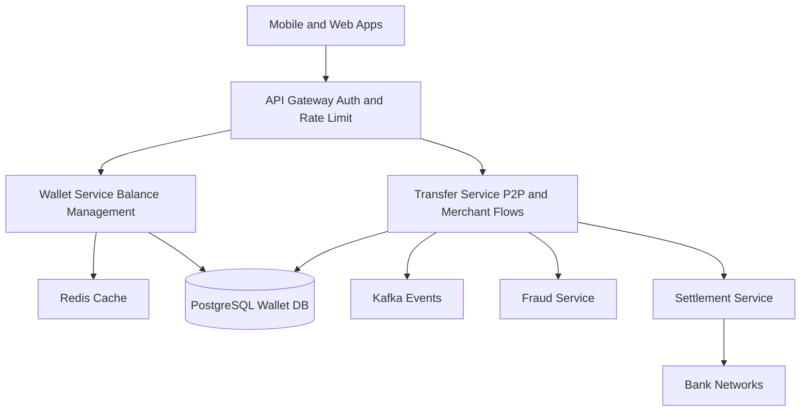

# System Design: Digital Wallet (PayPal-Style) (Beginner-Friendly Guide)

---

## What Are We Building?

A digital wallet (like PayPal, Apple Pay, or Google Pay) where users can:
- Store money in their account balance
- Link multiple payment methods (credit cards, bank accounts)
- Send money to other users instantly
- Pay merchants without exposing card details
- Track transaction history
- Set spending limits
- Manage multiple currencies
- Access funds anytime, anywhere

The wallet is the core of PayPal—it's where your money lives when you use PayPal to pay, receive, or transfer.

**Key Engineering Challenges:**
- **Real-time balance updates** — User sends $50 to friend; both users must see updated balance instantly
- **Concurrent transactions** — User sends $100 to friend AND pays merchant $50 simultaneously; balance must stay consistent
- **Money in transit** — Transfer is "processing" for 2-3 days; money not in sender's wallet, not in receiver's yet
- **Multi-currency** — User has balance in USD, EUR, INR; send money across currencies
- **Cold wallets** — User withdraws all money; wallet balance becomes zero; still needs to process pending transactions
- **Fraud detection** — Detect unusual spending patterns; block suspicious large transfers

---

## Step 1: Design Scope

**Scale:**
| Parameter | Value |
|-----------|-------|
| Active wallets | 500 million |
| Daily active users | 100 million |
| Transactions/second (peak) | 1 million |
| Concurrent wallet updates | 500,000 |
| Average wallet balance | $150 (USD) |
| Total money in wallets | $75+ billion |
| Transfer completion SLA | < 5 seconds (P2P) |
| Settlement delay | 2-3 business days (bank transfers) |
| Supported currencies | 50+ |
| Fraud detection latency | < 100ms |

**QPS Funnel:**
```
Wallet balance queries:       2 million QPS (80%)
Transfer requests:            200,000 QPS (8%)
Payment requests:             300,000 QPS (12%)
Refund requests:              100,000 QPS (4%)
```

**Non-functional requirements:**
- Availability: 99.99% uptime
- Consistency: Strong consistency for balance (no double-spending)
- Latency: Balance read < 50ms, transfer < 200ms
- Fraud detection: Catch 99% of fraudulent transfers
- Scalability: Handle 10x peak traffic

---

## Step 2: API Design

**Wallet APIs:**

```
GET    /v1/wallet/balance            ← Get current balance
POST   /v1/wallet/deposit            ← Add money (link card)
POST   /v1/wallet/withdraw           ← Remove money (to bank)
POST   /v1/transfers                 ← Send money to user
GET    /v1/transfers/{id}            ← Check transfer status
POST   /v1/transfers/{id}/cancel     ← Cancel pending transfer
GET    /v1/wallet/transactions       ← List transaction history
```

**Example: Check Balance**
```json
GET /v1/wallet/balance
Header: Authorization: Bearer {token}

Response:
{
  "wallet_id": "wallet_user_123",
  "total_balance": 500.00,
  "balances_by_currency": {
    "USD": 300.00,
    "EUR": 150.00,
    "INR": 2000.00
  },
  "available_balance": 450.00,  // Excludes pending holds
  "on_hold": 50.00,             // Pending refunds, disputes
  "last_updated": "2026-06-18T10:35:00Z"
}
```

**Example: Transfer Money (P2P)**
```json
POST /v1/transfers
{
  "to_user_id": "user_456",
  "amount": 50.00,
  "currency": "USD",
  "note": "Dinner payment",
  "idempotency_key": "transfer_12345_1"
}

Response:
{
  "transfer_id": "xfer_abc123",
  "status": "COMPLETED",  // or PENDING for international
  "from_user": "user_123",
  "to_user": "user_456",
  "amount": 50.00,
  "currency": "USD",
  "timestamp": "2026-06-18T10:35:00Z"
}
```

**Example: Deposit Money (Link Card)**
```json
POST /v1/wallet/deposit
{
  "payment_method_token": "tok_xyz789",  // Tokenized card
  "amount": 100.00,
  "currency": "USD",
  "idempotency_key": "deposit_999_1"
}

Response:
{
  "transaction_id": "txn_def456",
  "status": "AUTHORIZED",
  "amount": 100.00,
  "wallet_will_receive": 100.00,
  "processing_time": "1-3 business days"
}
```

---

## Step 3: Database Design

**Why Multiple Data Stores?**

| Data | Database | Why? |
|------|----------|------|
| Wallet balance | PostgreSQL + Redis | Strong consistency for balance; fast reads |
| Transaction history | PostgreSQL | ACID compliance, auditability, searchable |
| Transfer status (in-flight) | Redis | Fast updates, expires after settlement |
| Wallet metadata | PostgreSQL | User preferences, limits, settings |
| Transaction events | Kafka | Event stream for notifications, analytics |
| Risk scoring | Redis sorted sets | Real-time pattern detection |

---

## Step 4: Data Schema

**Wallets Table (PostgreSQL):**
```sql
CREATE TABLE wallets (
  wallet_id VARCHAR PRIMARY KEY,
  user_id VARCHAR UNIQUE NOT NULL,
  
  total_balance DECIMAL(15,2),  -- Sum of all currencies converted
  available_balance DECIMAL(15,2),  -- total - on_hold
  on_hold DECIMAL(15,2),  -- Pending refunds, chargebacks
  
  primary_currency VARCHAR(3),  -- USD, EUR, etc.
  created_at TIMESTAMP,
  updated_at TIMESTAMP,
  
  is_active BOOLEAN,
  verification_status VARCHAR,  -- KYC status
  daily_transfer_limit DECIMAL(15,2),
  monthly_transfer_limit DECIMAL(15,2),
  
  INDEX (user_id),
  INDEX (updated_at)
);
```

**Wallet Balances by Currency (PostgreSQL):**
```sql
CREATE TABLE wallet_balances (
  wallet_id VARCHAR,
  currency VARCHAR(3),
  balance DECIMAL(15,2),
  
  PRIMARY KEY (wallet_id, currency),
  INDEX (currency)
);
```

**Transfers Table (PostgreSQL):**
```sql
CREATE TABLE transfers (
  transfer_id VARCHAR PRIMARY KEY,
  from_user_id VARCHAR NOT NULL,
  to_user_id VARCHAR NOT NULL,
  amount DECIMAL(15,2),
  currency VARCHAR(3),
  
  status VARCHAR(20),  -- PENDING, COMPLETED, FAILED, CANCELLED
  
  from_fee DECIMAL(15,2),  -- Fee charged to sender
  to_received DECIMAL(15,2),  -- What receiver gets (after fees)
  
  initiated_at TIMESTAMP,
  completed_at TIMESTAMP,
  
  idempotency_key VARCHAR UNIQUE,
  reference_note VARCHAR,
  
  INDEX (from_user_id, initiated_at),
  INDEX (to_user_id, initiated_at),
  INDEX (status)
);
```

**Wallet Holds (Pending Transactions):**
```sql
CREATE TABLE wallet_holds (
  hold_id VARCHAR PRIMARY KEY,
  wallet_id VARCHAR NOT NULL,
  
  reason VARCHAR,  -- PENDING_REFUND, DISPUTE, CHARGEBACK
  amount DECIMAL(15,2),
  
  created_at TIMESTAMP,
  expires_at TIMESTAMP,  -- Auto-release if not resolved
  
  related_transaction_id VARCHAR,
  
  INDEX (wallet_id, expires_at)
);
```

**Redis Cache (Real-Time Balance):**
```json
Key: wallet:balance:user_123
Value: {
  "total_balance": 500.00,
  "usd": 300.00,
  "eur": 150.00,
  "inr": 2000.00,
  "on_hold": 50.00,
  "last_updated": 1718704500000
}
TTL: 5 minutes
```

---

## Step 5: High-Level Architecture



**Key Services:**
- **Wallet Service:** Manages balance, deposits, withdrawals
- **Transfer Service:** P2P transfers, merchant payments
- **Fraud Service:** Real-time risk scoring
- **Settlement Service:** Batch settlement to banks

---

## Step 6: Double-Entry Accounting

**Problem:** If we only store "balance = 500", how do we audit where money came from/went?

**Solution: Ledger (Double-Entry Bookkeeping)**
```
Every transaction has 2 entries:
1. Debit (money out from account)
2. Credit (money in to account)

Example Transfer: User A sends $50 to User B

Entry 1: Debit from User A's wallet
  account: user_a_wallet
  amount: -50.00
  type: TRANSFER_OUT

Entry 2: Credit to User B's wallet
  account: user_b_wallet
  amount: +50.00
  type: TRANSFER_IN

Sum of all entries: 0 (balanced!)

This prevents:
- Losing money (entry 1 debit, forgot entry 2 credit)
- Creating money (entry 1 debit, entry 2 credit +60)
```

**Ledger Table:**
```sql
CREATE TABLE ledger_entries (
  entry_id VARCHAR PRIMARY KEY,
  transfer_id VARCHAR,
  
  account VARCHAR,  -- user_123, user_456, reserve, fees
  amount DECIMAL(15,2),  -- Positive (credit) or negative (debit)
  
  entry_type VARCHAR,  -- TRANSFER_OUT, TRANSFER_IN, DEPOSIT, WITHDRAWAL, FEE
  status VARCHAR,  -- PENDING, POSTED, REVERSED
  
  created_at TIMESTAMP,
  posted_at TIMESTAMP,
  
  INDEX (account, posted_at)
);

-- Balance = SUM(amount) WHERE account = X AND status = POSTED
SELECT SUM(amount) FROM ledger_entries 
WHERE account = 'user_123' AND status = 'POSTED';
-- Result: 500.00
```

---

## Step 7: Concurrent Transfer Handling

**Problem:** User has $100 balance. Sends $100 to User B AND pays $100 to merchant simultaneously. Both should succeed? Only one? System must decide.

**Solution 1: Pessimistic Locking**
```
Thread 1: Send $100 to User B
- Lock wallet row: SELECT * FROM wallets WHERE user_id = A FOR UPDATE
- Check balance: 100 >= 100? Yes
- Deduct: balance = 0
- COMMIT
- Unlock

Thread 2: Pay $100 to merchant (arrives while lock held)
- Try to lock wallet row
- WAIT (lock held by Thread 1)
- Once Thread 1 commits:
- Check balance: 0 >= 100? NO
- Fail: Insufficient funds
- Return error
```

**Solution 2: Optimistic Locking (Better for scale)**
```
Thread 1: Send $100 to User B
- Read balance: 100, version: 5
- Check: 100 >= 100? Yes
- Update: balance = 0 WHERE version = 5
- IF updated: SUCCESS
- IF not updated (version changed): RETRY

Thread 2: Pay $100 to merchant
- Read balance: 100, version: 5
- Check: 100 >= 100? Yes
- Update: balance = 0 WHERE version = 5
- IF version already changed: RETRY
- On retry, version = 6, balance = 0
- Check: 0 >= 100? NO
- Fail: Insufficient funds
```

**Recommended: Hybrid**
- Small transfers: Optimistic (fast)
- Large transfers: Pessimistic (safe)
- Mixed: Serialize at transaction level

---

## Step 8: Settlement Reconciliation

**Problem:** User transfers $50 to friend. Money shows as "PENDING" for 3 days. What if:
- Our system crashes?
- Bank never acknowledges transfer?
- User disputes the transfer?

**Solution: Batch Settlement with Reconciliation**

```
Day 1: User A initiates $50 transfer to User B
- Status: PENDING
- A's balance: reduced (reserved)
- B's balance: NOT updated yet
- Event published to Kafka

Day 1 Evening: Settlement Service batches transfers
- Collects all PENDING transfers
- Publishes to ACH network: $50 to B's bank account
- Status: AWAITING_SETTLEMENT

Day 2-3: Bank processes
- Status: SETTLED (ACH confirms)
- B's account receives funds
- Webhook sent to both users

Reconciliation:
- Compare our records vs bank records daily
- If mismatch: Flag for investigation
- If transfer never settled: Auto-refund after 5 days
```

---

## Step 9: Key Design Decisions & Tradeoffs

| Decision | Why? | Tradeoff |
|----------|------|----------|
| Strong consistency for balance | Prevent double-spending; critical for trust | Slower writes; serialization overhead |
| Optimistic locking for transfers | Higher throughput; lower latency | More retries on high concurrency |
| 2-3 day settlement | Bank batching saves fees; industry standard | Users see "pending" status; more fraud risk during delay |
| Ledger (double-entry) | Perfect auditability; balance verification | More storage; more writes per transaction |
| Multi-currency wallets | Users hold money globally; cheaper transfers | Exchange rate complexity; settlement delays |
| Kafka event stream | Reliable delivery; event replay | Infrastructure complexity; eventual consistency |
| Redis cache for balance | Sub-50ms balance reads | Cache invalidation complexity; requires dual-write |

---

## Step 10: Interview Cheat Sheet Q&A

**Q: User has $100, clicks "send $50" twice within 1 second. Both succeed? Can system send $100 from a $100 wallet?**  
A: Only one should succeed. Use optimistic locking: read balance + version, update only if version matches. Thread 1 sends $50: balance = 50, version increments. Thread 2 tries to send: version mismatched, retry. On retry, balance = 50 < 50? Failure. The second attempt fails with "insufficient funds." No overdraft.

**Q: If user receives $100 transfer but our system crashes before posting to balance, is money lost?**  
A: No. Transfer record persists in database: "transfer_id, status=PENDING". On recovery, settlement service finds pending transfers, republishes to ledger. Since we use idempotency keys and double-entry accounting, posting the same transfer twice has no net effect (both entries already exist). Money recovered.

**Q: User transfers $100 internationally (USD to INR). Exchange rate changes 10% during processing. Who pays?**  
A: Depends on policy. Options: (1) Lock rate when user initiates (merchant eats volatility). (2) Lock rate when transferred (user eats volatility, gets refund difference). (3) Fixed margin (PayPal eats volatility, charges markup). PayPal uses (2)+(3): lock rate + 1.5% markup.

**Q: How do we prevent a user from creating 1000 fake accounts and sending money in circles to "launder" funds?**  
A: Fraud detection system tracks: account age, velocity (new account doing many transfers), similar phone/email across accounts, geolocation changes. Flag suspicious patterns for manual review. Also: enforce KYC (know-your-customer), require ID verification for large transfers. Users with < 30 days: limit transfers to $500/day.

**Q: User disputes a transfer: "I didn't send this." How do we handle it?**  
A: Mark transfer as DISPUTED. Place hold on funds (move to "on_hold" account). Investigate: check IP, device, 2FA used? If user was compromised: refund. If user lying (sent it, wants chargeback): deny dispute, release hold. Store evidence in database for audit. If disputed amount is high: involve PayPal support team.

**Q: What if wallet balance in Redis cache is stale? User thinks they have $100, but DB says $50?**  
A: Cache TTL is 5 minutes. Stale data only brief (max 5min). For critical operations (send money), always do dual-check: read from Redis (fast), verify against DB before deducting. If mismatch, invalidate cache, refetch from DB. This ensures money-related operations use strong consistency.

---

## Summary

A digital wallet requires:
- ✅ Strong consistency for balance (prevent double-spending)
- ✅ Optimistic/pessimistic locking for concurrent updates
- ✅ Double-entry accounting ledger for auditability
- ✅ Multi-currency support with exchange rates
- ✅ Idempotency keys for transfer retries
- ✅ Settlement reconciliation with banks
- ✅ Real-time fraud detection
- ✅ Cache layer (Redis) for balance reads
- ✅ Event streaming (Kafka) for notifications
- ✅ Holds system (pending refunds, disputes)
