# System Design: Ledger Service (Double-Entry Accounting) (Beginner-Friendly Guide)

---

## What Are We Building?

A ledger service that's the backbone of PayPal's accounting system. It tracks every penny:
- User sends $50 to friend → ledger records both sides (debit from sender, credit to receiver)
- PayPal charges a $0.30 fee → ledger records fee income
- User requests refund → ledger reverses original entry, creates new one
- Regulatory audit → ledger provides complete audit trail (which transactions, when, for whom)

The ledger ensures that at any point in time, money is accounted for and balanced. It's double-entry bookkeeping at scale: for every dollar that leaves an account, a dollar enters another account.

**Key Engineering Challenges:**
- **Immutability** — Once a ledger entry is posted, it CANNOT be changed (regulatory requirement); only reversals allowed
- **Consistency** — Sum of all accounts must equal zero (debit = credit); no orphaned money
- **Scale** — Process 1M+ ledger entries per second; $100+ billion in total balances
- **Query latency** — Calculate user balance quickly by summing ledger entries (trillions of rows)
- **Correctness** — One bug causing $1 accounting mismatch = audit failure; stakes are high
- **Compliance** — Regulatory requirements (SEC, FinCEN); must retain audit trail for 7+ years

---

## Step 1: Design Scope

**Scale:**
| Parameter | Value |
|-----------|-------|
| Ledger entries/second (peak) | 1 million |
| Daily entries | 100+ billion |
| Total balance tracked | $100+ billion |
| Unique accounts | 500+ million |
| Balance queries/second | 10 million |
| Data retention | 7+ years |
| Allowed accounting error | $0 (ZERO tolerance) |
| Audit latency | < 1 second |
| Write latency | < 100ms |
| Read latency (balance) | < 50ms |

**QPS Funnel:**
```
Ledger writes (posts):        1 million QPS
Balance reads:               10 million QPS (80%)
Transaction searches:         5 million QPS (search by user, time)
Adjustments/reversals:        10,000 QPS (0.1%)
```

**Non-functional requirements:**
- Consistency: Strong (eventual consistency unacceptable)
- Availability: 99.99% uptime
- Durability: Zero data loss (ACID guarantee)
- Auditability: Complete immutable transaction log
- Scalability: Handle 10x traffic growth

---

## Step 2: API Design

**Ledger Posting APIs:**

```
POST   /v1/ledger/post            ← Record entry (only before posted)
POST   /v1/ledger/post-batch      ← Batch post (atomic)
POST   /v1/ledger/reverse         ← Reverse entry (create reversing entry)
GET    /v1/ledger/{account}/balance ← Get account balance
GET    /v1/ledger/entries         ← Search entries by account/date
GET    /v1/ledger/reconcile       ← Verify balance math
```

**Example: Post Single Entry**
```json
POST /v1/ledger/post
{
  "entry_id": "entry_abc123",
  "timestamp": "2026-06-18T10:35:00Z",
  
  "from_account": "user_123",
  "to_account": "user_456",
  "amount": 50.00,
  "currency": "USD",
  
  "transaction_id": "txn_xyz789",
  "transaction_type": "TRANSFER",  // TRANSFER, DEPOSIT, WITHDRAWAL, FEE, REFUND
  
  "metadata": {
    "memo": "Dinner payment",
    "merchant_id": null
  }
}

Response:
{
  "entry_id": "entry_abc123",
  "status": "POSTED",
  "timestamp": "2026-06-18T10:35:00Z",
  
  "ledger_sequence": 999999999  // Monotonic sequence for ordering
}
```

**Example: Batch Post (Atomic)**
```json
POST /v1/ledger/post-batch
{
  "batch_id": "batch_settlement_20260618",
  "entries": [
    {
      "entry_id": "entry_1",
      "from_account": "user_100",
      "to_account": "user_200",
      "amount": 100.00
    },
    {
      "entry_id": "entry_2",
      "from_account": "user_200",
      "to_account": "paypal_fees",
      "amount": 2.50
    },
    {
      "entry_id": "entry_3",
      "from_account": "paypal_reserve",
      "to_account": "user_300",
      "amount": 50.00
    }
  ]
}

Response:
{
  "batch_id": "batch_settlement_20260618",
  "status": "POSTED",
  "entry_count": 3,
  "total_debits": 152.50,
  "total_credits": 152.50,
  "balanced": true  // CRITICAL: debits MUST equal credits
}
```

**Example: Get Account Balance**
```json
GET /v1/ledger/user_123/balance?currency=USD&as_of=2026-06-18T10:35:00Z

Response:
{
  "account": "user_123",
  "currency": "USD",
  "balance": 500.00,  // SUM of all POSTED entries for this account
  "as_of": "2026-06-18T10:35:00Z",
  "calculated_from_entries": 12340,  // Number of entries summed
  "verified": true  // Balance verified via reconciliation
}
```

**Example: Reverse Entry (for Refunds)**
```json
POST /v1/ledger/reverse
{
  "original_entry_id": "entry_abc123",
  "reversal_reason": "CUSTOMER_REFUND",
  "reversal_timestamp": "2026-06-18T11:00:00Z"
}

Response:
{
  "original_entry_id": "entry_abc123",
  "reversal_entry_id": "entry_reversal_def456",
  "status": "POSTED",
  "net_effect": "Original entry reversed; accounts back to before transaction"
}
```

---

## Step 3: Database Design

**Core Concept: Ledger = Immutable Log**

| Component | Database | Why? |
|-----------|----------|------|
| Ledger entries (immutable log) | PostgreSQL (append-only) | ACID, no updates allowed, perfect audit trail |
| Account balance cache | Redis | Fast balance lookups (sum is expensive) |
| Daily balance snapshots | TimescaleDB | Time-series; efficient range queries |
| Reconciliation reports | PostgreSQL | Detailed audit data |
| Journal (posting queue) | Kafka | Async processing; replay capability |

---

## Step 4: Data Schema

**Ledger Entries (Immutable Append-Only):**
```sql
CREATE TABLE ledger_entries (
  entry_id VARCHAR PRIMARY KEY,
  
  -- Accounts involved
  from_account VARCHAR NOT NULL,
  to_account VARCHAR NOT NULL,
  
  -- Amount & currency
  amount DECIMAL(18,4),  -- High precision for financial
  currency VARCHAR(3),
  
  -- Status & timestamps
  status VARCHAR(20),    -- POSTED, REVERSED, PENDING
  posted_at TIMESTAMP NOT NULL,
  created_at TIMESTAMP DEFAULT NOW(),
  
  -- Immutability marker
  is_posted BOOLEAN DEFAULT TRUE,  -- Once true, never false
  
  -- References
  transaction_id VARCHAR,
  transaction_type VARCHAR,  -- TRANSFER, FEE, REFUND, etc.
  batch_id VARCHAR,
  
  -- Metadata
  metadata JSONB,
  
  -- Audit
  recorded_by VARCHAR,  -- Which service posted this
  
  INDEX (from_account, posted_at),
  INDEX (to_account, posted_at),
  INDEX (transaction_id),
  INDEX (posted_at),
  INDEX (status),
  
  -- Constraint: once posted, can't update
  CHECK (is_posted = TRUE)  -- POSTED entries immutable
);
```

**Why IMMUTABLE?**
- No bugs can silently corrupt data (no UPDATE allowed)
- Perfect audit trail (every change is new entry, not overwrite)
- Regulatory compliance (SEC requires immutable records)
- Easier to debug (history never changes)

**Account Balances Cache (Redis):**
```json
Key: balance:user_123:USD
Value: {
  "balance": 500.00,
  "last_calculated": 1718704500000,
  "entry_count": 12340,
  "is_verified": true
}
TTL: 1 hour (periodically recalculated)
```

**Daily Balance Snapshots (TimescaleDB):**
```sql
CREATE TABLE daily_balances (
  account_id VARCHAR,
  balance_date DATE,
  currency VARCHAR(3),
  
  opening_balance DECIMAL(18,4),
  closing_balance DECIMAL(18,4),
  total_debits DECIMAL(18,4),
  total_credits DECIMAL(18,4),
  entry_count INT,
  
  PRIMARY KEY (account_id, balance_date, currency)
);
```

**Batch Posting Record:**
```sql
CREATE TABLE posting_batches (
  batch_id VARCHAR PRIMARY KEY,
  
  posted_at TIMESTAMP,
  entry_count INT,
  
  total_debits DECIMAL(18,4),
  total_credits DECIMAL(18,4),
  
  status VARCHAR(20),  -- POSTED, FAILED, ROLLED_BACK
  
  -- Verification
  is_balanced BOOLEAN,
  balance_error DECIMAL(18,4),  -- Should be 0.00
  
  verified_by VARCHAR,
  verified_at TIMESTAMP
);
```

---

## Step 5: High-Level Architecture



```text
[Architecture diagram]
[Payment and Transfer Services]
             |
      [Ledger Service]
        /           \
[Entry Validator] [Posting Engine]
      \            /
      [PostgreSQL Ledger DB]
        |      |       |
    [Redis] [Kafka] [TimescaleDB]
         \      |      /
      [Reconciliation Service]
```

**Key Services:**
- **Ledger Service:** Main API, coordinates posting
- **Entry Validator:** Ensures debits = credits
- **Posting Engine:** Writes to immutable log
- **Reconciliation Service:** Verifies balance correctness

---

## Step 6: Posting Workflow

**Two-Phase Posting (Ensuring Correctness):**

```
Phase 1: PREPARE (Validation)
┌──────────────────────────────────┐
│ Entry: from=A, to=B, amount=$50  │
│ 1. Check: A and B exist          │
│ 2. Check: no duplicate entry_id  │
│ 3. Validate: amount > 0          │
│ 4. Mark as: PENDING              │
└──────────────────────────────────┘
         ↓ (if all OK)

Phase 2: POST (Write to Log)
┌──────────────────────────────────┐
│ 1. Write to append-only log      │
│ 2. Fsync to disk (durability)    │
│ 3. Mark as: POSTED               │
│ 4. Update balance cache          │
│ 5. Return success                │
└──────────────────────────────────┘
```

**Batch Posting (With Balancing Check):**

```
Batch: 100 entries
1. Validate each entry
2. Calculate:
   - Total debits: $5,000
   - Total credits: $5,000
   
3. Check: Debits == Credits? 
   - YES: Safe to post
   - NO: REJECT BATCH, error

4. If balanced:
   - Write entire batch atomically
   - All-or-nothing (no partial posts)

5. If unbalanced:
   - Return error: "Accounting error, batch rejected"
   - Investigate before retrying
```

---

## Step 7: Reconciliation & Verification

**The Problem:**
```
Ledger has trillions of rows
How do we verify balance = SUM(entries) without scanning all?

SUM query too slow: SELECT SUM(amount) WHERE account = A
Could take minutes for large account
```

**Solution: Balance Snapshots**

```
Every night:
1. Calculate official balance for all accounts
   - SUM all POSTED entries for each account
   - Store as: daily_balance_snapshot

2. During day: Use snapshots + incremental updates
   - Balance(today) = snapshot(yesterday) + entries(today)
   - Faster! Only sum today's entries

3. End of period: Full reconciliation
   - Recalculate all balances from scratch
   - Compare to snapshots
   - Must match perfectly (within 0.01 cent tolerance)
   - If mismatch: ALERT, investigate
```

**Reconciliation Queries:**

```sql
-- Verify account balance correct
SELECT account,
  SUM(CASE WHEN from_account = account THEN -amount ELSE amount END) as calculated_balance
FROM ledger_entries
WHERE account IN (select distinct account from ledger_entries)
  AND posted_at >= '2026-06-01'::date
  AND posted_at < '2026-06-02'::date
GROUP BY account;

-- Compare to stored snapshots
SELECT a.account,
  a.calculated_balance,
  s.balance,
  ABS(a.calculated_balance - s.balance) as difference
FROM calculated_balances a
LEFT JOIN daily_balances s ON a.account = s.account_id
WHERE ABS(a.calculated_balance - s.balance) > 0.01;

-- If query returns any rows: RECONCILIATION FAILED, investigate
```

---

## Step 8: Reversals & Corrections

**Handling Errors (Refunds, Disputes):**

```
Scenario: User claims transfer was unauthorized
- Original entry: from=A, to=B, $100

Solution: REVERSE (not delete)

Step 1: Create reversal entry
  from=B, to=A, $100 (opposite of original)
  
Result:
- Original entry still in log (immutable)
- Reversal entry added
- Net effect: A's balance restored, B's reduced
- Audit trail complete (why was it reversed?)

Example:
Original: Entry_1: A → B: $100
Reversal: Entry_2: B → A: $100

A's balance before: $500
A's balance after reversal: $500 + $100 = $600 ✓

B's balance before: $300
B's balance after reversal: $300 - $100 = $200 ✓
```

---

## Step 9: Key Design Decisions & Tradeoffs

| Decision | Why? | Tradeoff |
|----------|------|----------|
| Immutable append-only log | Perfect audit trail; no silent data corruption | Deletions become reversals (more entries) |
| Batch posting with balance check | Guarantee debits = credits atomically | More complex; slower than single posts |
| Redis balance cache | Fast reads (50ms vs 1s from DB) | Cache invalidation; possible stale reads |
| Daily snapshots | Faster reconciliation; detect errors early | More storage; snapshot errors cascade |
| High decimal precision (18,4) | Avoid rounding errors | Slower calculations; more storage |
| Strong consistency | Zero tolerance for accounting errors | Serialization overhead; lower throughput |

---

## Step 10: Interview Cheat Sheet Q&A

**Q: Why immutable append-only log instead of just updating balances?**  
A: Immutability ensures perfect audit trail. If we UPDATE balance from $500 → $450, we lose history of why (which transaction caused it?). With append-only: every transaction recorded, never erased. If balance is wrong, we can retrace every entry. Also: prevents bugs (no accidental overwrites) and ensures compliance (regulators require immutable records for 7+ years).

**Q: What if a batch has 1000 entries and one is wrong (bad entry_id)? Do all 1000 fail?**  
A: All 1000 fail. Batch is atomic: all-or-nothing. If even one entry invalid: entire batch rejected. This prevents partial posts where 999 entries succeed but balance is incorrect. Client must fix bad entry and resubmit entire batch. It's strict, but necessary for correctness.

**Q: User's balance shows $500 in Redis cache, but DB says $300. Which is correct?**  
A: Trust DB. Cache is just a speed optimization. Always verify critical operations (large transfers) against DB before processing. In this case: cache is stale (mismatch > threshold). Invalidate cache, recalculate from DB. For balance queries: if mismatch detected, return DB balance, not cache.

**Q: How do we prevent someone from creating fake entries (posting $1M to their account)?**  
A: Only authorized services (Payment Service, Wallet Service) can call /ledger/post. API requires authentication (mTLS, JWT). Also: entries must reference real transactions (transaction_id must exist in payment DB). If transaction_id doesn't exist: reject entry. Access logs track who posted what, when.

**Q: If we have $100B in wallets, how do we verify the ledger is correct?**  
A: Reconciliation process: recalculate all balances from ledger entries (trillions of rows). Compare to account balances. Should match perfectly. Run this daily (off-peak hours). If mismatch: STOP processing, investigate. Also: balance snapshots catch errors early (compare daily to snapshot). High-frequency reconciliation catches errors before they compound.

**Q: What's the difference between "posting" and "settled"?**  
A: POSTED = ledger entry written (money moved in our system). SETTLED = bank has processed (physical transfer occurred). A transfer might be POSTED immediately (appears in user's wallet) but SETTLED 2-3 days later (actually received from bank). Ledger tracks POSTED status; settlement service tracks SETTLED status (separate system).

---

## Full Flow (Start to End)

### Happy Path
1. Client request enters API Gateway and is authenticated/authorized.
2. Orchestrator service validates input and routing context.
3. Core service executes primary business logic and required checks.
4. Read path uses cache first; fallback goes to durable database/store.
5. Write path updates fast layer first (where applicable) and publishes async events.
6. Downstream consumers persist durable state and trigger secondary effects.
7. Response is returned to client with final status and metadata.

### Failure and Retry Paths
1. Cache miss: read from durable store, then repopulate cache.
2. Dependency timeout: retry with backoff or circuit-breaker fallback.
3. Async event failure: retry queue and dead-letter queue (DLQ) handling.
4. Duplicate request: idempotency key returns prior successful outcome.
5. Concurrent updates: version/lock conflict triggers re-read and safe retry.

### End-State Guarantees
- Low-latency user operations on the hot path.
- Durable correctness in the source-of-truth datastore.
- Eventual consistency for non-critical async side effects.
- Strict correctness at critical boundaries (commit/payment/finalization).

---
## Summary

A ledger service requires:
- ✅ Immutable append-only log (perfect audit trail)
- ✅ Strong consistency (debits = credits always)
- ✅ Atomic batch posting (all-or-nothing)
- ✅ Balance reconciliation (verify correctness)
- ✅ Reversals system (handle refunds/disputes)
- ✅ Daily snapshots (fast reconciliation)
- ✅ High decimal precision (avoid rounding errors)
- ✅ Access control (only authorized services post)
- ✅ Zero tolerance for accounting errors
- ✅ 7+ year audit trail retention


