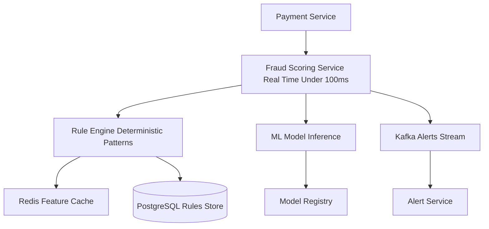

# System Design: Fraud Detection System (PayPal-Style) (Beginner-Friendly Guide)

---

## What Are We Building?

A real-time fraud detection system that catches suspicious transactions before they complete:
- User tries to send $10,000 in 5 seconds (unusual velocity)
- System detects anomaly, blocks transaction, sends SMS verification
- Stolen card used to buy from new merchant (different from usual)
- System catches it (99.5% accuracy), freezes account pending verification
- Chargebacks arrive; system analyzes patterns, identifies ring of fraudsters
- Machine learning model updated to catch similar fraud in future

The goal: Catch fraud in **milliseconds** (before payment clears), not days (after chargeback arrives).

**Key Engineering Challenges:**
- **Latency** — Decision required in < 100ms (during payment flow); can't take 5 seconds to analyze
- **Accuracy** — Catch 99%+ fraud but minimize false positives (blocking legit customers = revenue loss, support tickets)
- **Scale** — 1M+ transactions/second; each requires real-time risk scoring
- **Evolving fraud patterns** — Fraudsters adapt; model trained on yesterday's fraud may miss today's
- **Imbalanced data** — 99.9% legitimate, 0.1% fraud; ML models struggle with such imbalance
- **Privacy** — Detect suspicious patterns without storing sensitive data (card numbers, SSNs)

---

## Step 1: Design Scope

**Scale:**
| Parameter | Value |
|-----------|-------|
| Transactions/second (peak) | 1 million |
| Real-time scoring required | 1 million QPS |
| Fraud detection latency | < 100ms (99th percentile) |
| Transaction volume/day | 100+ billion |
| Fraud loss rate (target) | < 0.05% |
| Fraud detection accuracy | 99.5% (catch fraud) |
| False positive rate (max) | 1% (block legit users) |
| Training data (fraud cases) | 1+ million confirmed fraud cases |
| Model retraining frequency | Daily to weekly |
| Supported fraud types | 50+ patterns (card-not-present, account takeover, etc.) |

**QPS Funnel:**
```
Real-time transaction scoring:     1 million QPS
Risk score lookups (rules):         500,000 QPS (feature extraction)
Model inference (ML):               1 million QPS (50-100ms latency)
Post-transaction analysis:          100,000 QPS (chargeback analysis)
Alert generation:                    10,000 QPS (suspicious = alert)
```

**Non-functional requirements:**
- Latency: < 100ms for scoring (blocking decision latency)
- Accuracy: 99.5% fraud detection, < 1% false positive rate
- Availability: 99.99% (if fraud system down, allow all transactions)
- Scalability: Handle 10x peak traffic without latency increase
- Auditability: Log every decision for dispute analysis

---

## Step 2: API Design

**Fraud Detection APIs:**

```
POST   /v1/fraud/score              ← Score transaction (before approval)
POST   /v1/fraud/report             ← Report chargeback (feedback for model)
GET    /v1/fraud/risk/{user_id}     ← Get user's current risk profile
POST   /v1/fraud/rules/{id}/enable  ← Enable/disable rule
GET    /v1/fraud/alerts             ← List recent suspicious activity
```

**Example: Score Transaction (Real-Time)**
```json
POST /v1/fraud/score
{
  "transaction_id": "txn_abc123",
  "user_id": "user_456",
  
  "transaction": {
    "amount": 1000.00,
    "currency": "USD",
    "merchant_id": "merchant_new_xyz"  // Never used before
  },
  
  "user_context": {
    "account_age_days": 5,  // New account (risky)
    "device_fingerprint": "hash_device_123",
    "ip_address": "203.0.113.5",
    "country": "NG",  // Nigeria (different from usual)
    "previous_transactions": 2,
    "previous_24h_volume": 50.00  // Now sending 1K
  },
  
  "card_context": {
    "card_last_4": "4242",
    "card_issuer": "VISA",
    "card_country": "US"
  }
}

Response:
{
  "transaction_id": "txn_abc123",
  "risk_score": 85,  // 0-100 (85 = HIGH RISK)
  "decision": "CHALLENGE",  // APPROVE, CHALLENGE, DECLINE
  
  "risk_factors": [
    "new_account",
    "high_transaction_velocity",
    "unusual_merchant",
    "different_country",
    "card_country_mismatch"
  ],
  
  "recommended_action": "send_sms_verification",
  "expires_at": "2026-06-18T10:40:00Z"  // Score valid for 5 min
}
```

**Example: Report Fraud (Feedback Loop)**
```json
POST /v1/fraud/report
{
  "transaction_id": "txn_abc123",
  "fraud_type": "ACCOUNT_TAKEOVER",  // or CARD_NOT_PRESENT, PROMO_ABUSE
  "fraud_confirmed_at": "2026-06-18T11:00:00Z",
  "reported_by": "user_456",
  "reported_at": "2026-06-18T14:00:00Z"
}

Response:
{
  "transaction_id": "txn_abc123",
  "status": "RECORDED",
  "refund_initiated": true,
  "amount_refunded": 1000.00,
  "investigation_case_id": "case_7890"
}
```

---

## Step 3: Database Design

**Why Multiple Storage Systems?**

| Component | Database | Why? |
|-----------|----------|------|
| User risk profiles | Redis | Fast lookups; real-time updates |
| Transaction history | PostgreSQL | Queryable history; compliance |
| Fraud rules | PostgreSQL | CRUD operations; version control |
| Feature cache | Redis | Pre-computed features (velocity, etc.) |
| ML model artifacts | S3 | Store trained models, versioning |
| Chargeback records | PostgreSQL | Historical fraud analysis |
| Real-time alerts | Kafka | Stream suspicious activities |

---

## Step 4: Data Schema

**User Risk Profile (Redis):**
```json
Key: fraud:profile:user_456
Value: {
  "user_id": "user_456",
  "account_age_days": 5,
  "account_status": "ACTIVE",
  
  "velocity": {
    "transactions_24h": 10,
    "transactions_1h": 2,
    "volume_24h": 500.00,  // Total $ sent
    "volume_1h": 100.00
  },
  
  "risk_flags": [
    "new_account",
    "high_velocity",
    "multiple_devices"
  ],
  
  "previous_fraud": false,
  "chargeback_count": 0,
  
  "last_updated": 1718704500000,
  "last_transaction": "2026-06-18T10:35:00Z"
}
TTL: 1 hour
```

**Fraud Rules Table (PostgreSQL):**
```sql
CREATE TABLE fraud_rules (
  rule_id VARCHAR PRIMARY KEY,
  rule_name VARCHAR,
  description VARCHAR,
  
  condition_json TEXT,  -- e.g., {"amount": {">": 10000}, "velocity_1h": {">": 5}}
  
  risk_score_increment INT,  -- Add to base score if triggered
  action VARCHAR,  -- APPROVE, CHALLENGE, DECLINE
  
  enabled BOOLEAN,
  priority INT,  -- Higher = check first
  
  created_at TIMESTAMP,
  updated_at TIMESTAMP,
  
  INDEX (enabled, priority)
);

Example rows:
- rule_id: "rule_1", rule_name: "high_amount", condition: amount > $5000
- rule_id: "rule_2", rule_name: "high_velocity", condition: 5+ transactions in 1 hour
- rule_id: "rule_3", rule_name: "new_account", condition: account_age < 7 days
- rule_id: "rule_4", rule_name: "card_mismatch", condition: card_country != user_country
```

**Transaction Features Table (for analysis):**
```sql
CREATE TABLE transaction_features (
  transaction_id VARCHAR PRIMARY KEY,
  
  -- Transaction
  amount DECIMAL(15,2),
  merchant_category VARCHAR,
  
  -- User features
  account_age_days INT,
  devices_count INT,
  transactions_24h INT,
  chargeback_count INT,
  
  -- Card features
  card_age_days INT,
  card_country VARCHAR,
  card_is_new BOOLEAN,
  
  -- Location
  user_country VARCHAR,
  ip_country VARCHAR,
  
  -- Behavioral
  is_new_merchant BOOLEAN,
  time_of_day INT,  -- Hour (0-23)
  day_of_week INT,  -- 0-6
  
  -- Outcome
  fraud_confirmed BOOLEAN,
  chargeback_filed BOOLEAN,
  
  created_at TIMESTAMP,
  
  INDEX (created_at)
);
```

---

## Step 5: High-Level Architecture



**Key Services:**
- **Fraud Scoring:** Orchestrates rules + ML
- **Rule Engine:** Pattern-based rules (velocity, new merchant)
- **ML Model:** Neural network inference (trained daily)
- **Alert Service:** Sends notifications for suspicious activity

---

## Step 6: Hybrid Scoring System

**Two-Layer Approach:**

```
Layer 1: RULES (Fast, Deterministic)
┌──────────────────────────────────┐
│ 1. Amount check: > $5000? +20    │
│ 2. Velocity check: 5+ in 1h? +30 │
│ 3. New merchant? +15             │
│ 4. Card country mismatch? +10    │
│ 5. Account age < 7 days? +25     │
│                                  │
│ Total from rules: 0-100          │
└──────────────────────────────────┘
         ↓ (if score < 60, approve)
         ↓ (if score 60-80, challenge)
         ↓ (if score > 80, decline OR challenge)

Layer 2: ML MODEL (Accurate, Adaptive)
┌──────────────────────────────────┐
│ Input features (50):              │
│ - amount, velocity, account_age  │
│ - card_age, country, devices     │
│ - previous fraud history, etc.   │
│                                  │
│ Neural Network:                  │
│ Input → 3 hidden layers → Output │
│                                  │
│ Output: P(fraud) = 0.0 - 1.0     │
│         (probability)            │
└──────────────────────────────────┘

Final Decision:
risk_score = (rules_score × 0.4) + (ml_score × 0.6)
0-50: APPROVE
50-70: CHALLENGE (2FA, SMS verification)
70-85: CHALLENGE (high verification bar)
85+: DECLINE (high confidence fraud)
```

---

## Step 7: Feedback Loop & Model Training

**Problem:** Model trained yesterday. Fraudsters discover new exploit today. Model outdated.

**Solution: Continuous Learning**

```
Day 1: Deploy model v1
- Trained on: Historical fraud data
- Accuracy: 99%

Day 1-2: Transaction scoring
- Every decision logged: transaction, features, prediction, outcome
- Fraudsters try new tactics

Day 3: Chargebacks arrive
- Users report fraud: "This transaction was me, not me"
- Mark transactions as: FRAUD_CONFIRMED or LEGIT

Day 4: Retrain
- Collect new chargeback data from Day 3
- Add to training set
- Train model v2 (new patterns learned)
- A/B test: 10% traffic to v2, 90% to v1
- If v2 better: deploy gradually (canary deployment)

Result: Model adapts to fraud evolution (weekly/daily retraining)
```

**Feature Importance (from trained model):**
```
Top features predictive of fraud:
1. Account age < 7 days: 85% correlation with fraud
2. Transactions in 1 hour: 80%
3. New device + new country: 75%
4. Card country != User country: 60%
5. Merchant category unusual: 55%
6. Time of day (3am): 40%

Lower importance:
7. Amount > $1000: 30%
8. Previous chargebacks: 25%

Model learns: new accounts doing quick multiple transfers is
strongest fraud signal (higher weight)
```

---

## Step 8: Response Actions by Risk Level

**Risk Score Interpretation:**

```
Score: 0-30 (LOW RISK)
- Decision: APPROVE
- No friction
- User doesn't know fraud check happened

Score: 30-50 (MEDIUM-LOW)
- Decision: APPROVE
- Outcome logged for retraining

Score: 50-70 (MEDIUM)
- Decision: CHALLENGE
- Action: Send SMS verification code
- "Verify this is you: code XXXX"
- User enters code, transaction proceeds
- If user can't verify: block, contact support

Score: 70-85 (HIGH)
- Decision: CHALLENGE
- Action: Stronger verification
  - SMS code + security questions
  - "What's the last merchant you paid?"
- If multiple fails: block account
- Notify fraud team for manual review

Score: 85-100 (VERY HIGH)
- Decision: DECLINE (block)
- Action: Block transaction immediately
- Notify user: "Your account was compromised, call support"
- Fraud team investigates
- Reset user credentials
```

---

## Step 9: Key Design Decisions & Tradeoffs

| Decision | Why? | Tradeoff |
|----------|------|----------|
| Hybrid rules + ML | Rules are fast + interpretable; ML catches complex fraud | More complex system; harder to debug |
| 100ms latency budget | Acceptable in payment flow; real-time | Too aggressive for complex queries |
| 1% false positive rate | Can't block too many legit users | 1% of 1M transactions = 10K false declines (customer frustration) |
| Daily retraining | Keep up with fraud evolution | Model staleness during retraining; deployment risk |
| Redis cache for profiles | Sub-millisecond lookups; real-time updates | Cache inconsistency; memory overhead |
| Challenge vs decline | Challenge: verify user, allow if confirmed; decline: block | Challenge adds friction (bad UX); decline loses transaction |
| Multi-model ensemble | Average multiple ML models for better accuracy | More latency; more infrastructure |

---

## Step 10: Interview Cheat Sheet Q&A

**Q: Model says transaction is 95% fraud probability. Do we block or challenge?**  
A: Depends on business policy. High-value merchants (Amazon): challenge (verify with 2FA). Low-value merchants (gas station): decline (minimize fraud loss). For PayPal: typically challenge, accept SMS code. Blocking legitimate transactions = revenue loss, support costs, customer churn. Better to challenge and verify than decline.

**Q: Fraudsters bypass SMS verification (SIM swap attack). What's next layer?**  
A: Multiple verification methods: SMS (primary), security questions (secondary), email link (tertiary). For high-risk: require call to fraud team (human verification). For extreme: freeze account pending ID verification (upload passport). Tradeoff: extra friction, but catch sophisticated fraud.

**Q: New rule: "Block all transactions from Nigeria." Isn't that discrimination?**  
A: Legally risky. Geo-blocking alone is discriminatory. Better: treat Nigerian transactions as higher risk (score +20), but don't auto-decline. Challenge with stronger verification (SMS + security questions). Allows legitimate users from Nigeria, catches fraud. Also: monitor false positive rate by country—ensure equal treatment.

**Q: User reports fraud after 2 months. Chargeback arrives. Do we refund immediately?**  
A: Depends on reserve policy. Immediate refund: customer happy, PayPal liable (charged by bank). Hold for investigation: customer waits, we investigate, reduces fraud loss. Typical: refund if customer account clean (no previous fraud). If history of chargebacks: hold pending investigation. Ledger records both: refund + hold reversal.

**Q: ML model overfits to training data. Performance drops on production. How to catch this?**  
A: A/B test: 10% traffic to new model, 90% to old. Compare metrics: fraud catch rate, false positive rate. If new model worse: revert. Also: cross-validation during training (80% train, 20% validation). Monitor production metrics hourly (fraud catch rate, false positive rate). If accuracy drops: auto-revert, alert data team.

**Q: How do we prevent false positives from blocking legitimate customers?**  
A: Set low threshold for challenge (50% fraud probability), high threshold for decline (90%). Challenge is friction (SMS code), not blocking. Also: allow users to "whitelist" merchants (Amazon: always approve). For repeated false positives, contact support to adjust profile. Calculate loss: 1 false decline = $1000 revenue loss + support ticket + churn risk.

---

## Summary

A fraud detection system requires:
- ✅ Real-time risk scoring (< 100ms latency)
- ✅ Hybrid rules + ML approach
- ✅ 99.5% fraud detection accuracy
- ✅ < 1% false positive rate
- ✅ Multi-layer verification (SMS, 2FA, security questions)
- ✅ Continuous model retraining (adapt to fraud evolution)
- ✅ Feedback loops (chargeback data → retraining)
- ✅ User profile caching (velocity, history, risk flags)
- ✅ Multiple response actions (approve, challenge, decline)
- ✅ Auditability (log every decision for disputes)
