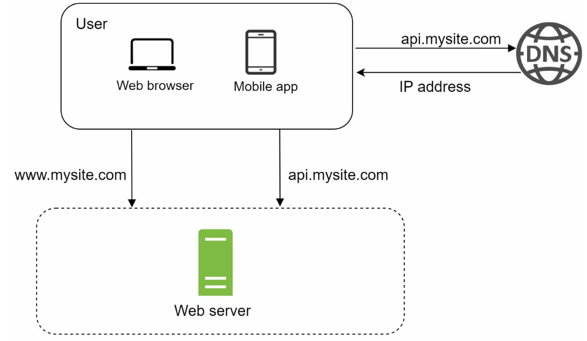
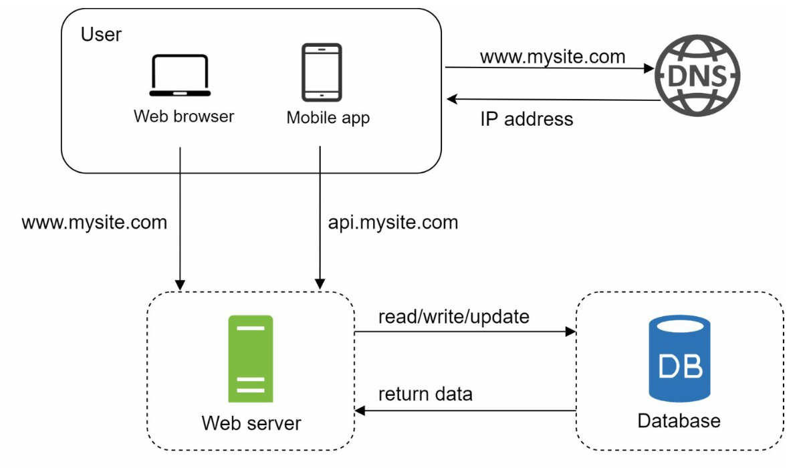
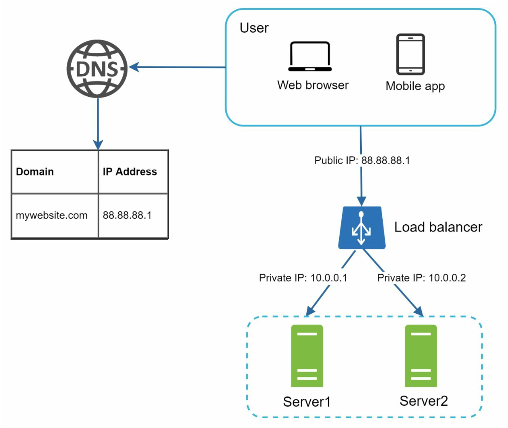
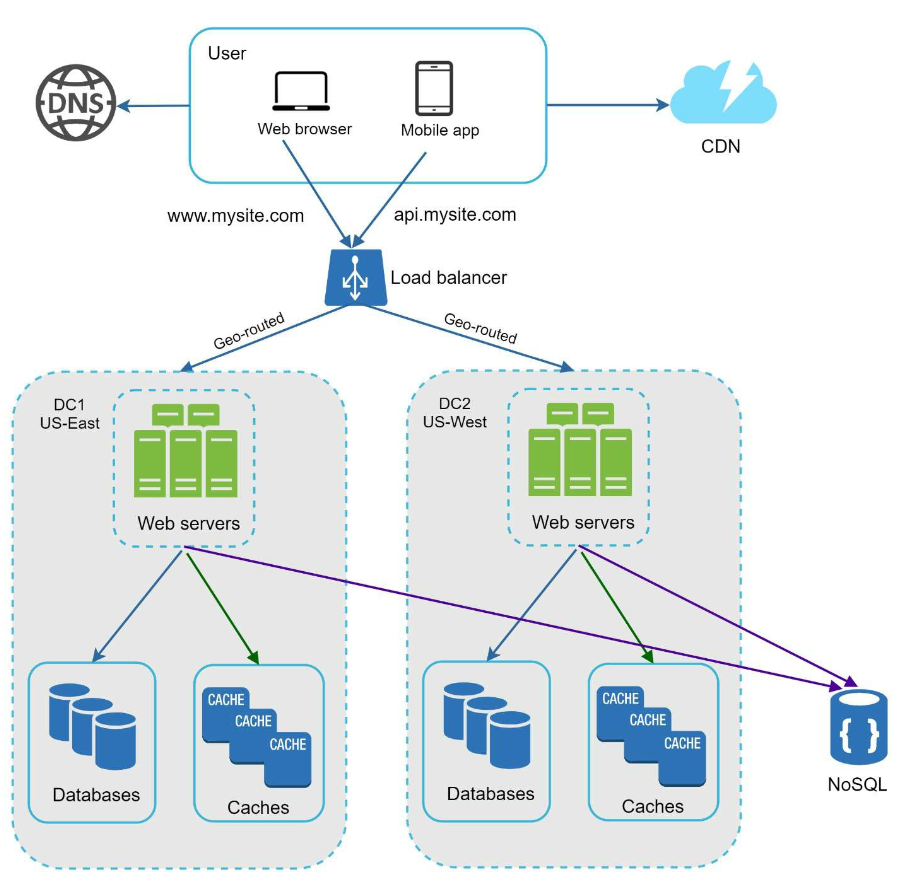
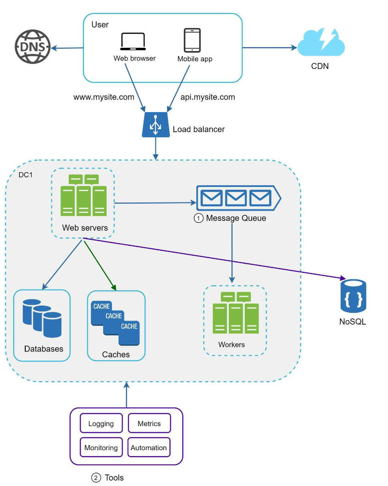

# Chapter 1: Scale from Zero to Millions of Users

## Introduction
Scaling a system to support millions of users is a complex, iterative journey requiring refinement and optimization. This chapter outlines how to begin with a single server setup and scale the architecture step by step to handle millions of users.

---

## Section 1: Single Server Setup
Initially, all components (web app, database, cache) run on a single server. 

   

### Request Flow
1. Users access the application via domain names (e.g., `api.mysite.com`), resolved to IP addresses using DNS.
2. IP address of the web-server is returned to the browser or mobile app.
3. HTTP requests are sent to the web server, which returns HTML or JSON responses.

### Traffic Sources
1. **Web Applications:** Use server-side languages (e.g., Python, Java) for business logic and client-side languages (e.g., JavaScript, HTML) for presentation.
2. **Mobile Applications:** Communicate with the web server using HTTP and JSON for lightweight data exchange.

---

## Section 2: Database Separation
As the user base grows, the database is moved to a dedicated server to allow independent scaling of web and database tiers.

   

### Database Choices

1. **Relational Databases (SQL):** Structured data stored in tables. Examples: MySQL, PostgreSQL.
2. **Non-Relational Databases (NoSQL):** Suitable for unstructured data or low-latency requirements. Categories include:
   - Key-Value Stores
   - Graph Databases
   - Column Stores
   - Document Stores

- Non-relational databases might be the right choice if:
   - application requires super-low latency.
   - data is unstructured, or  there is no relational data.
   - only need to serialize and deserialize data (JSON, XML, YAML, etc.).
   - need to store a massive amount of data.

---

## Section 3: Vertical vs Horizontal Scaling
### Vertical Scaling
- Adds more resources (CPU, RAM) to existing servers.
- Limited by hardware constraints and lacks redundancy.

### Horizontal Scaling
- Adds more servers to the pool, making it more suitable for large-scale systems.
- A load balancer is used to handle the request routing between the servers.
---

## Section 4: Load Balancer

   

A **load balancer** distributes traffic among multiple servers. Benefits include:
1. Redundancy: If a server goes offline, traffic is rerouted.
   -  If server 1 goes offline, all the traffic will be routed to server 2.
2. Scalability: Easily add servers to handle traffic spikes.
   -  If the website traffic grows rapidly, subsequent servers can be added to handle the additional traffic.

---

## Section 5: Database Replication

   

### Master-Slave Model
- **Master Database:** Handles write operations.
   - All the data-modifying commands like insert, delete, or update must be sent to the master database.
- **Slave Databases:** Handle read operations, improving performance and reliability.
   - Since the ratio of reads to writes is higher is most applications; thus, the number of slave
databases in a system is usually larger than the number of master databases.

### Benefits
1. Improved performance through parallel read operations.
2. High availability and data reliability through redundancy.

### Failure Handling
- If only one slave database is available and it goes offline, read operations will be directed
to the master database temporarily.
- In case multiple slave databases are available, read operations are
redirected to other healthy slave databases and a new server will replace the old one. 
-  If the master database goes offline, a slave database will be promoted to be the new
master.
- In production system the chosen slave database might not be up to date, hence data needs to be updated by running data
recovery scripts (methods like multi-masters and circular replication could help).

---

## Section 6: Caching
A **cache** stores frequently accessed data in memory to reduce database load. The cache tier is a temporary data store layer, much faster than the database. 

   

### Caching considerations
1. **Use case**: Consider using cache when data is read frequently but modified infrequently.
2. **Expiration Policies:** Once cached data is expired, it is removed from the cache. When there is no expiration policy, cached
data will be stored in the memory permanently.
3. **Consistency:** This means keeping the data store and the cache in sync. Inconsistency
can happen because data-modifying operations on the data store and cache are not in a single transaction. 
4. **Mitigating failures**: A single cache server represents a potential single point of failure, multiple
cache servers across different data centers are recommended to avoid SPOF.
5. **Eviction Policies:**: Once the cache is full, items need to be evicted to free up memory. LRU is the most popular cache eviction policy.

---

## Section 7: Content Delivery Network (CDN)
A **CDN** improves load times by caching static content (images, CSS, JavaScript) on geographically distributed servers.

   

### Workflow
1. User requests content from the nearest CDN server.
2. If unavailable, content is fetched from the origin server and cached.

### CDN considerations
1. **Cost:** CDNs are run by third-party providers which charge for data transfers in and out of the CDN.
2. **Cache Expiry:** The cache expiry time should neither be too long nor too short.
3. **CDN fallback:** If there is a temporary CDN outage, clients should be able to detect the problem
and request resources from the origin.
4. **Invalidating files:** If files are updated the cache should be invalidated to point to the updated files.

---

## Section 8: Stateless Web Tier
By moving session data to a shared datastore, web servers become stateless. This allows:
1. Easier horizontal scaling.
2. Auto-scaling based on traffic.

   

---

## Section 9: Multi-Data Center Setup
Deploying across multiple data centers improves availability and reduces latency. Strategies include:

   

1. **GeoDNS Routing:** Direct users to the nearest data center.
2. **Data Replication:** Synchronize data across centers to prevent inconsistencies.

### Key considerations
- **Traffic redirection:** Effective tools are needed to direct traffic to the correct data center.
- **Data synchronization:** A common strategy is to replicate data across multiple data centers. 
- **Test and deployment:**  Automated deployment tools are vital to keep services consistent through all the data centers.

---

## Section 10: Message Queue
A **message queue** is a durable component, stored in memory, that supports asynchronous
communication. It serves as a buffer and distributes asynchronous requests.

   

- Input services, called producers/publishers, create messages, and publish them to a message queue.
- Other services called consumers/subscribers, connect to the queue, and perform actions defined by the messages.

---

## Section 11: Logging, Metrics, and Automation

   

### Importance
1. **Logging:** Tracks errors and system health.
2. **Metrics:** Provides insights into performance and user activity.
3. **Automation:** Streamlines testing, deployment, and scaling.

---

## Section 12: Database Scaling
### Vertical Scaling
- Adds hardware resources but has physical and cost limitations.
- Has multiple drawbacks:
   -  Greater risk of single point of failures.
   -  Overall cost of vertical scaling is high

### Horizontal Scaling (Sharding)

   

- Divides data across multiple shards using keys (e.g., `user_id`).
   - Sharding separates large databases into smaller, more easily managed parts called shards.
   - Each shard shares the same schema, though the actual data on each shard is unique to the shard.
-  Sharding key is critical when implementing a sharding strategy. When choosing a sharding key it is important to choose a key that can evenly distribute data.

#### Challenges 
1. **Resharding data:** Resharding data is needed when:
   - Single shard could no longer hold more data due to rapid growth. 
   - Certain shards might experience shard exhaustion faster than others due to uneven data distribution.
   - Consistent Hashing is used to overcome these problems

2. **Celebrity problem:**  Excessive access to a specific shard could cause server overload.
   - To solve this problem, we may need to allocate a shard for each celebrity.

3. **Join and de-normalization:** Once a database has been sharded across multiple servers, it is hard to perform join operations across database shards.
   -  A common workaround is to de-normalize the database so that queries can be performed in a single table.

---

## Conclusion
### Key Takeaways
1. Keep the web tier stateless.
2. Build redundancy at every tier.
3. Use caching and CDNs to optimize performance.
4. Scale the data tier with sharding.
5. Decouple components for flexibility.

This chapter provides a solid foundation for building scalable systems that can handle millions of users.

---

## Most Asked Interview Questions

**Q1. What is the difference between vertical and horizontal scaling? When would you choose one over the other?**
> Vertical scaling (scale up) means adding more CPU/RAM/disk to a single machine. Horizontal scaling (scale out) means adding more machines to the pool. Vertical scaling is simpler but has a hard upper limit and creates a single point of failure; horizontal scaling is more complex (requires load balancing, stateless design) but offers near-unlimited capacity. Choose vertical for early-stage simplicity; switch to horizontal once load exceeds a single machine's capacity.

**Q2. How does a CDN improve website performance, and when should you use one?**
> A CDN caches static content (images, CSS, JS, videos) at geographically distributed edge nodes, serving users from the nearest node rather than the origin server. This reduces latency, lowers origin load, and improves availability. Use a CDN when your users are geographically distributed and you have significant static or cacheable content.

**Q3. Explain the CAP theorem. How does it influence database selection?**
> CAP states a distributed system can provide at most two of: Consistency (every read reflects the latest write), Availability (every request gets a response), and Partition Tolerance (the system continues operating despite network partitions). Since partitions are inevitable, systems choose CP (e.g., HBase, ZooKeeper) or AP (e.g., Cassandra, DynamoDB). This guides database selection: choose CP when correctness is critical (banking), AP when availability is critical (social media).

**Q4. What are the different database sharding strategies? What are the trade-offs of each?**
> Common strategies: (1) Range-based — easy range queries but risks hotspots; (2) Hash-based — even distribution but makes range queries hard and expensive resharding; (3) Directory-based — flexible lookup table but the directory is a single point of failure. Choose hash-based for even load distribution, range-based when range queries dominate.

**Q5. When would you choose a relational database over a NoSQL database, and vice versa?**
> Choose RDBMS when you need ACID transactions, complex joins, structured data with a well-defined schema, or strong consistency (e.g., financial systems). Choose NoSQL for massive horizontal scale, flexible/dynamic schemas, high write throughput, or when data is naturally key-value, document, or graph-shaped (e.g., user preferences, product catalogs, social graphs).

**Q6. How does a load balancer work? What are the common load balancing algorithms?**
> A load balancer distributes incoming traffic across multiple backend servers to prevent any single server from being overwhelmed. Common algorithms: Round Robin (sequential cycling), Least Connections (routes to the server with fewest active connections), IP Hash (same client always routes to the same server for session stickiness), and Weighted Round Robin (servers assigned weights based on capacity).

**Q7. What is database replication and what are the consistency implications?**
> Replication maintains copies of data on multiple nodes. In master-slave (primary-replica) replication, all writes go to the primary and are asynchronously propagated to replicas; reads can be served by replicas. The implication: replicas may serve stale data (eventual consistency). If the primary fails before replication completes, data can be lost. Synchronous replication avoids data loss but increases write latency.

**Q8. How does stateless vs. stateful architecture affect scalability?**
> In a stateless architecture, each server request contains all the information needed; no session state is stored on the server. This allows any request to be routed to any server, making horizontal scaling trivial. Stateful architectures bind users to specific servers (sticky sessions), which complicates load balancing, failover, and scaling. Always prefer stateless where possible; offload state to shared stores like Redis.

**Q9. What is a message queue and how does it help decouple services?**
> A message queue stores messages from producers until consumers can process them. It decouples producers (which send events) from consumers (which process them) so they can scale, fail, or be updated independently. Benefits include: buffering traffic spikes, enabling async processing, improving fault tolerance (messages persist even if the consumer is down), and enabling fan-out to multiple consumers.

**Q10. How would you scale a system from 1M to 100M users step by step?**
> (1) Separate web/app servers from the database server. (2) Add a load balancer + multiple app servers. (3) Add a caching layer (Redis/Memcached) to reduce DB reads. (4) Add a CDN for static assets. (5) Scale the database: read replicas for read-heavy load. (6) Introduce a message queue for async processing. (7) Shard the database for write-heavy load. (8) Move to microservices where bottlenecks exist. (9) Add multi-region deployment for global scale.

**Q11. What is the difference between a cache hit and a cache miss? What is an acceptable cache hit rate?**
> A cache hit occurs when requested data is found in the cache; a cache miss means the system must fetch data from the slower origin (database/disk). An acceptable hit rate depends on the system but is typically above 80–90% for most production systems. Below that, the cache adds overhead without enough benefit.

**Q12. What is the thundering herd problem and how do you prevent it?**
> When a cache entry expires, many concurrent requests simultaneously miss the cache and stampede the database. Solutions: (1) Cache locking — only one request regenerates the cache, others wait; (2) Probabilistic early expiration — randomly refresh cache before expiry; (3) Background refresh — proactively refresh popular keys before they expire.

**Q13. What is cache invalidation and what are the common strategies?**
> Cache invalidation ensures the cache doesn't serve stale data. Strategies: (1) TTL-based expiry — entries expire after a fixed time; (2) Write-through — update cache and DB simultaneously on writes; (3) Write-behind (write-back) — write to cache immediately, persist to DB asynchronously; (4) Cache-aside (lazy loading) — application checks cache first, fetches from DB on miss and populates cache.

**Q14. What is a reverse proxy and how does it differ from a forward proxy?**
> A reverse proxy sits in front of backend servers and handles incoming client requests on their behalf (load balancing, SSL termination, caching). A forward proxy sits in front of clients and routes requests on their behalf (used by clients to access the internet, for anonymity or content filtering). Nginx and HAProxy are common reverse proxies.

**Q15. What is DNS and what role does it play in a large-scale system?**
> DNS maps domain names to IP addresses. In large systems, DNS enables geographic load distribution via GeoDNS (routing users to the nearest data center), supports failover by pointing traffic to healthy servers, and enables blue-green deployments via DNS record swaps. DNS TTL should be kept low during deployments but higher in steady state to reduce lookup overhead.

**Q16. What is a microservices architecture, and when should you use it vs. a monolith?**
> Microservices split the application into independently deployable services, each owning its domain. Advantages: independent scaling, independent technology choices, fault isolation. Disadvantages: network overhead, operational complexity, distributed tracing challenges. Prefer a monolith early on for simplicity; migrate to microservices when specific components have distinct scaling needs or team boundaries justify it.

**Q17. How do you handle session management in a horizontally scaled system?**
> In horizontal scaling, users can hit different servers on each request. Solutions: (1) Sticky sessions (IP affinity) — route a user to the same server, but this hurts load distribution; (2) Centralized session store — store sessions in Redis or a DB so any server can retrieve them; (3) Stateless JWT tokens — encode session data in a signed token so no server-side state is needed.

**Q18. What is database connection pooling and why does it matter at scale?**
> Opening a new database connection for every request is expensive (TCP handshake, authentication). A connection pool maintains a set of persistent connections that are reused across requests, reducing latency and resource consumption. At scale, a misconfigured pool (too few connections) causes queuing; too many overwhelms the database. PgBouncer is a common PostgreSQL connection pooler.

**Q19. What is the difference between synchronous and asynchronous processing, and when would you use each?**
> Synchronous processing blocks the caller until the operation completes; asynchronous processing decouples the caller and worker using queues or callbacks. Use synchronous for operations whose result is immediately needed (login, payment confirmation). Use async for work that is time-consuming, can tolerate delay, or doesn't require an immediate response (email sending, report generation, video transcoding).

**Q20. What is a service mesh and how does it help in a microservices architecture?**
> A service mesh (e.g., Istio, Linkerd) is an infrastructure layer that handles service-to-service communication, providing features like mutual TLS, retries, circuit breaking, observability, and load balancing without changing application code. It offloads cross-cutting concerns from individual services into a sidecar proxy, simplifying the application logic.

**Q21. What is the difference between latency and throughput? How do they relate to each other?**
> Latency is the time taken to process a single request (e.g., 50ms). Throughput is the number of requests processed per unit of time (e.g., 10,000 RPS). They are related: high throughput can increase latency under load (queueing theory — Little's Law). Optimization for one can hurt the other; batching increases throughput but increases latency per item.

**Q22. What is circuit breaking and how does it prevent cascade failures?**
> A circuit breaker monitors failure rates for calls to a downstream service. When failures exceed a threshold, the circuit "opens" and subsequent calls immediately return an error (or fallback) rather than waiting for a timeout. This prevents a failing service from consuming threads and cascading failure across the system. After a cooldown, it enters "half-open" state to test recovery.

**Q23. How does database indexing work, and what are the trade-offs of adding too many indexes?**
> An index is a data structure (typically a B-tree or hash) that speeds up read queries on indexed columns at the cost of additional storage and slower writes (the index must be updated on every insert/update/delete). Too many indexes slow down writes and increase storage. Index selectively: create indexes on columns used in WHERE, JOIN, and ORDER BY clauses with high cardinality.

**Q24. What is eventual consistency vs. strong consistency? Give a real-world example of each.**
> Strong consistency guarantees every read reflects the latest write (e.g., a bank balance — you must always see the current balance). Eventual consistency allows temporary stale reads but promises the system will converge over time (e.g., a social media like count — seeing 999 instead of 1000 for a moment is acceptable). Choose based on the tolerance for stale reads vs. the performance cost of synchronization.

**Q25. What is a write-ahead log (WAL) and why is it important for database durability?**
> A WAL records every change to a durable log before applying it to the data file. If the system crashes, it replays the WAL to recover any uncommitted transactions. This ensures durability (D in ACID) without requiring every write to flush the data file immediately. PostgreSQL, MySQL InnoDB, and most RDBMS use WAL. It also enables replication (primary streams its WAL to replicas).

**Q26. How does geo-distribution / multi-region deployment work, and what are the challenges?**
> Multi-region deployment runs your system across multiple geographic regions to reduce latency for global users and improve disaster recovery. Challenges: (1) Data replication lag between regions; (2) Conflict resolution for concurrent writes in multiple regions; (3) Cost of cross-region data transfer; (4) Consistency vs. availability trade-offs. Solutions: active-passive failover, active-active with conflict resolution (e.g., Dynamo), or geo-partitioning.

**Q27. What is the difference between an SQL JOIN and denormalization for read performance?**
> JOINs fetch normalized data across multiple tables at query time — flexible but potentially slow at scale. Denormalization pre-computes and stores joined data together, reducing query complexity at the cost of data redundancy and more complex writes. At massive scale (e.g., social graphs), denormalization or pre-materialized views are often necessary because JOIN operations across shards are prohibitively expensive.

