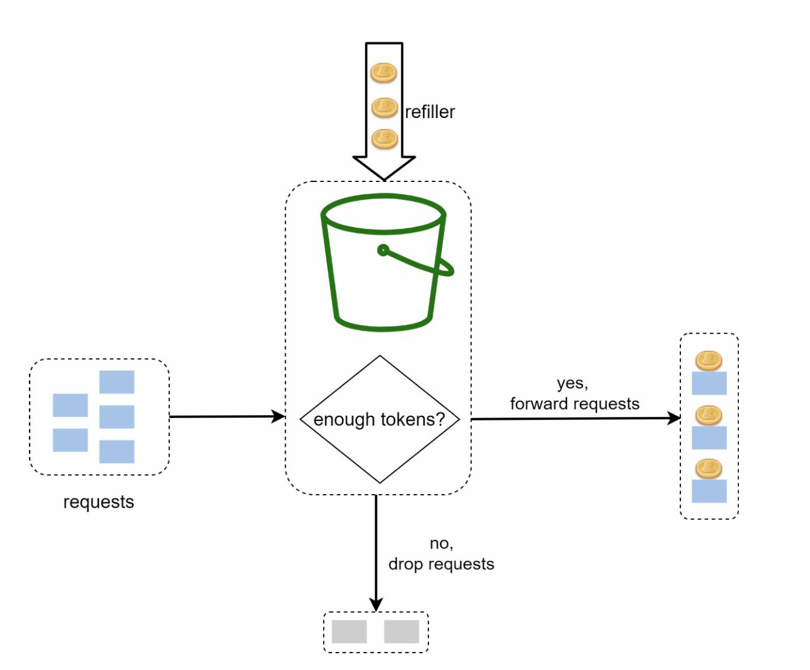
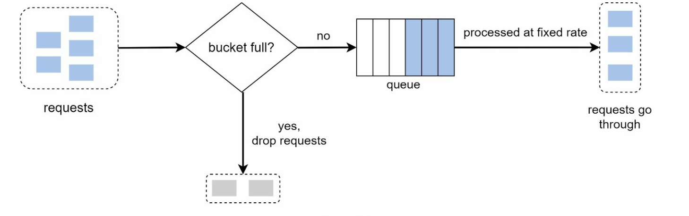
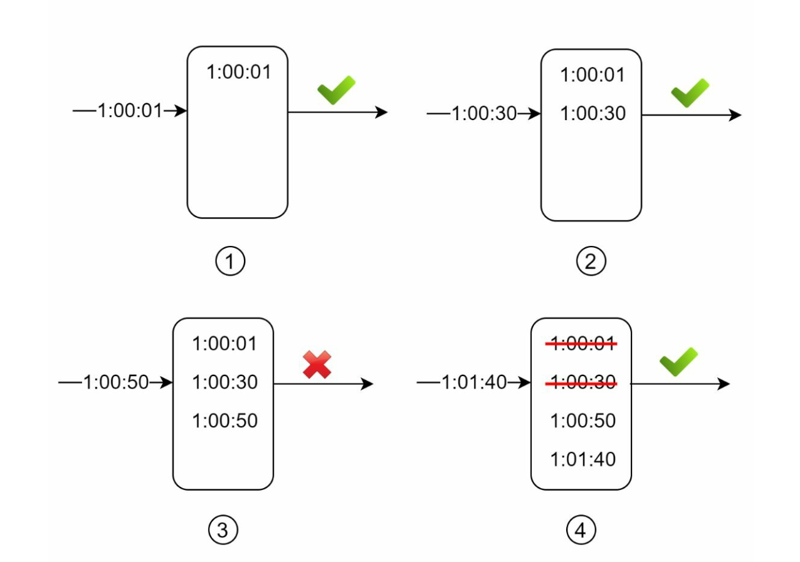
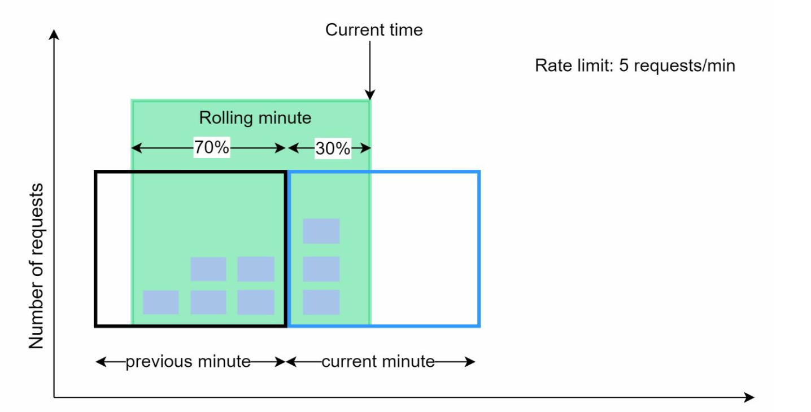
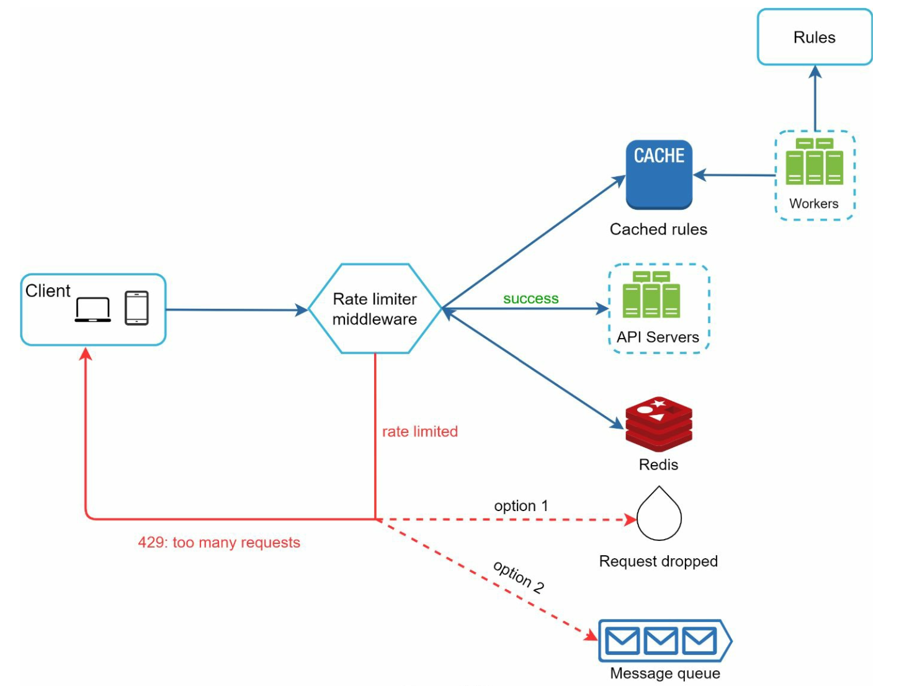

# Chapter 4: Design a Rate Limiter

## Introduction
This chapter explores the design and implementation of a rate limiter—a system component used to control traffic rates sent by clients or services. Rate limiters are crucial for preventing abuse, reducing costs, and ensuring the stability of server resources. Examples of their use include limiting posts, account creations, and reward claims.

## Benefits of Rate Limiting
- **Preventing DoS Attacks:** Blocking excess calls to avoid resource starvation.
- **Cost Reduction:** Limiting unnecessary requests to reduce server expenses.
- **Preventing Overloads:** Filtering out excessive requests to stabilize server performance.

## Step 1: Understanding the Problem
### Key Features
- Server-side API rate limiter.
- Support for multiple throttle rules.
- Handle large-scale systems in distributed environments.
- Option for a standalone service or application-level code.
- Inform users when throttled.

### Requirements
- Accurate request throttling.
- Minimal latency.
- Low memory usage.
- Distributed capability.
- Clear exception handling.
- High fault tolerance.

## Step 2: High-Level Design
### Placement Options

    

1. **Client-Side Implementation:** Unreliable due to potential misuse.
2. **Server-Side Implementation:** Preferred for control and reliability.
3. **Middleware (API Gateway):** A flexible option for integrated rate limiting.

### Guidelines for Placement
- Evaluate current tech stack and choose efficient options.
- Select appropriate algorithms based on business needs.
- Use an API gateway if microservices are employed.
- Opt for commercial solutions if resources are limited.

## Step 3: Rate Limiting Algorithms
### 1. Token Bucket

  

- **Description:** Tokens are added to a bucket at a fixed rate; each request consumes a token.
- **Parameters:** Bucket size and refill rate.
- **Pros:** Easy to implement, memory-efficient, supports traffic bursts.
- **Cons:** Requires careful parameter tuning.

### 2. Leaking Bucket

  

- **Description:** Processes requests at a fixed rate using a FIFO queue.
- **Pros:** Memory-efficient, stable outflow rate.
- **Cons:** Traffic bursts may delay recent requests.
  

  Example: https://github.com/uber-go/ratelimit

### 3. Fixed Window Counter

  

- **Description:** Divides time into fixed intervals and uses counters to limit requests.
- **Pros:** Simple, efficient for specific use cases.
- **Cons:** Traffic spikes at window edges can exceed limits.

- Sudden burst of traffic at the edges of time windows
could cause more requests than allowed quota to go through.

  

### 4. Sliding Window Log

  

- **Description:** Tracks timestamps to allow a rolling time window.
- **Pros:** Accurate rate limiting.
- **Cons:** High memory consumption.
  

### 5. Sliding Window Counter

  

- **Description:** Combines fixed window and sliding log methods for smoothing spikes.
- **Pros:** Memory-efficient, handles traffic bursts.
- **Cons:** Approximation may not be perfectly strict.
  

## High-Level Architecture

  

- **Data Storage:** Use in-memory caching (e.g., Redis) for fast counter operations.
- **Steps:**
  1. Client sends request to middleware.
  2. Middleware checks counters in Redis.
  3. Request is processed or rejected based on limits.

## Advanced Considerations
### Distributed Environments
- **Challenges:** Race conditions, synchronization issues.
- **Solutions:** Use locks, Lua scripts, or sorted sets in Redis. Employ centralized data stores for synchronization.

### Performance Optimizations
- Multi-data center setups for reduced latency.
- Eventual consistency models for synchronization.

### Monitoring
- Regular analytics to ensure algorithm effectiveness and adjust rules as needed.

---

## Most Asked Interview Questions

**Q1. What are the most common rate limiting algorithms? Compare the trade-offs.**
> (1) Token Bucket: allows bursts up to bucket capacity, smooth on average, memory efficient; (2) Leaky Bucket: fixed output rate regardless of burst, queue-based; (3) Fixed Window Counter: simple but allows 2× burst at window boundaries; (4) Sliding Window Log: precise but memory-heavy (stores timestamps of all requests); (5) Sliding Window Counter: hybrid of fixed window and log, good balance of accuracy and memory.

**Q2. Where should the rate limiter be placed — client, server, or middleware?**
> Server-side or API gateway middleware is preferred. Client-side rate limiting is unreliable since clients can bypass it. Placing it at the API gateway (e.g., Kong, AWS API Gateway) centralizes enforcement and removes the logic from individual services. For microservices, a distributed rate limiter (Redis-backed) shared across all gateway nodes is ideal.

**Q3. How would you implement a distributed rate limiter across multiple servers?**
> Use a centralized store like Redis with atomic operations. For token bucket: use Redis INCR + EXPIRE with a Lua script to atomically check-and-increment the counter. For sliding window: use Redis sorted sets (ZADD/ZCOUNT/ZREMRANGEBYSCORE) with timestamps as scores. All API servers share the same Redis cluster, ensuring consistent counting across nodes.

**Q4. How does the token bucket algorithm work?**
> A bucket holds up to N tokens. Tokens are added at a fixed rate (e.g., 10/second). Each request consumes 1 token. If the bucket is full, new tokens are discarded. If a request arrives and the bucket is empty, it is rejected. This allows short bursts (up to N requests instantly) while enforcing a long-term average rate. Memory usage: O(1) per user.

**Q5. How does the leaky bucket algorithm work?**
> Requests are added to a fixed-size queue (the "bucket"). A "leak" processes requests at a fixed constant rate from the queue. If the queue is full, new requests are dropped. Unlike token bucket, it doesn't allow bursts — output is always a smooth, constant flow. Good for use cases requiring traffic shaping (e.g., upstream API calls).

**Q6. What HTTP status code is returned when rate limited? Which headers should be included?**
> Return `429 Too Many Requests`. Standard headers to include: `Retry-After` (seconds until the client can retry), `X-RateLimit-Limit` (request limit per window), `X-RateLimit-Remaining` (remaining requests in current window), `X-RateLimit-Reset` (UNIX timestamp when the window resets). These help clients back off gracefully without hammering the server.

**Q7. What is the fixed window counter algorithm and its main flaw?**
> Divide time into fixed windows (e.g., 1-minute slots). Count requests per user per window; reject if over the limit. The flaw: a user can make the full quota at the end of window 1 and the full quota at the start of window 2 — effectively 2× the intended rate within a 1-minute span. Sliding window algorithms fix this at the cost of more complexity.

**Q8. What is the sliding window log algorithm and its memory overhead?**
> Store a timestamp for every request in a sorted set per user. When a new request arrives, remove timestamps older than the window, count remaining, and reject if over the limit. Highly accurate but stores every request timestamp per user — memory grows with request volume. At 1M users × 100 requests/window, that's 100M entries.

**Q9. How would you implement per-user vs. per-IP vs. per-API-key rate limiting?**
> Use the rate limiter key to distinguish: for per-user use `user:{userId}:count`, per-IP use `ip:{ip}:count`, per-API-key use `key:{apiKey}:count`. The algorithm is the same; only the key changes. You can compose them: a request might simultaneously consume a per-user bucket and a global per-IP bucket.

**Q10. How do you handle race conditions in a distributed rate limiter?**
> Use atomic Redis scripts (Lua scripts executed atomically) for read-increment-check operations. Redis MULTI/EXEC transactions or Lua scripts prevent race conditions between the check and the increment steps. Without atomicity, two concurrent reads could both pass the check before either increments the counter, allowing more requests than allowed.

**Q11. What are the trade-offs of in-process vs. Redis-based rate limiting?**
> In-process (local counter): zero network overhead, extremely fast, but counts only on one server — a user can make N × num_servers requests across the fleet. Redis-based: centralizes counting, accurate globally, but adds ~1ms Redis roundtrip per request and Redis becomes a dependency. For most production systems, Redis-based is preferred for correctness.

**Q12. How would you rate limit different user tiers (free vs. premium)?**
> Store the rate limit configuration per user tier in a config service or database. When a request arrives, look up the user's tier (cacheable) and apply the corresponding limit. Example: free tier = 100 req/min, premium = 10,000 req/min. The rate limiter middleware fetches the limit from cache by user ID before checking the counter.

**Q13. How would you design rules for rate limiting (e.g., per endpoint, per user, globally)?**
> Store rules in a configuration service (e.g., Yaml file or DB): rule = {key_type: "user_id", resource: "/api/login", algorithm: "sliding_window", limit: 5, window: "60s"}. The rate limiter middleware loads rules (cached, refreshed periodically) and evaluates all applicable rules for each request. First rule violation triggers the 429 response.

**Q14. How do you ensure the rate limiter doesn't become a performance bottleneck?**
> (1) Keep the rate limiter on the critical path minimal — only a Redis INCR and compare; (2) Cache user tier/config lookups; (3) Use Redis pipelining for batched operations; (4) Deploy Redis in-cluster mode for horizontal scaling; (5) Consider local approximate rate limiting as a first-pass filter with Redis for precise counting only at limits.

**Q15. What happens if the rate limiter itself goes down?**
> Design for graceful degradation: if the rate limiter or Redis is unreachable, choose a fail-open policy (allow requests through) or fail-closed (reject all). Fail-open protects availability but risks abuse. Fail-closed protects the backend but causes full service outage. Most systems prefer fail-open with circuit breakers and alerts to detect the outage quickly.

**Q16. How would you implement a global rate limiter for the entire API (not per-user)?**
> Use a global counter in Redis: `INCR global:api:count` with a TTL-based expiry (sliding or fixed window). If count > global limit, reject with 429. This caps total API throughput regardless of which user is responsible. Combined with per-user limits, you get both individual abuse prevention and global capacity protection.

**Q17. How do you handle rate limiting for microservices that call each other?**
> Service-to-service calls should use API keys or service accounts. Apply rate limits on the receiving service (inbound) rather than the calling service (outbound). Use circuit breakers (e.g., Resilience4j) on the caller side to stop hammering a downstream service that is struggling. Kong or Istio can enforce inter-service rate limits at the network layer.

**Q18. What is the difference between rate limiting and throttling?**
> Rate limiting strictly enforces a request cap per time window (reject if exceeded). Throttling slows down requests rather than rejecting them — adding artificial delay to reduce throughput. Throttling is gentler but increases per-request latency. Rate limiting is more abrupt but simpler to implement and reason about.

**Q19. How do you communicate rate limit information to API clients?**
> Via response headers on every request (not just when limited): `X-RateLimit-Limit: 1000`, `X-RateLimit-Remaining: 847`, `X-RateLimit-Reset: 1713984000`. On a 429, include `Retry-After: 60`. Good API documentation should also document the limits. SDKs can use these headers for automatic retry with backoff.

**Q20. What is the leaky bucket vs. token bucket trade-off for streaming APIs?**
> Leaky bucket is ideal for streaming where output rate must be constant (e.g., video frame rates, RTB bid requests). Token bucket is better for web APIs where you want to allow occasional bursts (e.g., a mobile app syncing after coming back online). Choose based on whether burst tolerance is desirable.

**Q21. How do you rate limit without a centralized store (fully distributed)?**
> Use a gossip-based approach where each node occasionally syncs its counter with a few random peers (approximate counting). Alternatively, use consistent hashing to route all requests with the same key to the same node — no centralized store needed for that key, but limited by that node's capacity. This trades accuracy for reduced centralized dependency.

**Q22. How do you handle rate limiting in GraphQL APIs where every request hits the same endpoint?**
> Since all GraphQL requests use POST /graphql, standard endpoint-based rate limiting doesn't work well. Instead, rate limit on query complexity (calculate a cost per query based on fields and depth) and apply complexity budgets per user per time window. This prevents expensive queries from consuming all capacity.

**Q23. What is the "two-speed" rate limiting pattern?**
> Apply two limits simultaneously: a short burst limit (e.g., 100 req/10s) and a sustained limit (e.g., 1,000 req/hour). This allows short legitimate spikes (e.g., page load with 50 API calls) while preventing sustained abuse. Token bucket naturally implements this with burst capacity capped at bucket size and replenishment rate as the sustained limit.

**Q24. How do you test a rate limiter?**
> Unit test: verify that the counter increments, that the Nth+1 request is rejected, that TTL resets correctly. Integration test: spin up Redis + the limiter and fire concurrent requests to test for race conditions. Load test: verify that the rate limiter handles 100K RPS without itself becoming a bottleneck. Chaos test: kill Redis and verify the fail-open/fail-closed behavior is as designed.

**Q25. Give an example of a real-world rate limiter architecture used by large companies.**
> Stripe: uses token bucket per API key stored in Redis, with a tiered system based on account type. GitHub: REST API uses X-RateLimit-* headers with a 5,000 req/hr limit for authenticated users. Google Maps API: uses a daily quota + per-second burst limit enforced at the API gateway. Twitter API: uses per-endpoint rate limits (e.g., 300 reads/15min window) shared across OAuth apps.

**Q26. What is an API gateway and how does it relate to rate limiting?**
> An API gateway sits in front of all your services and handles cross-cutting concerns: routing, SSL termination, authentication, rate limiting, and observability. Products like Kong, AWS API Gateway, and NGINX Plus have built-in rate limiting plugins. Centralizing rate limiting in the gateway means individual microservices don't need to implement it themselves.

**Q27. How does rate limiting differ for real-time APIs (WebSocket, SSE) vs. REST APIs?**
> REST APIs: limit per request (easily countable). WebSocket/SSE: connections are long-lived, so you rate limit on connection establishment, message rate within a connection (messages per second), or bandwidth consumed. For WebSockets, also apply a connection-level limit (max open connections per user) to prevent resource exhaustion from keeping thousands of idle sockets open.

