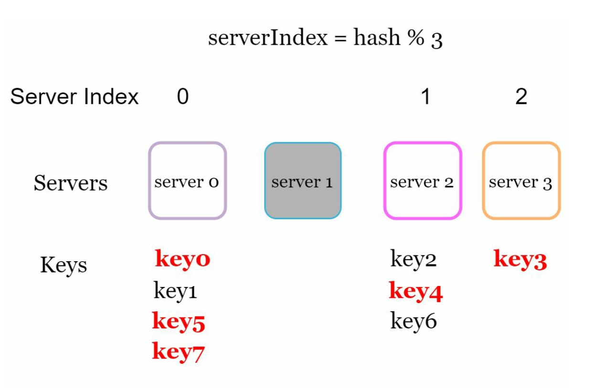
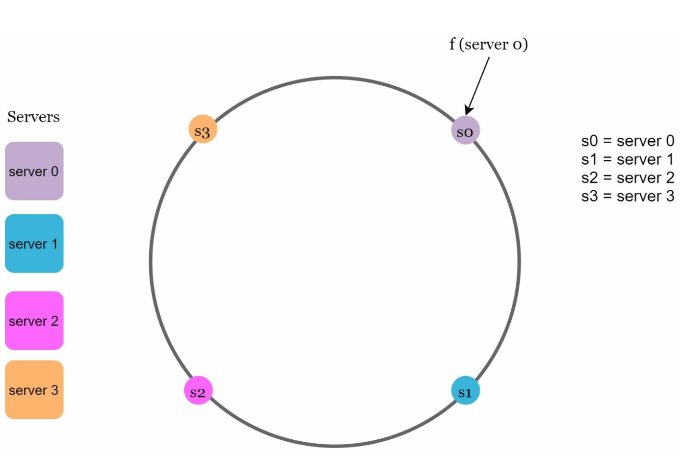
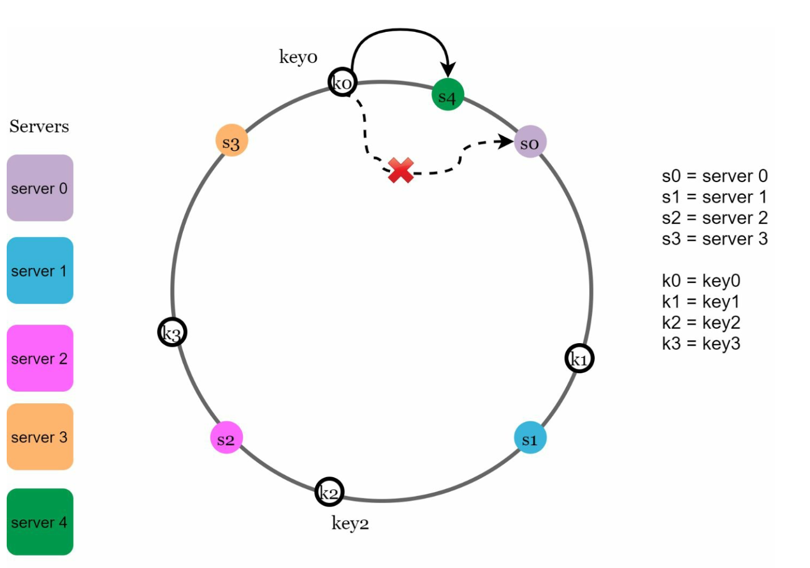
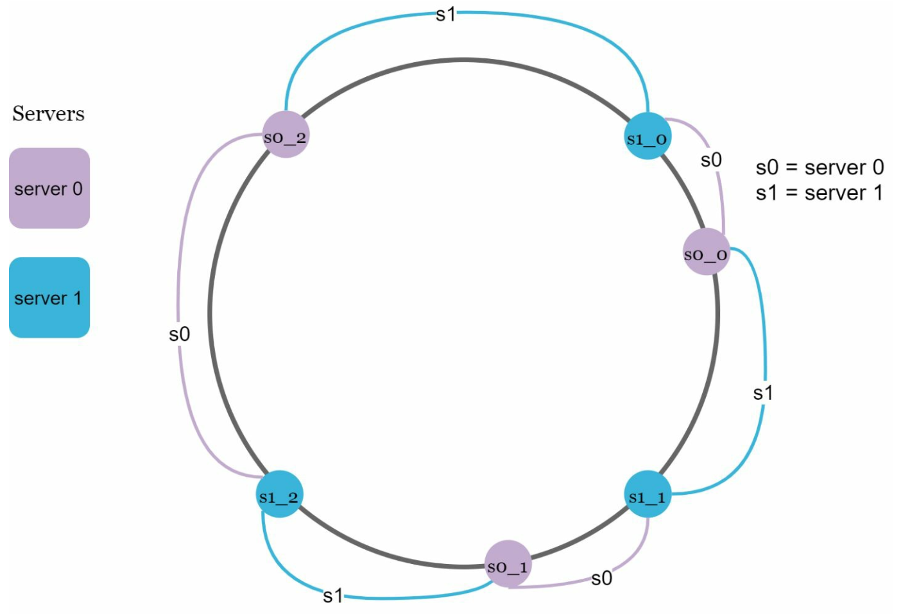

# Chapter 5: Design Consistent Hashing

## Introduction
This chapter explores consistent hashing, a technique essential for achieving horizontal scaling by efficiently distributing requests and data across servers. It minimizes data redistribution when servers are added or removed and ensures an even distribution of data to mitigate issues like server hotspots.

## The Rehashing Problem
### Explanation
In traditional hashing methods, such as `serverIndex = hash(key) % N`, data redistribution becomes problematic when the number of servers changes. For example:
- Removing a server causes most keys to be reassigned, leading to cache misses.
- Adding a server results in unnecessary key redistributions.

  

- This approach works well when the size of the server pool is fixed. However, problems arise when new servers are added, or existing servers are removed.

  

### Key Issue
Redistribution of most keys when server count changes causes inefficiency and overload.

## Consistent Hashing
### Definition
Consistent hashing ensures that only a fraction of keys are remapped when servers are added or removed. This minimizes disruptions and enhances scalability.

### Key Concepts
1. **Hash Space and Ring:** The hash space forms a continuous ring, with hash values distributed from `0` to `2^160-1` (e.g., using hash function like SHA-1). By connecting both ends we get a ring.
    

    
    

- Using the same hash function f, we map servers based on server IP or name onto the ring.  

    

    
    

1. **Server Lookup**
- A key's server is determined by traversing clockwise on the ring until a server is found.

  

  
  

2. **Adding and Removing Servers**
- Adding a server redistributes only nearby keys. Only a fraction of keys are redistributed to the new server.
  
  

  
  

- Removing a server affects only the keys in its range. Only keys from the removed server are reassigned to the next server clockwise.

  

  
  

## Challenges and Solutions
### Two Issues in Basic Approach
1. **Uneven Partition Sizes:** Servers may have unequal data partitions.
2. **Non-uniform Key Distribution:** Some servers may receive significantly more keys than others.

### Solution: Virtual Nodes
- Each server is represented by multiple virtual nodes on the ring uniformly distrubuted on the ring.
- Virtual nodes improve key distribution and balance load. As the number of virtual nodes increases, the distribution of keys       becomes more balanced. This is because the standard deviation gets smaller with more virtual nodes, leading to balanced data distribution.
   
  

  
  

## Affected Keys
When servers are added or removed:
- **Added Server:** Affected keys are those between the new server and its predecessor.
  In the following example server 4 is added onto the ring. The affected range starts from s4 (newly
  added node) and moves anticlockwise around the ring until a server is found (s3). Thus, keys
  located between s3 and s4 need to be redistributed to s4.

  

  
  

- **Removed Server:** Affected keys are those between the removed server and its predecessor. In the following example when a server (s1) is removed, the affected range starts from s1
(removed node) and moves anticlockwise around the ring until a server is found (s0). Thus, keys located between s0 and s1 must be redistributed to s2.
   
  

  
  

## Benefits of Consistent Hashing
- **Minimized Redistribution:** Only a fraction of keys are reassigned.
- **Scalability:** Enables horizontal scaling.
- **Mitigates Hotspots:** Balances data distribution to avoid server overload.

## Real-World Applications
- Amazon Dynamo DB
- Apache Cassandra
- Discord
- Akamai CDN
- Maglev Load Balancer

---

## Most Asked Interview Questions

**Q1. What problem does consistent hashing solve that ordinary modulo-N hashing doesn't?**
> With modulo-N hashing (`key % N`), adding or removing a server causes almost all keys to be remapped (on average `(N-1)/N` of all keys). Consistent hashing only remaps `K/N` keys on average when one server is added or removed (where K = number of keys, N = number of servers), making it vastly more efficient for distributed caches and storage systems.

**Q2. What is the hash ring and how does key lookup work?**
> All possible hash values are mapped onto a circular ring (0 to 2^32 - 1). Each server is placed on the ring at the position its hash maps to. A key is hashed and placed on the ring; it is assigned to the first server found going clockwise. Adding a server only takes over keys between the new server and its predecessor.

**Q3. What is a virtual node and why is it used?**
> A virtual node (vnode) is a replica of a server's position on the hash ring. Instead of each server being placed once, it is placed K times at different hash positions (e.g., K=100–200 virtual nodes per server). This makes load distribution much more even (prevents one server getting a large "arc" of the ring), and handles servers with different capacities by assigning more vnodes to more powerful machines.

**Q4. How does consistent hashing minimize data redistribution when servers change?**
> When a server is added, only the keys between the new server and its predecessor on the ring need to move to the new server. When a server is removed, only its keys move to the next server clockwise. All other keys are unaffected. This is O(K/N) movement per change, compared to modulo-N's O(K) movement.

**Q5. How does consistent hashing help prevent server hotspots?**
> With vnodes, keys are distributed more uniformly than with single-point placement. If one server randomly gets a disproportionately large arc (hotspot), vnodes reduce this variance. Additionally, load-sensitive vnode assignment can reduce the number of vnodes for an overloaded server, redistributing some of its keys to neighbors dynamically.

**Q6. What is the time complexity of key lookup in consistent hashing?**
> Lookup requires finding the first server clockwise from the hashed key. Using a sorted array of server positions + binary search: O(log N) where N is the number of server positions (including vnodes). With N=100 servers × 100 vnodes = 10,000 positions, binary search takes only ~14 comparisons — negligible overhead.

**Q7. How do you replicate data across multiple nodes using consistent hashing?**
> For replication factor R, assign each key to the next R distinct servers clockwise on the ring (skipping over virtual nodes of the same physical server). This is the strategy used by Apache Cassandra. The first server is the coordinator for writes; reads can be served by any of the R replicas depending on the consistency level required.

**Q8. What happens to data when a server crashes in a consistent hashing setup?**
> The crashed server's keys become temporarily unavailable (until detection) or are served by replicas if replication is configured. Once the node is detected as failed (via gossiping or heartbeat failure), its keys are redistributed to the next server clockwise (or replicas take over). With R=3 replication, the system tolerates R-1=2 simultaneous failures.

**Q9. Which real-world systems use consistent hashing?**
> Apache Cassandra (partition ring), Amazon DynamoDB (similar approach), Amazon Dynamo (the original paper that popularized it), Discord (Elixir node routing), Akamai CDN (cache server selection), Memcached + many client libraries for distributing keys, and Google Maglev (for load balancing network traffic).

**Q10. Compare consistent hashing vs. rendezvous hashing.**
> Both minimize remapping on server changes. Consistent hashing: O(log N) lookup via sorted ring. Rendezvous hashing (highest random weight): each key computes a score for all N servers and picks the highest — O(N) lookup but simpler implementation and perfectly uniform distribution even with few servers. Consistent hashing is preferred at very high server counts; rendezvous is simpler for smaller clusters.

**Q11. How does consistent hashing handle the case of an uneven key distribution?**
> Uneven key distribution (hot keys) is separate from uneven server distribution. Consistent hashing handles server distribution with vnodes but doesn't fix hot keys — a single key with extremely high load still maps to one server. Hot keys are handled separately: replicate the hot key across multiple servers and load-balance reads, or shard the value at the application layer.

**Q12. What is the difference between the hash ring used in Cassandra vs. DynamoDB?**
> Both use a ring but differ in their approaches. Original Cassandra (pre-2.0) assigned random tokens per node, leading to uneven distribution; modern Cassandra uses virtual nodes (vnodes) with many tokens per node for even distribution. DynamoDB uses a similar vnode-like virtual partitioning but manages partition placement automatically, hiding ring details from the user.

**Q13. How would you add a new server to an existing consistent hashing cluster?**
> (1) Assign virtual node positions to the new server on the ring; (2) Identify which existing servers are responsible for key ranges that now belong to the new server; (3) Stream keys from those servers to the new server; (4) Once data transfer is complete, update the routing table to start routing new requests to the new server; (5) The old servers can discard transferred keys.

**Q14. How does consistent hashing relate to the concept of a routing tier?**
> In systems like Dynamo or Cassandra, a coordination layer uses the hash ring to determine which node(s) own each key. The routing client hashes the key, walks the ring, and knows exactly which node to contact — this avoids centralized routing. This is called "smart client" routing. Alternatively, any node can route to the correct node on behalf of the client (coordinator pattern).

**Q15. What are the limitations of consistent hashing?**
> (1) Doesn't solve hot key problems — highly popular keys still hit the same server; (2) Implementation complexity increases with vnodes; (3) Ring management requires coordination during member changes (harder in a fully decentralized setting); (4) Doesn't automatically rebalance when server capacities differ significantly without explicit vnode weighting.

**Q16. How does consistent hashing support heterogeneous servers (different capacities)?**
> Assign more virtual nodes to higher-capacity servers. A server with 2× the RAM gets 2× the vnodes, meaning it owns ~2× the key space. This lets you mix different server sizes in the same cluster and still achieve load proportional to capacity. Cassandra's vnode system supports this via token assignment.

**Q17. What is the hash function used in consistent hashing, and does it matter?**
> Common choices: MD5, SHA-1, MurmurHash, xxHash. The key requirements are: uniform output distribution (to spread keys evenly on the ring) and speed. Cryptographic properties (collision resistance, preimage resistance) are NOT required and add overhead. MurmurHash and xxHash are preferred in production for their speed and good uniformity.

**Q18. How do you implement consistent hashing in code?**
> Use a sorted data structure (TreeMap/SortedDict) mapping hash positions to server IDs. For each server, insert K virtual node entries (`hash("server1#0")`, `hash("server1#1")`, ...). For a key lookup, compute `hash(key)`, then find the first position ≥ that hash in the sorted structure (wrapping around to the lowest position if none is found). This is O(log N) per lookup.

**Q19. How is consistent hashing used in CDN cache server selection?**
> When a CDN needs to decide which edge server should cache a given URL, consistent hashing maps `hash(URL)` to a server on the ring. This ensures the same URL always maps to the same server (good cache locality). When a server is added or removed, only a fraction of URLs need to be re-served by different servers, minimizing cache cold starts.

**Q20. What is "consistent hashing with bounded loads" and when is it used?**
> Proposed by Google, bounded loads adds a constraint: no server can handle more than (1 + ε) × average load. If the natural consistent hashing placement would put a key on an overloaded server, the key is placed at the next least-loaded server. Used in Google's Maglev load balancer to avoid hotspots while maintaining near-consistent hashing's redistribution efficiency.

**Q21. What is the minimal number of virtual nodes per server needed for good distribution?**
> In practice, 100–200 virtual nodes per physical server gives good uniformity. With 3 servers and 100 vnodes each (300 ring positions), the standard deviation of load per server drops to ~10% of average. With 10 or fewer vnodes the variance is high and some servers get significantly more keys than others.

**Q22. How does consistent hashing affect the design of a distributed cache invalidation strategy?**
> Since consistent hashing determines which cache server owns a key, invalidation must be sent to the same server (same hash lookup). If a server is down during an update, invalidation is lost and the new server (which inherits the key after recovery) may serve stale data. Solutions: use short TTLs as a safety net, or maintain an invalidation log that new servers replay on startup.

**Q23. What is the "consistent hashing + virtual nodes" alternative in Riak's design?**
> Riak uses a 160-bit ring divided into 2^160 positions, split into a fixed number of partitions (default 64). Each node is responsible for an equal number of partitions. When nodes are added or removed, whole partitions are transferred. This is simpler than arbitrary vnodes but requires a fixed partition count chosen at cluster creation time — a design trade-off.

**Q24. How does consistent hashing handle clock drift or incorrect hash computations?**
> Consistent hashing is deterministic — given the same hash function and server list, any client produces the same ring assignment. Clock drift is irrelevant since hashing doesn't involve time. Incorrect hash computation is prevented by using the same hash library across all clients and services. Configuration management (e.g., ZooKeeper, etcd) keeps all nodes synchronized on the current ring membership.

**Q25. How would you explain consistent hashing to a non-technical interviewer?**
> Imagine a circular clock face (the ring). Each server is assigned a position on the clock. Each piece of data also gets a position. Data goes to the first server encountered moving clockwise from the data's position. When you add a new server, it only takes responsibility for data between its position and the previous server — almost everyone else is unaffected. That's consistent hashing.

**Q26. What is the time and space complexity of storing the hash ring?**
> Space: O(S × V) where S = number of servers, V = virtual nodes per server. For 100 servers × 150 vnodes = 15,000 entries, each storing a 4-byte position and pointer = ~60 KB, trivially small. Time for lookup: O(log(S × V)) binary search. Time for adding/removing a server: O(V log(S × V)) to insert/remove V entries.

**Q27. If two keys hash to the same position on the ring, how is the conflict resolved?**
> Hash collisions between two keys mapping to the exact same ring position are extremely rare with 32-bit+ hash functions. If a collision occurs, both keys would be assigned to the same server — which is correct, just a coincidence. What matters is that different server positions don't collide, which is managed by choosing good virtual node hash inputs (e.g., `server_id + "#" + vnode_index`).

