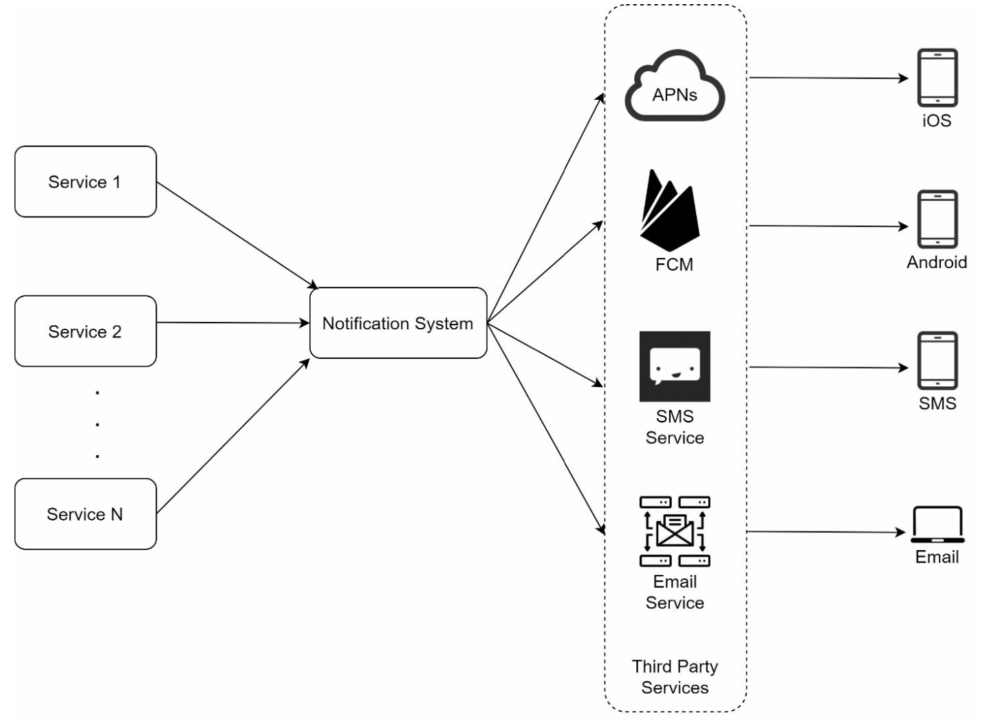
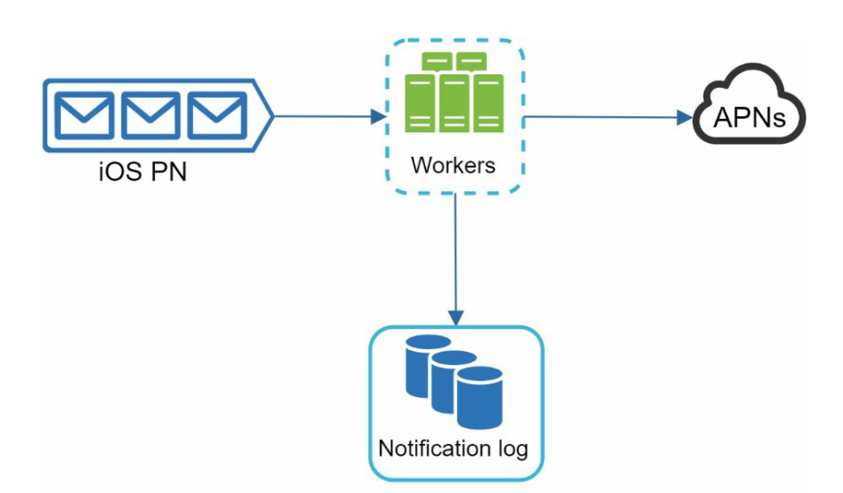
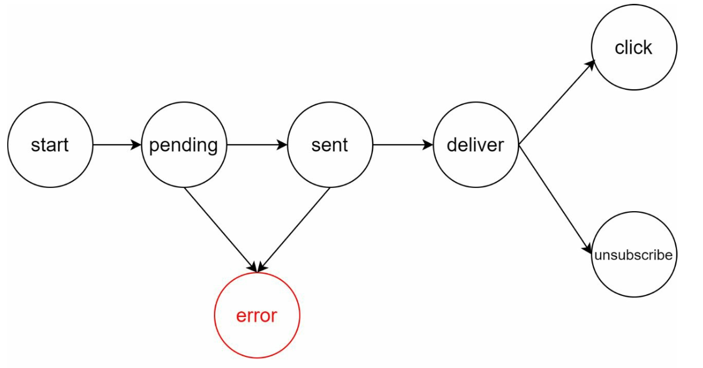
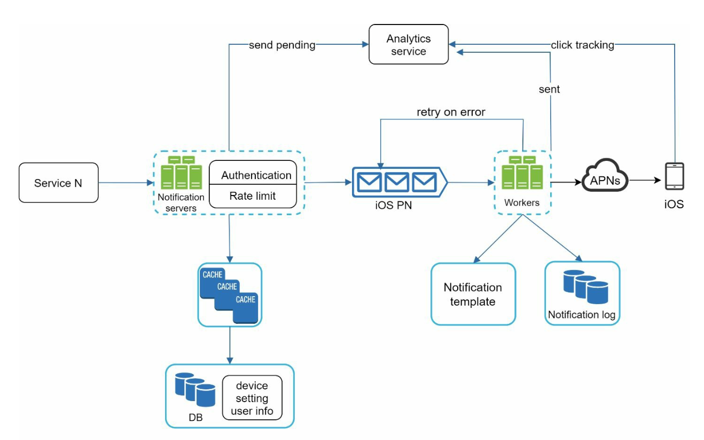

# Chapter 10: Design a Notification System

## Introduction
A **notification system** is essential for modern applications, providing timely updates like product notifications, events, offers, and alerts. Notifications can be sent through:
1. **Push notifications** (mobile or desktop),
2. **SMS messages**, and
3. **Emails**.

The chapter focuses on designing a scalable system capable of sending millions of notifications daily.

---

## Step 1: Understanding the Problem
### Requirements
- **Notification Types:** Push notifications, SMS, and Emails.
- **Delivery:** Soft real-time system with minimal delays.
- **Platforms:** iOS, Android, and desktop.
- **Triggers:** Notifications can be triggered by client applications or scheduled on servers.
- **Scale:**
  - **Push Notifications:** 10 million/day,
  - **SMS:** 1 million/day,
  - **Emails:** 5 million/day.
- **Opt-out Support:** Users can disable specific notification types.

---

## Step 2: High-Level Design

### Components

1. **Notification Types:**
   - **iOS Push Notifications:** Use **Apple Push Notification Service (APNS)**.
   - **Android Push Notifications:** Use **Firebase Cloud Messaging (FCM)**.
   - **SMS Messages:** Third-party services like Twilio or Nexmo.
   - **Emails:** Commercial email services like SendGrid or Mailchimp.

2. **Contact Info Gathering:**
   

      
   

   - Collect device tokens, phone numbers, or email addresses during app installation or signup.
   - Store contact info in the database:
     - **Device Tokens Table:** For push notifications.
     - **User Table:** For emails and phone numbers.

3. **Notification Sending Flow:**

   

      
   

   - **Trigger Services:**
      - Generate events to initiate notifications (e.g., billing reminders, shipping updates).
      - A service can be a micro-service, a cron job, or a distributed system that triggers notification sending events.
   - **Notification Server:** 
      - Provide APIs for services to send notifications. 
      - Carry out basic validations to verify emails, phone numbers.
      - Query the database or cache to fetch data needed to render a notification.
   - **Third-Party Services:** Deliver notifications to users.

     

### Challenges in Initial Design
- **Single Point of Failure (SPOF):** One notification server can crash the entire system.
- **Scalability Issues:** Hard to scale databases, caches, and processing components independently.
- **Performance Bottlenecks:** High resource demands for sending notifications.

### Improved Design

   

      
   

- Move databases and caches out of the notification server.
- Introduce **horizontal scaling** with multiple notification servers.
- Use **message queues** to decouple system components.
   -  Message queues serve as buffers when high volumes of notifications are to be sent out.
- Add workers that pull notification events from message queues and send them to corresponding third party services.

   

---

## Step 3: Design Deep Dive

### Reliability
1. **Prevent Data Loss:** 
   

   
   

   - Persist notification data in a database and implement a retry mechanism. 
   - The Notification log database is included for data persistence.

2. **Deduplication:** 
   - Check event IDs to avoid sending duplicate notifications.
   - When a notification event first arrives, check if it is seen before by checking the event ID.
If seen before discard it, otherwise send out the notification. 

### Additional Components
   

   
   

1. **Notification Templates:** Preformatted templates for consistent and efficient notifications.
2. **Notification Settings:**
   - Users can opt-in or opt-out for specific channels (push, SMS, or email).
   - Stored in a dedicated notification settings table.
3. **Rate Limiting:** Cap the frequency of notifications sent to users.
4. **Retry Mechanism:** Retry sending notifications if third-party services fail.
5. **Monitoring Queues:** Track queued notifications to scale workers dynamically.
6. **Event Tracking:** Collect metrics like open rate, click rate, and engagement.

### Security
- Use **AppKey** and **AppSecret** to authenticate and secure APIs for push notifications.

### Notification Flow

   

   
   

1. Trigger services call APIs to send notifications.
2. Notification servers validate requests and fetch metadata from caches or databases.
3. Notification events are sent to message queues.
4. Workers process events and interact with third-party services.
5. Third-party services deliver notifications to users.

---

## Key Optimizations
1. **Horizontal Scaling:** Add more notification servers for load distribution.
2. **Message Queues:** Decouple processing to handle high volumes.
3. **Caching:** Reduce latency by caching frequently accessed data.
4. **Distributed Crawling:** Optimize message delivery geographically for better performance.

---

## Most Asked Interview Questions

**Q1. What are the three main notification channels and how do they differ architecturally?**
> (1) Push Notifications (mobile): sent via APNs (iOS) or FCM (Android) — fire-and-forget, delivered even when the app is closed; (2) SMS: sent via third-party providers (Twilio, Nexmo) via SMPP protocol — high delivery rate but high cost; (3) Email: sent via SMTP providers (SendGrid, SES) — lowest cost, supports rich HTML content, lower immediacy. Each has separate provider integrations and delivery guarantees.

**Q2. How would you design a notification system sending 10M push notifications per day?**
> 10M/day ÷ 86,400 = ~116/sec average; peak ~580/sec. Architecture: (1) API server accepts notification requests → publishes to Kafka; (2) Notification workers consume from Kafka, look up user device token from DB/cache, call APNs/FCM; (3) Separate queues per channel (push/SMS/email); (4) 5–10 notification worker pods suffice at this scale. For 100M/day, add more workers and Kafka partitions.

**Q3. What is the role of a message queue in a notification system?**
> Decouples notification creation from delivery. Producers (event sources: order service, marketing service) publish events to the queue without knowing delivery details. Workers consume at their own pace, handle retries on failure, and scale independently. If APNs is slow, the queue absorbs the backlog rather than blocking the order service. Also enables fan-out: one event triggers multiple notification types.

**Q4. How do you handle notification delivery failures and retries?**
> Implement exponential backoff retry: attempt 1 → wait 1s → attempt 2 → wait 2s → attempt 4s → etc. up to a max retry count (e.g., 5). After max retries, move to a Dead Letter Queue (DLQ) for manual inspection or fallback action. Track delivery status per notification in a DB. For APNs: check error codes — `DeviceTokenNotForTopic` = permanent failure (don't retry); `ServiceUnavailable` = retry.

**Q5. How do you prevent duplicate notifications?**
> Assign a unique idempotency key per notification event (e.g., `order:12345:shipped:push`). Before processing, check a deduplication store (Redis SET with TTL) — if key exists, skip. Store the key after successful delivery. Use at-least-once delivery at the queue level but idempotent processing at the worker level. This ensures exactly-once semantics from the user's perspective.

**Q6. How does APNs differ from FCM?**
> APNs (Apple Push Notification Service): HTTP/2-based, requires a device token per app installation, tokens change after reinstall. FCM (Firebase Cloud Messaging): covers Android, iOS, and web; tokens also change but FCM handles some token refresh automatically. APNs is Apple-proprietary; FCM is Google's cross-platform service. Both require registering device tokens when users install/update the app.

**Q7. How do you handle user notification preferences (opt-in/opt-out)?**
> Store notification preferences per user per channel in a DB table: `{user_id, channel, type, enabled}`. Before dispatching a notification, check preference cache (Redis) for the user+channel+type combo. Cache the preference for 5–10 minutes to reduce DB queries. Respect opt-outs strictly — a muted user should never receive notifications, even on retry. GDPR requires honoring opt-out requests immediately.

**Q8. How would you implement a notification rate limiter to avoid spamming users?**
> Apply per-user, per-channel, per-notification-type rate limits. Example: max 1 promo email/day per user, max 3 push notifications/hour per user. Implement with Redis counter: `INCR user:{id}:push:hour` with `EXPIRE` of 3600 seconds. If count exceeds the limit, drop the notification (or delay it to the next window). Track limits separately per notification type to allow urgent alerts to bypass promo limits.

**Q9. What are the challenges of real-time vs. scheduled/batch notifications?**
> Real-time: low latency required (transactional notifications — order confirmed), immediate fan-out to devices, harder to rate-limit and batch. Scheduled/batch: marketing campaigns sent at optimal times (e.g., 9am user's local time), can be planned ahead, easier to throttle and batch-process. Use separate processing pipelines: high-priority queue for real-time, scheduled job runner (e.g., Airflow) for batch campaigns.

**Q10. How would you design a notification template system supporting multiple languages and channels?**
> Store templates in a DB with: `{template_id, channel, locale, subject, body_html, body_text, variables}`. At send time, fetch the template by `{notification_type, channel, user_locale}` (cache aggressively). Interpolate variables (`{{username}}`, `{{order_id}}`). For channels without HTML (SMS, push), use `body_text`. Use a fallback locale (e.g., `en-US`) if user's locale template is missing.

**Q11. How does the notification system know which device token to send to?**
> When a user installs or opens the app, the client SDK obtains a device token from APNs/FCM and registers it with your backend via an API call: `POST /api/v1/devices {user_id, token, platform}`. Store tokens in a DB, indexed by `user_id`. One user may have multiple tokens (multiple devices). When sending, look up all active tokens for the user and dispatch to each. Mark invalid tokens as inactive on APNs/FCM error response.

**Q12. How do you handle notification delivery to offline users?**
> For push notifications: APNs/FCM store messages on their servers for offline devices and deliver when the device reconnects. For SMS/Email: delivery is inherently store-and-forward. For in-app notifications: write to a notifications inbox table in the DB; the client fetches unread notifications on next app open. TTL should be applied: discard push messages older than N hours if they're no longer relevant.

**Q13. What is a notification inbox vs. a push notification?**
> A push notification appears on the device lock screen/notification center and is delivered via APNs/FCM. A notification inbox (like Facebook's bell icon) is a persistent list of notifications stored server-side, viewable in-app. A push notification is ephemeral (appears and disappears); the inbox persists until the user dismisses it. Most systems implement both: push for immediacy, inbox for history.

**Q14. How do you handle time-zone sensitivity in notification delivery?**
> For marketing/promotional notifications, store the user's timezone preference in the profile. Use a time-based scheduler: when a campaign is due to send, produce a message per user at their local-time target. For global campaigns of 100M users across 24 timezones, spread processing over 24 hours. Use a priority queue ordered by `scheduled_send_time` to ensure on-time delivery.

**Q15. When should you send a push notification vs. an in-app notification vs. an SMS?**
> Push: real-time alerts where immediacy matters (order shipped, friend request) — user must have the app installed. In-app: supplementary information, less urgent, visible only when user is already in the app. SMS: highest urgency (security codes, flight cancellations), guaranteed delivery without app, but high cost and character limits. Email: rich content, low urgency, must be opted into (GDPR).

**Q16. How do you scale the notification system from 10M to 1B notifications per day?**
> 1B/day = ~11,574/sec average; peak ~58K/sec. Scale: (1) Add Kafka partitions + notification worker replicas (horizontal scale); (2) Shard device token DB by user_id; (3) Add dedicated connection pools for APNs/FCM (HTTP/2 multiplexing allows many concurrent requests per connection); (4) Add CDN for notification images; (5) Geo-distribute workers close to APNs/FCM endpoints to reduce latency.

**Q17. How does notification delivery work with end-to-end encryption (like Signal)?**
> APNs/FCM only deliver an encrypted payload — the provider never sees message content. The server sends only a notification ID or cipher blob; the client decrypts using its locally stored private key. The delivery receipt (did the notification arrive?) is separate from message content. The server never stores the decrypted content. This is signal's sealed-sender architecture.

**Q18. What is a notification vendor provider and why use one instead of building your own SMTP server?**
> Third-party providers (SendGrid, SES, Twilio) handle: reputation management (IP warming, domain warming to avoid spam folders), delivery analytics (open rates, bounce rates), compliance (CAN-SPAM, GDPR unsubscribe), scaling infrastructure, and bounce/complaint handling. Building your own SMTP server risks landing in spam filters. Provider APIs add one abstraction but are worth the simplicity.

**Q19. How would you implement A/B testing for notification content?**
> Segment users into experiment groups (stored in a user feature flag service). At notification send time, look up the user's experiment variant (A vs. B) and render the corresponding template. Log which template was sent per user. Track open-rate and click-through-rate per variant in your analytics system. Use statistical significance testing to declare a winner before rolling out to 100%.

**Q20. How do you monitor notification delivery health?**
> Track: (1) Delivery rate per channel (APNs/FCM/SMS/Email); (2) Error rate and error types (invalid tokens, quota exceeded, provider errors); (3) Queue depth (if growing, workers are falling behind); (4) End-to-end delivery latency; (5) Retry count distribution; (6) Dead letter queue backlog. Alert on: delivery success rate dropping below SLO, queue depth growing unboundedly, error rate spike.

**Q21. What is a notification fanout and how do you implement it for group events?**
> Fanout sends the same notification to many users (e.g., "a post you liked got a new comment"). Naive approach: one DB query + one FCM call per user = O(N) work per event. Optimized: publish a single fanout event to Kafka; worker reads follower/group list in batches (100 users/batch) and dispatches batch push requests to FCM (which supports up to 500 tokens per batch request).

**Q22. How does the notification system handle APNs certificate expiry?**
> APNs authentication can use certificate-based (.p12) or token-based (.p8 key file with JWT). Token-based authentication is preferred — tokens expire every 60 minutes but can be refreshed automatically without re-deploying. Monitor the expiry date of the .p8 key and alert 30 days in advance. Store credentials in a secrets manager (Vault, AWS Secrets Manager) — never commit to source control.

**Q23. What is silent push notification and when is it used?**
> A silent push (APN `content-available: 1`, FCM `priority: normal`) wakes the app in the background without showing any visible notification to the user. Used for: background data refresh (sync new messages before user opens the app), cache invalidation, configuration updates. The app handles the notification silently and doesn't alert the user. iOS limits background runtime to 30 seconds per silent push.

**Q24. How do you implement notification analytics (open rates, click-through rates)?**
> Include a unique tracking ID in each notification payload. When the user taps the notification, the app sends a `notification_opened` event to your analytics endpoint. For email, embed a 1x1 tracking pixel and a click-tracked URL via redirect. Join delivery events, open events, and click events in an analytics warehouse (BigQuery/Redshift) to compute open rate = opens/delivered, CTR = clicks/delivered.

**Q25. How would you design the notification system to support multiple tenants (SaaS scenario)?**
> Each tenant (customer) has their own APNs/FCM credentials, sender email addresses, SMS sender IDs, and notification templates. Store per-tenant credentials encrypted in a secrets store. Route notifications through the appropriate credentials based on tenant_id. Apply per-tenant rate limits (each tenant gets a quota). Provide tenant-specific delivery analytics dashboards. Prevent one tenant's high volume from impacting others via queue isolation.

**Q26. What is the difference between transactional and marketing notifications?**
> Transactional: triggered by a user action (order confirmed, password reset) — high urgency, legally often exempt from opt-out requirements. Marketing: promotional, unprompted (sale announcement, newsletter) — requires explicit opt-in (GDPR, CAN-SPAM). Use separate sending infrastructure with separate IPs/domains to protect transactional deliverability from marketing spam blacklisting. Never mix them on the same IP pool.

**Q27. How would you design a "do not disturb" feature for notifications?**
> Store per-user DND windows in the profile: `{user_id, dnd_start: "22:00", dnd_end: "08:00", timezone}`. Before dispatching a notification, check if the user's current local time falls within their DND window. For urgent notifications (security alert), bypass DND. For non-urgent notifications within DND, either discard or reschedule to the end of the DND window by placing them in a time-delayed queue.
