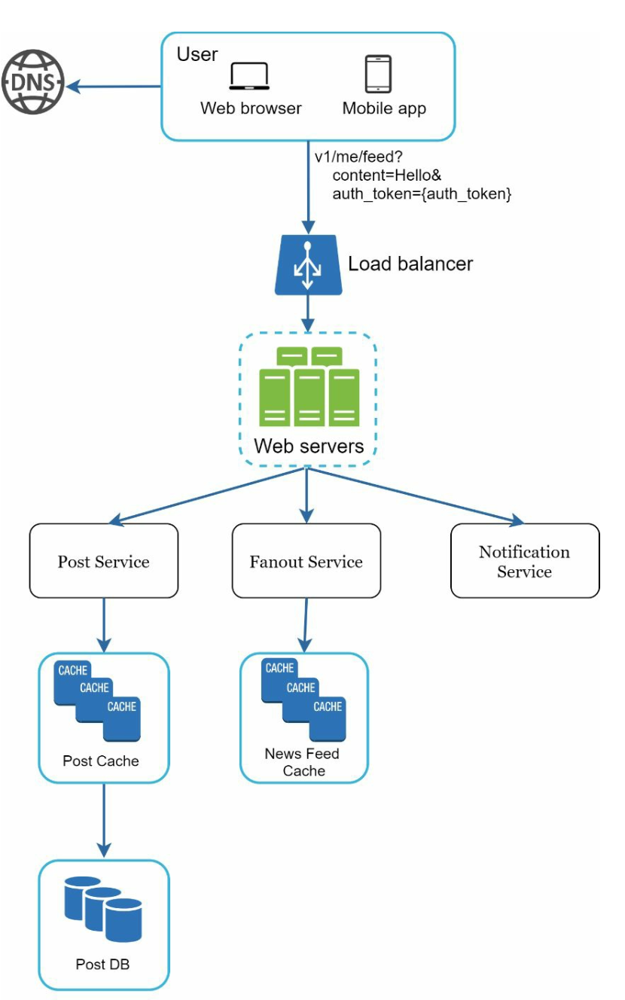
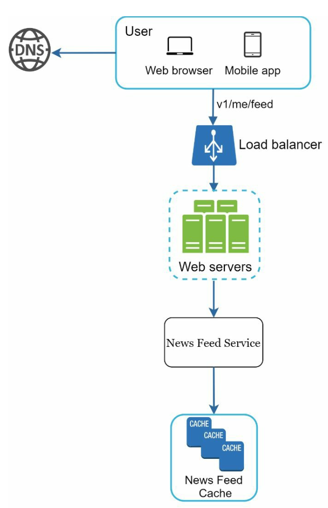
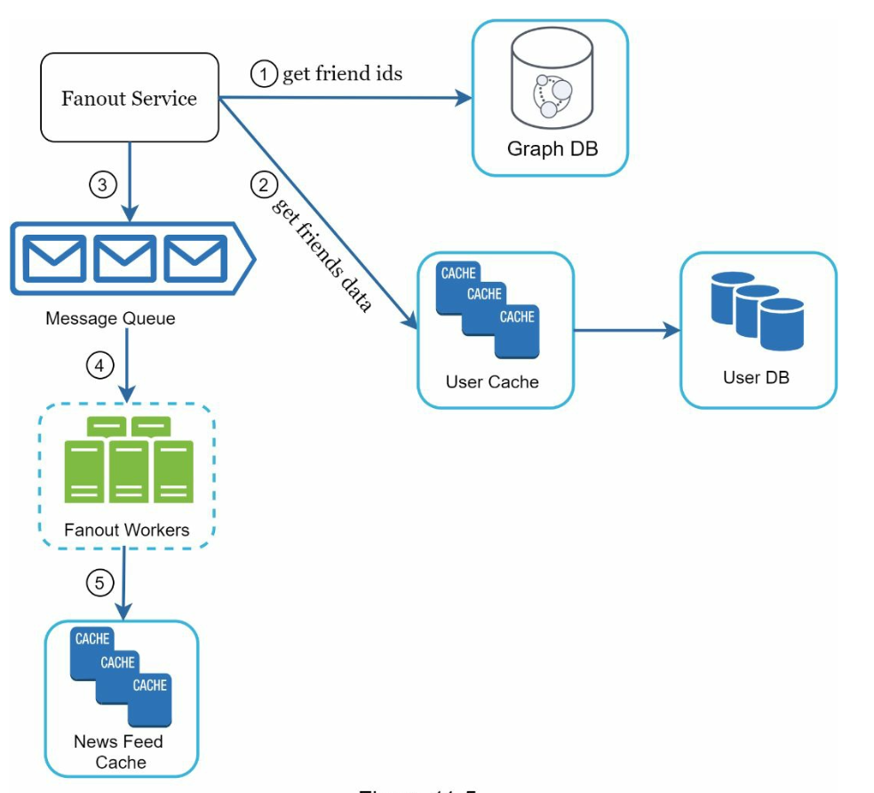
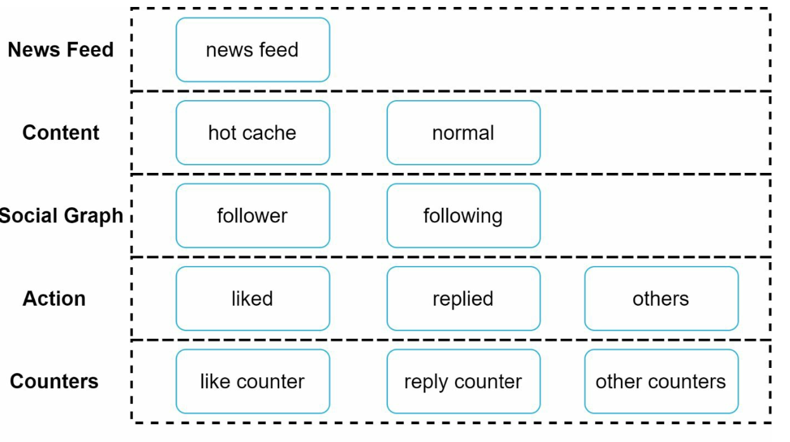

# Chapter 11: Design a News Feed System

## Introduction
A **news feed system** displays a constantly updating list of posts (status updates, photos, videos, and links) from a user’s connections. Examples include Facebook’s news feed, Instagram’s feed, and Twitter’s timeline. This chapter explores the design of a scalable news feed system.

---

## Step 1: Understanding the Problem

### Requirements
1. **Platform:** The system supports both web and mobile apps.
2. **Features:**
   - Users can publish posts.
   - Users can view posts from friends in their news feed.
3. **Sorting:** Feeds are sorted in **reverse chronological order** for simplicity.
4. **Scale:**
   - Users can have up to 5,000 friends.
   - 10 million daily active users (DAU).
   - Feeds may include text, images, and videos.

---

## Step 2: High-Level Design

### Overview
The design includes two main flows:
1. **Feed Publishing:** A user publishes a post, which is written to the database and propagated to their friends’ feeds.
2. **News Feed Building:** A user retrieves their news feed by aggregating posts from friends in reverse chronological order.

---

### News Feed APIs
1. **Feed Publishing API:**
   - **Endpoint:** `POST /v1/me/feed`
   - **Params:** `content` (post text) and `auth_token` (authentication).

2. **News Feed Retrieval API:**
   - **Endpoint:** `GET /v1/me/feed`
   - **Params:** `auth_token` (authentication).

---

### Feed Publishing

   

      
   

1. **User Interaction:** The user publishes a post via the feed publishing API.
2. **Load Balancer:** Distributes traffic to web servers.
3. **Web Servers:** Authenticate requests and redirect to services.
4. **Post Service:** Stores the post in the database and cache.
5. **Fanout Service:** Propagates the post to friends’ news feeds in the cache.
6. **Notification Service:** Sends notifications to friends.

---

### News Feed Building

   

      
   

1. **User Interaction:** The user requests their news feed via the retrieval API.
2. **Load Balancer:** Distributes traffic to web servers.
3. **Web Servers:** Forward requests to the news feed service.
4. **News Feed Service:** Fetches post IDs from the news feed cache and retrieves complete post details from the database or cache.

   
---

## Step 3: Design Deep Dive

### Feed Publishing Deep Dive
1. **Web Servers:**
   - Authenticate users using `auth_token`.
   - Enforce rate limits to prevent spam.

2. **Fanout Service:**
   - **Fanout on Write:** Push posts to friends’ feeds at write time.
     - **Pros:** Real-time updates, fast feed retrieval.
     - **Cons:** Resource-intensive for users with many friends.
   - **Fanout on Read:** Pull posts at read time.
     - **Pros:** Efficient for inactive users.
     - **Cons:** Slower feed retrieval.
   - **Hybrid Approach:** Use a push model for most users and a pull model for high-connection users (e.g., celebrities).

        

    The **fanout service** works as following:

    1. **Fetch Friend IDs:** Retrieve the friend list from a graph database.
    2. **Filter Friends from Cache:** Access user settings in the cache to exclude certain friends (e.g., muted friends or selective sharing preferences).
    3. **Send to Message Queue:** Send the filtered friend list along with the new post ID to a message queue for processing.
    4. **Fanout Workers:** Workers retrieve data from the message queue and update the news feed cache. The cache stores `<post_id, user_id>` mappings instead of full user and post objects to save memory.
    5. **Store in News Feed Cache:** Append new post IDs to the friends’ news feed cache. A configurable limit ensures that only recent posts are stored, as most users focus on the latest content, keeping cache memory consumption manageable.

        

## News Feed Retrieval Deep Dive

### Cache Architecture
The cache is divided into five layers:
1. **News Feed Cache:** Stores post IDs for quick retrieval.
2. **Content Cache:** Stores post details (popular posts in hot cache).
3. **Social Graph Cache:** Stores user relationship data.
4. **Action Cache:** Tracks user actions (likes, replies, shares).
5. **Counter Cache:** Maintains counts for likes, replies, followers, etc.

    
---

## Key Optimizations

### Scaling
1. **Database Scaling:**
   - Horizontal scaling and sharding.
   - Use of read replicas for high-traffic queries.
2. **Stateless Web Tier:** Keep web servers stateless to enable horizontal scaling.

### Caching
1. Store frequently accessed data in memory.
2. Use cache layers to reduce latency and database load.

### Reliability
1. **Consistent Hashing:** Distribute requests evenly across servers.
2. **Message Queues:** Decouple system components and buffer traffic.

### Monitoring
1. Track key metrics like QPS (queries per second) and latency.
2. Monitor cache hit rates and adjust configurations accordingly.

---

## Most Asked Interview Questions

**Q1. What is the difference between fanout on write and fanout on read?**
> Fanout on write (push model): when user A posts, immediately write the post to all A's followers' feed caches → fast reads but slow writes; O(followers) work per post. Fanout on read (pull model): feed is computed from followees' posts at read time → fast writes but slow reads. For most social networks, fanout on write is preferred since reads far outnumber writes.

**Q2. When is fanout on read (pull model) better than fanout on write?**
> Fanout on read is better when: (1) A user has millions of followers (celebrity problem — writing to millions of caches per post is too slow/expensive); (2) The user posts very infrequently (pre-computing cache wastes space); (3) Feed algorithms are complex and change often (harder to pre-compute). Twitter uses pull for celebrities, push for regular users.

**Q3. What is the hybrid fanout approach?**
> Fanout on write for regular users (e.g., < 10,000 followers) so their posts are pre-written to followers' feed caches. Fanout on read for celebrities (> 10,000 followers) — their posts are not pre-distributed; followers' feed queries merge pre-cached entries with real-time celebrity posts at read time. This avoids the thundering herd from celebrity writes while keeping reads fast for most users.

**Q4. How do you handle celebrities (high-follower accounts) in news feed design?**
> Identify high-follower users (> N threshold) and tag them. Skip fanout on write for these users. At feed read time, separately query the last K posts from each celebrity the user follows and merge them with the cached feed. Use a CDN or heavily replicated cache for celebrity post objects since they are read by millions concurrently. Pre-cache the post object itself (not in every feed).

**Q5. How would you sort news feed posts? Chronological vs. relevance-based?**
> Reverse chronological is simplest (sort by post timestamp — no ML needed). Relevance-based (Facebook/TikTok style): rank posts by a score based on recency + engagement (likes, comments, shares) + user affinity (interaction history with poster) + content type preferences. Ranking requires a post scoring service; feed is assembled by score rather than timestamp. Relevance improves engagement but adds ML pipeline complexity.

**Q6. What database would you use to store news feeds?**
> Feed cache: Redis sorted sets (score = post timestamp, value = post_id) for O(log N) range queries; serve paginated feed by time range. Post data: NoSQL document store (DynamoDB) or relational DB for full post content. Graph data (who follows whom): graph DB (Neo4j) or adjacency list in a RDBMS with `(follower_id, followee_id)` index. Object metadata is typically in a relational DB; hot feed state in Redis.

**Q7. How does caching work in a news feed system?**
> Two levels: (1) Feed cache: Redis stores a list of post IDs per user (the pre-computed feed order). On read, fetch post IDs from Redis, then batch-fetch full post objects from a secondary cache or DB. (2) Post cache: full post content (text, media URLs) cached by post_id. Feed cache stores only references (IDs), not full content, to keep it compact. Cache is invalidated/updated asynchronously via fanout workers.

**Q8. How would you design the system to support 10M DAU?**
> 10M DAU, assuming 1 feed load per session: 10M reads/day ≈ 116 reads/sec average, peak ~580 reads/sec. Easily handled by Redis cache + 3–5 app servers. Writes: if 1% of DAU post per day = 100K posts/day. Fanout at 200 followers average = 20M feed-cache writes/day = 231/sec. Manageable with a fanout worker pool + Redis. Scale horizontally by adding Redis nodes and worker replicas.

**Q9. How do you handle the "thundering herd" problem when a celebrity posts?**
> When a celebrity posts to millions of followers at once, naive fanout would spike the message queue and DB. Solutions: (1) Skip fanout for celebrities (hybrid model); (2) Rate-limit the fanout worker for celebrity posts (spread writes over 30–60 seconds at a throttled rate); (3) Use lazy fanout — write to followers' caches only on their next feed load, not immediately; (4) Cache celebrity post objects separately with high-replication Redis.

**Q10. How would you design the data model for posts, users, and feeds?**
> Users table: `user_id, username, follower_count, following_count`. Posts table: `post_id, user_id, content, media_url, created_at`. Feed table (cache manifest): `user_id, feed: [post_id, ...]` stored in Redis sorted set. Follow graph: `(follower_id, followee_id)` table with indexes on both columns. Media stored in object storage (S3); `media_url` in the post record points to the CDN URL.

**Q11. How does pagination work in a news feed system?**
> Use cursor-based (keyset) pagination rather than offset pagination. The cursor is the `post_id` or `(score, post_id)` of the last seen item. The next page request provides this cursor, and the query returns the next K posts before that cursor. This is O(log N) per page load vs. O(offset) for offset pagination, which becomes slow at large offsets.

**Q12. How would you implement "unfollow" and ensure the feed is updated?**
> On unfollow: (1) Delete the `(follower, followee)` row; (2) Optionally purge the unfollowed user's posts from the follower's feed cache (batch delete from Redis sorted set). Purging is expensive at scale — a simpler approach is to rebuild the cache on next feed load (lazy rebuild). For hybrid fanout (celebrity), the purge only affects the regular user's feed list, not the celebrity's CDN-cached posts.

**Q13. How do you implement "seen post" tracking to avoid showing duplicates?**
> Track the `last_seen_post_id` per user in a session cookie or Redis. On each feed load, return posts newer than `last_seen_post_id`. For infinite scroll, the client sends the cursor (last received post_id) with each request. Server returns the next page starting from that ID. This stateless approach (cursor in client) avoids server-side session tracking at the cost of relying on the client to maintain the cursor.

**Q14. How do you handle media (images/videos) in a news feed?**
> Store original media in object storage (S3). Generate multiple sizes/formats via an async transcoding pipeline on upload. Store CDN URLs per variant in the post record. The feed API returns CDN URLs for the appropriate format per viewer (thumbnail for feed preview, full-res for expanded view). Use a CDN with cache-control headers to serve popular media from edge nodes without hitting origin.

**Q15. How do you design notifications for new feed items?**
> On fanout (when new post is added to feed), optionally enqueue a push notification. Apply smart throttling: don't notify on every post — batch them ("3 new posts from people you follow"). Use the notification system's per-user rate limits. Respect DND windows. For high-volume publishers (newsletters), send a daily digest rather than per-post notifications.

**Q16. How does the news feed handle deleted posts?**
> When a post is deleted: (1) Soft-delete the post record (set `deleted_at`); (2) The feed cache may still reference the deleted post_id. On feed render, if a post_id returns null/deleted from the post cache, skip it; (3) Eventually, asynchronously remove the post_id from all affected feed caches (expensive for popular posts). The lazy approach (skip on render) is simpler and more scalable than eager cache cleanup.

**Q17. What is the difference between infinite scroll and paginated news feed?**
> Infinite scroll: client sends a cursor with each scroll event; server returns the next K items from the cursor position; client appends to existing list. Paginated: client requests page N; server computes offset and returns items. Infinite scroll is better for feeds: users don't need "page 47"; they scroll continuously. It's also more efficient with cursor-based queries vs. slow OFFSET-based queries.

**Q18. How do you implement "sponsored posts" (ads) in a news feed?**
> Insert ad placeholders at defined intervals in the feed (e.g., every 5th post). At render time, call an ad server (separate service) to fill placeholders with targeted ads based on user profile. Render ad objects in the same format as organic posts for seamless integration. Track ad impressions and clicks separately. Ensure ad server latency doesn't block organic feed loading (async or parallel fetch).

**Q19. How do you support real-time feed updates (showing new posts without refreshing)?**
> Options: (1) Client polling — simple, wastes bandwidth; (2) Long polling — more efficient; (3) WebSocket — real-time push from server; (4) SSE (Server-Sent Events) — one-way push efficient for feeds. Use WebSocket or SSE for real-time updates; when a new post fanout completes, push a notification to all connected clients with the new post_id. Clients lazily fetch the full post content.

**Q20. How do you measure news feed quality?**
> Key metrics: (1) Feed latency (time to first meaningful post); (2) Feed staleness (how old is the newest post when the user opens the feed); (3) Engagement rate (likes, shares, comments per feed view); (4) Session duration; (5) Click-through rate on posts. Feed relevance algorithms are tuned using A/B experiments optimizing for long-term engagement, not just immediate CTR.

**Q21. What is an activity feed and how is it different from a news feed?**
> An activity feed shows actions taken by a user and their connections (e.g., "Alice liked Bob's photo"). A news feed shows content (posts, articles, videos). The data model differs: activity feed records events (actor, action, object, timestamp); news feed records content items (post_id, author, content). Both use fanout architecture but activity feeds tend to be more lightweight (event notifications, not full content).

**Q22. How would you handle a news feed for privacy-sensitive posts (friend-only or group-only)?**
> Each post has a visibility level (public, friends, group). On fanout, only push to users matching the visibility: for friends-only, only send to direct followees/friends. Store `visibility` on the cached feed item. On render, re-check visibility (in case privacy changed after fanout). This "defense in depth" prevents a race condition where a post was fanned out before a privacy downgrade.

**Q23. How do you handle feed for a user with 100,000 followees?**
> A user following 100K accounts has a massive fan-in problem: their feed potentially has millions of posts per day. Solutions: (1) Don't pre-compute the full feed — use pull model and query only the top-K most recent posts from a window of followees; (2) Cluster followees by relevance score, query only the top 500 most-relevant; (3) Cap the number of followees before imposing "high-volume subscription" limitations (like Twitter's 2,000 following limit).

**Q24. How does the news feed handle time zones and post timing?**
> Store all timestamps in UTC. Convert to user's local timezone at display time in the client. For scheduled posts (publish at 9am user's time), store the target UTC timestamp and use a scheduled job service to trigger fanout at that time. The feed sorting uses UTC timestamps, which ensures global consistency — users in different timezones see the same post with the same UTC timestamp.

**Q25. How do you build a "what you missed" feed summary for returning users?**
> When a user hasn't opened the app for N hours/days, render a summary: top K posts by engagement from the time period they were away. This requires: (1) Tracking the user's last session end time; (2) Computing top-K posts by engagement score in the missed time window from followees; (3) Show "X posts since you were last here" with the most-engaged subset. This requires a top-K query per user on return, not pre-computed fanout.

**Q26. How would you handle feed generation for new users with no follow relationships?**
> Cold-start problem. Solutions: (1) Onboarding flow: ask the user to select interests and suggest popular accounts to follow; (2) Populate initial feed with trending content in the user's demographic/location; (3) Show "suggested posts" from a globally cached top-trending set; (4) Follow social graph recommendations (import contacts) to bootstrap the graph. Until the user has followees, serve non-personalized trending content.

**Q27. What does a complete news feed system architecture look like?**
> Client → CDN (for static assets) → Load Balancer → API servers → Feed Cache (Redis, pre-computed feed IDs) + Post Cache (Redis, post content) → Post DB (DynamoDB/PostgreSQL) + User DB. Write path: User creates post → Post service → Fanout service (reads follow DB, writes to follower feed caches via async workers reading from Kafka). Media: stored in S3, served via CDN. Monitoring: Prometheus + Grafana on queue depth, cache hit rate, fanout lag.
