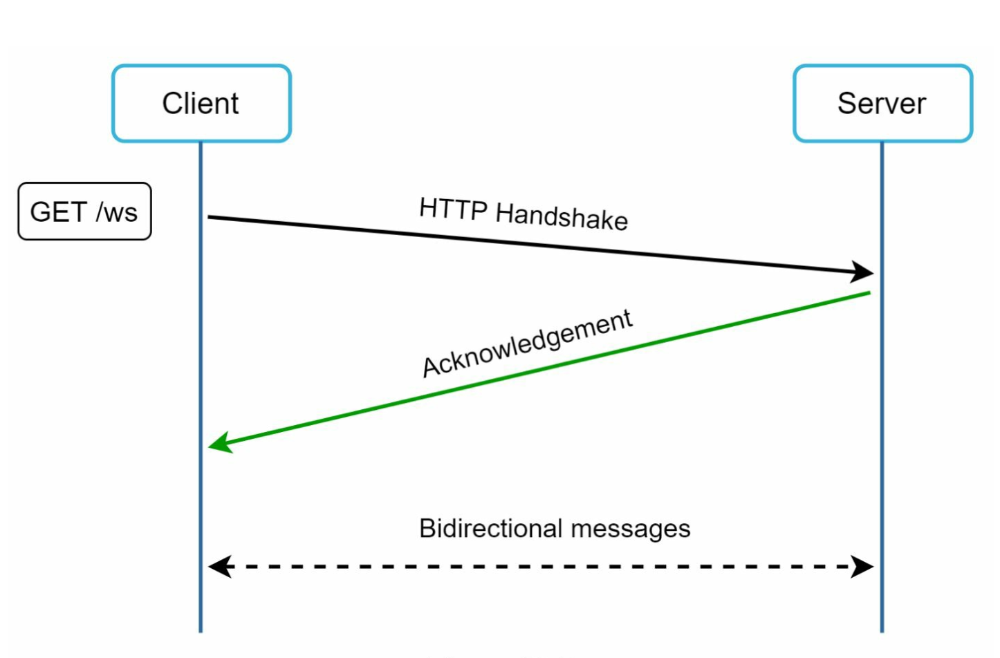
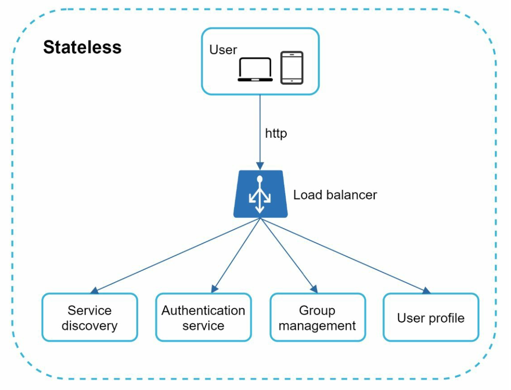
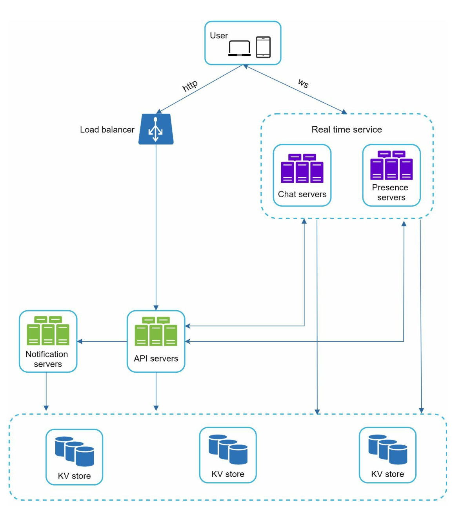
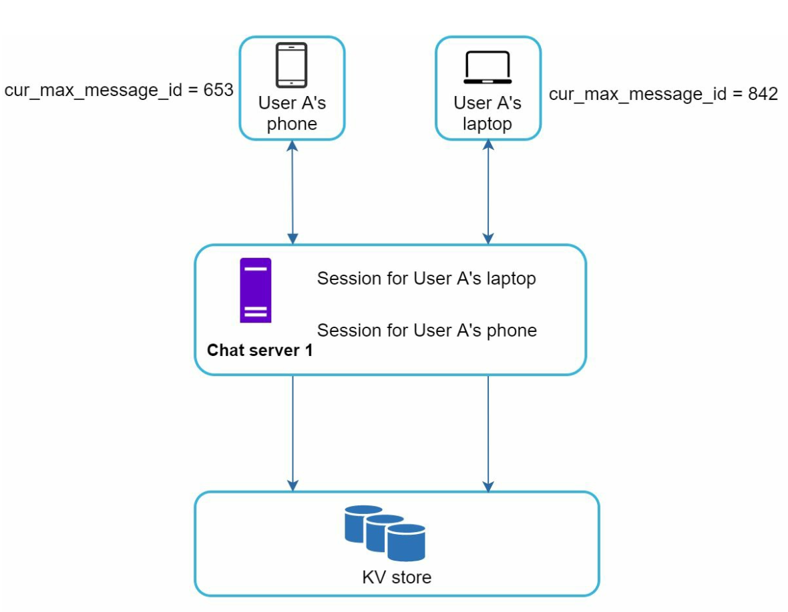
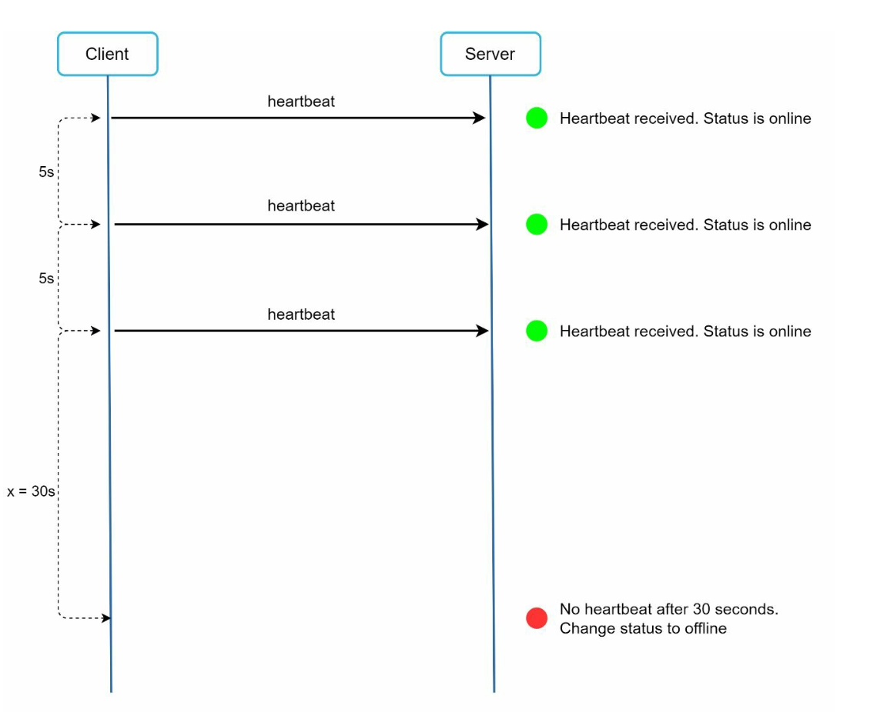

# Chapter 12: Design a Chat System

## Introduction
A **chat system** supports real-time messaging between users. This chapter focuses on designing a chat app that includes:
- **One-on-One Chat**
- **Group Chat (max 100 users)**
- **Online Presence Indicators**
- **Multiple Device Support**
- **Push Notifications**

The system targets **50 million daily active users (DAU)** and stores chat history permanently.

---

## Step 1: Understanding the Problem

### Requirements
1. **Features:**
   - One-on-one and group chat (max 100 members).
   - Text-based messages (up to 100,000 characters).
   - Online/offline indicators.
   - Support for multiple devices.
   - Push notifications.
2. **Scale:** Design for 50 million DAU.
3. **Storage:** Permanent chat history.

---

## Step 2: High-Level Design

### Communication Protocols
1. **Sender Side:** HTTP for sending messages, leveraging persistent connections for efficiency.

      

          
      

2. **Receiver Side:**
   - **Polling:**
      - Client periodically asks the server if there are messages available.
      - Inefficient due to frequent, redundant requests.

             

   - **Long Polling:** 
      - Keeps the connection open until messages arrive. 
      - Inefficient for inactive users.

         

   - **WebSocket:** 
      - A bi-directional, persistent connection for real-time communication, chosen for both sending and receiving messages.
      - Uses WebSockets (ws) protocol for sending and recieving messages.

             
   
---

### Components

       
   

1. **Stateless Services:**
   - Handle signup, login, and user profile management.
   - Integrated with service discovery to recommend the best chat server.
2. **Stateful Services:**
   - Chat servers maintain persistent WebSocket connections.
   - Responsible for message delivery and synchronization.
3. **Third-Party Integration:**
   - Push notification services notify users about new messages.
   - Refer Notification System chapter for notifications implementation.

---
### Design

The client maintains a persistent WebSocket connection to a chat server for real-time messaging.

       

- Chat servers facilitate message sending/receiving.
- Presence servers manage online/offline status.
- API servers handle everything including user login, signup, change profile, etc.
- Notification servers send push notifications.
- Finally, the key-value store is used to store chat history.Key-value stores for the database of the chat history data for following reasons:
   - It allows easy horizontal scaling.
   - KV stores provide very low latency to access data.
   - Relational databases do not handle long tail of data well. When the indexes grow
   large, random access is expensive.
   - KV stores are adopted by other proven reliable chat applications. For example,
   both Facebook messenger and Discord.

Following are the data models for one-to-one chat and group chat.
   - The primary key is message id, which helps to decide message sequence.
   - For the group chat the composite primary key is (channel_id, message_id). 
      - IDs can be generated using a global 64-bit sequence number generator like Snowflake.
      - A better approach is to use local sequence number generator. Local means IDs are only unique within a group.
      - The reason why local IDs work is that maintaining message sequence within one-on-one channel or a group channel is sufficient. 
      
         
         

## Step 3: Design Deep Dive

### Service Discovery

      

- The primary role of service discovery is to recommend the best chat server for a client based
on the criteria like geographical location, server capacity. 
- Uses **Apache Zookeeper** to allocate chat servers based on criteria like geographic location and server capacity.
- Ensures efficient load distribution and minimizes latency.

### Messaging Flows
#### One-on-One Chat

1. User A sends a message to Chat Server 1.
2. Chat Server 1 assigns a unique message ID and stores the message in a key-value store.
3. If User B is online, the message is forwarded to Chat Server 2, maintaining a persistent WebSocket connection.
4. If User B is offline, a push notification is sent.

#### Group Chat

     

- Messages are copied to individual inboxes for each recipient in the group.
- Simplifies synchronization but becomes expensive for larger groups.
- On the recipient side, a recipient can receive messages from multiple users. Each recipient
has an inbox (message sync queue) which contains messages from different senders.

---

#### Message Synchronization

Many users have multiple devices. We need to synchronize the message across the devices.
Each device maintains a variable called cur_max_message_id, which keeps track of the latest
message ID on the device. Messages that satisfy the following two conditions are considered
as news messages:

     

- The recipient ID is equal to the currently logged-in user ID.
- Message ID in the key-value store is larger than cur_max_message_id

---

### Online Presence
1. **Heartbeat Mechanism:** 
   

       
   

   
   - Clients send periodic heartbeats to presence servers to indicate they are online. 
   - If no heartbeat is received within a threshold (for eg x = 30), the user is marked offline.

     

2. **Fanout Model:** 

   

       
   

   - Presence updates are pushed to friends using a publish-subscribe model in which each friend pair maintains a channel.
   - When User A’s online status changes, it publishes the event to three channels, channel A-B, A-C, and A-D. 
   - Those three channels are subscribed by User B, C, and D, respectively which get the online status updates.
   - The above design is effective for a small user groups.

---

## Additional Considerations
### Scalability
- **Horizontal Scaling:** Add servers as user count increases.
- **Load Balancing:** Distribute traffic evenly across servers.
- **Caching:** Reduce database load and improve latency.

### Error Handling
- **Retry Mechanisms:** Handle message delivery failures with retries and queuing.
- **Server Failures:** Use service discovery to allocate new servers in case of failures.

### Future Extensions
1. **Media Support:** Add handling for photos and videos, including compression and cloud storage.
2. **End-to-End Encryption:** Ensure message privacy.
3. **Client-Side Caching:** Reduce data transfer for better performance.
4. **Improved Load Times:** Use geographically distributed caching networks.    

---

## Most Asked Interview Questions

**Q1. What protocol would you use for real-time messaging and why?**
> WebSocket is the best choice for bidirectional real-time messaging. HTTP polling works but is inefficient (wasted requests when no new messages). Long polling is better but has high server-side connection overhead. SSE is one-directional (server→client only). WebSocket establishes a persistent TCP connection, enabling both the client and server to push messages at any time with minimal overhead.

**Q2. How does a WebSocket connection work?**
> WebSocket starts with an HTTP handshake (`Upgrade: websocket` header). If the server accepts, the protocol is upgraded to WebSocket — an open, full-duplex TCP connection. Client and server can send frames at any time without request-response overhead. The connection stays open until either side closes it. Each user in a chat system maintains one WebSocket connection per device.

**Q3. How do you scale WebSocket servers horizontally?**
> WebSocket connections are stateful (tied to a specific server). To scale: (1) Route each user to the same server via consistent hashing on `user_id` (sticky routing at the load balancer); (2) When one server receives a message, it must fan-out to recipients potentially connected to other servers — use a Pub/Sub system (Redis Pub/Sub or Kafka) as the message bus between WebSocket servers.

**Q4. How would you store chat history? SQL or NoSQL?**
> NoSQL (HBase/Cassandra) with a schema like: partition key = `chat_id`, clustering key = `message_id (time-based)` for efficient time-range scans. SQL works for small scale but doesn't shard well for billions of messages. Key considerations: write-heavy (high throughput), read pattern is by conversation+time-range, messages are immutable. Cassandra's wide-row model fits this access pattern perfectly.

**Q5. How do you design message IDs for correct ordering?**
> Use a time-based 64-bit ID (like Snowflake) rather than a random UUID. The timestamp prefix ensures that sorting by message_id produces chronological order. Within a conversation on the same millisecond, the sequence number provides ordering. Store `message_id` as the cluster key in the DB to get messages in order without an additional sort step.

**Q6. How would you implement online/offline presence indicators?**
> Clients send a heartbeat (WebSocket ping or HTTP POST) every N seconds. A Presence Service records the last heartbeat time per user in Redis. If `now - last_heartbeat > threshold` (e.g., 30s), the user is considered offline. On disconnect, the WebSocket server immediately publishes an "offline" event. Friends subscribe (via Pub/Sub) to presence changes of users they care about.

**Q7. How do you handle message delivery when the recipient is offline?**
> Store messages in a persistent DB regardless of recipient online status. On reconnect, the client requests all messages since its `last_received_message_id`. The server queries the DB for messages in the recipient's conversations newer than that ID. For push notifications to prompt the user to reconnect: send a silent push via APNs/FCM when a new message is stored.

**Q8. What are the challenges of group chat with high consistency?**
> In a group of 100, each message must be delivered to all members consistently (no member receives messages in a different order). Challenges: (1) Total message ordering across a distributed system; (2) Efficient fan-out to 100 members who may be on different WebSocket servers; (3) Handling members joining/leaving mid-conversation. Solutions: assign sequence numbers to messages per group, use a coordinator per group, or leverage Kafka partition ordering.

**Q9. How do you scale a chat system to 50M DAU?**
> 50M DAU × 40 messages/day = 2B messages/day = ~23K messages/sec. Each message stored once in Cassandra. Fan-out: average group size 10 → 230K deliveries/sec. WebSocket servers: 50M concurrent connections at 500K connections/server = 100 servers. Redis Pub/Sub: 1K topics per cluster, 10 clusters. Cassandra: 3-node cluster handles 23K writes/sec easily; scale to 10+ nodes for headroom.

**Q10. How would you implement end-to-end encryption in a chat system?**
> Each device generates a key pair (public/private). Users exchange public keys via a key distribution service (server stores public keys). When sending a message, the sender encrypts with the recipient's public key. Only the recipient can decrypt with their private key. The server stores and routes encrypted ciphertext — it never has access to plaintext. Signal Protocol (Double Ratchet algorithm) is the gold standard.

**Q11. How do you handle out-of-order message delivery?**
> Assign monotonically increasing sequence numbers to messages per conversation (using a sequence generator or Snowflake IDs). Receiver buffers messages and reorders them before display. If a gap is detected (message 5 received before message 4), request the missing message from the server. In practice, TCP delivery within a single WebSocket connection is ordered, but multi-device/multi-server delivery requires sequence numbers.

**Q12. How does message acknowledgment (read receipts) work?**
> Three states: sent (stored in DB), delivered (received by recipient's client), read (user has seen it). Client sends an ACK event via WebSocket when it receives a message (→ delivered) and when the user opens the chat (→ read). Server stores ACK status per message per recipient. Sender's client receives ACK notifications and updates the message display (single checkmark → double checkmark → blue checkmark).

**Q13. What is the difference between a 1:1 chat and a group chat in the data model?**
> 1:1 chat: `channel_id = sorted(user_a_id, user_b_id)` (deterministic, no separate entity needed). Group chat: `channel_id = group_id` (created explicitly, stored in a groups table with membership list). Messages for both use the same schema: `{channel_id, message_id, sender_id, content, created_at}`. Member management (add/remove) is only relevant for groups, not 1:1 chats.

**Q14. How would you implement message search in a chat system?**
> For full-text search across the user's messages: index messages in Elasticsearch, partitioned by user (or conversation). On search, query ES by user's conversations + keyword. For privacy-first systems (E2EE), server-side search is impossible — client must download and search locally (as WhatsApp does). For non-E2EE systems (Slack), ES + ACL filtering on the search results is the standard approach.

**Q15. What is a "last seen" feature and how is it implemented?**
> On disconnect (WebSocket close event), the server records `{user_id, last_seen_at}` in a fast store (Redis). When user B views user A's profile or chat, the server fetches A's `last_seen_at` from Redis. Privacy settings may hide this from others (WhatsApp allows hiding last seen). Update `last_seen` via heartbeat for gradually-disconnecting clients (e.g., poor network) so it doesn't erroneously show "online."

**Q16. How do you handle multiple devices for the same user in a chat system?**
> Each device has its own WebSocket connection and device token registered with the server. When a message is sent to a user, fan it out to all their active device connections (via the Pub/Sub layer). For offline devices, delivery happens via push notification on reconnect. The server tracks `{user_id → [device_id, connection_id, ...]}` in Redis for each user's active connections.

**Q17. What is a message queue (distinct from a notification queue) in a chat system?**
> Within the chat delivery pipeline, a message queue (Kafka) buffers messages between the API server and the message delivery workers. The API server publishes a message to Kafka on receipt; workers consume from Kafka and distribute to recipient WebSocket servers or push notification services. This handles delivery-time spikes without dropping messages.

**Q18. How would you implement typing indicators?**
> Client sends a `typing_start` event via WebSocket when the user starts typing. Server publishes to a Pub/Sub channel for the conversation; all other participants' WebSocket servers receive the event and push it to their connected clients. The typing indicator disappears after a timeout (e.g., 5s without a new `typing_start` event) or on `typing_stop` event. This is ephemeral — don't persist typing events to DB.

**Q19. How do you implement message reactions (emoji reactions)?**
> Store reactions as a separate table: `{message_id, user_id, emoji, created_at}`. Index by `message_id` for fast lookup. Aggregate counts by emoji type per message. To update the reaction display in real time, publish a reaction event via Pub/Sub → all participants receive the update via WebSocket. Batch-fetch reactions when loading a conversation to avoid per-message round trips.

**Q20. How would you implement message deletion in a chat system?**
> Soft-delete: set `deleted_at` on the message record. Two variants: (1) "Delete for me" — mark as hidden for the requester only; (2) "Delete for everyone" — mark as deleted globally (only allowed within a time window, e.g., 60 minutes). Immediately push a `message_deleted` event via Pub/Sub to all participants on the same conversation's channel so their clients can hide the message in real time.

**Q21. How do you handle message attachments (photos, files) in a chat system?**
> Client uploads media directly to object storage (S3 pre-signed URL). On successful upload, the client sends the message with the S3 URL and file metadata. Server stores the media URL in the message record. The chat UI displays a CDN URL (CloudFront) pointing to the S3 object. Message content is lightweight (just a URL reference); the heavy media is never routed through your API servers.

**Q22. How does a chat service handle network reconnection and message resync?**
> Client stores the last received `message_id` locally. On reconnect, it sends a re-sync request: `GET /messages?after=last_message_id`. Server returns all messages since then (paginated). Simultaneously, the WebSocket is re-established for future real-time delivery. This catch-up mechanism ensures no messages are missed during a brief disconnect without requiring a full history reload.

**Q23. What is a chat service's approach to message delivery guarantees (at-least-once)?**
> Guarantee at-least-once by: (1) The server ACKs the message to the sender only after it has been durably stored in the DB; (2) The server retries delivery to offline recipients; (3) Clients handle idempotent processing — if a duplicate message arrives (same message_id), the client displays it only once (deduplication by message_id). This achieves effectively-once display with at-least-once transport.

**Q24. How would you design a chat service's message storage to support data retention policies?**
> Store messages in a time-partitioned table (partition by month or quarter). To enforce retention (e.g., 1-year message history): a scheduled job drops old partitions rather than running expensive DELETE queries. Each partition drop is O(1) and doesn't fragment the table. Archive deleted partitions to cold storage (Glacier) before dropping if compliance requires long-term records. This is the standard time-series data lifecycle approach.

**Q25. What is "channel" vs. "conversation" in a chat system's data model?**
> A conversation is a 1:1 or group private communication channel between specific users. A channel (Slack-style) is a persistent named space that users join by choice, open to all workspace members. Conversations are typically invitation-only with fixed membership; channels are more like persistent public chat rooms. The message storage model is the same but membership and discovery rules differ.

**Q26. How does the chat system handle message ordering across multiple concurrent senders in a group?**
> Total ordering within a group chat is achieved by: (1) A single sequence generator per group (bottleneck); (2) Logical clocks (Lamport timestamps) per message; (3) Let Kafka partition ordering guarantee sequence within a partition (assign each group to one partition). Messages within a Kafka partition are delivered in strict order — senders' messages within the same group get ordered by partition ingestion time.

**Q27. How would you design a chat system that complies with GDPR's right to be forgotten?**
> On a user deletion request: (1) Delete or anonymize the user record immediately; (2) Schedule background deletion of all messages sent by the user; (3) For group messages visible to others, replace content with "Message deleted" or truly erase depending on policy; (4) Revoke all sessions/tokens; (5) Delete device tokens and push notification subscriptions; (6) Provide a data export before deletion (GDPR right to data portability). Log the deletion action for audit trail.
