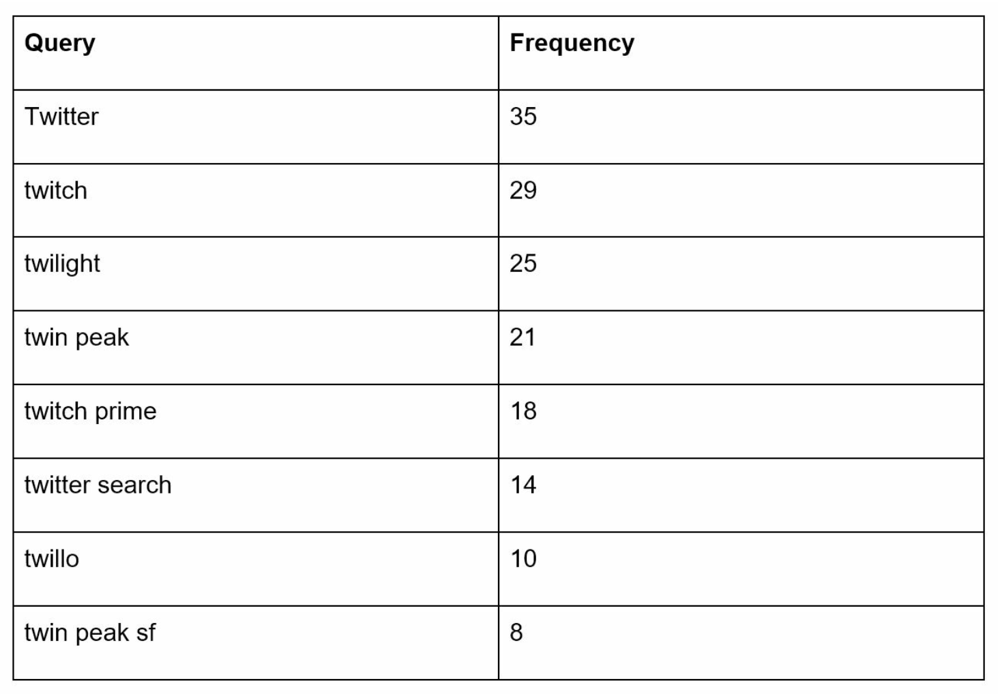
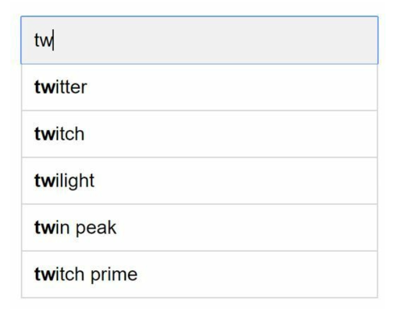
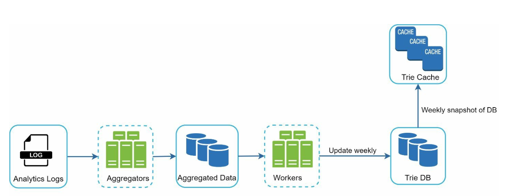

# Chapter 13: Design a Search Autocomplete System

## Introduction
Autocomplete, also known as typeahead or incremental search, provides real-time suggestions to users as they type in search boxes. The system must efficiently deliver top-k relevant and popular suggestions based on historical query data.

### Key Features
- Suggest up to **5 autocomplete results**.
- Based on **query popularity** (frequency).
- Support only **lowercase English characters**.
- Fast response time (<100 ms) and scalable.

---

## Step 1: Understanding the Problem

### Requirements
1. **Real-Time Suggestions:** Display relevant matches as the user types.
2. **Top-k Results:** Return up to 5 results sorted by popularity.
3. **Scalability:** Handle **10 million DAU** with a peak QPS of **48,000**.
4. **High Availability:** Handle failures without system downtime.
5. **Data Growth:** Support daily storage growth of **0.4 GB** for new query data.

---

## Step 2: High-Level Design
At the high-level, the system is broken down into two services:
1. **Data Gathering Service:** 
    - Collects user queries and aggregates them for frequency analysis in real-time.
    - Real-time processing is not practical for large data sets; however, it is a good starting point

2. **Query Service:** Provides the top-k suggestions based on the user’s input.

---

### Data Gathering Service

    

- Aggregates query data from analytics logs and updates the frequency table.
- Processes historical data weekly to build a **trie** (prefix tree).

### Query Service

    
    

- Uses the frequency table from data gathering service.
- Processes user input and retrieves top-k suggestions from the frequency table using a Trie.
- Optimized for fast lookups using caching and efficient data structures.
- For example when a user types “tw” in the search box, the following top 5 searched queries are displayed.

---

## Step 3: Design Deep Dive

### Trie Data Structure
The **trie** is a tree-like data structure used to store and retrieve query strings efficiently.

#### Key Features
1. **Compact Storage:** Represents prefixes hierarchically to minimize redundancy.
2. **Frequency Information:** Stores the popularity of queries at each node.

4. **Steps to get top k most searched queries**
   

      
   

    - Find the prefix
    - Traverse the subtree from prefix node to get all valid children
    - Sort the children and get top k 

3. **Optimizations:**
   - Cache top-k queries at each node to speed up retrieval and avoid traversing the whole trie.

        

   - Limit prefix length to reduce search space as users rarely type a loong search query (say 50).

#### Trie Operations
1. **Create:** 
    - Built weekly using aggregated query data.
    - The source of data is from Analytics Log/DB.
2. **Update:** Rarely updated in real-time; weekly updates replace old data.
3. **Delete:** 
      

         
      

    - Filters remove unwanted or harmful suggestions (e.g., hate speech).
    - Having a filter layer gives us the flexibility of removing results based on different filter rules.
    - Unwanted suggestions are removed physically from the database asynchronically.
    

---

### Query Processing Flow
1. **Prefix Search:**
   - Identify the prefix node corresponding to the user’s input.
   - Traverse the subtree to collect valid suggestions.
2. **Top-k Sorting:**
   - Cache top-k suggestions at each node to minimize sorting overhead.
3. **Response Construction:**
   - Construct results using cached data for fast response times.

---

### Optimizations
1. **Cache at Each Node:**
   - Store the top-k queries to avoid redundant traversals.
2. **Limit Prefix Length:**
   - Cap prefix length to a small value (e.g., 50 characters) for faster lookups.
3. **AJAX Requests:**
   - Use lightweight asynchronous requests for real-time responses.
4. **Browser Caching:**
   - Save autocomplete results in the browser cache for frequently searched terms.

---

### Data Gathering Pipeline
In the high-level design, whenever a user types a search query, data is updated in real-time. This appraoch is not practical.
- Users may enter billions of queries per day. Updating the trie on every query is not feasible.
- Top suggestions may not change much one the trie is built.

#### Updated Design

   

1. **Analytics Logs:**
   - Stores raw query data as logs for weekly aggregation.
   - Logs are append-only and are not indexed
2. **Aggregators:**
   - Process logs into frequency tables, suitable for trie construction.
   - For real-time applications such as Twitter, aggregate data in a shorter time interval.
   - For other cases, aggregating data less frequently, say once per week is good enough.
3. **Workers:**
   - Asynchronous servers rebuild the trie and store it in persistent storage.
4. **Storage Options:**
    - **Trie Cache**: Trie Cache is a distributed cache system that keeps trie in memory for fast read.
    - **Trie DB** 
        1. **Document Store (e.g., MongoDB)**: Since a new trie is built weekly, we can periodically take a snapshot of it, serialize it, and store the serialized data in the database like MongoDB
        2. **Key-Value Store:** 
            - Maps prefixes to node data for fast access.
            - Every prefix in the trie is mapped to a key in a hash table.
            - Data on each trie node is mapped to a value in a hash table.

                
---

### Scalability
1. **Sharding:**
   - Distribute trie nodes across servers based on prefix ranges (e.g., `a-m`, `n-z`).
   - Further shard within prefixes to balance uneven distributions (e.g., `aa-ag`, `ah-an`).
2. **Load Balancing:**
   

      
   

   - Use a shard map manager to route requests to the appropriate server.

---

## Step 4: Advanced Features

### Multi-Language Support
1. **Unicode Characters:** Use Unicode to support non-English languages.
2. **Country-Specific Tries:** Build separate tries for different countries or regions.

### Trending Queries
- Handle real-time events by dynamically updating trie nodes or weighting recent queries more heavily.

---

## Most Asked Interview Questions

**Q1. What data structure is best suited for search autocomplete and why?**
> A Trie (prefix tree) is ideal because it stores strings character-by-character, and all strings sharing a prefix share the same path. Lookup for all completions of prefix "sea" takes O(p + k) where p = prefix length, k = number of completions — much faster than scanning a full database. In practice, Trie nodes also cache their top-k suggestions to avoid re-traversal.

**Q2. How does a Trie work? What is the time complexity for search and insert?**
> A Trie node holds a character and pointers to child nodes (one per possible character). Insert: traverse from root, create nodes for each character — O(M) where M = string length. Search for prefix: traverse the path for each char in the prefix — O(P) where P = prefix length. Retrieving all suggestions under a node: DFS — O(N) where N = total nodes in subtree. But with cached top-k at each node: O(P) total.

**Q3. How do you rank autocomplete suggestions by popularity?**
> Assign each query a frequency count from historical logs. When building the Trie, store the top-K suggestions (by frequency) at each node rather than requiring a full subtree traversal. Example: at node "s-e-a", store `[("search", 10M), ("seattle", 5M), ("sears", 3M)]`. On lookup, return these cached top-K without any DFS. Frequency data is recomputed weekly and Tries are rebuilt asynchronously.

**Q4. How do you update the Trie with new query data without impacting read performance?**
> Never modify the live Trie in-place — it is read by millions concurrently. Instead: (1) Collect query logs in a stream (Kafka); (2) Batch-process logs weekly/daily in a Map-Reduce job to compute new query frequencies; (3) Build a completely new Trie from the new frequency data; (4) Atomic swap: point the routing layer to the new Trie, tear down the old one. Zero downtime, zero locking.

**Q5. What is the trade-off between storing suggestions in a Trie vs. a relational database?**
> Trie: O(prefix_length) lookup, memory-resident, extremely fast for prefix matching. DB (e.g., PostgreSQL LIKE 'query%' or full-text search): easy to update without rebuild, supports complex ranking queries, but slower for prefix-only lookups. At 48K QPS with <100ms SLA, a Trie in memory easily satisfies requirements. A DB works at smaller scale. Hybrid: store frequency data in DB, build Trie in memory from DB data.

**Q6. How would you scale the autocomplete system to 10M DAU and 48K QPS?**
> With 48K QPS at <100ms: (1) Serve from in-memory Trie replicas (multiple servers, no DB on critical path); (2) Load balance across 5–10 Trie servers; (3) Cache frequent prefix lookups in Redis (top 1,000 prefixes cover ~80% of traffic — Zipf's law); (4) Async pipeline rebuilds Trie nightly; (5) CDN caches responses for common single-character prefix queries. Each Trie server handles ~5K QPS — 10 servers with headroom.

**Q7. How do you cache autocomplete results to reduce Trie lookup overhead?**
> Cache at two levels: (1) CDN: prefixes like "a", "th", "sea" are queried millions of times per day — CDN caches the response, serving without hitting origin; (2) Application cache (Redis): store the top-K completions per prefix with 10-minute TTL. Cache invalidation happens on Trie rebuild, not per-query. This means up to 10 min staleness in suggestions — acceptable for most use cases.

**Q8. How do you handle multilingual autocomplete?**
> Build separate Trie instances per language (e.g., English, Chinese, French). Detect the user's language from browser Accept-Language header, query locale, or user profile. Route to the appropriate language Trie. For CJK languages (Chinese, Japanese, Korean), the "characters" are Unicode code points, not Latin letters — the Trie spans all Unicode characters. Use Unicode normalization (NFC) to normalize queries before insertion.

**Q9. How would you build a data aggregation pipeline to update Trie from query logs?**
> (1) Log every search query to Kafka in real-time; (2) Kafka → Hive/HDFS: batch-accumulate logs hourly; (3) Spark/MapReduce job: compute top-K queries per prefix from the past 7 days, weighting recent queries more heavily; (4) Output frequency data to a key-value store; (5) Trie builder service reads frequency data and builds new Trie; (6) New Trie replaces old via atomic swap.

**Q10. How do you filter out offensive, inappropriate, or spam autocomplete suggestions?**
> Maintain a blocklist of banned phrases. During Trie build, filter out any query matching the blocklist before insertion. For reactive filtering: editors update the blocklist; next Trie rebuild excludes those terms. For emergency removal (trending harmful content): support real-time blocklist refresh without full Trie rebuild (mark nodes as suppressed). Operator override should take effect within minutes, not hours.

**Q11. What is the maximum prefix length you need to support in autocomplete?**
> In practice, autocomplete is only triggered for the first 1–5 characters of a query — users don't need autocomplete after they've typed 20+ characters. Support prefixes up to length 20–30 to cover 99%+ of real-world queries. Queries beyond that length have very low frequency and can be cut from the Trie to save memory.

**Q12. How does Google handle autocomplete suggestions in real-time for trending topics?**
> Standard Tries are rebuilt nightly/weekly. For real-time trends (a breaking news event spikes very sudden), a separate real-time layer tracks trending queries in a sliding window (last 1-hour query counts in Redis sorted sets). The autocomplete API merges results from the standard Trie and the real-time trending layer, giving a blended result set that stays fresh within minutes.

**Q13. What is the memory complexity of a Trie for 1 billion unique queries?**
> In the worst case (no shared prefixes), a Trie for N strings each of length M uses O(N × M) nodes. For 1B unique queries averaging 5 characters: 5B nodes × ~50 bytes/node = 250 GB. In practice, massive prefix sharing reduces this significantly. With top-K caching and compression, a production Trie for 1B queries might use 50–100 GB.

**Q14. What happens when the Trie is being rebuilt? Is there downtime?**
> No downtime needed. Old and new Tries exist simultaneously during the rebuild. The routing layer continues serving from the old Trie. Once the new Trie is fully built and validated, an atomic swap of the pointer is performed. Old Trie is garbage collected. If the new Trie fails validation, the swap is aborted and the old Trie continues serving.

**Q15. How do you handle typos in autocomplete queries?**
> Standard Trie requires exact prefix match. For typo tolerance: (1) Levenshtein edit-distance search within the Trie (expensive); (2) BK-tree for approximate matching; (3) Elasticsearch fuzzy query with `fuzziness: AUTO`; (4) Suggest candidates based on phonetic similarity (Soundex). Most production autocomplete systems don't apply fuzzy matching until the user submits the full query.

**Q16. What is prefix compression in a Trie (Patricia Trie / Radix Tree)?**
> In a standard Trie, long chains with only one child waste nodes. A Patricia Trie (Radix Tree) compresses these chains into a single node labeled with the shared substring. Example: nodes "s→e→a→r→c→h" become a single node "search". This reduces memory usage by 5–10× for typical word dictionaries at the cost of slightly more complex insert/delete operations.

**Q17. How does real-time personalized autocomplete work?**
> Track the user's own query history and frequently visited pages. When showing autocomplete, blend: (1) global top-K suggestions from the population Trie; (2) personalized suggestions from the user's history (weighted higher if recent). Serve from a per-user recency store (Redis sorted set) merged with the shared Trie results at query time. Never include private queries in the global Trie to avoid privacy leaks.

**Q18. What are the top-K algorithms for populating suggestions at each Trie node?**
> (1) Sort all descendant queries by frequency and take top K at build time — O(N log N) per node, expensive; (2) Use a min-heap of size K during DFS — O(N log K); (3) During Trie construction, propagate top-K upward: when inserting a query with frequency F, update ancestor nodes' top-K if F exceeds the minimum in the current top-K set. This makes top-K lookup O(1) at query time.

**Q19. How do you handle session context in autocomplete (refine by previous query)?**
> Maintain a session context vector (last 2–3 queries) on the client-side and include it in the autocomplete API request. Server blends context-aware suggestions with global suggestions, boosting context-relevant completions. Example: after searching "harry potter", typing "movies" surfaces "harry potter movies" higher.

**Q20. How do you ensure low latency autocomplete for mobile users?**
> (1) CDN at the edge for common prefixes; (2) Response compression (gzip/brotli reduces payload 70%); (3) Debounce on client side — don't send a request on every keystroke, wait 100ms after last keystroke; (4) Prefetch: when user types "s", prefetch "se" and "st" results in the background; (5) HTTP/2 for connection reuse.

**Q21. How do you design the data model for query frequency tracking?**
> Store: `{query: "seattle weather", count_7d: 5000000, count_1d: 700000, updated_at: ...}`. Accumulate counts from Kafka using a Spark batch job. Use approximate counting (Count-Min Sketch or probabilistic counters) for very high cardinality — exact counts are unnecessary when ranking top-K.

**Q22. How would you implement autocomplete for product names in an e-commerce site?**
> Index product names by prefix in a Trie or Elasticsearch. After prefix match, rank results by: popularity score, in-stock status, price tier, user's past browsing history. Use Elasticsearch's `prefix` query with function_score for flexible ranking beyond pure frequency count.

**Q23. How would you handle autocomplete for a search engine with billions of queries per day?**
> Shard the Trie by prefix range across multiple servers: prefix "a"–"m" goes to shard 1, "n"–"z" to shard 2. Add an intermediary service that routes the prefix to the correct shard and aggregates results. Apply heavy CDN caching at the edge for common 1–2 character prefixes.

**Q24. How do you measure and improve autocomplete quality?**
> Track: (1) suggestion click-through rate (CTR) — did users accept a suggestion?; (2) query completion rate — did users type less because of suggestions?; (3) search success rate — did users find what they wanted after accepting a suggestion? Use A/B tests to compare ranking algorithms and measure these metrics with statistical significance.

**Q25. How would you build a frequency model that handles both historical and recent query trends?**
> Use a time-decayed weighted sum: `score = α × count_last_7d + β × count_last_30d + γ × count_all_time`. Recent queries get higher weights (α > β > γ). This ensures trending fresh queries surface quickly while historically popular stable queries remain in suggestions. Recompute nightly with Spark.

**Q26. How does the Trie handle insertions of new queries that don't yet have high frequency?**
> New low-frequency queries are inserted into the Trie's leaf nodes but don't displace high-frequency queries in top-K cached sets at ancestor nodes. They become visible in suggestions only once their frequency exceeds the Kth-highest competitor in that node's top-K. This natural threshold prevents noisy one-off queries from polluting suggestions.

**Q27. What does a full autocomplete system architecture look like?**
> Client types → debounced request → Load Balancer → CDN (cache hit: return immediately) → Autocomplete Server (Trie in-memory lookup with Redis prefix cache) → response. Offline pipeline: Query logs → Kafka → Spark job (frequency aggregation) → Trie Builder → Trie snapshot to S3 → Autocomplete Servers load new snapshot atomically. Blocklist updates go through a config service consumed in real time.

