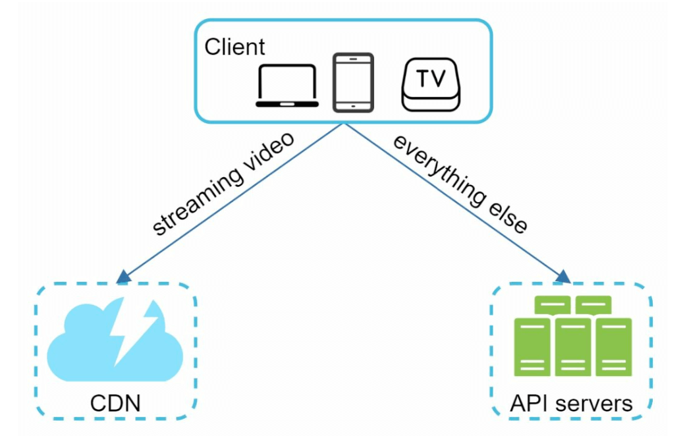
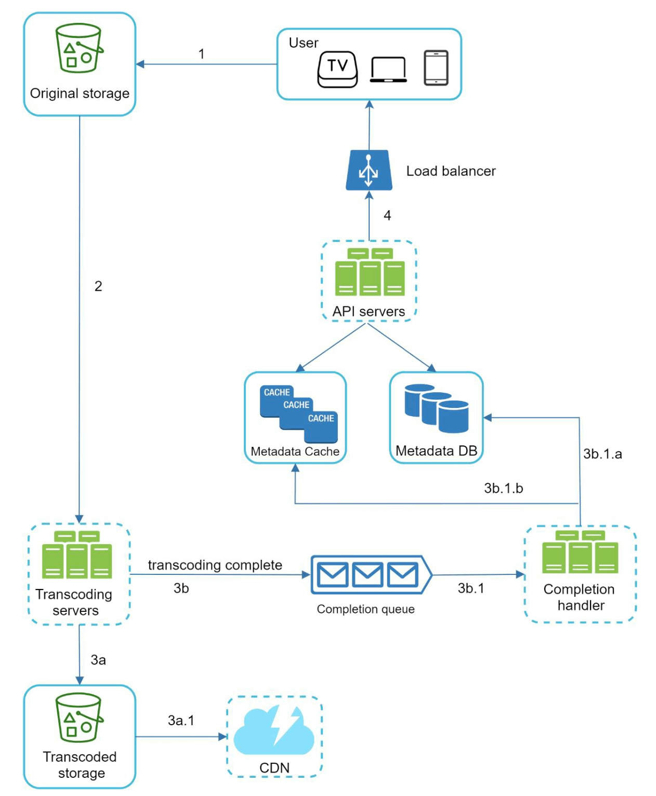
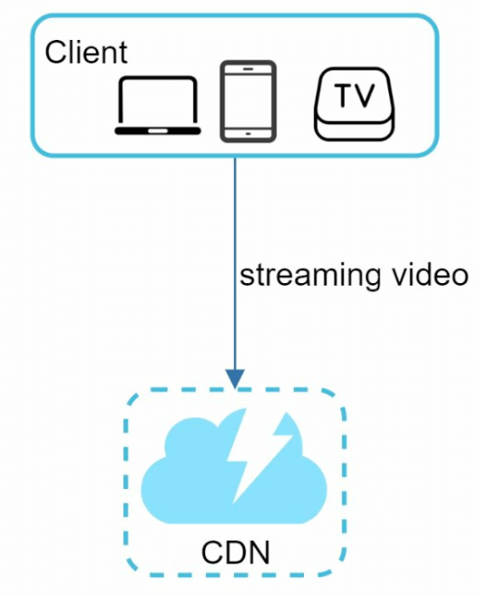
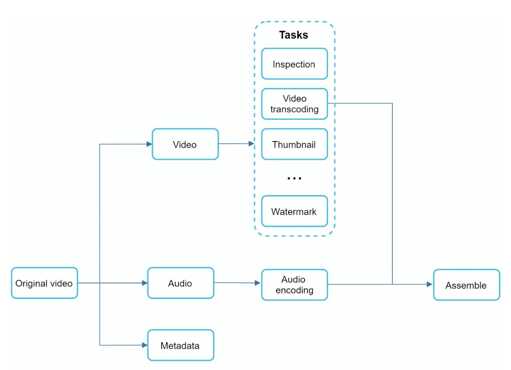
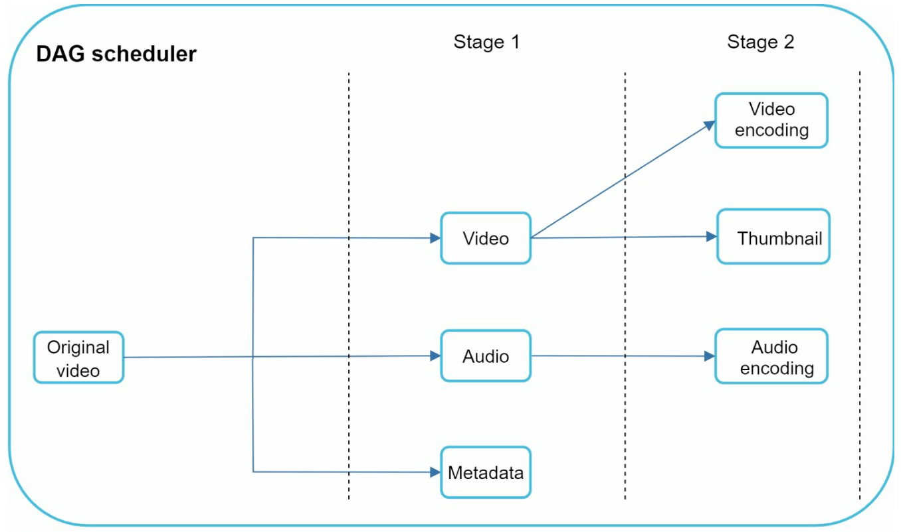
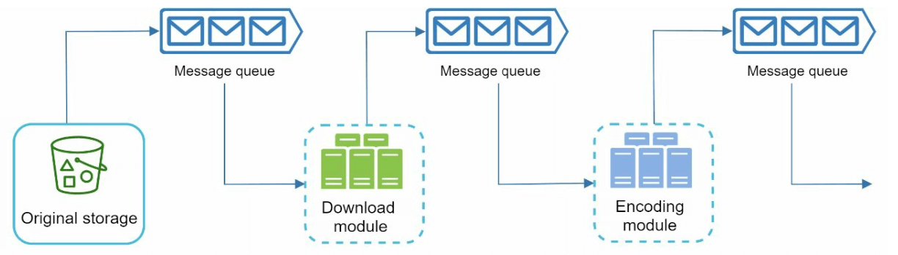
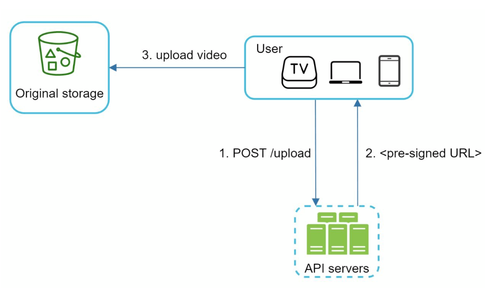

# Chapter 14: Design YouTube

## Introduction
YouTube is a massive video streaming platform supporting video uploads, playback, and various interactions. This chapter focuses on designing a scalable video streaming system with the following core features:
- **Fast video uploads**
- **Smooth video streaming**
- **Ability to change video quality**
- **Low infrastructure cost**
- **High availability and reliability**

### Key Statistics (2020)
- **2 billion monthly active users**
- **5 billion videos watched per day**
- **37% of mobile internet traffic comes from YouTube**
- Available in **80 languages**
- **$15.1 billion ad revenue** in 2019

---

## Step 1: Understand the Problem and Scope

### Core Functionalities
1. Upload videos
2. Watch videos

### Supported Platforms
- Mobile apps, web browsers, and smart TVs

### Assumptions
- **Daily Active Users (DAU):** 5 million
- **Average Video Size:** 300 MB
- **Upload Limits:** Max 1 GB per video
- **Daily Storage Need:** 150 TB
- **CDN Costs:** 5 million * 5 videos * 0.3GB * $0.02 =  $150,000/day (using Amazon CloudFront)

---

## Step 2: High-Level Design

### Components

    

1. **Client:** Devices like smartphones, computers, and TVs.
2. **CDN (Content Delivery Network):** Stores and streams videos.
3. **API Servers:** Handles all user interactions except video streaming (e.g., uploads, metadata updates).
4. **Metadata Database:** Stores video metadata (e.g., title, description, size).
5. **Original Storage:** Blob storage for uploaded videos.
6. **Transcoding Servers:** Convert videos into multiple resolutions and formats.
7. **Transcoded Storage:** Blob storage for transcoded videos.

---

### Core Workflows
#### 1. Video Uploading Flow
- **Parallel Processes:**
  1. Upload video to original storage.
  2. Update video metadata in the database.

- **Video Upload (Steps):**

    

        
    

    - [1] Videos are uploaded to blob storage. 
    - [2] Transcoding servers convert videos to multiple formats.
    - [3] One trasncoding is complete, following two steps are exectued in parallel.
        - [3a] Transcoded videos are sent to transcoded storage.
        - [3b] Transcoding completion events are queued in the completion queue. 
    - [3a.1] Videos are distributed to the CDN. 
    - [3b.1] Completion handlers update metadata and inform users. 

- **Metadata Upload (Steps):**

    

        
    

    - The client in parallel sends a request to update the video metadata 
    - The request contains video metadata, including file name, size, format, etc.
    
       

#### 2. Video Streaming Flow

  

- Videos are streamed directly from the CDN using edge servers to minimize latency.
- Some of te popular streaming protocols are MPEG_DASH, Apple HLS, Adobe HDS.
-  *Different streaming protocols support different video encodings and playback players.*

---

## Step 3: Design Deep Dive

### Video Transcoding
#### Importance
1. Raw video consumes large amounts of storage space. It Reduces storage space.
2. Ensures compatibility across devices and browsers.
3. Adapts video quality to network conditions.

#### Components
- **Container:** Encapsulates video, audio, and metadata (e.g., MP4, AVI).
- **Codecs:** Compression and Decompression algorithms (e.g., H.264, VP9).

#### Directed Acyclic Graph (DAG) Model

    

- Transcoding a video is computationally expensive and time-consuming.
- DAG Model defines tasks like encoding, thumbnail generation, and watermarking.
- Allows high parallelism in video processing.

- The original video is split into video, audio, and metadata. 
    - Video encodings: Videos are converted to support different resolutions, codec, bitrates.
    - Thumbnail: It can either be uploaded by a user or automatically generated bythe system.
    - Watermark: Image overlay on top of your video contains identifying information about the video.

---

### Video Transcoding Architecture

1. **Preprocessor:** Splits videos into smaller chunks (GOP alignment). It has 4 responsibilities.

    

        
    

    - Video splitting: Video stream is split or further split into smaller Group of Pictures (GOP) alignment.
    - It split videos by GOP alignment for old clients.
    - It generates DAG based on configuration files client programmers write. 
    - It stores GOPs and metadata in temporary storage in case the encoding fails, the system could use persisted data for retry operations.

2. **DAG Scheduler:** Organizes tasks into sequential or parallel stages.
    

        
    

    - It splits a DAG graph into stages of tasks and puts them in the task queue in the resource manager. 
    - Stage 1: video, audio, and metadata.
    - The video file is further split into two tasks in stage 2: video encoding and thumbnail. 

3. **Resource Manager:** Responsible for managing the efficiency of resource allocation.It
contains 3 queues and a task scheduler.
    

        
    

    - Task queue: priority queue that contains tasks to be executed.
    - Worker queue: priority queue that contains worker utilization info.
    - Running queue: contains  currently running tasks and workers running the tasks.
    - Task scheduler: picks the optimal task/worker, and instructs the chosen task worker to execute the job.

4. **Task Workers:** Perform transcoding and other operations.
    

        
   

    - Different task workers may run different tasks 

5. **Temporary Storage:** Stores intermediate data for retries.
    - The choice of storage system depends on factors like data type, data size, access frequency, data life span, etc. 
6. **Output:** Transcoded videos ready for distribution.

---

## System Optimizations

### Speed Optimizations
1. **Parallel Video Uploads:** Split videos into smaller chunks for faster, resumable uploads.

    

2. **Distributed Upload Centers:** Use CDNs as upload hubs close to users.
3. **Parallel Processing:** Decouple modules using message queues for high parallelism.

    
    

### Safety Optimizations
1. **Pre-Signed URLs:** Restrict video uploads to authorized users.

    

2. **Protect Videos:**
   - **DRM Systems** (e.g., Apple FairPlay, Google Widevine).
   - **AES Encryption.**
   - **Watermarking.**

### Cost-Saving Optimizations
1. Serve only popular videos via CDN; less popular ones from high-capacity servers.
2. Encode on-demand for rarely accessed videos.
3. Regionalize video distribution based on popularity.
4. Build custom CDNs and partner with ISPs to reduce bandwidth costs.

---

## Error Handling
### Recoverable Errors
- Retry failed uploads, transcoding, or resource allocation tasks.

### Non-Recoverable Errors
- Stop malformed video processing and return error codes.

---

## Most Asked Interview Questions

**Q1. How would you design the video upload pipeline for YouTube?**
> Client → Upload Service (receives raw video, stores to S3 raw bucket) → Message Queue (Kafka/SQS) → Transcoding Workers (pull jobs, transcode to multiple formats/resolutions) → Processed video stored in CDN-backed object storage → Metadata DB updated with available formats. The upload is split from processing: upload acknowledgment is instant; processing is async and may take minutes.

**Q2. What is video transcoding and why is it necessary?**
> Transcoding converts the raw uploaded video (any format: MKV, MOV, AVI) into standardized formats (H.264/AVC, H.265/HEVC, VP9, AV1) at multiple resolutions (1080p, 720p, 480p, 360p). Different devices support different codecs; different network speeds need different bitrates. Without transcoding, users on 3G would try to stream a 4K file, causing buffering. Transcoding ensures compatibility and adaptive streaming.

**Q3. What is Adaptive Bitrate Streaming (ABR) and why is it important?**
> ABR (HLS/DASH) breaks video into small segments (2–10 second chunks). Each segment is encoded at multiple quality levels. The client player monitors network speed and buffer state, automatically selecting the appropriate quality segment for each chunk. Result: smooth playback — instead of buffering, the player downgrades quality temporarily to maintain continuous playback. Netflix, YouTube, and Twitch all use ABR.

**Q4. What storage would you use for raw vs. processed video?**
> Raw video: Object storage (S3) — durable, cheap, handles massive files, write-once. Processed video segments: Object storage + CDN (CloudFront, Akamai) — segments are immutable after creation, perfect for CDN caching, served directly from edge nodes. Metadata (title, description, view count, transcoding status): RDBMS (PostgreSQL) or DynamoDB for fast structured lookups.

**Q5. How does a CDN help in video streaming?**
> CDN caches video segments at edge nodes near users. Instead of all users globally fetching from a single origin (catastrophic for a viral video), requests go to the nearest CDN PoP. Popular Video segments are cached for hours — cache hit rate >95%. CDN absorbs 95%+ of traffic; origin serves only cache misses (long-tail videos). This reduces origin cost, improves latency, and enables petabytes-per-day streaming.

**Q6. How do you separate metadata storage from actual video content?**
> Video content (binary segments) goes to object storage + CDN. Metadata (title, channel, tags, duration, resolution options, view count, like count, upload_time, status=processing/ready) goes to a relational or NoSQL DB. The metadata record holds CDN URLs for each resolution/format. This separation allows metadata to be queried with SQL while video data benefits from object storage economics (~$0.023/GB vs. $0.10/GB for DB storage).

**Q7. How would you scale the video processing pipeline to handle millions of daily uploads?**
> YouTube receives 500 hours of video per minute. Scale: (1) Upload service horizontally (stateless, just write to S3); (2) Kafka partitioned by video_id for ordered processing; (3) Transcoding worker pool (auto-scales based on queue depth); (4) Use GPU instances for fast transcoding (NVIDIA CUDA-accelerated FFmpeg); (5) Prioritize popular channel uploads; (6) Distribute transcoding geographically for regional uploads.

**Q8. What is the role of a message queue in the video upload/transcoding workflow?**
> After upload, the service publishes a job to Kafka/SQS: `{video_id, s3_path, upload_time}`. Transcoding workers consume jobs independently — they can fail and retry without losing jobs. Queue decouples upload (fast, user-facing) from transcoding (slow, CPU-intensive). If transcoding falls behind, the queue acts as a buffer — uploads continue while transcoding catches up at its own pace.

**Q9. How do you handle video transcoding failures and retry logic?**
> On failure: move the job to a retry queue with an incremented attempt counter. Use exponential backoff delays (1 min, 5 min, 30 min). After N failed attempts (e.g., 5), move to a Dead Letter Queue (DLQ) and alert operators. Many failures are caused by malformed input — detect corruption upfront and reject early with a clear error message to the uploader. Transient failures (worker crash) are retried; structural failures (corrupt codec) are rejected.

**Q10. How do you design video recommendation at a high level?**
> Inputs: user watch history, likes/dislikes, search queries, video metadata, engagement signals (CTR, watch time, shares). Offline: collaborative filtering (users who watched X also watched Y) + content-based (video tags, description, title). Online: real-time candidate retrieval (ANN search over video embeddings) + re-ranking (ML model scoring candidates on user-specific features). YouTube's system generates a short list of ~500 candidates, re-ranked to top 10 per request.

**Q11. How do you handle video deduplication to prevent re-uploads of copyrighted content?**
> Content ID system: (1) During transcoding, compute a robust perceptual fingerprint (audio + video fingerprint) of the video; (2) Compare against a fingerprint database of copyrighted reference content; (3) On match: apply copyright owner's action (block, monetize, track). Perceptual hashing (not cryptographic) is needed to handle re-encodings or minor edits of the original.

**Q12. How does video seek (jump to timestamp) work with HLS/DASH segments?**
> Each video is split into fixed-duration segments (e.g., 6 seconds each). A manifest file (M3U8 for HLS, MPD for DASH) lists all segments with their timestamps and URLs. When the user seeks to 5:30, the player calculates which segment contains that timestamp, requests that specific CDN URL, and begins playback. No server-side state needed — seek is a pure client-side operation using the manifest.

**Q13. How do you implement video search (not autocomplete, but full-text search)?**
> Index video metadata (title, description, tags, transcript from auto-captions) in Elasticsearch. Add ranking signals: view count, upload date, channel authority, engagement rate, watch time. On search query: ES full-text search → candidate set → re-rank by relevance + personalization factors. Index updates happen async after transcoding completes and the video is published.

**Q14. What is the difference between HLS and DASH?**
> HLS (HTTP Live Streaming): Apple's standard, uses .m3u8 playlists and .ts segments, natively supported on iOS/macOS Safari. DASH (Dynamic Adaptive Streaming over HTTP): open standard, uses .mpd manifests, XML-based, not natively supported on older iOS. Both use the same underlying concept (segments + adaptive manifest) but different formats. Most platforms support both; YouTube uses DASH for Chrome/Android and HLS for iOS.

**Q15. How does YouTube handle video comments at scale?**
> Comments are stored in a distributed DB (likely BigTable-style) partitioned by video_id. Top-level comments are fetched with pagination. Replies are nested under parent comments. Likes on comments are counter-based (Redis for hot comments). Comment display order: Top Comments (ranked by like count + age) or Newest First (chronological). Content moderation: ML classifier for spam/harmful content runs async after posting.

**Q16. How do you implement video view count accurately at scale?**
> Naive approach: `UPDATE views = views + 1 per row on each view` — creates a write hotspot for viral videos. Better: buffer view events in a Redis counter per video (INCR is atomic, sub-ms). A background job periodically flushes Redis counts to the persistent DB (batch update). This reduces DB writes from millions/sec to thousands/sec. For very high-traffic videos, approximate counts (± 1%) are acceptable.

**Q17. How does YouTube ensure high availability during a video processing failure?**
> At-least-once delivery via idempotent job IDs in the queue. Each transcoding worker marks job state: claimed → processing → completed/failed. If a worker crashes while processing, the job's lease expires and another worker picks it up. The video metadata shows "processing" until all resolutions are ready. Partial availability: show 360p while HD is still processing (progressive publishing).

**Q18. How would you estimate YouTube's infrastructure scale?**
> 500 hours uploaded/min → 720K hours/day. At 1 GB/hour raw: 720 TB/day incoming. After transcoding to 3 resolutions: 3× storage → ~2 PB/day added. 5 billion videos watched daily × 200 MB avg → 1 EB/day of CDN egress. At $0.01/GB CDN cost: $10B/day (ridiculous) — in practice Google owns its own CDN and IXP peering, dramatically reducing egress cost to near zero.

**Q19. How do you implement live video streaming?**
> Stream ingest via RTMP from streamer's encoder to ingest servers. Ingest servers transcode the live RTMP stream into HLS/DASH segments in real time (per-segment transcoding). Segments are pushed to origin storage and immediately available to the CDN edge cache. Target latency: standard HLS has 15–30s delay; LL-HLS (Low-Latency HLS) achieves 2–3s. WebRTC enables sub-second latency but doesn't scale to millions of concurrent viewers.

**Q20. How would you design a scalable video thumbnail generation system?**
> On upload: (1) Extract frames at regular intervals (every 5 seconds) during transcoding; (2) Store frame images in object storage; (3) Optionally run an ML model to select the most "engaging" thumbnail (high contrast, faces, bright colors); (4) Store thumbnail CDN URLs in video metadata. Custom thumbnails: uploader can upload their own image → same pipeline stores and CDN-serves it.

**Q21. What is a "cold" vs. "hot" video in YouTube's storage optimization?**
> Hot videos (recently uploaded or trending): accessed millions of times/day → cached at CDN edge, live in warm storage. Cold videos (long-tail, rarely watched): uploaded once, watched occasionally → stored in cheaper cold storage (S3 Glacier / GCS Nearline); CDN cache misses fetch from cold storage (slightly higher latency). ~95% of YouTube content falls into the cold category but accounts for ~5% of traffic.

**Q22. How does YouTube handle chapter markers and timestamps in videos?**
> Chapter timestamps are stored as metadata alongside the video (e.g., `0:00 Intro, 5:30 Main Topic, 15:00 Conclusion`). During playback, the player's progress bar displays chapter markers computed from these timestamps. Seeking to a chapter: same as any timestamp seek — the player jumps to the corresponding HLS/DASH segment. Chapter data is stored in the video metadata table, not in the video binary.

**Q23. How do you handle copyright-blocked videos in specific countries?**
> Store per-video geographic availability rules in the metadata: `{video_id, geo_block: [{country: "DE", action: "block"}]}`. At CDN edge, include geo-based rules in cache keys or use Lambda@Edge functions to check geo rules before serving. Return HTTP 451 (Unavailable for Legal Reasons) for blocked regions. The CDN geo-blocks without hitting the origin, ensuring efficient enforcement at scale.

**Q24. How does YouTube manage auto-generated captions?**
> After transcoding, the audio is sent to a Speech-to-Text service (Google Cloud STT). The STT service returns timestamped transcript segments. Captions are stored as timed text files (WebVTT format) alongside the video. The player fetches the caption file separately (along with the HLS manifest). Caption generation runs async — a video may be available without captions initially; they appear once the STT job completes.

**Q25. How does YouTube handle video resumption (continue watching)?**
> Client sends periodic `watch_position` events (every 5–10 seconds while watching) to a resume API: `POST /api/watch_position {video_id, position_seconds}`. Stored per-user per-video in a low-latency DB (Redis or DynamoDB). On next load, client fetches `GET /api/watch_position?video_id=X` → gets last position → HLS player seeks to that segment. Position updates are fire-and-forget (async) to not block playback.

**Q26. How does the video recommendation system handle the cold-start problem for new videos?**
> New videos have no engagement history. Cold-start strategies: (1) Use content-based signals (title, description, tags) for initial categorization; (2) Show to a small diverse audience first to gather initial engagement signals; (3) Use channel authority — videos from established channels get initial boosts; (4) Contextual relevance: if a user just searched for "guitar tutorial", surface new guitar tutorial videos.

**Q27. What does a complete YouTube architecture look like?**
> Upload path: Client → Upload Service → S3 (raw) → Kafka → Transcoding Workers → S3 (segments) + CDN. Watch path: Client → CDN (segments, cache hit) → Origin (S3, cache miss). Metadata path: Client → API Server → Metadata DB + Redis cache. Recommendation: offline ML training → model server → API response. Moderation: content fingerprint + ML classifier on async workers. Monitoring: Prometheus + Grafana, Kafka consumer lag, transcoding queue depth.

