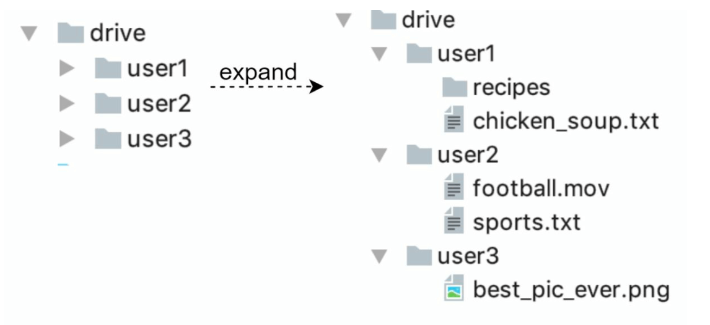
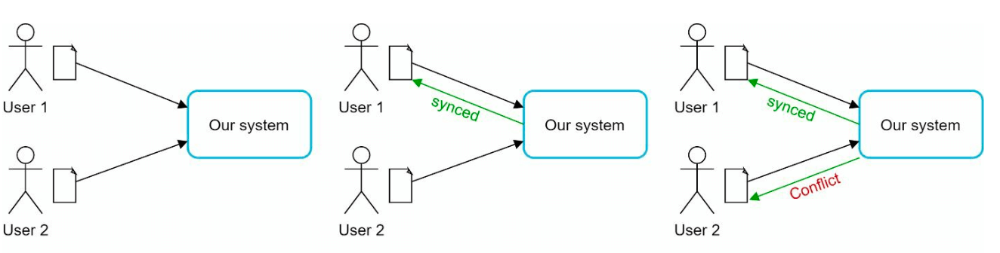
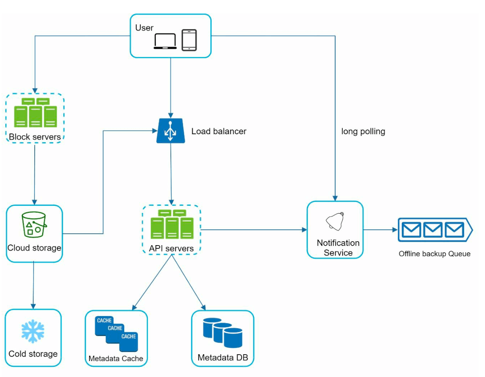
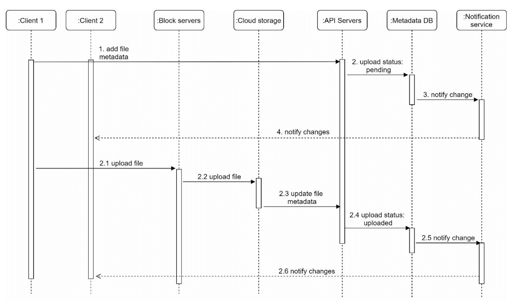
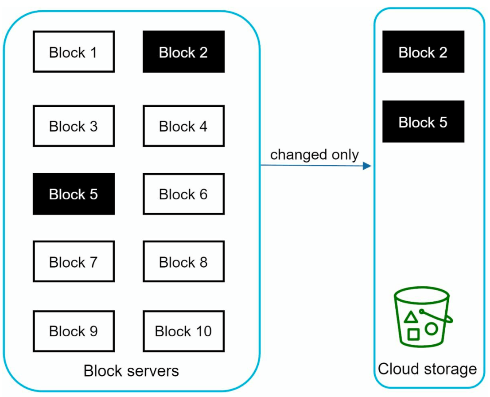
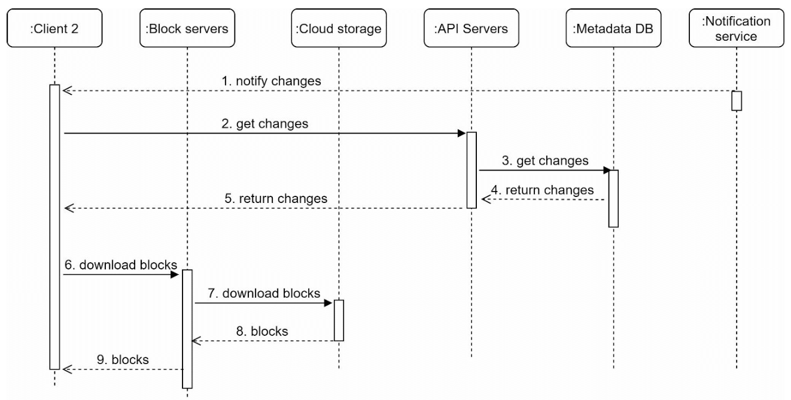

# Chapter 15: Design Google Drive

## Introduction
Google Drive is a cloud-based file storage and synchronization service that allows users to store, access, and share files from various devices. This chapter discusses designing a scalable system with the following features:
- **File Upload and Download**
- **File Sync Across Devices**
- **File Sharing**
- **File Revision History**
- **Notifications for Edits, Deletes, and Shares**

---

## Step 1: Understanding the Problem

### Key Requirements
#### Functional Requirements:
- Upload and download files.
- Sync files across multiple devices.
- Maintain file revisions.
- Enable file sharing with permissions.
- Send notifications on file edits, deletions, and shares.

#### Non-Functional Requirements:
- **Reliability:** Data loss is unacceptable.
- **Fast Sync Speed:** Avoid user impatience with delayed syncing.
- **Bandwidth Efficiency:** Minimize unnecessary data usage.
- **Scalability:** Handle 10 million daily active users (DAU).
- **High Availability:** Operate seamlessly during server failures or network issues.

### Constraints and Assumptions
- Users get **10 GB free space**.
- Maximum file size: **10 GB**.
- Average file upload size: **500 KB**.
- Upload frequency: **2 files per day per user**.
- Total storage required: **500 PB**.

---

## Step 2: High-Level Design
### Single-Server Setup
A basic setup includes:
1. **Web Server:** Handles uploads and downloads.
2. **Metadata Database:**  to keep track of metadata like user data, login info, files info/
3. **Storage Directory:** Holds files organized by namespaces.

    

- A web server and a directory called drive/ is set up as the root directory to store uploaded files. 
- Under drive/ directory, there is a list of directories called namespaces. 
- Each namespace contains all the uploaded files for that user. 
- Each file or folder can be uniquely identified by joining the namespace and the relative path.

This design serves as a starting point but is inadequate for scaling.

#### APIs
1. **Upload a file to Google Drive:** Two types of uploads are supported
    - Simple upload: Used when file size is small.
    - Resumable upload: 
        - Endpoint: https://api.example.com/files/upload?uploadType=resumable
        - Send the initial request to retrieve the resumable URL.
        - Upload the data and monitor upload state
        - If upload is disturbed, resume the upload.
2. **Download a file from Google Drive:** To download a file
    -  Endpoint: https://api.example.com/files/download
3. **Get file revisions:**
    - Endpoint: https://api.example.com/files/list_revisions

### Moving to Distributed Systems

#### Improvements:
1. **Sharding:** Split storage across servers based on `user_id`.
2. **Amazon S3:** Use S3 for scalable and redundant file storage with cross-region replication.

    
     
3. **Load Balancer:** Distribute traffic across multiple web servers.
4. **Metadata Database Replication:** Ensure availability through database sharding and replication.

#### Sync Conflicts:
For a large storage system like Google Drive, sync conflicts happen from time to time.
When two users modify the same file or folder at the same time, a conflict happens.

- In the example user 1 and user 2 tries to update the same file at the same time, but user 1’s file is processed by our system first.
- User 1’s update operation goes through, but, user 2 gets a sync conflict. 
- The system presents both copies of the same file: user 2’s local copy and the latest version from the server.
- User 2 has the option to merge both files or override one version with the other.

### Improved design

1. **User Interaction:**: Users access the application via browser or mobile app.

2. **Block Servers:**
   - Files are split into **4 MB blocks** (maximum size) and assigned unique hash values.
   - Blocks are stored independently in cloud storage (e.g., Amazon S3).
   - File reconstruction involves joining blocks in a specific order.

3. **Cloud Storage:** Blocks are stored in cloud storage for scalability and redundancy.

4. **Cold Storage:** Inactive files are moved to cold storage to reduce costs.

5. **Load Balancer:** Distributes requests evenly among API servers to ensure efficient operation.

6. **API Servers:**
   - Handle user authentication, profile management, and file metadata updates.
   - Manage all non-uploading workflows.

7. **Metadata Database and Cache:**
   - Stores metadata for users, files, blocks, and versions.
   - Frequently accessed metadata is cached for faster retrieval.

8. **Notification Service:**
   - A **publisher/subscriber system** that notifies clients about file changes (add, edit, delete).
   - Ensures clients can pull the latest updates.

9. **Offline Backup Queue:** Temporarily stores file change information for offline clients to sync when back online.

---

## Step 3: Design Deep Dive

### Metadata Database
A highly simplified is shown below version as it only includes the most important tables and fields.
#### Schema Design:
- **User Table:** Stores user profiles and preferences.
- **File Table:** Maintains file metadata (e.g., size, name, path).
- **Block Table:** Tracks file blocks for reconstructing files.
- **File Version Table:** Stores file revision history.

---

### File Upload Flow

1. **File Upload:**
   - File is split into blocks, compressed, and encrypted by the block server.
   - Blocks are uploaded to block servers and stored in S3.
2. **Metadata Upload:**
   - Client sends metadata to the API server.
   - Metadata is stored in the database with status `pending`.
3. **Completion:**
   - S3 triggers a callback to update the file status to `uploaded`.
   - Notification service informs relevant users.

---

### File Sync
1. **Delta Sync:** Transfer only modified blocks instead of the entire file.

    

    
    

2. **Compression:** Blocks are compressed using compression algorithms depending on file types. 
3. **Conflict Resolution:**
   - First processed version wins.
   - Conflicting versions are saved separately for user resolution.

---

### File Download Flow
Download flow is triggered when a file is added or edited elsewhere. There are two ways a client can know:
- If client A is online while a file is changed by another client, notification service will inform client A.
- If client A is offline while a file is changed by another client, data will be saved to the cache. When the offline client is online again, it pulls the latest changes.

Once a client knows a file is changed, it first requests metadata via API servers, then
downloads blocks to construct the file.

1. **Trigger:** Notification service informs the client of file updates.
2. **Metadata Fetch:** Client retrieves updated metadata via API.
3. **Block Download:** Client downloads updated blocks from block servers and reconstructs the file.

---

### Notification Service
1. **Purpose:** Keeps clients updated about file changes.
2. **Mechanism:** Implements **long polling** for asynchronous notifications.
3. **Example:** When a file is added, edited, or deleted, notifications are pushed to all relevant clients.

---

### Storage Optimization
1. **De-duplication:** Remove duplicate blocks at the account level using hash-based comparisons.
2. **Versioning Strategy:**
   - Limit the number of saved revisions.
   - Prioritize recent versions for frequently edited files.
3. **Cold Storage:** Move rarely accessed files to cheaper storage solutions (e.g., Amazon S3 Glacier).

---

### Failure Handling
1. **Load Balancer Failure:** Secondary load balancer becomes active.
2. **Block Server Failure:** Pending tasks are reassigned to other servers.
3. **Metadata Database Failure:**
   - Promote a slave node to master.
   - Redirect traffic to remaining replicas.
4. **Cloud Storage Failure:** Use cross-region replication to fetch unavailable files.
5. **Notification Service Failure:** Clients reconnect to alternative servers.  

---

## Most Asked Interview Questions

**Q1. How does Google Drive sync files across multiple devices in real time?**
> On file change, the client sends the modified file (or delta) to the sync service. The sync service persists the update and publishes an event to a notification queue. Other devices subscribed (via long polling or WebSocket) receive an "update available" event, then pull the new version from the server. This ensures eventual consistency across devices without requiring constant polling.

**Q2. What is delta sync and why is it critical for efficiency?**
> Delta sync sends only the changed bytes of a file rather than the entire file. A file is split into chunks (~4 MB each); each chunk has a hash. On change, only modified chunks are re-uploaded (detected by comparing chunk hashes on the client). For a 1 GB document with a 1 KB edit, only 4 MB (one chunk) is transferred instead of 1 GB. This dramatically reduces bandwidth and time for large files.

**Q3. How would you design chunked file uploads for large files?**
> (1) Client splits file into fixed-size chunks (e.g., 4 MB each); (2) Compute a hash (SHA-256) per chunk; (3) Upload each chunk to object storage (S3 multipart upload or pre-signed URLs); (4) After all chunks uploaded, send a "combine" request with the list of chunk references; (5) Server assembles the file manifest; (6) If upload is interrupted, only missing chunks need to be re-uploaded (resumable upload).

**Q4. How do you implement file versioning and revision history?**
> Store each version as a separate object in storage: `{file_id, version: 5, chunk_refs: [...], timestamp, author}`. Never overwrite old versions — create new version records. The version history is a linked list of version metadata stored in the DB. Storage cost: deduplicate chunks across versions (same chunk hash = same object in storage). Users can view/restore any previous version. Retention policy: keep N versions or versions within 30 days.

**Q5. What is the difference between block-level sync and file-level sync?**
> File-level sync: upload/download the entire file on every change — simple but inefficient for large files. Block-level (chunk-level) sync: split files into chunks; sync only changed chunks — much more efficient for large files but requires client-side chunking logic and a chunk deduplication layer. Google Drive uses chunk-level sync; Dropbox uses a similar block-sync approach.

**Q6. How do you implement file sharing with different permission levels?**
> Store an ACL (Access Control List) per file: `{file_id, user_id or email, permission: VIEWER|COMMENTER|EDITOR|OWNER}`. On each file access, check ACL. Share via link: create a signed token embedding file_id + permission level; anyone with the link can access. For domain-wide sharing: check if the requester's email domain matches the file's domain restriction. Cache ACL lookups in Redis, invalidated on permission change.

**Q7. How does offline access work, and how do you handle conflicts on reconnect?**
> Client marks files for "offline availability"; downloads and caches locally. While offline, changes are tracked in a local change log. On reconnect: (1) Upload queued local changes; (2) Download remote changes since last sync; (3) If both sides modified the same file (conflict): last-write-wins (simpler) or create a conflict copy (safer — both versions preserved, user decides). Google Drive creates a conflict copy suffix "(Conflict copy 2026-04-15)".

**Q8. How would you design the separation between metadata and file/block storage?**
> Metadata (file name, path, size, version, chunk_refs, owner, permissions, modified_at): stored in a relational DB (Spanner or PostgreSQL) — supports complex queries, ACL checks, tree traversal. File content (chunks/blocks): object storage (GCS/S3) — cheap, durable, optimized for large blobs. The metadata layer is a directory service; the storage layer is a raw blob store. They scale independently.

**Q9. How would you handle concurrent edits from two users to the same file?**
> For binary files (not real-time collaborative docs): detect conflict via server-side version number. If user A saves version 5 and user B also saved from version 5, one write wins; the other generates a conflict copy. For real-time collaborative docs (Google Docs style): use Operational Transformation (OT) or CRDTs (Conflict-free Replicated Data Types) to merge concurrent edits without conflicts — both users' changes are applied without collision.

**Q10. How do you ensure data durability (99.999999999%) in cloud storage?**
> Three techniques: (1) Redundant storage — 3+ copies across availability zones (AZs); (2) Erasure coding — split data into N+K fragments; any N fragments reconstruct the data (e.g., 6 data + 3 parity = tolerates 3 drive failures with 50% storage overhead vs. 300% for 3× replication); (3) Integrity checksums — periodic CRC checks detect silent corruption and trigger re-replication. Google's 11 9s durability uses erasure coding + multi-region replication.

**Q11. How does chunked transfer work for downloads in a file sync system?**
> Client requests the file manifest from the metadata service → gets a list of chunk_refs + CDN URLs. Client downloads chunks in parallel (multiple HTTP range requests simultaneously). Reassembles chunks locally in order using chunk sequence numbers. If a chunk download fails, only that chunk is retried. This maximizes download throughput and provides resilience against transient failures.

**Q12. How do you design the file search functionality in Google Drive?**
> On file upload/update, index the file's metadata (name, type, last modified, owner) and extracted text content (from PDF/Word/Slides using OCR for images) into an Elasticsearch cluster. Search queries hit ES with ACL filtering (only return results the querying user can access). Fuzzy matching for typos. Support filtering by file type, owner, date range. Since Drive indexes content, search across billions of docs requires Elasticsearch at massive scale.

**Q13. What is the architecture of the notification service for real-time sync?**
> Device registers for change notifications (WebSocket or long polling) with a Notification Service. When a file change is saved, the Sync Service publishes an event: `{user_id, change_type, file_id}` to a Pub/Sub queue (Kafka). Notification workers consume the queue and push the notification to all of the user's active connections. The device then pulls the actual file delta from the Sync Service.

**Q14. How do you handle large file uploads that exceed client timeout limits?**
> Use S3 multipart upload or pre-signed URLs for each chunk. The client requests a pre-signed URL per chunk from the server, then uploads directly to S3 (bypassing your API servers entirely). This off-loads bandwidth from your servers and supports resumable uploads — if the client disconnects during chunk 5 of 100, it resumes from chunk 5 without restarting. Completion manifest sent after all chunks are in S3.

**Q15. What is the deduplication and storage optimization strategy for file chunks?**
> Content-based chunking: split files at variable boundaries (Rabin fingerprinting) so moving a block within a file reuses existing chunks. Hash-based deduplication: if two chunks have the same SHA-256 hash, store only one copy in object storage. The metadata DB tracks which files reference which chunk hashes — reducing storage cost by 20–40% across a large user base. This is how Dropbox's "Magic Pocket" works.

**Q16. How does Google Drive handle file tree operations (move, rename)?**
> The file tree is stored in a metadata DB with `{file_id, parent_folder_id, name, owner}`. Moving a file: update `parent_folder_id`. Renaming: update `name`. No file content changes needed. Depth-first traversal of the tree uses the parent pointer chain. Cyclic reference prevention (folder moved to its own descendant): enforced by checking if the target folder is a descendant of the source.

**Q17. How do you implement folder sharing with all its contents?**
> When a folder is shared, the ACL entry applies to the folder_id. All files under that folder inherit the folder's ACL by traversal at access time (check the file's own ACL + all ancestor folder ACLs). To avoid re-traversal on every access, cache the effective ACL per file per user in Redis with short TTL. Permission changes to the folder propagate to all descendants on next cache expiry.

**Q18. How does Google Drive support team drives (shared drives)?**
> Shared drives have their own root folder owned by a "team" entity (not a personal user). Members of the team are given drive-level permissions. Files inside the shared drive are owned by the drive, not the uploader — they don't disappear when the uploader leaves the company. Implemented as a separate ACL scope: `{drive_id, member_id, role}` analogous to folder-level sharing but at the drive root level.

**Q19. How do you address storage quota enforcement for users?**
> Track each user's total storage consumed in a DB: `{user_id, bytes_used}`. Increment atomically on upload. On quota exceeded, reject new uploads with HTTP 507 Insufficient Storage. A background reconciliation job periodically recomputes `bytes_used` by summing all file versions owned by the user to correct for race conditions. Deduped chunks shared across users count toward the uploader's quota (not shared).

**Q20. How does file backup differ from file sync in design?**
> File sync: bidirectional (changes on any device propagate to all others), purpose is to keep all devices current. File backup: unidirectional (device → cloud), purpose is to preserve historical copies for disaster recovery. Sync requires a delta-detection client; backup requires scheduling logic, retention policies, and restoration workflows. Google Drive is primarily sync; Google Backup and Sync adds backup semantics.

**Q21. How would you implement "trash" and file recovery?**
> On delete, move the file to a "Trash" folder (update parent_folder_id to the user's trash folder). File content is retained for 30 days. Background job hard-deletes trashed files older than 30 days. On restore: update parent_folder_id back to the original parent (stored at trash time). Hard delete: mark all chunk_refs of the file version as deletable; storage GC removes the orphaned chunks once no version references them.

**Q22. How do you handle GDPR right-to-erasure for files stored in Google Drive?**
> On a deletion request: (1) Delete all file versions (metadata); (2) Schedule deletion of all chunk objects owed exclusively by the user (chunks not referenced by any other user's file versions); (3) Remove all ACL entries for the user; (4) Purge from all caches and search indexes; (5) Log the erasure event for audit; (6) Complete within 30 days per GDPR requirement. Shared files are anonymized, not deleted (the file content remains, the user's ownership is removed).

**Q23. How would you design the Google Drive mobile client for battery and bandwidth efficiency?**
> (1) Background sync: only sync when on Wi-Fi and charging (unless overridden); (2) Delta sync: upload/download only changed chunks; (3) Selective offline: download only starred files for offline use; (4) Compression: compress text files before upload; (5) Exponential backoff on network failures; (6) Batch network operations (upload multiple chunks in one connection using HTTP/2 multiplexing); (7) Prefetch thumbnails for files likely to be opened.

**Q24. How does Google Drive handle simultaneous writes from two devices on the same file?**
> Both clients have client version N. Device A saves first → server creates version N+1. Device B tries to save → server rejects (expected version N, actual version N+1). Client B detects conflict and either: (1) auto-merges if the format supports it (Google Docs OT); (2) creates a conflict copy for binary files; (3) prompts the user to resolve. The client uses ETag/If-Match headers for optimistic concurrency control.

**Q25. What are the key non-functional requirements for a Google Drive-like system?**
> (1) Durability: 11 9s (~0 data loss risk); (2) Availability: 99.99% (< 1 hr downtime/year); (3) Performance: upload/download scales to the user's available bandwidth; (4) Consistency: all devices see the same file state eventually (within seconds), with conflict handling; (5) Security: data encrypted at rest (AES-256) and in transit (TLS 1.3); (6) Scalability: billions of files, petabytes of storage; (7) Privacy: data never accessible to unauthorized parties (including encryption key management).

**Q26. How do you design file previews (PDF, image, video) in Google Drive?**
> On upload completion: (1) Detect file type from magic bytes; (2) Launch async preview generation job: PDF → paginated images via Ghostscript; Image → JPEG thumbnail; Video → thumbnail frames via FFmpeg; (3) Store preview images/thumbnails in object storage with CDN URLs; (4) Update file metadata with preview URLs. Drive's web UI requests thumbnails via the CDN URLs embedded in the file listing API response.

**Q27. What does the full Google Drive architecture look like?**
> Client → API Gateway → Metadata Service (PostgreSQL/Spanner) + Block Storage Service (GCS/S3). Upload: client chunks file → pre-signed S3 URLs per chunk → direct upload to S3 → completion manifest → metadata persisted. Download: metadata API fetches chunk URLs → client downloads from CDN/S3. Notification: Pub/Sub (Kafka) → Notification Service → WebSocket to connected devices. Collaboration: Google Docs OT service for real-time edits. Search: Elasticsearch with content indexing.

