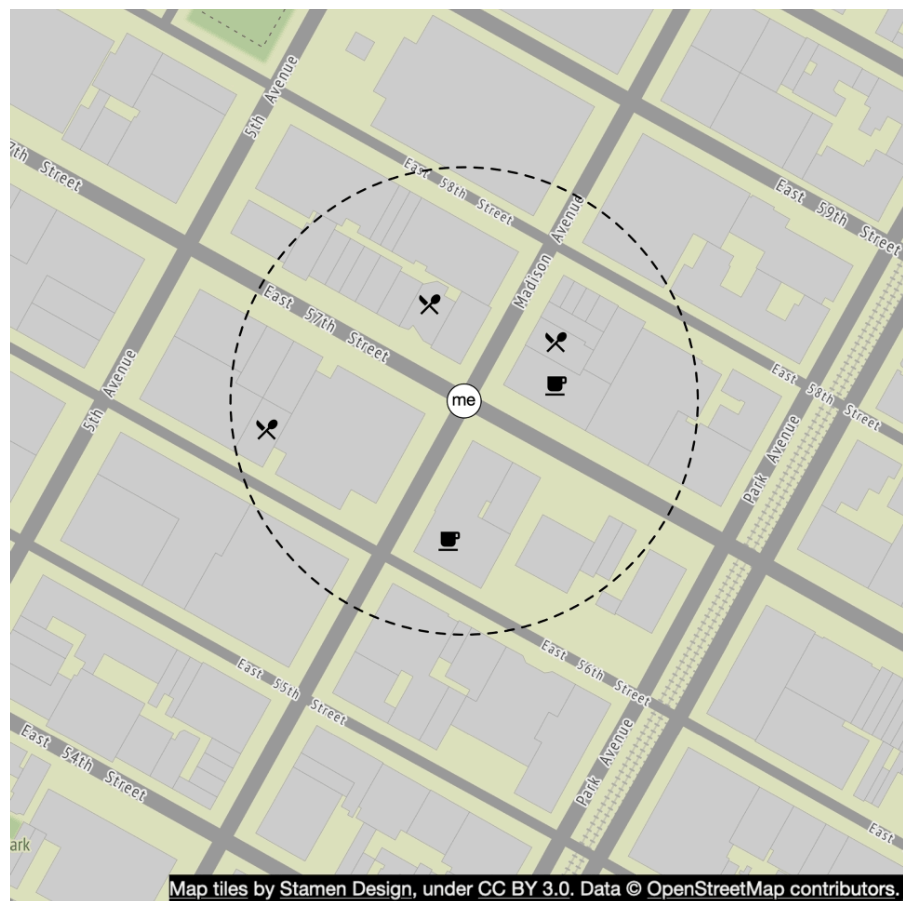
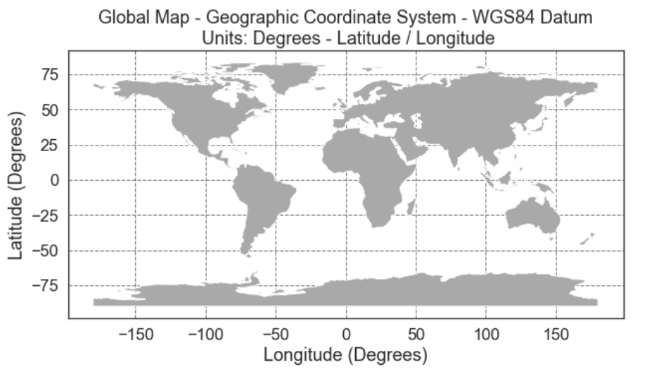
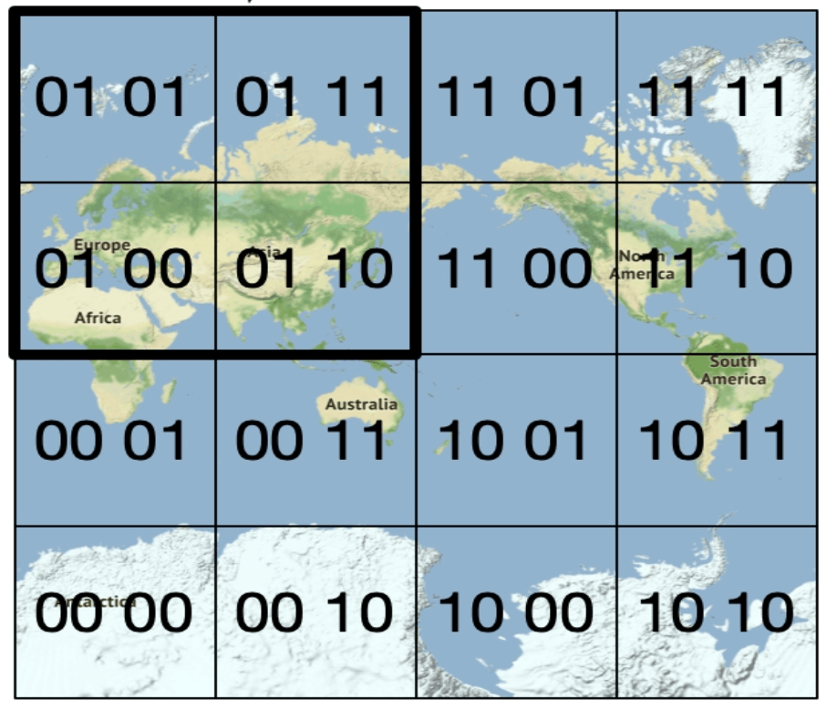
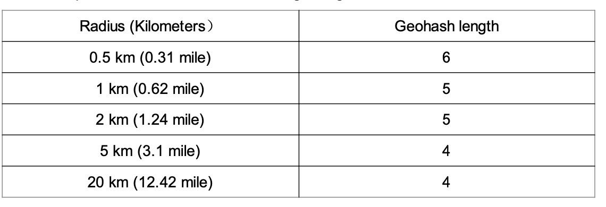
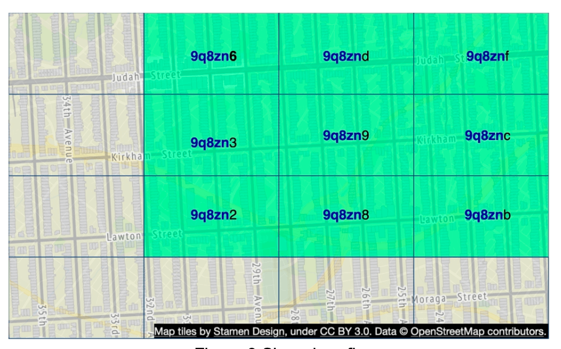
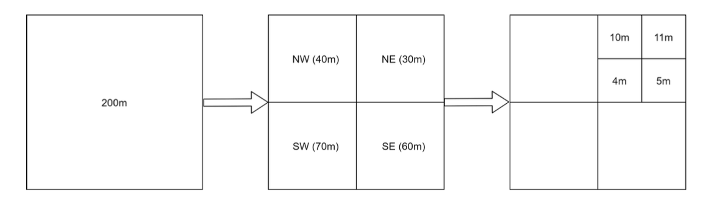
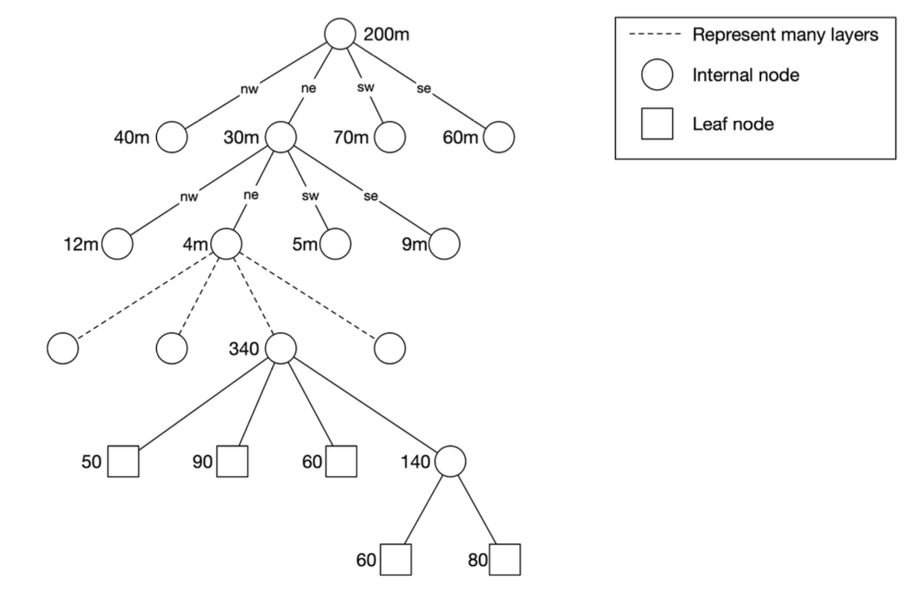
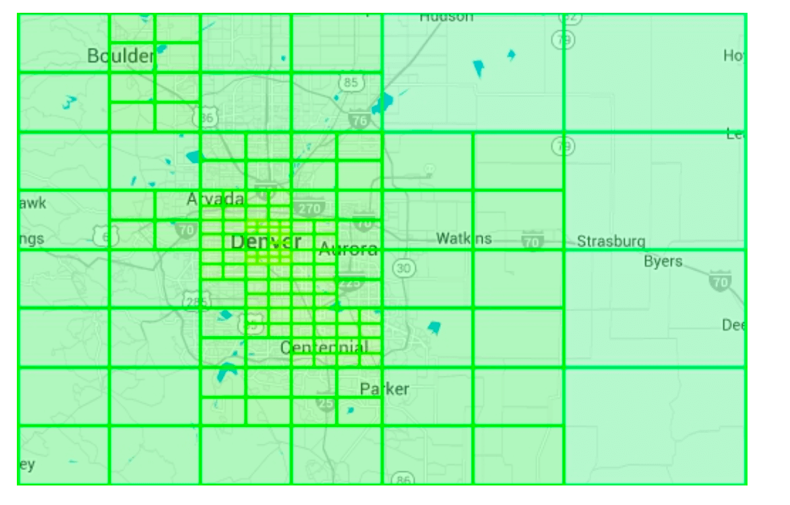
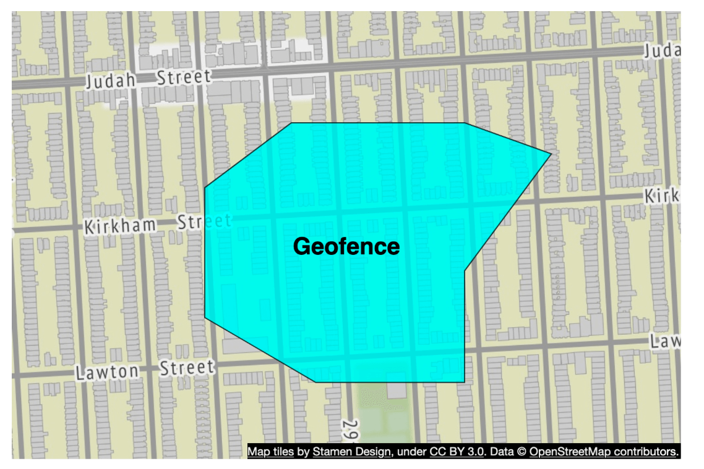

# Chapter 16: Proximity Service

## Introduction
A **proximity service** is designed to find nearby locations, such as restaurants, hotels, gas stations, and other businesses. This functionality is used in applications like **Google Maps** and **Yelp** to help users discover places within a defined radius.


## Step 1: Understanding the Problem and Establishing Scope

### **Functional Requirements**
1. **Search for businesses** based on user location (latitude, longitude) and search radius.
2. **Allow business owners** to add, update, or delete businesses (not real-time).
3. **Provide detailed business information** when requested.

### **Non-Functional Requirements**
- **Low latency**: Users should get quick responses.
- **Data privacy**: Compliance with GDPR and CCPA regulations.
- **High availability**: Handle peak-hour spikes in busy locations.

### **Back-of-the-Envelope Estimation**
- **100 million daily active users**.
- **200 million businesses** in the system.
- **Search QPS Calculation**:
  - Users make **5 searches per day**.
  - **Search QPS** = (100M × 5) / 86,400 ≈ **5,000 QPS**.

---

## Step 2: High-Level Design

### **API Design**
#### **Search Nearby Businesses**
GET /v1/search/nearby

- **Request Parameters**:
  - `latitude`: User’s location latitude.
  - `longitude`: User’s location longitude.
  - `radius`: Search radius (default: 5000m).

#### **Business APIs**
| API Endpoint                     | Description                                      |
|-----------------------------------|--------------------------------------------------|
| `GET /v1/businesses/{id}`         | Fetch detailed business info                    |
| `POST /v1/businesses`             | Add a new business                              |
| `PUT /v1/businesses/{id}`         | Update business details                         |
| `DELETE /v1/businesses/{id}`      | Remove a business from the system               |


### **Data Model**
- Since the read volume is high because two features are very commonly used, a realtional database such as MySQL is a good fit.
  - Search for nearby businesses
  - View the detailed information of a business

### **Data Schema**
- Key Database tables are the business table and the geospatial index table
- The business table consists the detailed information about a business.

### **High-Level System Architecture**
The system comprises of two parts: Location based service (LBS) and business related service.

<div style="margin-left:3rem">
    
</div>

- **Location-Based Service (LBS)**: 
  - Processes location-based search queries.
  - Read-heavy service with no write requests.
  - QPS is high especially during peak hours in dense areas and the system is stateless.
- **Business Service**: Deals with two types of requests.
  - Business owners create, update or delete businesses.
  - Customers view detailed information about a business.
- **Load Balancer**: Routes traffic to LBS and Business service.
- **Database Cluster**: 
  - Uses **primary-replica architecture** for read-heavy workloads.
  - There might be some discrepancy between data read b/w data read by LBS and data written by by primary database.
  - This incosistency is not an issue beacuase the business information is not updated in real-time.


---

## Step 3: Algorithms for Fetching Nearby Businesses

### **Option 1: Two-Dimensional Search (Naive Approach)**

<div style="margin-left:3rem">
    
</div>

The most intuitive way is to draw a circle with pre-defined radius and find all the businesses within the circle.

**SQL Query:**
```
SELECT business_id, latitude, longitude
FROM business
WHERE (latitude BETWEEN :lat - radius AND :lat + radius)
AND (longitude BETWEEN :long - radius AND :long + radius);
```
**Problems:**
- **Inefficient**: Requires scanning the entire database.
- **Limited by one-dimensional indexes** (latitude/longitude).

A potiential improvement is to build index on logitude and latitude columns, alhtough this is slighlty better but still vry slow.

### Better Approach
- The problem with last approach is that the database index can only increase search speed in one dimension.
- An optimal apporach is to reprsent the two-dimensional data into one dimension using geospatial indexing.
  - Hash: Even grid, Geo Hash
  - Tree: Quadtree, Google S2, RTree

  <div style="margin-left:3rem">
    
  </div>


### **Option 2: Evenly Divided Grid**

  <div style="margin-left:3rem">
    
  </div>

- **Divides the world into fixed-size grids**.
- **Issue**: Uneven business distribution (high density in cities, sparse in rural areas).

### **Option 3: Geohash**
- Divide the planet into four quadrants along with the prime meridian and equator. And then divide each grid into four smaller grids. 
- Each grids can be represented by altering b/w longitude and latitude bit.
- Repeat this subdivision

  <div style="margin-left:3rem">
    
    
  </div>


- **Encodes latitude and longitude into a single alphanumeric string**. It has 12 precisions (levels)
- **Hierarchical grid structure** allows for efficient searching.
- The right precision is chosen by using the minimal geohash length according to the table.
  <div style="margin-left:3rem">
    
  </div>
- Geohash guarantees that the longer a shared prefix is between two geohashes, the closer they are.

- **Challenges**:
  <div style="margin-left:3rem">
    
  </div>

  - **Boundary issues** (businesses close to grid edges may get excluded).
    - Two locations can be very close but have no shared prefix at all (can be on other side of equator)
    - Two locations can have a long shared prefix but belong to different geohashes.
  - Solution: Need to search neighboring grids.


### **Option 4: Quadtree**

  A quadtree is a tree data structure that recursively divides a two-dimensional space into four quadrants, with each internal node having exactly four children, representing the four sub-regions of the space.
  - The quadtree is an in-memory data structure and it runs on each LBS server and built on server startup time.

  <div style="margin-left:3rem">
    
  </div>

  - The root node is recursively broken down into 4 quadrants until no nodes are left with more than x number of businesses (100 in this case).

  <div style="margin-left:3rem">
    
  </div>

- The quadtree index doen't take too much memory (typically in GBs) and can easily fit in one server.
- Since tge time complexity to build the tree is nlogn, it might take a few minutes to build the tree.
- **Efficient for k-nearest search queries** (e.g., find the closest gas station).

  <div style="margin-left:3rem">
    
  </div>

#### Operational considerations
 - For around 200 million businesses, it might take few minutes to build a quadtree at the server start time.
 - While the quadtree is built it cannot serve traffic, therefore a new release should be rolled out incrementally to a subset of servers.
 - When updating a business or adding a new the easiest approach is to incrementally rebuild the quadtree. (Leading to a lot of cache invalidation)
 - Also possible to update the quadtree on the fly but more complex to implement. (Needs locking mechanism)

### **Option 5: Google S2**
It maps a sphere to a !D index based on Hilbert curve.Two points that are close to each other on the Hilbert curve are close in 1D space.


  <div style="margin-left:3rem">
    
    
  </div>

- **Divides the earth into small cells using a Hilbert curve**.
- Great for geofencing becuase it can cover arbitrary areas with varying levels.
- Geofencing also allows to define parameters that surround the area of interest.
- Aother advantage if instead of having a fixed level of precision, we can specify min,max level and max cells in S2.


## Tradeoff Comparison 

#### Geohash
- Easy to use and implement- No need to build/rebuild a tree
- Supports fixed radius results
- Updating the index is easy.
- Cannot dynamically adjust the grid size based on population density.

#### Quadtree
- Slightly harder to implement.
- Supports fetching k-nearest businesses.
- Can dynamically adjust the grid size based on population desnsity.
- Updating the index is more complicated as might need to rebuild the whole tree.

---

## Step 4: Scaling the Database and Caching Strategy

### **Scaling the Business Table**
- **Sharding by business ID** ensures even data distribution.
- We have separate rows for each business in the table.

| Geohash | Business ID |
|---------|------------|
| 9q9hvu  | 343        |
| 9q9hvu  | 347        |
| 9q9hvu  | 112        |

### **Scaling the Geospatial Index**
- Might not be a good fit for the geohash table. In this case everything can fit in a single server so there's no tehcnical reason for sharding.
- A better approach is to have read-replicas to help with read loads.


---

### **Cache Strategy**
The most obvious cache key choice is the location coordinate, however it has a few issues:
 - Location coordinates from gps are not accurate.
 - A user can move casuing the location coordinate to change.
 - A better key is the geohash.

| Cache Key  | Cache Value |
|------------|------------|
| `geohash`  | List of business IDs in that grid |
| `business_id` | Business details (name, address, reviews, etc.) |

---

## Step 5: Deployment Strategy and Final Architecture

### **Region and Availability Zones**
- Deploy LBS and Business Service **across multiple regions**.

### **Handling Real-Time Updates**
- **Business updates are batch processed daily**.

### **Final System Architecture**


  <div style="margin-left:3rem">
    
  </div>


This final algorithm looks like this:

## Steps to Retrieve Nearby Businesses
1. **User Request:**  
   - A user searches for restaurants within **500 meters**.  
   - The client sends **latitude (37.776720), longitude (-122.416730), and radius (500m)** to the **load balancer**.

2. **Request Forwarding:**  
   - The **load balancer (LB)** forwards the request to the **Location-Based Service (LBS)**.

3. **Geohash Calculation:**  
   - LBS determines the **geohash length** matching the radius.  
   - Using a reference table, **500m corresponds to geohash length = 6**.

4. **Fetching Neighboring Geohashes:**  
   - LBS calculates **neighboring geohashes** to include nearby areas.  
   - The result is a list:  
     ```
     [my_geohash, neighbor1_geohash, neighbor2_geohash, ..., neighbor8_geohash]
     ```

5. **Fetching Business IDs from Redis:**  
   - For each geohash in the list, LBS queries the **Geohash Redis server** to fetch **business IDs**.  
   - Parallel queries are used to minimize latency.

6. **Retrieving & Ranking Businesses:**  
   - LBS fetches **full business details** from the **Business Info Redis server**.  
   - Businesses are **sorted by distance** from the user’s location.  
   - The **ranked results** are sent back to the client.

## Key Optimizations
- **Parallel Redis Calls**: Reduces response time.  
- **Geohash Indexing**: Ensures efficient spatial queries.  
- **Caching**: Speeds up lookup and retrieval of business data.  

This method ensures **low-latency, scalable** retrieval of businesses near a user’s location.

---

### **Choosing the Best Indexing Method**
| Indexing Method | Pros | Cons |
|----------------|------|------|
| **Geohash** | Easy to implement, efficient for proximity search | Boundary issues, fixed grid size |
| **Quadtree** | Dynamically adjusts to density, supports k-nearest queries | More complex, requires tree rebalancing |
| **Google S2** | Advanced geofencing, used in Google Maps | Harder to implement |

---

## References
1. [Geohash Algorithm](https://www.movable-type.co.uk/scripts/geohash.html)
2. [Quadtree Indexing](https://en.wikipedia.org/wiki/Quadtree)
3. [Google S2 Geometry](https://s2geometry.io/)

---

## Most Asked Interview Questions

**Q1. What geospatial indexing techniques are used for proximity search? Compare Geohash, Quadtree, and Google S2.**
> Geohash: divides the world into a grid using a Base32 string; nearby cells share a prefix, enabling prefix-based DB queries. Quadtree: recursively subdivides 2D space into 4 quadrants until each cell has ≤ N points — adaptive to data density. Google S2: projects Earth onto a cube face, uses Hilbert curve for space-filling locality — excellent for spherical distance calculations. Geohash is easiest to implement; S2 is most accurate for large geographic areas.

**Q2. How does Geohash work? What are its precision levels and limitations?**
> Geohash encodes latitude/longitude into a Base32 string. The longer the string, the smaller the cell: 1 char ≈ 5000km², 6 chars ≈ 1.2km², 9 chars ≈ 4.8m². Adjacent cells share a common prefix in most cases. Limitation: boundary issue — two nearby points can be in different Geohash cells with different prefixes (near a cell boundary). Solution: search the target cell + its 8 neighbors.

**Q3. How do you handle the boundary edge case where a business sits near a Geohash cell boundary?**
> Query not just the target cell but also all 8 adjacent cells (a 3×3 grid). Geohash neighbors can be computed algorithmically in O(1) per neighbor. Filter results to only include points within the actual desired radius using Haversine distance. This eliminates the false-negative issue where a nearby business falls just outside the target cell.

**Q4. What is a Quadtree and how does it differ from Geohash for proximity search?**
> A Quadtree recursively splits the bounding box into 4 quadrants until each quadrant has ≤ N businesses (e.g., 100). Cells are smaller in dense areas (Manhattan) and larger in sparse areas (Montana) — adaptive unlike Geohash's uniform grid. Searching: start at root, recurse into quadrants intersecting the search circle. Quadtrees are better for non-uniform data density; Geohash is simpler to implement with standard DB indexing.

**Q5. How does Redis Geo support geo-indexing and range queries?**
> Redis Geo uses a sorted set internally where each element's score is its Geohash-encoded coordinate. Commands: `GEOADD` to add a location, `GEODIST` for distance between two points, `GEORADIUS`/`GEOSEARCH` to find all points within a given radius. Sub-millisecond for millions of businesses. Redis Geo is ideal for the "nearby businesses" query when the dataset fits in memory (typically yes for business locations).

**Q6. How would you design the API for finding nearby businesses?**
> `GET /api/v1/search?lat=37.7749&lng=-122.4194&radius=500&category=restaurant&limit=20&page_token=xxx` → returns `{businesses: [...], next_page_token}`. Always validate: lat/lng within valid ranges, radius within maximum (e.g., 50km), limit ≤ 100. Use cursor-based pagination for consistent results as businesses are updated. Response includes business_id, name, distance, address, rating.

**Q7. How do you cache business data for proximity queries efficiently?**
> Cache at two levels: (1) Geohash-level cache: `cache[geohash_prefix_6char] → [business_ids_in_cell]` with TTL. Since businesses rarely change, this cache has a high hit rate. (2) Business data cache: `cache[business_id] → full_business_object`. The first cache gives you the IDs; the second gives you the data. User location is private and should NOT be cached. Geohash cells are a public geographic concept with no privacy concerns.

**Q8. What is Google S2 Geometry and what problems does it solve that Geohash cannot?**
> S2 projects the Earth's surface onto 6 cube faces using a space-filling Hilbert curve. This gives: (1) consistent cell sizes at all latitudes (Geohash cells distort near the poles); (2) efficient coverage of arbitrary regions with a small number of cells; (3) accurate great-circle distance calculations. S2 is used by Google Maps, Foursquare, and Uber. Its main disadvantage vs. Geohash: more complex to implement.

**Q9. How would you handle replication of location data across geographic regions?**
> Business location data (addresses, coordinates) rarely changes → write-through cache with long TTL. Replicate the business DB to multiple regions with asynchronous replication (10–100ms lag acceptable). Users searching in Tokyo query the Tokyo replica. Business updates use the primary writer and sync to replicas. Since this is not real-time location (like ride-sharing), multi-second replication lag is acceptable.

**Q10. What non-functional requirements are most critical for a proximity service?**
> (1) Low latency: responses within 200ms even at 100M DAU — drives cache-first architecture; (2) High availability: 99.99% — read-heavy and easily replicated service; (3) Data privacy: user location is sensitive — never log raw coordinates beyond what's needed (GDPR/CCPA); (4) Eventual consistency: OK for business data (rarely updated); (5) Scalability: horizontal scale on all layers.

**Q11. What is the difference between static proximity search (businesses) and dynamic (real-time users)?**
> Static: business locations are fixed or change rarely → can be cached aggressively, pre-indexed. Dynamic: user/driver locations update every few seconds → must use time-bucketed indexes (e.g., skip old location updates), cannot cache user positions, requires streaming ingestion pipeline (often in-memory, not on-disk). Proximity Service uses static data; Nearby Friends uses dynamic.

**Q12. How do you handle the scenario where a business is temporarily closed?**
> Store `is_temporarily_closed` and `opening_hours` per business as part of the business metadata. On search results, the business is still returned (it exists and is nearby), but the `is_open_now` flag is computed server-side based on the current time vs. opening hours. Clients display "Open" vs "Closes at 10PM". This keeps the search index simple while providing accurate status at display time.

**Q13. How does the proximity service handle searches with different search radii?**
> Use a geohash of the appropriate precision for the search radius: 1km radius → 6-char geohash (cell ~1.2km²) + neighbors; 10km radius → 5-char geohash (cell ~38km²) + neighbors; 50km radius → 4-char (cell ~635km²). Select the geohash precision that minimizes false positives while guaranteeing all relevant businesses are in the covered cells. Post-filter by exact distance (Haversine) to trim false positives.

**Q14. How would you implement fuzzy search for business names within proximity?**
> Combine proximity filter + name search: (1) Apply geospatial filter to get candidate business IDs in the radius; (2) Filter candidates by name substring or Elasticsearch fuzzy match; (3) Return intersection. If the candidate set is small (<1000 businesses within radius), do in-memory string matching. For larger areas, push both filters to Elasticsearch: use `geo_distance` filter + `match` query combined in a single bool query.

**Q15. How do you scale the business location DB for 200M businesses across 100M DAU?**
> Shard the business DB by geo-region (country or continent). Each shard handles a geographic slice of the world. Users searching in Europe query the European shard. Within each shard, index on Geohash prefix for fast prefix-range queries. Add Redis Geo cache per region for hot-area queries. Read replicas per shard handle the high read load (proximity search is almost exclusively reads).

**Q16. What is the Haversine formula and when is it used in proximity search?**
> The Haversine formula calculates the great-circle distance between two points on Earth given their lat/lng: `d = 2r × arcsin(√(sin²(Δlat/2) + cos(lat1)cos(lat2)sin²(Δlng/2)))`. Used as a post-filter: after Geohash pulls candidate businesses, Haversine computes exact distances to discard false positives outside the exact radius circle. Quick to compute in code; used for every candidate within the candidate set.

**Q17. How would you handle a Yelp-like feature where user reviews affect search ranking?**
> After proximity filter, rank results by a score combining: `distance (-weight) + rating (weight) + review_count (log scale weight) + price_level_match + user_preferences`. Store pre-computed ranking factors in the business metadata cache. The ranking function is applied in the API server after fetching candidate businesses from the Geohash index. For personalization, add user history signals (categories of previously visited places).

**Q18. How does Uber use proximity search for matching riders to drivers?**
> Drivers continuously update their location (every few seconds) in a geospatial index (Redis Geo or in-memory grid). On a ride request, the dispatch service queries nearby available drivers within a radius using Redis GEOSEARCH. Candidates are ranked by ETA (distance × estimated traffic). Unlike business search, this is real-time dynamic location — the index is updated and queried thousands of times per second globally.

**Q19. How do you design the data model for a proximity service?**
> Businesses table: `{business_id, name, address, lat, lng, geohash_6, category, rating, is_open, phone, ...}`. Index on `geohash_6` prefix for range queries. Redis Geo: `{key="businesses:geohash_4char", members: [(business_id, lat, lng), ...]}` for fast GEOSEARCH. The DB is the source of truth; Redis is the hot read cache. Updates to business info: update DB first, invalidate/update Redis cache.

**Q20. What is the difference between "search within X km" and "search for nearest N businesses"?**
> Search within X km: return all businesses within a fixed radius (may return 0 or 1000). Search for nearest N: return exactly N closest businesses regardless of distance (may be far). For a restaurant search, "within 1km" is more useful (user wants nearby options). For taxi dispatch, "nearest 5 available drivers" is more useful. The proximity service supports both via Geohash radius search or top-K ordered by distance.

**Q21. How would you add a "favorites" or bookmarks feature to a proximity service?**
> Store user bookmarks in a separate table: `{user_id, business_id, created_at}`. When the user searches, optionally join with bookmarks to annotate results with `is_favorited: true`. Allow the "Search my favorites nearby" filter: filter the candidate set to only bookmarked businesses before distance sorting. Store bookmark counts per business for "popularity among your network" signals.

**Q22. How do you handle coordinate precision and floating-point issues?**
> Store lat/lng as `DECIMAL(9,6)` (precision to ~11cm) or as DOUBLE in the DB. Don't use FLOAT (only 7 significant digits — ~meter precision). When computing Geohash, use a library (e.g., geohash-js) to ensure correct encoding. Haversine computation needs double precision floating point. Avoid rounding coordinates before storage — round only at display time (2 decimal places shown to user).

**Q23. How do you ensure privacy compliance when storing user search locations?**
> (1) Never persist raw user coordinates with user identity in hot logging — use approximate/fuzzy location for analytics; (2) Encrypt stored coordinates at rest; (3) Implement data retention: delete precise location logs after 24 hours; (4) Provide user control: allow users to disable location history; (5) Comply with GDPR data localization: EU user location data stored in EU regions; (6) Use coarse-grain coordinates (1km precision) for analytics to protect privacy.

**Q24. How do you implement the business owner admin API (add/update/delete businesses)?**
> Authenticated API (business owner must verify ownership via email, phone, or official records). `POST /api/v1/businesses` → create new business (triggers async index update). `PUT /api/v1/businesses/{id}` → update (cache invalidation + Geohash re-index if location changed). `DELETE /api/v1/businesses/{id}` → soft delete (mark inactive, remove from Geohash index). Business record format updates: schema-versioned to allow backward compatibility.

**Q25. What happens if the user's location permission is denied on mobile?**
> Fallback strategy: (1) Use IP geolocation (city-level accuracy via MaxMind or similar); (2) Prompt user to manually enter a city or zip code; (3) Default to a popular/global city; (4) Use last-known location from a previous session (stored locally, with user consent). Display a notice to the user: "Using approximate location based on your IP" so they understand the reduced accuracy.

**Q26. How would you build a multi-category search filter (restaurants AND coffee shops)?**
> Store categories as a set on each business record. Index categories in Elasticsearch alongside Geohash. Support multi-category: `categories: [restaurant, coffee]` → ES `terms` query on category field within geo_distance filter. UI filter chips combine with AND/OR logic. For Redis Geo (single-category), run parallel GEOSEARCH queries per category and merge + dedup client-side — acceptable for small category lists.

**Q27. What does a complete proximity service architecture look like?**
> Client (mobile/web) → Load Balancer → Proximity API servers → Redis Geo (hot Geohash cache, fast GEOSEARCH) → Business DB (PostgreSQL, sharded by geo-region, authoritative store). Write path: Business Owner Admin → Business Service → PostgreSQL update + Redis Geo update + Elasticsearch index update. Read path: Location search → Redis GEOSEARCH → batch fetch business metadata from Redis/DB → Haversine filter → rank → respond. Monitoring: geo-query latency, Redis hit rate, Geohash cache coverage.


