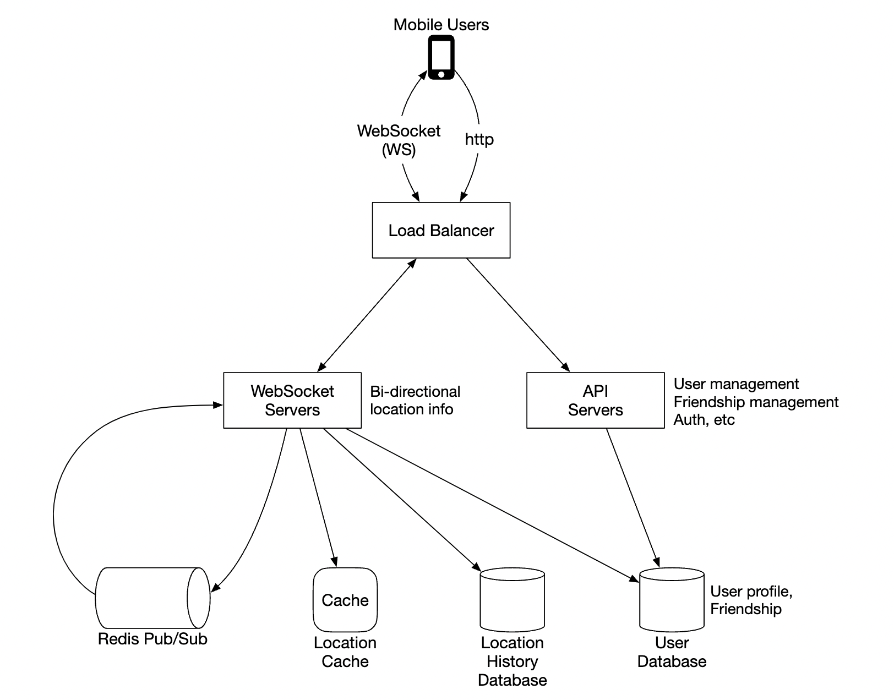
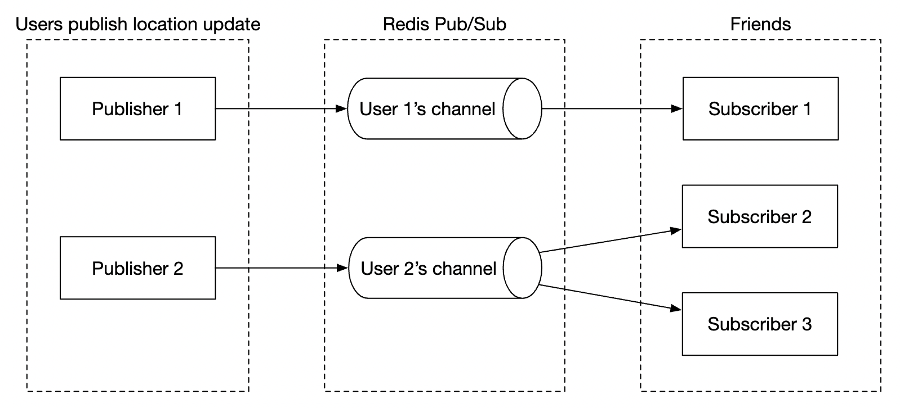
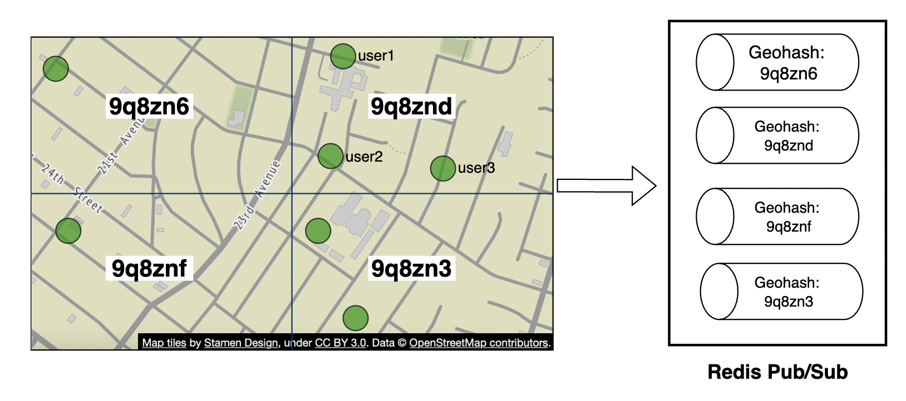
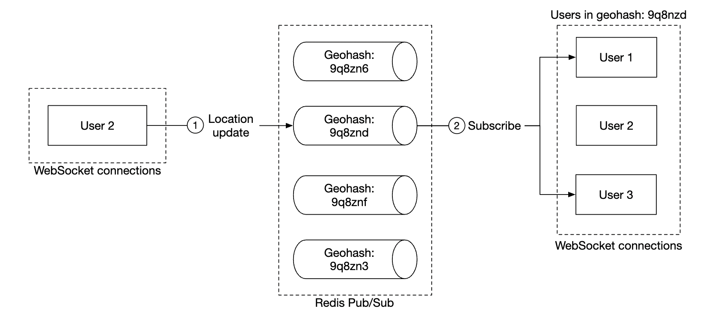
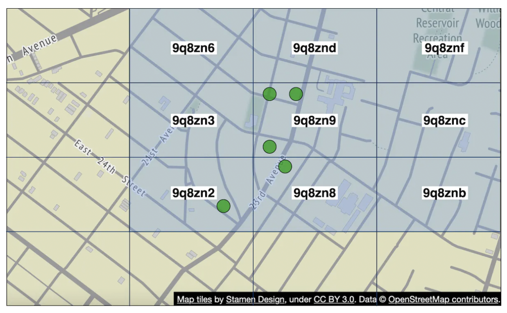

# Chapter 17: Nearby Friends

## Introduction

This chapter focuses on designing a scalable backend for an application which enables user to share their location and discover friends who are **nearby**.

The major difference with the proximity chapter is that in this problem, **locations constantly change**, whereas in that one, business addresses more or less stay the same.

---

## Step 1: Understand the Problem and Establish Design Scope

Some questions to drive the interview:
 * C: How geographically close is considered to be "nearby"?
 * I: 5 miles, this number should be configurable
 * C: Is distance calculated as straight-line distance vs. taking into consideration eg a river in-between friends
 * I: Yes, that is a reasonable assumption
 * C: How many users does the app have?
 * I: 1bil users and 10% of them use the nearby friends feature
 * C: Do we need to store location history?
 * I: Yes, it can be valuable for eg machine learning
 * C: Can we assume inactive friends will disappear from the feature in 10min
 * I: Yes
 * C: Do we need to worry about GDPR, etc?
 * I: No, for simlicity's sake

### **Functional requirements**

 * Users should be able to see nearby friends on their mobile app. Each friend has a distance and timestamp, indicating when the location was updated
 * Nearby friends list should be updated every few seconds

### **Non-functional requirements**

- **Low latency**: it's important to receive location updates without too much delay
- **Reliability**: Occassional data point loss is acceptable, but system should be generally available
- **Eventual consistency**: Location data store doesn't need strong consistency. Few seconds delay in receiving location data in different replicas is acceptable

### **Back-of-the-envelope**

Some estimations to determine potential scale:
 * Nearby friends are friends within 5mile radius
 * Location refresh interval is 30s. Human walking speed is slow, hence, no need to update location too frequently.
 * On average, 100mil users use the feature every day \w 10% concurrent users, ie 10mil
 * On average, a user has 400 friends, all of them use the nearby friends feature
 * App displays 20 nearby friends per page
 * **Location Update QPS** = 10mil / 30 == ~334k updates per second

---

## Step 2: Propose High-Level Design and Get Buy-In

Before exploring API and data model design, we'll study the communication protocol we'll use as it's less ubiquitous than traditional request-response communication model.

### **High-level design**

At a high-level we'd want to establish effective message passing between peers. This can be done via a peer-to-peer protocol, but that's not practical for a mobile app with flaky connection and tight power consumption constraints.

A more practical approach is to use a shared backend as a fan-out mechanism towards friends you want to reach:

    

What does the backend do?
 * Receives location updates from all active users
 * For each location update, find all active users which should receive it and forward it to them
 * Do not forward location data if distance between friends is beyond the configured threshold

This sounds simple but the challenge is to design the system for the scale we're operating with.

We'll start with a simpler design at first and discuss a more advanced approach in the deep dive:

    

- **Load balancer**: spreads traffic across rest API servers as well as bidirectional web socket servers
- **Rest API servers**: handles auxiliary tasks such as managing friends, updating profiles, etc
- **Websocket servers**: stateful servers, which forward location update requests to respective clients. It also manages seeding the mobile client with nearby friends locations at initialization (discussed in detail later).
- **Redis location cache**: used to store most recent location data for each active user. There is a TTL set on each entry in the cache. When the TTL expires, user is no longer active and their data is removed from the cache.
- **User database**: stores user and friendship data. Either a relational or NoSQL database can be used for this purpose.
- **Location history database**: stores a history of user location data, not necessarily used directly within nearby friends feature, but instead used to track historical data for analytical purposes
- **Redis pubsub**: used as a lightweight message bus which enables different topics for each user channel for location updates.

    

In the above example, websocket servers subscribe to channels for the users which are connected to them & forward location updates whenever they receive them to appropriate users.

### **Periodic location update**

Here's how the periodic location update flow works:

    

 * Mobile client sends a location update to the load balancer
 * Load balancer forwards location update to the websocket server's persistent connection for that client
 * Websocket server saves location data to location history database
 * Location data is updated in location cache. Websocket server also saves location data in-memory for subsequent distance calculations for that user
 * Websocket server publishes location data in user's channel via redis pub sub
 * Redis pubsub broadcasts location update to all subscribers for that user channel, ie servers responsible for the friends of that user
 * Subscribed web socket servers receive location update, calculate which users the update should be sent to and sends it

Here's a more detailed version of the same flow:

    

On average, there's going to be 40 location updates to forward as a user has 400 friends on average and 10% of them are online at a time.

### **API Design**

Websocket Routines we'll need to support:
 * periodic location update - user sends location data to websocket server
 * client receives location update - server sends friend location data and timestamp
 * websocket client initialization - client sends user location, server sends back nearby friends location data
 * Subscribe to a new friend - websocket server sends a friend ID mobile client is supposed to track eg when friend appears online for the first time
 * Unsubscribe a friend - websocket server sends a friend ID, mobile client is supposed to unsubscribe from due to eg friend going offline

HTTP API - traditional request/response payloads for auxiliary responsibilities.

### **Data model**

 * The location cache will store a mapping between `user_id` and `lat,long,timestamp`. Redis is a great choice for this cache as we only care about current location and it supports TTL eviction which we need for our use-case.
 * Location history table stores the same data but in a relational table \w the four columns stated above. Cassandra can be used for this data as it is optimized for write-heavy loads.

---

## Step 3: Design Deep Dive

Let's discuss how we scale the high-level design so that it works at the scale we're targetting.

### **How well does each component scale?**

- **API servers**: can be easily scaled via autoscaling groups and replicating server instances
- **Websocket servers**: we can easily scale out the ws servers, but we need to ensure we gracefully shutdown existing connections when tearing down a server. Eg we can mark a server as "draining" in the load balancer and stop sending connections to it, prior to being finally removed from the server pool
- **Client initialization**: when a client first connects to a server, it fetches the user's friends, subscribes to their channels on redis pubsub, fetches their location from cache and finally forwards to client
- **User database**: We can shard the database based on user_id. It might also make sense to expose user/friends data via a dedicated service and API, managed by a dedicated team
- **Location cache**: We can shard the cache easily by spinning up several redis nodes. Also, the TTL puts a limit on the max memory we could have taken up at a time. But we still want to handle the large write load
- **Redis pub/sub server**: we leverage the fact that no memory is consumed if there are channels initialized but are not in use. Hence, we can pre-allocate channels for all users who use the nearby friends feature to avoid having to deal with eg bringing up a new channel when a user comes online and notifying active websocket servers

### **Scaling deep-dive on redis pub/sub component**

We will need around 200gb of memory to maintain all pub/sub channels. This can be achieved by using 2 redis servers with 100gb each.

Given that we need to push ~14mil location updates per second, we will however need at least 140 redis servers to handle that amount of load, assuming that a single server can handle ~100k pushes per second.

Hence, we'll need a distributed redis server cluster to handle the intense CPU load.

In order to support a distributed redis cluster, we'll need to utilize a service discovery component, such as zookeeper or etcd, to keep track of which servers are alive.

What we need to encode in the service discovery component is this data:

    

Web socket servers use that encoded data, fetched from zookeeper to determine where a particular channel lives. For efficiency, the hash ring data can be cached in-memory on each websocket server.

In terms of scaling the server cluster up or down, we can setup a daily job to scale the cluster as needed based on historical traffic data. We can also overprovision the cluster to handle spikes in loads.

The redis cluster can be treated as a stateful storage server as there is some state maintained for the channels and there is a need for coordination with subscribers so that they hand-off to newly provisioned nodes in the cluster.

We have to be mindful of some potential issues during scaling operations:
 * There will be a lot of resubscription requests from the web socket servers due to channels being moved around
 * Some location updates might be missed from clients during the operation, which is acceptable for this problem, but we should still minimize it from happening. Consider doing such operation when traffic is at lowest point of the day.
 * We can leverage consistent hashing to minimize amount of channels moved in the event of adding/removing servers

    

### **Adding/removing friends**

Whenever a friend is added/removed, websocket server responsible for affected user needs to subscribe/unsubscribe from the friend's channel.

Since the "nearby friends" feature is part of a larger app, we can assume that a callback on the mobile client side can be registered whenever any of the events occur and the client will send a message to the websocket server to do the appropriate action.

### **Users with many friends**

We can put a cap on the total number of friends one can have, eg facebook has a cap of 5000 max friends.

The websocket server handling the "whale" user might have a higher load on its end, but as long as we have enough web socket servers, we should be okay.

### **Nearby random person**

What if the interviewer wants to update the design to include a feature where we can occasionally see a random person pop up on our nearby friends map?

One way to handle this is to define a pool of pubsub channels, based on geohash:

    

Anyone within the geohash subscribes to the appropriate channel to receive location updates for random users:

    

We could also subscribe to several geohashes to handle cases where someone is close but in a bordering geohash:

    

### **Alternative to Redis pub/sub**

An alternative to using Redis for pub/sub is to leverage Erlang - a general programming language, optimized for distributed computing applications.

With it, we can spawn millions of small, erland processes which communicate with each other. We can handle both websocket connections and pub/sub channels within the distributed erlang application.

A challenge with using Erlang, though, is that it's a niche programming language and it could be hard to source strong erlang developers.

---

## Step 4: Wrap Up

We successfully designed a system, supporting the nearby friends features.

Core components:
- **Web socket servers**: real-time comms between client and server
- **Redis**: fast read and write of location data + pub/sub channels

We also explored how to scale restful api servers, websocket servers, data layer, redis pub/sub servers and we also explored an alternative to using Redis Pub/Sub. We also explored a "random nearby person" feature.

---

## Most Asked Interview Questions

**Q1. How is the "Nearby Friends" problem different from the "Proximity Service"?**
> Proximity Service finds static locations (businesses that don't move). Nearby Friends handles dynamic locations — users update their position every 30 seconds. This means: (1) No aggressive caching (positions become stale in seconds, not hours); (2) Streaming write pipeline needed to ingest millions of updates/sec; (3) The index must support efficient "here are my friends' current positions" query, not just "what's near lat/lng X".

**Q2. How do you efficiently handle real-time location updates for millions of users?**
> Client sends location update every 30s → API server (or WebSocket server) receives the update → writes to Redis (HSET user:{id} lat lng updated_at) for fast current-position lookup → also publishes update to a Pub/Sub channel per user. Workers fan out the update to all friends of the user. The hot path (receive update → Redis write → publish) must complete in <10ms.

**Q3. What is the role of WebSocket in a Nearby Friends feature?**
> WebSocket maintains a persistent bidirectional connection between the mobile app and the server. The client sends location updates (client→server) and receives friends' location changes (server→client) on the same connection. Without WebSocket, clients would need to poll every 30 seconds — 100M users × polling would generate enormous unnecessary traffic. WebSocket also enables truly low-latency delivery of friend location changes.

**Q4. How does Redis Pub/Sub work and how is it used for location update propagation?**
> Redis Pub/Sub: publishers send messages to a named channel; all subscribers to that channel receive the message immediately. In Nearby Friends: when user A's location changes, a worker publishes to channel `user:A:location`. All of A's friends who are currently active have WebSocket servers subscribed to `user:A:location`. Those servers push the new position to friends' WebSocket connections.

**Q5. How would you calculate distance between users without checking every user?**
> Use Geohash indexed in Redis Geo: store each active user's position with `GEOADD active_users user_id lat lng`. To find all users within 5 miles: `GEOSEARCH active_users FROMLONLAT lat lng 5 mi ASC`. This leverages the Geohash spatial index internally — O(log N + K) per query. Then intersect with the user's friend list (stored in a separate cache) to show only friends.

**Q6. How do you handle user privacy in a Nearby Friends feature?**
> Opt-in only: the feature is disabled by default; users must explicitly enable it. Users can pause location sharing without disabling the feature. Configurable visibility: share with all friends, select friends only, or no one. Location is never stored persistently — only current position in Redis with short TTL (5 minutes). Users can view who can see their location. Never share location with non-friends regardless of proximity.

**Q7. How would you store user location history for features like "path replay"?**
> Write each location event to a time-series database (InfluxDB, TimescaleDB, or Cassandra with `(user_id, timestamp)` partition key). Keep only authorized duration (e.g., 7 days max per user consent). Data model: `{user_id, timestamp BIGINT, lat DOUBLE, lng DOUBLE}`. Queries: "show user A's path on April 15" = range scan by `(user_id, date_range)`. This is separate from the real-time location (Redis) — Redis is volatile; history is durable.

**Q8. What happens when the Redis Pub/Sub server goes down?**
> Redis Pub/Sub is in-memory and loses all messages on crash. Mitigation: (1) Use Redis Cluster for high availability; (2) Fall back to polling (every 30s) when WebSocket/Pub/Sub is unavailable — graceful degradation; (3) Use a durable alternative like Kafka for location updates (messages are persisted) with a consumer that feeds the Pub/Sub delivery to WebSocket servers. Alert on Pub/Sub server failure immediately.

**Q9. How do you scale WebSocket servers that maintain persistent connections for location sharing?**
> WebSocket connections are stateful (tied to a specific server). Scale via: (1) Consistent hashing at the load balancer — route user A's connection always to server S (sticky routing); (2) Each WebSocket server subscribes to Pub/Sub channels for the users it hosts; (3) Scale by adding more WebSocket servers; (4) Use a service registry (etcd/ZooKeeper) so Pub/Sub message routers know which server hosts which user's connection.

**Q10. How would you design the data model for storing friend location updates efficiently?**
> Redis: `HSET user:{id}:location lat {lat} lng {lng} updated_at {ts}` — O(1) read/write. Redis Geo: `GEOADD active_users {lat} {lng} {user_id}` for spatial queries. Friend graph: `SMEMBERS user:{id}:friends` → set of friend_ids. Location TTL: `EXPIRE user:{id}:location 300` (5 min auto-expire when user goes inactive). Pub/Sub channel per user: `user:{id}:location_updates`.

**Q11. How do you handle users who are inactive or have turned off location sharing?**
> When location sharing is paused/disabled: (1) Stop publishing location updates to Pub/Sub; (2) Remove user from Redis Geo active set; (3) Set TTL on their Redis location hash — it expires after 5 minutes of inactivity; (4) Publish a "user offline" event to friends so their UI shows the friend as "location unavailable" instead of stale coordinates. Friends see "Last seen near X" or nothing, depending on the user's privacy settings.

**Q12. How would you implement the "random nearby person" feature safely?**
> Show only users who have explicitly opted into this feature (separate consent from nearby friends). Show approximate location (rounded to ~500m), not exact. Never reveal username or profile until both parties match (double opt-in: both must want to meet). Rate-limit discovery requests to prevent abuse. Consider ephemeral matching (connections expire after 24h unless confirmed).

**Q13. How do you handle location updates when a user is briefly offline (phone in tunnel)?**
> Client buffers location updates locally when offline. On reconnect: (1) If offline was brief (<5 minutes), send the latest buffered position; (2) If offline was long (>5 minutes), don't replay all buffered positions — just send the current one; friends don't care about your past positions, only your current one. Remove the user from the active Redis Geo set after TTL expiry during the offline period.

**Q14. What is the frequency of location updates and how do you balance accuracy vs. battery life?**
> Default: update every 30 seconds (good balance). Adaptive: update every 5–10s when actively moving (accelerometer detects motion); reduce to 60–120s when stationary (GPS drain is unnecessary). Use significant-location-change API on iOS (free) to trigger updates only when the user has moved meaningfully. This reduces battery drain by 70–80% vs. fixed 30s GPS polling.

**Q15. How do you prevent a server from being overwhelmed by location update storms?**
> If 10M users all go online simultaneously (e.g., at 9 AM): (1) Client-side jitter: randomize the first update delay by 0–30 seconds so updates don't all arrive at second 0; (2) Rate limit per user at the API layer (max 1 update per 15s); (3) Batch Redis writes using pipelining (100 updates per pipeline call); (4) Kafka absorbs burst writes; downstream Pub/Sub workers consume at steady rate.

**Q16. How does the application determine which friends to show on the map?**
> Fetch the user's friend list (from a social graph service or friends DB). For each friend with location sharing enabled, fetch their current position from Redis. Filter to those within the user's configured distance (e.g., 5 miles). Return the subset of friends who are active + nearby. Avoid querying all 1,000 friends' positions — only query friends whose Pub/Sub updates have been received in the current session (subscription-based push reduces polling entirely).

**Q17. How do you handle the case where a user has 10,000 friends (influencer-level follow)?**
> Fan-out on write (write to all 10,000 friends' WebSocket servers) requires 10,000 Pub/Sub deliveries per location update. At 1 update per 30s, one popular user generates 333/sec × 10,000 = 333K WS pushes/sec. Mitigation: (1) Cap Nearby Friends feature at a lower follow count (e.g., only bidirectional friends, not one-way follows); (2) Fan-out on read: friends pull the influencer's position periodically instead of being pushed; (3) Limit the feature to mutual friends only.

**Q18. What is the difference between Redis Pub/Sub and Kafka for this use case?**
> Redis Pub/Sub: in-memory, zero-persistence, extremely low latency (<1ms), messages lost if subscriber is disconnected. Kafka: durable, consumers can replay missed messages, higher latency (5–10ms), more operational complexity. For location updates, Redis Pub/Sub is preferred — a slightly missed location update is tolerable (next update arrives in 30s anyway). If durability is needed (audit trail, path history), write to both Kafka (durable) and Redis Pub/Sub (real-time delivery).

**Q19. How do you display approximate vs. exact location to protect privacy?**
> Round the displayed coordinates to the nearest 300–500 meters (truncate last decimal digits). "Near Central Park" vs. "40.7829° N, 73.9654° W". This is a product/UX decision: mutual close friends may see higher precision, acquaintances lower. The server-side Redis stores exact coordinates; the API response applies precision rounding based on the requesting user's relationship level to the target user.

**Q20. How do you detect and alert on unusual location patterns (anomaly detection)?**
> Track the user's movement speed: if a user "jumps" from New York to Tokyo in 10 seconds (impossible physical movement), flag as GPS spoofing or device error. Discard the anomalous update. Alert if a user's location becomes unavailable while they were last seen in a high-risk area (safety feature). Speed-based filtering: `if (distance/time_interval > 200 mph) → discard or flag`.

**Q21. How do you build the "Nearby Friends" feature for a new user with no friends?**
> Cold-start: new users with no friends see an empty map. Solutions: (1) Onboarding: suggest adding contacts from phone book; (2) Show public events nearby as a fallback; (3) "Random nearby person" opt-in feature (separate from friends). The friends graph must be populated first — no special engineering needed for the Nearby Friends feature itself for new users.

**Q22. How do you handle different timezones in last seen / activity timestamps?**
> Store all timestamps in UTC in the backend. Convert to user's local timezone at display time on the client (use the device's timezone setting). "Last seen 5 minutes ago" is a relative time computed client-side from the UTC timestamp. Never store local time in the DB — it causes confusion during daylight saving time transitions and across geographic regions.

**Q23. What is the WebSocket connection lifecycle in the Nearby Friends app?**
> App foreground: establish WebSocket connection → authenticate (JWT) → start sending location updates + receiving friend updates. App background (iOS/Android): OS may kill WebSocket after a few minutes → fall back to silent push notifications to "wake" the app for critical updates. App killed: connection closes; server detects via WebSocket close event → removes user from active set → publishes "user offline" event.

**Q24. How do you load test the Nearby Friends system before launch?**
> Simulate N virtual users sending location updates every 30 seconds with a distributed load testing tool (k6, Locust, Gatling). Increase N gradually (10K → 100K → 1M). Monitor: (1) WebSocket server CPU/memory; (2) Redis command latency (should stay <1ms); (3) Pub/Sub message delivery rate; (4) WebSocket server connection count vs. max; (5) Queue depth for async fanout workers. Identify the bottleneck before it affects real users.

**Q25. How would you implement "group nearby friends" — showing friends of friends within a radius?**
> Fetch user's friend list → for each friend, fetch their friend list (second-hop) → deduplicate → filter to those within radius + with appropriate privacy settings. This is a BFS expansion of the social graph to depth 2. Cache the second-hop friend graph (changes rarely). Apply privacy check: second-degree friends are shown at lower precision (city-level) than direct friends. Limit to 100 second-degree friends to avoid graph explosion.

**Q26. How do you compress location update payloads for mobile efficiency?**
> Location updates are tiny: `{user_id: 8 bytes, lat: 4 bytes, lng: 4 bytes, timestamp: 8 bytes}` = 24 bytes per message. Over WebSocket, use binary protocol (MessagePack, Protocol Buffers) instead of JSON → 40–60% size reduction. Delta encoding: instead of absolute lat/lng, send the offset from the last position (usually small numbers) → further 50% compression for slowly moving users.

**Q27. What does the full Nearby Friends architecture look like?**
> Mobile Client → Load Balancer (sticky routing by user_id) → WebSocket Servers → Redis (HSET for current positions, GEO for spatial index, Pub/Sub for fan-out). When user A moves: Client → WebSocket Server A → Redis HSET + GEOADD → Pub/Sub publish `user:A:location`. Worker reads Pub/Sub → for each of A's friends with active WebSocket connections (from subscription registry) → pushes location update to their WebSocket Server → delivers to friend's client. History: async writes to Cassandra time-series.
