# Chapter 18: Google Maps

## Introduction

We'll design a simple version of **Google Maps**.

Some facts about google maps:
 * Started in 2005
 * Provides various services - satellite imagery, street maps, real-time traffic conditions, route planning
 * By 2021, had 1bil daily active users, 99% coverage of the world, 25mil updates daily of real-time location info

---

## Step 1: Understand the Problem and Establish Design Scope

Sample Q&A between candidate and interviewer:
 * C: How many daily active users are we dealing with?
 * I: 1bil DAU
 * C: What features should we focus on?
 * I: Location update, navigation, ETA, map rendering
 * C: How large is road data? Do we have access to it?
 * I: We obtained road data from various sources, it's TBs of raw data
 * C: Should we take traffic conditions into consideration?
 * I: Yes, we should for accurate time estimations
 * C: How about different travel modes - by foot, biking, driving?
 * I: We should support those
 * C: How about multi-stop directions?
 * I: Let's not focus on that for scope of interview
 * C: Business places and photos?
 * I: Good question, but no need to consider those

We'll focus on three key features - user location update, navigation service including ETA, map rendering.

### **Non-functional requirements**

- **Accuracy**: user shouldn't get wrong directions
- **Smooth navigation**: Users should experience smooth map rendering
- **Data and battery usage**: Client should use as little data and battery as possible. Important for mobile devices.
- General availability and scalability requirements

### **Map 101**

Before jumping into the design, there are some map-related concepts we should understand.

#### Positioning system

World is a sphere, rotating on its axis. Positiions are defined by latitude (how far north/south you are) and longitude (how far east/west you are):

<div style="margin-left:3rem">
    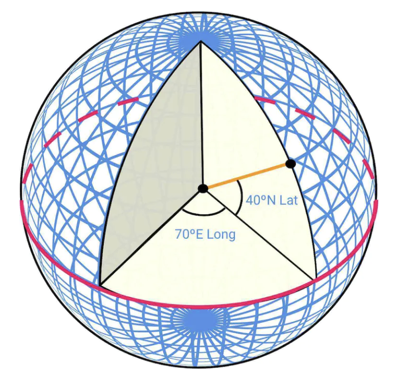
</div>

#### Going from 3D to 2D

The process of translating points from 3D to 2D plane is called "map projection".

There are different ways to do it and each comes with its pros and cons. Almost all distort the actual geometry.

<div style="margin-left:3rem">
    
</div>

Google maps selected a modified version of Mercator projection called "Web Mercator".

#### Geocoding

Geocoding is the process of converting addresses to geographic coordinates. 

The reverse process is called "reverse geocoding".

One way to achieve this is to use interpolation - leveraging data from different sources (eg GIS-es) where street network is mapped to geo coordinate space.

#### Geohashing

Geohashing is an encoding system which encodes a geographic area into a string of letters and digits.

It depicts the world as a flattened surface and recursively sub-divides it into four quadrants:

<div style="margin-left:3rem">
    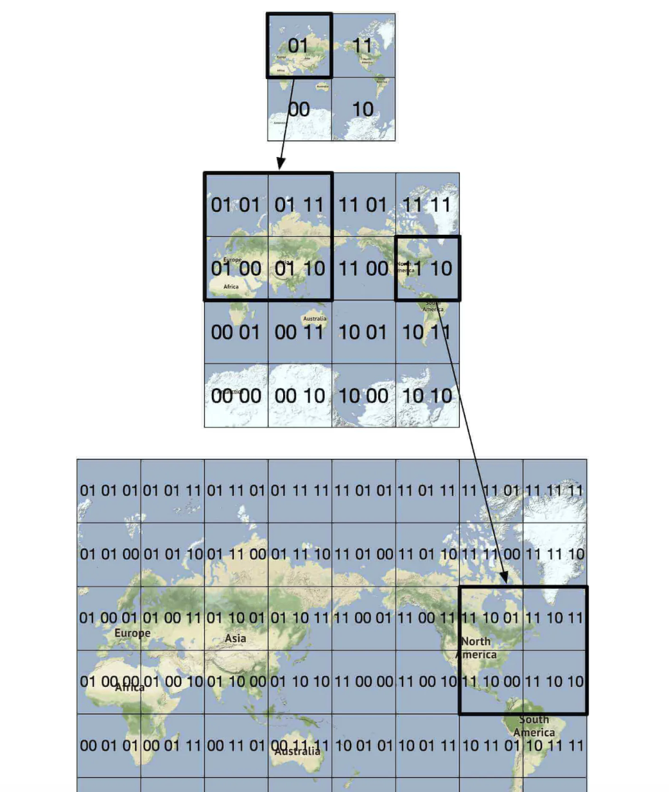
</div>

#### Map rendering

Map rendering happens via tiling. Instead of rendering entire map as one big custom image, world is broken up into smaller tiles.

Client only downloads relevant tiles and renders them like stitching together a mosaic.

There are different tiles for different zoom levels. Client chooses appropriate tiles based on the client's zoom level.

Eg, zooming out the entire world would download only a single 256x256 tile, representing the whole world.

#### Road data processing for navigation algorithms

In most routing algorithms, intersections are represented as nodes and roads are represented as edges:

<div style="margin-left:3rem">
    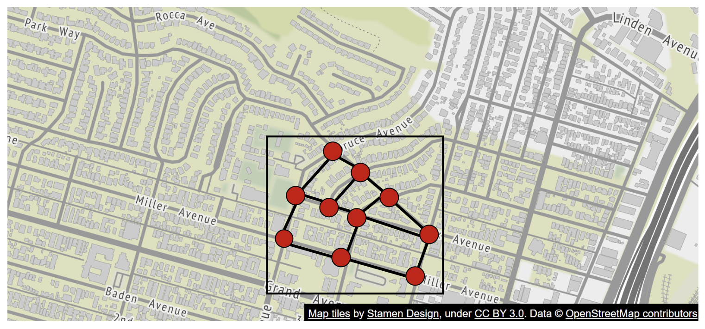
</div>

Most navigation algorithms use a modified version of Djikstra or A* algorithms.

Pathfinding performance is sensitive to the size of the graph. To work at scale, we can't represent the whole world as a graph and run the algorithm on it.

Instead, we use a technique similar to tiling - we subdivide the world into smaller and smaller graphs.

Routing tiles hold references to neighboring tiles and algorithms can stitch together a bigger road graph as it traverses interconnected tiles:

<div style="margin-left:3rem">
    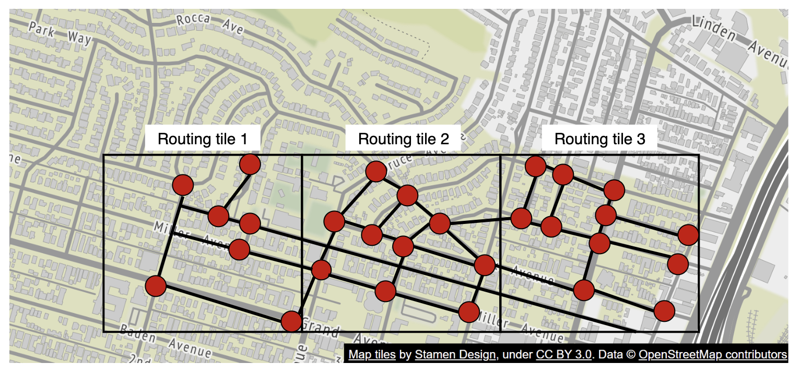
</div>

This technique enables us to significantly reduce memory bandwidth and only load the tiles we need for the given source/destination pair.

However, for larger routes, stitching together small, detailed routing tiles would still be time/memory consuming. Instead, there are routing tiles with different level of detail and the algorithm uses the appropriately-detailed tiles, based on the destination we're headed for:

<div style="margin-left:3rem">
    
</div>

### **Back-of-the-envelope estimation**

For storage, we need to store:
 * map of the world - estimated as ~70pb based on all the tiles we need to store, but factoring in compression of very similar tiles (eg vast desert)
 * metadata - negligible in size, so we can skip it from calculation
 * Road info - stored as routing tiles

Estimated QPS for navigation requests - 1bil DAU at 35min of usage per week -> 5bil minutes per day. 
Assuming gps update requests are batched, we arrive at 200k QPS and 1mil QPS at peak load

---

## Step 2: Propose High-Level Design and Get Buy-In

<div style="margin-left:3rem">
    
</div>

### **Location service**

<div style="margin-left:3rem">
    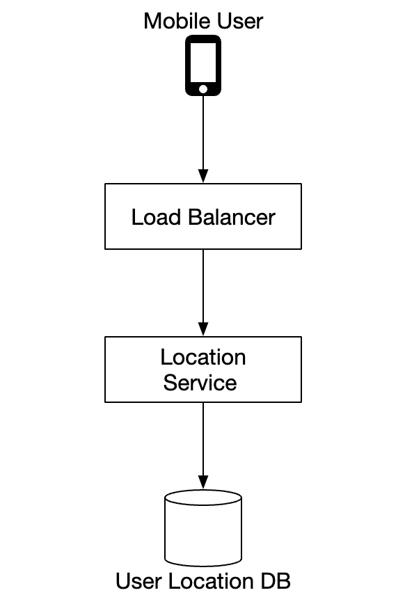
</div>

It is responsible for recording a user's location updates:
 * location updates are sent every `t` seconds
 * location data streams can be used to improve the service over time, eg provide more accurate ETAs, monitor traffic data, detect closed roads, analyze user behavior, etc

Instead of sending location updates to the server all the time, we can batch the updates on the client-side and send batches instead:

<div style="margin-left:3rem">
    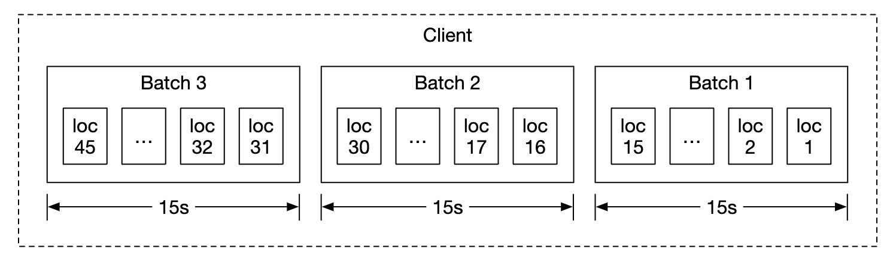
</div>

Despite this optimization, for a system of Google Maps scale, load will still be significant. Therefore, we can leverage a database, optimized for heavy writes such as Cassandra.

We can also leverage Kafka for efficient stream processing of location updates, meant for further analysis.

Example location update request payload:

```
POST /v1/locations
Parameters
  locs: JSON encoded array of (latitude, longitude, timestamp) tuples.
```

### **Navigation service**

This component is responsible for finding fast routes between A and B in a reasonable time (a little bit of latency is okay). Route need not be the fastest, but accuracy is important.

Example request payload:

```
GET /v1/nav?origin=1355+market+street,SF&destination=Disneyland
```

Example response:

```json
{
  "distance": {"text":"0.2 mi", "value": 259},
  "duration": {"text": "1 min", "value": 83},
  "end_location": {"lat": 37.4038943, "Ing": -121.9410454},
  "html_instructions": "Head <b>northeast</b> on <b>Brandon St</b> toward <b>Lumin Way</b><div style=\"font-size:0.9em\">Restricted usage road</div>",
  "polyline": {"points": "_fhcFjbhgVuAwDsCal"},
  "start_location": {"lat": 37.4027165, "lng": -121.9435809},
  "geocoded_waypoints": [
    {
       "geocoder_status" : "OK",
       "partial_match" : true,
       "place_id" : "ChIJwZNMti1fawwRO2aVVVX2yKg",
       "types" : [ "locality", "political" ]
    },
    {
       "geocoder_status" : "OK",
       "partial_match" : true,
       "place_id" : "ChIJ3aPgQGtXawwRLYeiBMUi7bM",
       "types" : [ "locality", "political" ]
    }
  ],
  "travel_mode": "DRIVING"
}
```

Traffic changes and reroutes are not taken into consideration yet, those will be tackled in the deep dive section.

### **Map rendering**

Holding the entire data set of mapping tiles on the client-side is not feasible as it's petabytes in size.

They need to be fetched on-demand from the server, based on the client's location and zoom level.

When should new tiles be fetched - while user is zooming in/out and during navigation, while they're going towards a new tile.

How should the map tiles be served to the client?
 * They can be built dynamically, but that puts a huge load on the server and also makes caching hard
 * Map tiles are served statically, based on their geohash, which a client can calculate. They can be statically stored & served from a CDN

<div style="margin-left:3rem">
    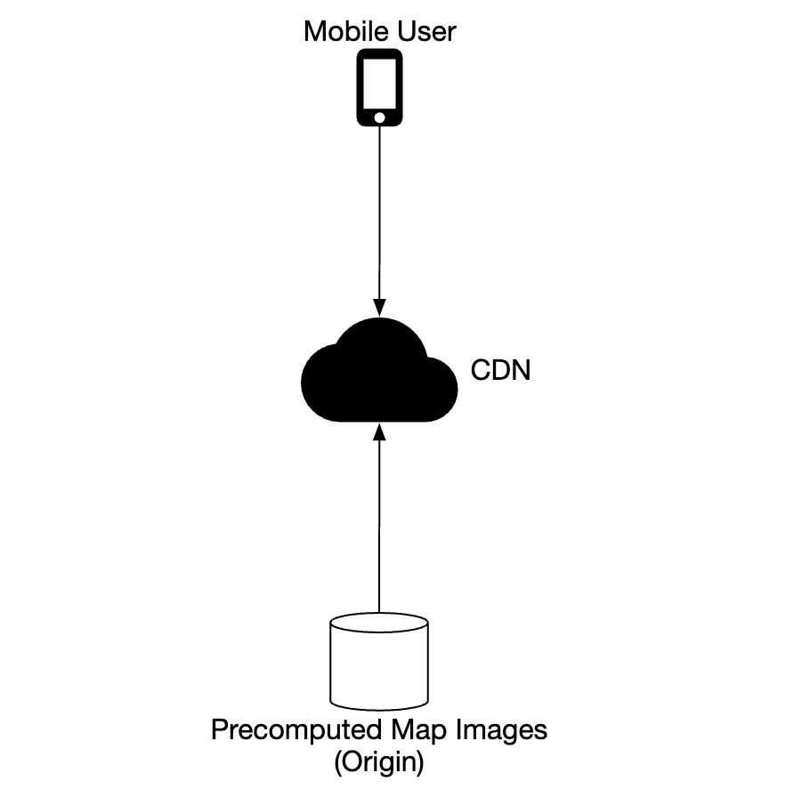
</div>

CDNs enable users to fetch map tiles from point-of-presence servers (POP) which are closest to users in order to minimize latency:

<div style="margin-left:3rem">
    
</div>

Options to consider for determining map tiles:
 * geohash for map tile can be calculated on the client-side. If that's the case, we should be careful that we commit to this type of map tile calculation for the long-term as forcing clients to update is hard
 * alternatively, we can have simple API which calculates the map tile URLs on behalf of the clients at the cost of additional API call

<div style="margin-left:3rem">
    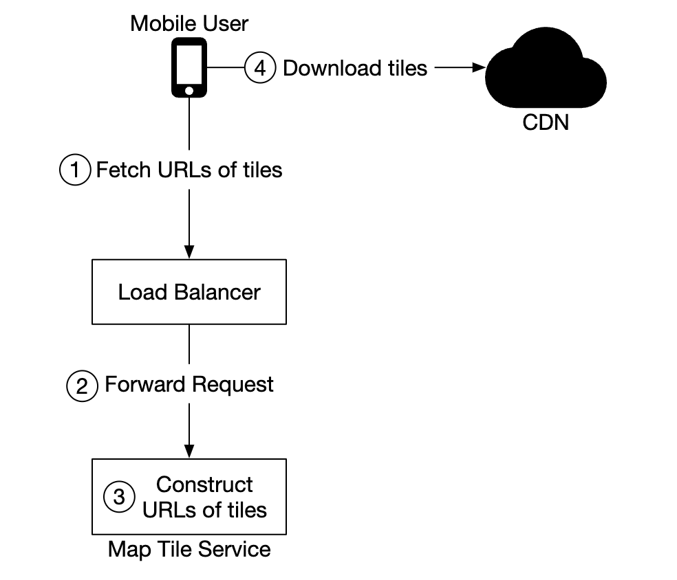
</div>

---

## Step 3: Design Deep Dive

### **Data model**

Let's discuss how we store the different types of data we're dealing with.

#### Routing tiles

Initial road data set is obtained from different sources. It is improved over time based on location updates data.

The road data is unstructured. We have a periodic offline processing pipeline, which transforms this raw data into the graph-based routing tiles our app needs.

Instead of storing these tiles in a database as we don't need any database features. We can store them in S3 object storage, while caching them agressively.

We can also leverage libraries to compress adjacency lists into binary files efficiently.

#### User location data

User location data is very useful for updaring traffic conditions and doing all sorts of other analysis.

We can use Cassandra for storing this kind of data as its nature is to be write-heavy.

Example row:

<div style="margin-left:3rem">
    
</div>

#### Geocoding database

This database stores a key-value pair of lat/long pairs and places.

We can use Redis for its fast read access speed, as we have frequent read and infrequent writes.

#### Precomputed images of the world map

As we discussed, we will precompute map tiling images and store them in CDN.

<div style="margin-left:3rem">
    
</div>

### **Services**

#### Location service

Let's focus on the database design and how user location is stored in detail for this service.

<div style="margin-left:3rem">
    
</div>

We can use a NoSQL database to facilitate the heavy write load we have on location updates. We prioritize availability over consistency as user location data often changes and becomes stale as new updates arrive.

We'll choose Cassandra as our database choice as it nicely fits all our requirements.

Example row we're going to store:

<div style="margin-left:3rem">
    
</div>

 * `user_id` is the partition key in order to quickly access all location updates for a particular user
 * `timestamp` is the clustering key in order to store the data sorted by the time a location update is received

We also leverage Kafka to stream location updates to various other service which need the location updates for various purposes:

<div style="margin-left:3rem">
    
</div>

#### Rendering map

Map tiles are stored at various zoom levels. At the lowest zoom level, the entire world is represented by a single 256x256 tile.

As zoom levels increase, the number of map tiles quadruples:

<div style="margin-left:3rem">
    
</div>

One optimization we can use is to not send the entire image information over the network, but instead represent tiles as vectors (paths & polygons) and let the client render the tiles dynamically.

This will have substantial bandwidth savings.

#### Navigation service

This service is responsible for finding the fastest routes:

<div style="margin-left:3rem">
    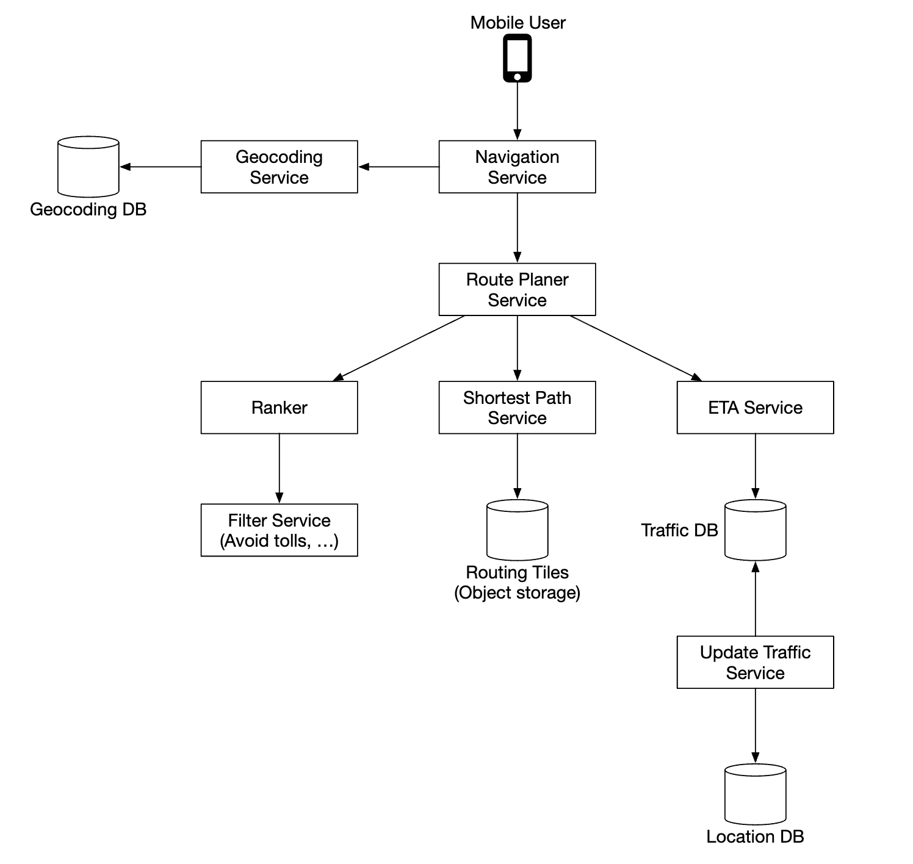
</div>

Let's go through each component in this sub-system.

First, we have the geocoding service which resolves an address to a location of lat/long pair.

Example request:

```
https://maps.googleapis.com/maps/api/geocode/json?address=1600+Amphitheatre+Parkway,+Mountain+View,+CA
```

Example response:

```json
{
   "results" : [
      {
         "formatted_address" : "1600 Amphitheatre Parkway, Mountain View, CA 94043, USA",
         "geometry" : {
            "location" : {
               "lat" : 37.4224764,
               "lng" : -122.0842499
            },
            "location_type" : "ROOFTOP",
            "viewport" : {
               "northeast" : {
                  "lat" : 37.4238253802915,
                  "lng" : -122.0829009197085
               },
               "southwest" : {
                  "lat" : 37.4211274197085,
                  "lng" : -122.0855988802915
               }
            }
         },
         "place_id" : "ChIJ2eUgeAK6j4ARbn5u_wAGqWA",
         "plus_code": {
            "compound_code": "CWC8+W5 Mountain View, California, United States",
            "global_code": "849VCWC8+W5"
         },
         "types" : [ "street_address" ]
      }
   ],
   "status" : "OK"
}
```

The route planner service computes a suggested route, optimized for travel time according to current traffic conditions.

The shortest-path service runs a variation of the A* algorithm against the routing tiles in object storage to compute an optimal path:
 * It receives the source/destination pairs, converts them to lat/long pairs and derives the geohashes from those pairs to derive the routing tiles
 * The algorithm starts from the initial routing tile and starts traversing it until a good enough path is found to the destination tile

<div style="margin-left:3rem">
    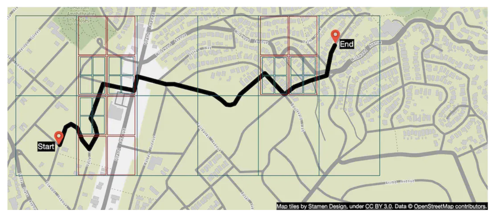
</div>

The ETA service is called by the route planner to get estimated time based on machine learning algorithms, predicting ETA based on traffic data.

The ranker service is responsible to rank different possible paths based on filters, passed by the user, ie flags to avoid toll roads or freeways.

The updater service asynchronously update some of the important databases to keep them up-to-date.

#### Improvement - adaptive ETA and rerouting

One improvement we can do is to adaptively update in-flight routes based on newly available traffic data.

One way to implement this is to store users who are currently navigating through a route in the database by storing all the tiles they're supposed to go through.

Data might look like this:

```
user_1: r_1, r_2, r_3, …, r_k
user_2: r_4, r_6, r_9, …, r_n
user_3: r_2, r_8, r_9, …, r_m
...
user_n: r_2, r_10, r21, ..., r_l
```

If a traffic accident happens on some tile, we can identify all users whose path goes through that tile and re-route them.

To reduce the amount of tiles we store in the database, we can instead store the origin routing tile and several routing tiles in different resolution levels until the destination tile is also included:

```
user_1, r_1, super(r_1), super(super(r_1)), ...
```

<div style="margin-left:3rem">
    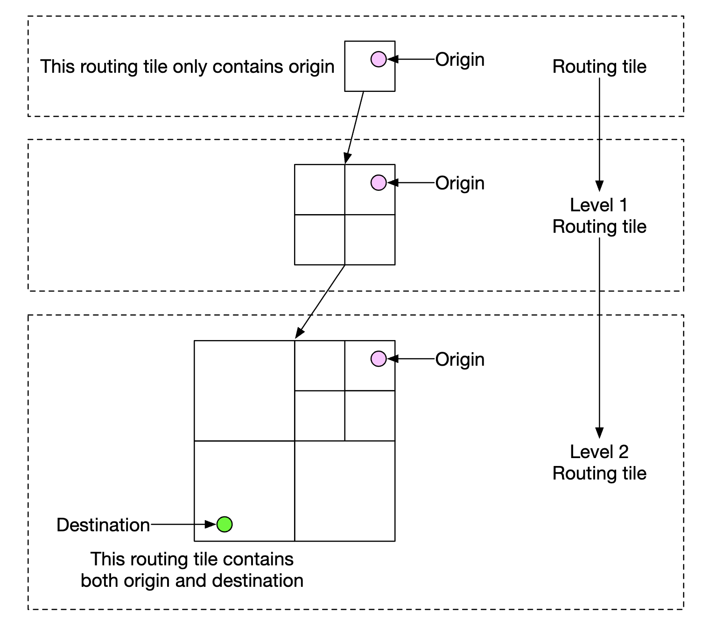
</div>

Using this, we only need to check if the final tile of a user includes the traffic accident tile to see if user is impacted.

We can also keep track of all possible routes for a navigating user and notify them if a faster re-route is available.

#### Delivery protocols

We have several options, which enable us to proactively push data to clients from the server:
 * Mobile push notifications don't work because payload is limited and it's not available for web apps
 * WebSocket is generally a better option than long-polling as it has less compute footprint on servers
 * We can also use server-sent events (SSE) but lean towards web sockets as they support bi-directional communication which can come in handy for eg a last-mile delivery feature

---

## Step 4: Wrap Up

This is our final design:

<div style="margin-left:3rem">
    
</div>

One additional feature we could provide is multi-stop navigation which can be sold to enterprise customers such as Uber or Lyft in order to determine optimal path for visiting a set of locations.

---

## Most Asked Interview Questions

**Q1. How would you design the map tile system for Google Maps?**
> The world is divided into a grid of tiles at multiple zoom levels (0 = whole world in one 256×256px tile; zoom 21 = building level). Tiles are pre-rendered PNGs/vector tiles stored in object storage (S3-like) keyed by `{zoom}/{x}/{y}`. A CDN caches tiles by geography (users in Europe get tiles from European edge nodes). The client fetches only the tiles visible in the current viewport using Slippy Map tile coordinates.

**Q2. How does turn-by-turn navigation work at a high level?**
> User sets destination → routing engine computes shortest/fastest path on the road graph → path decomposed into turn-by-turn instructions ("In 500m, turn left"). During navigation, GPS position is matched to the road graph (map matching) to confirm which segment the user is on. As user progresses, instructions are played via TTS. If user deviates from route, re-route is triggered automatically.

**Q3. What graph algorithms are used for routing, and which does Google Maps use?**
> Dijkstra finds shortest path in O((V+E) log V) but is too slow for continental-scale graphs. A* uses a heuristic (straight-line distance) to focus search directionally — faster in practice. Contraction Hierarchies (CH) pre-processes the road graph to create "shortcut" edges, then bidirectional Dijkstra on the contracted graph runs ~1000x faster than plain Dijkstra. Google/Apple Maps use CH or similar hierarchical techniques (ALT, Hub Labeling) for real-time routing.

**Q4. How do you incorporate real-time traffic into route computation?**
> Road segment speeds are collected from GPS probe data (anonymized phone movement). Aggregated speed → travel time for each segment → updates the edge weight in the road graph. Pre-computed routes become stale quickly, so traffic-aware routing uses time-dependent edge weights that change every few minutes. The routing engine re-queries with updated weights and re-routes if travel time would improve by >1–2 minutes.

**Q5. How does ETA (Estimated Time of Arrival) work?**
> ETA = sum of predicted travel times for each road segment on the route. Segment time = segment length / predicted speed at time of travel. Historical speed data (same hour, same day of week) combined with real-time probe data gives the prediction. ML models improve accuracy by incorporating weather, events, accidents. ETA is continuously recalculated as the user moves and as traffic conditions change.

**Q6. How do you handle location updates from millions of drivers/GPS probes?**
> Each phone sends a GPS ping every 15 seconds. 1 billion DAU × 1/15 updates/sec = 67M GPS pings/sec is the theoretical max (not all are actively navigating). Ingest pipeline: Kafka → stream processors (Flink/Spark Streaming) aggregate pings by road segment → compute average speed → update road graph edge weights in a graph store. Low-latency path: Kafka → in-memory segment speed store → query by routing engine.

**Q7. How does geocoding (address → lat/lng) work at scale?**
> Geocoding: address string is parsed into components (number, street, city, country) → lookup in a structured address database with spatial index. Can also use trigram index for fuzzy matching (handles typos). Reverse geocoding: lat/lng → nearest road/address using a spatial R-tree or k-d tree. Both services are read-heavy — cache frequent queries (city centers, POIs). Google uses its own address DB built from authoritative government sources + Street View/community reports.

**Q8. How do you keep map data up to date (roads change, new buildings appear)?**
> Data pipeline: (1) Authoritative sources (government road databases, HERE, OpenStreetMap) ingested periodically; (2) Community edits (Google Map Maker / Local Guides) reviewed and merged; (3) Street View detection: ML model detects new buildings, changed road markings from imagery; (4) User-reported corrections (wrong directions, closed road). Changes are staged → validated → published to the tile/routing pipeline (daily batch for tiles, near-real-time for road closures).

**Q9. How do you optimize map tile delivery for mobile vs. desktop?**
> Mobile: vector tiles (protobuf-encoded geometry + labels, ~20KB vs ~200KB PNG raster tiles) are rendered client-side — smaller download, smooth scaling, adapt to screen DPI. Desktop/web: also switched to vector tiles (Mapbox GL / Google Maps GL). CDN serves tiles from edge nodes within 50ms. Tile caching on client (LRU by tile key) means tiles already seen are not re-fetched. Prefetch adjacent tiles at current zoom level.

**Q10. How does the routing engine handle multi-modal transport (driving + transit + walking)?**
> Graph contains multiple edge types: road edges (car), transit edges (bus/subway with schedules), and pedestrian edges (footpaths). Multi-modal routing: dynamic programming / modified Dijkstra with time-expanded graph (edge weight depends on departure time for transit). The algorithm finds the optimal combination: walk 0.2 miles → subway (arrives at 2:05 PM) → walk 0.1 miles. RAPTOR algorithm is commonly used for transit routing.

**Q11. How would you design the road map data model (graph representation)?**
> Nodes: intersections (lat/lng, node_id). Edges: road segments (from_node, to_node, length_meters, speed_limit_kmh, flags: oneway/toll/highway). Stored as adjacency list for fast neighbor lookups. For a country like the US: ~50M nodes, ~120M edges. Partitioned by geography (tiles) so routing on one city loads only that region's subgraph. CH pre-processing runs offline and adds shortcut edges.

**Q12. How would you design the system to support offline maps?**
> User downloads a geographic region ahead of time as a bundle: vector tiles (for rendering) + routing graph (for offline navigation) + POI data. Stored locally on device (SQLite or flat file). Offline routing uses the locally stored graph — same Contraction Hierarchies algorithm. Updates: app checks for delta updates (changed tiles/edges) periodically, downloads only diffs. Bundle size for a large city: ~100–500MB.

**Q13. How do you handle GPS inaccuracy and do map matching?**
> Raw GPS has 5–20m error; on urban canyons (tall buildings), 50–100m. Map matching: project the GPS point to the nearest road segment using a probabilistic model (Hidden Markov Model). HMM considers both spatial proximity (how close is the GPS to the segment?) and transition probability (is it physically possible to jump from segment A to segment B given speed/direction?). Snaps the trajectory to the most likely road sequence.

**Q14. What is the difference between vector tiles and raster tiles?**
> Raster tiles: pre-rendered PNG images — fast to display, but fixed visual style, don't scale cleanly, large file size (~200KB each). Vector tiles: raw geometry data (points, lines, polygons) + labels encoded in protobuf — rendered on-device by WebGL, much smaller (~20KB), can be styled dynamically (dark mode, different languages), smooth zoom animations. Modern apps (Google Maps, Mapbox) all use vector tiles exclusively.

**Q15. How do you design the search/autocomplete feature in Google Maps?**
> Trie or inverted index (Elasticsearch) over POI names, addresses, and categories. Prefix matching + fuzzy matching (handles typos). Ranking: proximity to user's current location, POI popularity, past searches. Google also incorporates Knowledge Graph signals (McDonald's restaurants near user's location ranked by rating). The autocomplete service is read-heavy — cached at API layer with geographic sharding.

**Q16. How does Google Maps detect accidents and road closures in real-time?**
> Multiple signals: (1) GPS probes show sudden deceleration → slow segment → flagged as traffic jam/accident; (2) User reports via map UI; (3) Government/waze incident feeds; (4) Computer vision on traffic cameras. Aggregation: if 10+ users in 2 minutes report slow speed on a segment → automatic incident creation. Routing engine immediately uses the incident to detour new navigation requests.

**Q17. How do you handle map tile invalidation when road changes occur?**
> Road change → triggers tile re-render for all zoom levels that show that road (e.g., zoom 10–21). Tile renderer is a MapReduce / distributed job that re-generates only changed tiles. New tiles uploaded to object storage with new version hash in the key → CDN cache automatically serves new version (cache key includes tile version). Clients may cache old tiles locally — TTL-based expiry (typically 7 days) forces refresh.

**Q18. How do you scale the geocoding service to handle 1 billion queries per day?**
> ~11,600 QPS average. Architecture: horizontally scaled stateless geocoding service pods → read from a geo-indexed PostgreSQL/PostGIS database or Elasticsearch cluster. Read-through Redis cache (LRU, ~10M entries for popular addresses) handles 80–90% of requests. Database sharded by country/region. Separate reverse geocoding service backed by an R-tree spatially indexed POI/road database.

**Q19. How would you handle fraudulent Map edits (vandalism) in community-contributed data?**
> Rate limiting per account. Edits from new/low-reputation accounts are held in review queue before publishing. ML model classifies edits as suspicious (renaming real streets to profanity, moving POIs to wrong locations). High-reputation trusted users' edits go live faster. Revert system: any edit can be rolled back. Geofenced review: edits to sensitive locations (government buildings, airports) require higher approval threshold.

**Q20. How do you design the ETA prediction to be reliable despite sparse GPS data in rural areas?**
> In rural areas fewer probe vehicles → less real-time traffic signal. Fall back to: (1) Historical average speed for road class (highway vs local road) and time of day; (2) Posted speed limit × 0.9 heuristic; (3) Interpolation from adjacent road segments with data. ML model trained with historical GPS traces learns typical travel times even for roads with infrequent probe coverage.

**Q21. How do you support alternative routes (fastest vs. shortest vs. avoid tolls)?**
> Run multiple routing queries with different edge weight functions: (1) Minimize time (use current speed predictions); (2) Minimize distance (use physical length); (3) Avoid tolls (set toll edge weights to infinity). CH pre-computation can be done for multiple weight functions in parallel. Present top 3 routes with time/distance trade-off. K-shortest paths algorithms (Yen's algorithm) or penalty-based re-routing generates diverse alternatives.

**Q22. How would you design the navigation service API?**
> Route request: `POST /route {origin, destination, mode, departure_time, preferences}` → `{route_id, steps[], polyline, duration_sec, distance_m, eta}`. Navigation updates: `GET /navigate/{route_id}/position?lat=&lng=` → `{current_step, next_maneuver, re_route_needed, updated_eta}`. Streaming updates pushed via WebSocket. Map tiles: `GET /tiles/{z}/{x}/{y}` (standard Slippy Map URL scheme) served from CDN.

**Q23. How do you estimate the storage requirements for global map tiles?**
> ~21 zoom levels × ~4 tiles per zoom level per zoom-in step = exponentially growing tile count. Rough estimate: zoom 0 = 1 tile; zoom 15 = 1 billion tiles; zoom 20 = 1 trillion tiles. Land area is ~30% of Earth → trim ocean tiles. Vector tiles average ~20KB (only when compressed land tiles exist) → 1 billion non-empty tiles × 20KB = 20 PB. In practice Google Maps uses ~20–30 PB for all tiles at all zoom levels.

**Q24. How does Google Maps handle navigation in areas with no internet connectivity?**
> Cached offline maps: user pre-downloads a region. The routing engine uses the locally stored CH graph — no server round-trip needed. GPS still works (GPS is satellite-based, no internet required). Offline mode limitations: no real-time traffic, POI search limited to downloaded area, map data eventually becomes stale. When connectivity restores, the app re-routes with live traffic using the online routing service.

**Q25. How do you design the system to handle special events (concerts, New Year's Eve) with massive sudden congestion?**
> Pre-event: routing algorithm learns from historical data (Times Square on Dec 31 is always congested → pre-loaded slow speeds). Near real-time: GPS probe data shows sudden slowdown → routing system updates edge weights within minutes. Surge routing: algorithm proactively suggests alternate routes even before users encounter congestion. City-event feeds (concerts, sports) can be integrated to pre-warm predictions.

**Q26. How does the routing engine handle one-way streets, turn restrictions, and road closures?**
> One-way streets: directed edges in the graph (A→B but not B→A). Turn restrictions (e.g., no U-turn, no left turn): modeled as penalty edges or via turn-node expansion (replace each intersection node with one node per incoming edge — restrictions become missing edges in the expanded graph). Road closures: edge weight set to infinity (effectively removed from graph) until closure is lifted.

**Q27. What are the most important components of a Google Maps-like system?**
> (1) Map Data Pipeline: ingest + process raw geo data → vector tiles + routing graph; (2) Tile Server + CDN: serve pre-rendered tiles to clients; (3) Routing Engine: Contraction Hierarchies-based shortest path service; (4) Location Ingest: receive GPS probes from millions of devices via Kafka; (5) Traffic Processor: aggregate probes → segment speeds → update routing weights; (6) Geocoding/Search Service: address → coordinates + POI search; (7) Navigation API: real-time turn-by-turn with ETA recalculation.
