# Chapter 20: Metrics Monitoring and Alerting System

## Introduction
This chapter focuses on designing a highly scalable **metrics monitoring and alerting system**, which is critical for ensuring high availability and reliability.

---

## Step 1: Understand the Problem and Establish Design Scope
A metrics monitoring system can mean a lot of different things - eg you don't want to design a logs aggregation system, when the interviewer is interested in infra metrics only.

Let's try to understand the problem first:
 - C: Who are we building the system for? An in-house monitoring system for a big tech company or a SaaS like DataDog?
 - I: We are building for internal use only.
 - C: Which metrics do we want to collect?
 - I: Operational system metrics - CPU load, Memory, Data disk space. But also high-level metrics like requests per second. Business metrics are not in scope.
 - C: What is the scale of the infrastructure we're monitoring?
 - I: 100mil daily active users, 1000 server pools, 100 machines per pool
 - C: How long should we keep the data?
 - I: Let's assume 1y retention.
 - C: May we reduce metrics data resolution for long-term storage?
 - I: Keep newly received metrics for 7 days. Roll them up to 1m resolution for next 30 days. Further roll them up to 1h resolution after 30 days.
 - C: What are the supported alert channels?
 - I: Email, phone, PagerDuty or webhooks.
 - C: Do we need to collect logs such as error or access logs?
 - I: No
 - C: Do we need to support distributed system tracing?
 - I: No

### **High-level requirements and assumptions**
The infrastructure being monitored is large-scale:
 - 100mil DAU
 - 1000 server pools * 100 machines * ~100 metrics per machine -> ~10mil metrics
 - 1-year data retention
 - Data retention policy - raw for 7d, 1-minute resolution for 30d, 1h resolution for 1y

A variety of metrics can be monitored:
 - CPU load
 - Request count
 - Memory usage
 - Message count in message queues

### **Non-functional requirements**
 - **Scalability**: System should be scalable to accommodate more metrics and alerts
 - **Low latency**: System needs to have low query latency for dashboards and alerts
 - **Reliability**: System should be highly reliable to avoid missing critical alerts
 - **Flexibility**: System should be able to easily integrate new technologies in the future

What requirements are out of scope?
 - **Log monitoring**: the ELK stack is very popular for this use-case
 - **Distributed system tracing**: this refers to collecting data about a request lifecycle as it flows through multiple services within the system

---

## Step 2: Propose High-Level Design and Get Buy-In

### **Fundamentals**
There are five core components involved in a metrics monitoring and alerting system:

<div style="margin-left:3rem">
    
</div>

 - **Data collection**: collect metrics data from different sources
 - **Data transmission**: transfer data from sources to the metrics monitoring system
 - **Data storage**: organize and store incoming data
 - **Alerting**: Analyze incoming data, detect anomalies and generate alerts
 - **Visualization**: Present data in graphs, charts, etc

### **Data model**
Metrics data is usually recorded as a time-series, which contains a set of values with timestamps.
The series can be identified by name and an optional set of tags.

Example 1 - What is the CPU load on production server instance i631 at 20:00?

<div style="margin-left:3rem">
    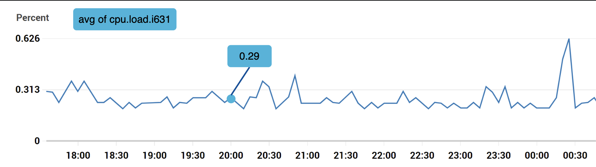
</div>

The data can be identified by the following table:

<div style="margin-left:3rem">
    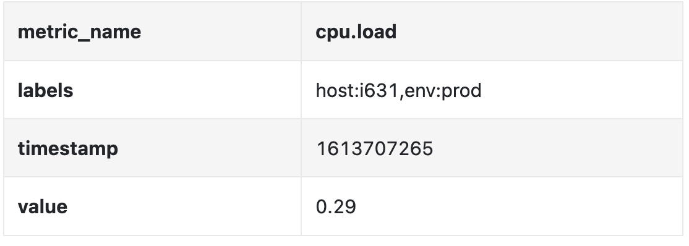
</div>

The time series is identified by the metric name, labels and a single point in at a specific time.

Example 2 - What is the average CPU load across all web servers in the us-west region for the last 10min?

```
CPU.load host=webserver01,region=us-west 1613707265 50

CPU.load host=webserver01,region=us-west 1613707265 62

CPU.load host=webserver02,region=us-west 1613707265 43

CPU.load host=webserver02,region=us-west 1613707265 53

...

CPU.load host=webserver01,region=us-west 1613707265 76

CPU.load host=webserver01,region=us-west 1613707265 83
```

This is an example data we might pull from storage to answer that question.
The average CPU load can be calculated by averaging the values in the last column of the rows.

The format shown above is called the line protocol and is used by many popular monitoring software in the market - eg Prometheus, OpenTSDB.

What every time series consists of:

<div style="margin-left:3rem">
    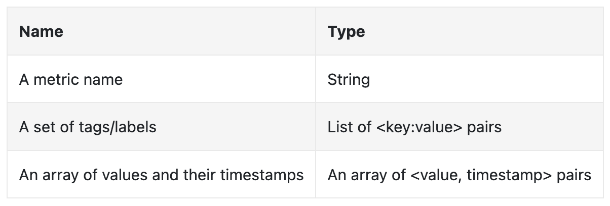
</div>

A good way to visualize how data looks like:

<div style="margin-left:3rem">
    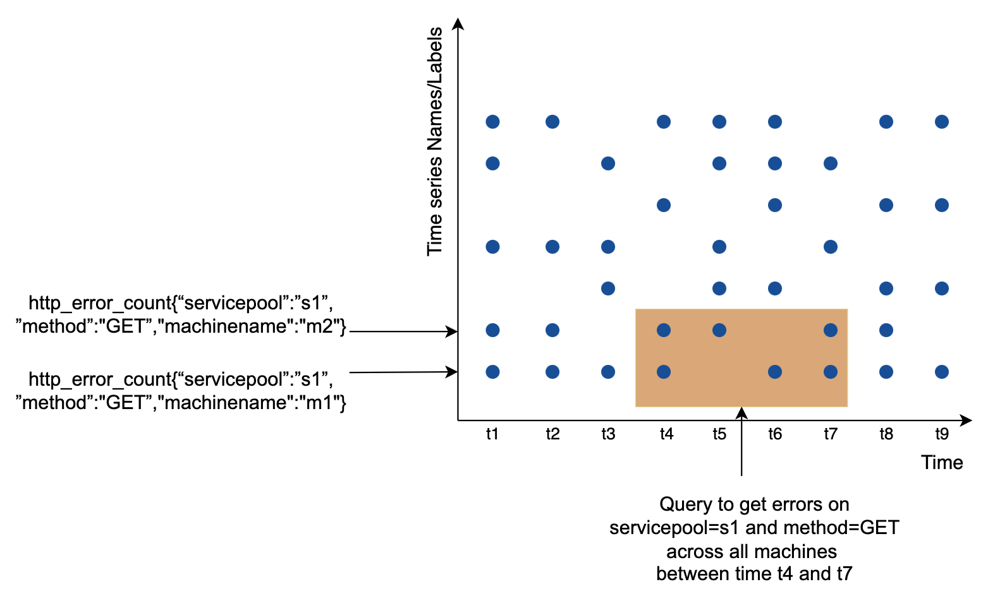
</div>

 - The x axis is the time
 - the y axis is the dimension you're querying - eg metric name, tag, etc.

The data access pattern is write-heavy and spiky reads as we collect a lot of metrics, but they are infrequently accessed, although in bursts when eg there are ongoing incidents.

The data storage system is the heart of this design. 
 - It is not recommended to use a general-purpose database for this problem, although you could achieve good scale \w expert-level tuning.
 - Using a NoSQL database can work in theory, but it is hard to devise a scalable schema for effectively storing and querying time-series data.

There are many databases, specifically tailored for storing time-series data. Many of them support custom query interfaces which allow for effective querying of time-series data.
 - OpenTSDB is a distributed time-series database, but it is based on Hadoop and HBase. If you don't have that infrastructure provisioned, it would be hard to use this tech.
 - Twitter uses MetricsDB, while Amazon offers Timestream.
 - The two most popular time-series databases are InfluxDB and Prometheus. 
 - They are designed to store large volumes of time-series data. Both of them are based on in-memory cache + on-disk storage.

Example scale of InfluxDB - more than 250k writes per second when provisioned with 8 cores and 32gb RAM:

<div style="margin-left:3rem">
    
</div>

It is not expected for you to understand the internals of a metrics database as it is niche knowledge. You might be asked only if you've mentioned it on your resume.

For the purposes of the interview, it is sufficient to understand that metrics are time-series data and to be aware of popular time-series databases, like InfluxDB.

One nice feature of time-series databases is the efficient aggregation and analysis of large amounts of time-series data by labels.
InfluxDB, for example, builds indexes for each label.

It is critical, however, to keep the cardinality of labels low - ie, not using too many unique labels.

### **High-level Design**

<div style="margin-left:3rem">
    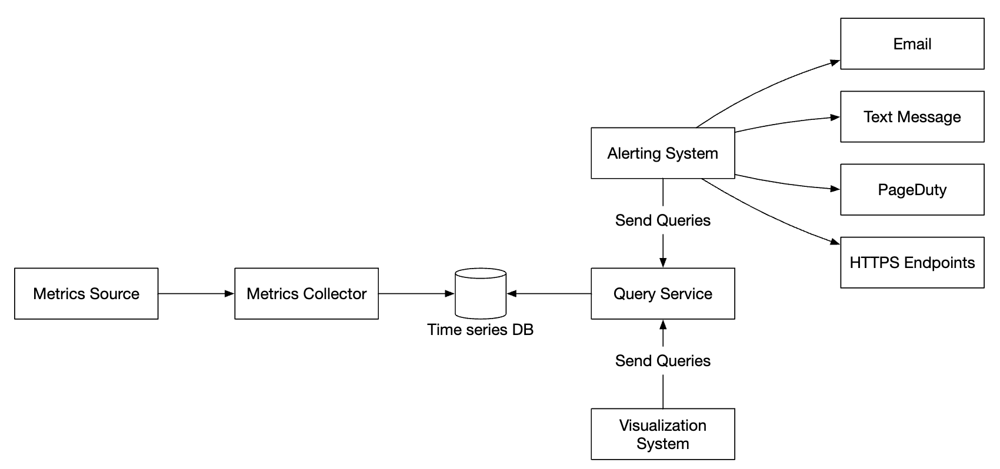
</div>

 - **Metrics source**: can be application servers, SQL databases, message queues, etc.
 - **Metrics collector**: Gathers metrics data and writes to time-series database
 - **Time-series database**: stores metrics as time-series. Provides a custom query interface for analyzing large amounts of metrics.
 - **Query service**: Makes it easy to query and retrieve data from the time-series DB. Could be replaced entirely by the DB's interface if it's sufficiently powerful.
 - **Alerting system**: Sends alert notifications to various alerting destinations.
 - **Visualization system**: Shows metrics in the form of graphs/charts.

---

## Step 3: Design Deep Dive
Let's deep dive into several of the more interesting parts of the system.

### **Metrics collection**
For metrics collection, occasional data loss is not critical. It's acceptable for clients to fire and forget.

<div style="margin-left:3rem">
    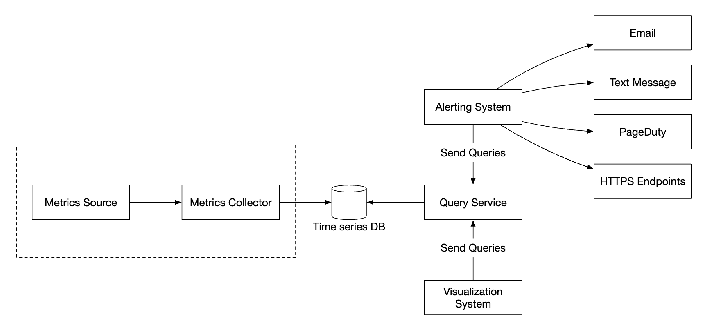
</div>

There are two ways to implement metrics collection - pull or push.

Here's how the pull model might look like:

<div style="margin-left:3rem">
    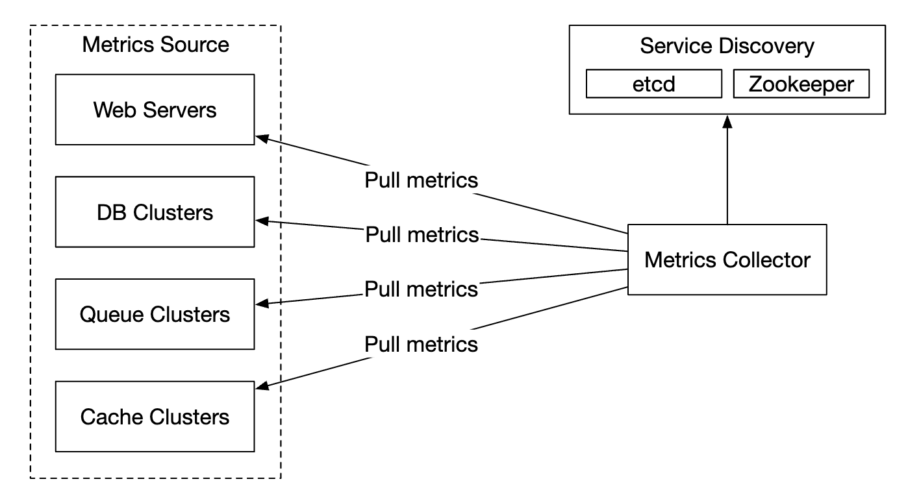
</div>

For this solution, the metrics collector needs to maintain an up-to-date list of services and metrics endpoints.
We can use Zookeeper or etcd for that purpose - service discovery.

Service discovery contains contains configuration rules about when and where to collect metrics from:

<div style="margin-left:3rem">
    
</div>

Here's a detailed explanation of the metrics collection flow:

<div style="margin-left:3rem">
    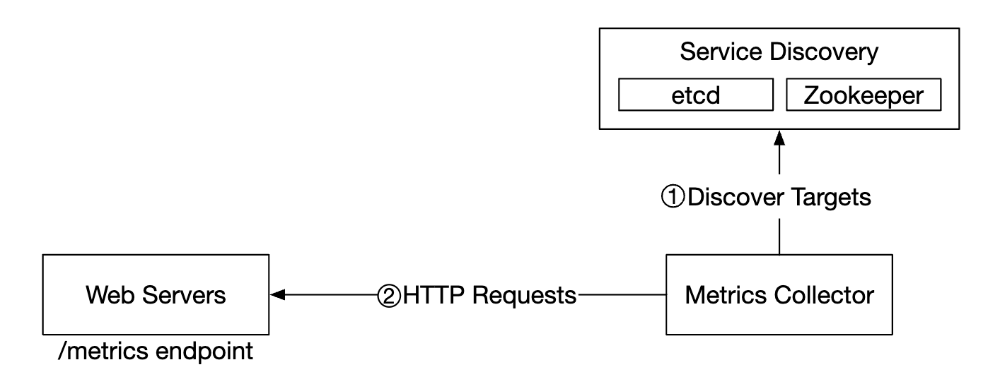
</div>

 - Metrics collector fetches configuration metadata from service discovery. This includes pulling interval, IP addresses, timeout & retry params.
 - Metrics collector pulls metrics data via a pre-defined http endpoint (eg `/metrics`). This is typically done by a client library.
 - Alternatively, the metrics collector can register a change event notification with the service discovery to be notified once the service endpoint changes.
 - Another option is for the metrics collector to periodically poll for metrics endpoint configuration changes.

At our scale, a single metrics collector is not enough. There must be multiple instances. 
However, there must also be some kind of synchronization among them so that two collectors don't collect the same metrics twice.

One solution for this is to position collectors and servers on a consistent hash ring and associate a set of servers with a single collector only:

<div style="margin-left:3rem">
    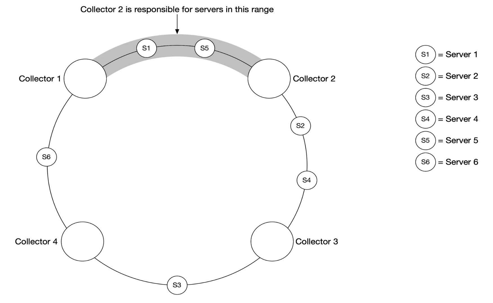
</div>

With the push model, on the other hand, services push their metrics to the metrics collector proactively:

<div style="margin-left:3rem">
    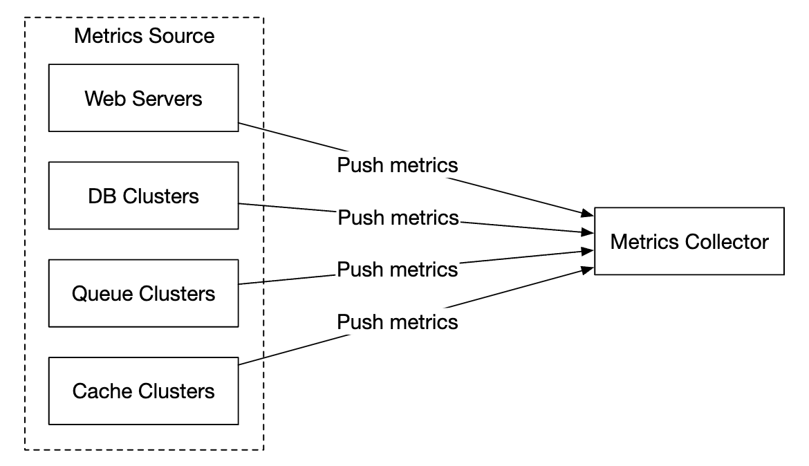
</div>

In this approach, typically a collection agent is installed alongside service instances. 
The agent collects metrics from the server and pushes them to the metrics collector.

<div style="margin-left:3rem">
    
</div>

With this model, we can potentially aggregate metrics before sending them to the collector, which reduces the volume of data processed by the collector.

On the flip side, metrics collector can reject push requests as it can't handle the load. 
It is important, hence, to add the collector to an auto-scaling group behind a load balancer.

so which one is better? There are trade-offs between both approaches and different systems use different approaches:
 - Prometheus uses a pull architecture
 - Amazon Cloud Watch and Graphite use a push architecture

Here are some of the main differences between push and pull:
|                                        | Pull                                                                                                                                                                                                    | Push                                                                                                                                                                                                                                    |
|----------------------------------------|---------------------------------------------------------------------------------------------------------------------------------------------------------------------------------------------------------|-----------------------------------------------------------------------------------------------------------------------------------------------------------------------------------------------------------------------------------------|
| Easy debugging                         | The /metrics endpoint on application servers used for pulling metrics can be used to view metrics at any time. You can even do this on your laptop. Pull wins.                                          | If the metrics collector doesn't receive metrics, the problem might be caused by network issues.                                                                                                                                        |
| Health check                           | If an application server doesn't respond to the pull, you can quickly figure out if an application server is down. Pull wins.                                                                           | If the metrics collector doesn't receive metrics, the problem might be caused by network issues.                                                                                                                                        |
| Short-lived jobs                       |                                                                                                                                                                                                         | Some of the batch jobs might be short-lived and don't last long enough to be pulled. Push wins. This can be fixed by introducing push gateways for the pull model [22].                                                                 |
| Firewall or complicated network setups | Having servers pulling metrics requires all metric endpoints to be reachable. This is potentially problematic in multiple data center setups. It might require a more elaborate network infrastructure. | If the metrics collector is set up with a load balancer and an auto-scaling group, it is possible to receive data from anywhere. Push wins.                                                                                             |
| Performance                            | Pull methods typically use TCP.                                                                                                                                                                         | Push methods typically use UDP. This means the push method provides lower-latency transports of metrics. The counterargument here is that the effort of establishing a TCP connection is small compared to sending the metrics payload. |
| Data authenticity                      | Application servers to collect metrics from are defined in config files in advance. Metrics gathered from those servers are guaranteed to be authentic.                                                 | Any kind of client can push metrics to the metrics collector. This can be fixed by whitelisting servers from which to accept metrics, or by requiring authentication.                                                                   |

There is no clear winner. A large organization probably needs to support both. There might not be a way to install a push agent in the first place.

### **Scale the metrics transmission pipeline**

<div style="margin-left:3rem">
    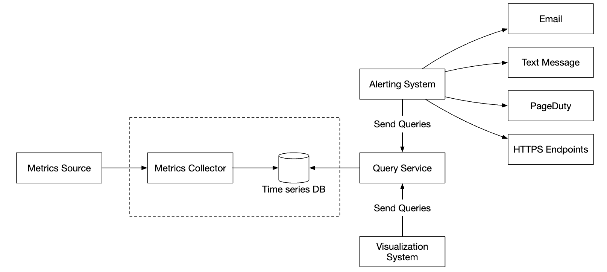
</div>

The metrics collector is provisioned in an auto-scaling group, regardless if we use the push or pull model.

There is a chance of data loss if the time-series DB is down, however. To mitigate this, we'll provision a queuing mechanism:

<div style="margin-left:3rem">
    
</div>

 - Metrics collectors push metrics data into kafka
 - Consumers or stream processing services such as Apache Storm, Flink or Spark process the data and push it to the time-series DB

This approach has several advantages:
 - Kafka is used as a highly-reliable and scalable distributed message platform
 - It decouples data collection and data processing from one another
 - It can prevent data loss by retaining the data in Kafka

Kafka can be configured with one partition per metric name, so that consumers can aggregate data by metric names.
To scale this, we can further partition by tags/labels and categorize/prioritize metrics to be collected first.

<div style="margin-left:3rem">
    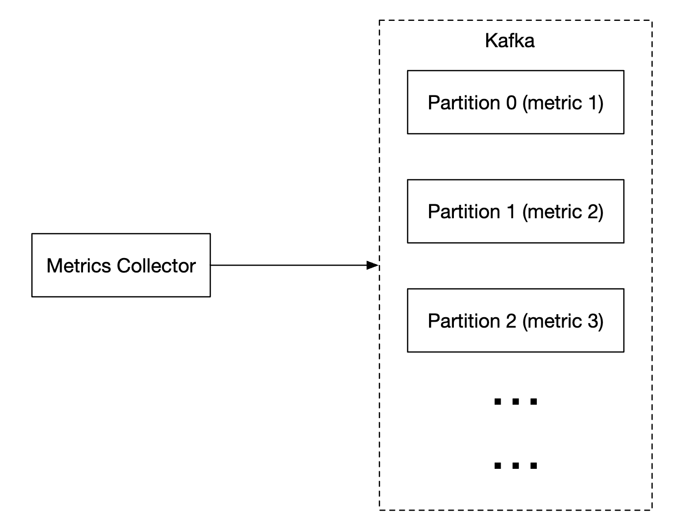
</div>

The main downside of using Kafka for this problem is the maintenance/operation overhead.
An alternative is to use a large-scale ingestion system like [Gorilla](https://www.vldb.org/pvldb/vol8/p1816-teller.pdf).
It can be argued that using that would be as scalable as using Kafka for queuing.

### **Where aggregations can happen**
Metrics can be aggregated at several places. There are trade-offs between different choices:
 - **Collection agent**: client-side collection agent only supports simple aggregation logic. Eg collect a counter for 1m and send it to the metrics collector.
 - **Ingestion pipeline**: To aggregate data before writing to the DB, we need a stream processing engine like Flink. This reduces write volume, but we lose data precision as we don't store raw data.
 - **Query side**: We can aggregate data when we run queries via our visualization system. There is no data loss, but queries can be slow due to a lot of data processing.

### **Query Service**
Having a separate query service from the time-series DB decouples the visualization and alerting system from the database, which enables us to decouple the DB from clients and change it at will.

We can add a Cache layer here to reduce the load to the time-series database:

<div style="margin-left:3rem">
    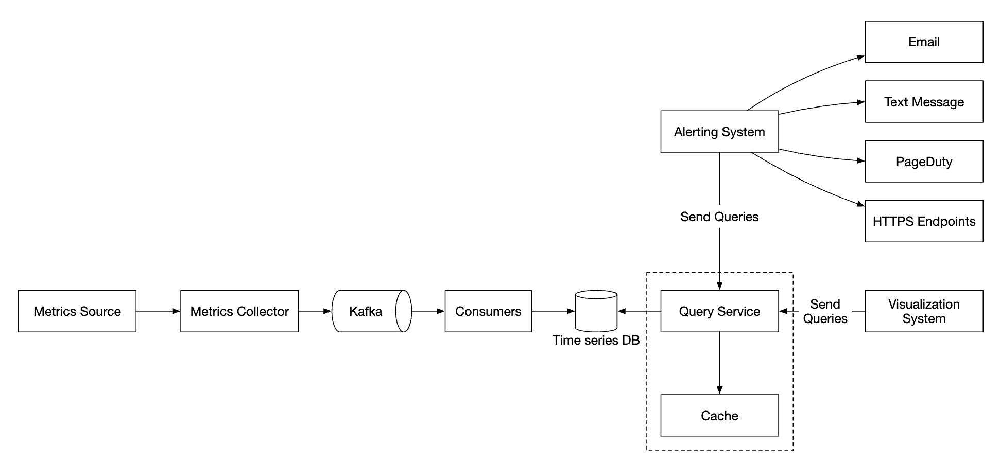
</div>

We can also avoid adding a query service altogether as most visualization and alerting systems have powerful plugins to integrate with most time-series databases.
With a well-chosen time-series DB, we might not need to introduce our own caching layer as well.

Most time-series DBs don't support SQL simply because it is ineffective for querying time-series data. Here's an example SQL query for computing an exponential moving average:

```
select id,
       temp,
       avg(temp) over (partition by group_nr order by time_read) as rolling_avg
from (
  select id,
         temp,
         time_read,
         interval_group,
         id - row_number() over (partition by interval_group order by time_read) as group_nr
  from (
    select id,
    time_read,
    "epoch"::timestamp + "900 seconds"::interval * (extract(epoch from time_read)::int4 / 900) as interval_group,
    temp
    from readings
  ) t1
) t2
order by time_read;
```

Here's the same query in Flux - query language used in InfluxDB:

```
from(db:"telegraf")
  |> range(start:-1h)
  |> filter(fn: (r) => r._measurement == "foo")
  |> exponentialMovingAverage(size:-10s)
```

### **Storage layer**
It is important to choose the time-series database carefully.

According to research published by Facebook, ~85% of queries to the operational store were for data from the past 26h.

If we choose a database, which harnesses this property, it could have significant impact on system performance. InfluxDB is one such option.

Regardless of the database we choose, there are some optimizations we might employ.

Data encoding and compression can significantly reduce the size of data. Those features are usually built into a good time-series database.

<div style="margin-left:3rem">
    
</div>

In the above example, instead of storing full timestamps, we can store timestamp deltas.

Another technique we can employ is down-sampling - converting high-resolution data to low-resolution in order to reduce disk usage.

We can use that for old data and make the rules configurable by data scientists, eg:
 - 7d - no down-sampling
 - 30d - down-sample to 1min
 - 1y - down-sample to 1h

For example, here's a 10-second resolution metrics table:
| metric | timestamp            | hostname | Metric_value |
|--------|----------------------|----------|--------------|
| cpu    | 2021-10-24T19:00:00Z | host-a   | 10           |
| cpu    | 2021-10-24T19:00:10Z | host-a   | 16           |
| cpu    | 2021-10-24T19:00:20Z | host-a   | 20           |
| cpu    | 2021-10-24T19:00:30Z | host-a   | 30           |
| cpu    | 2021-10-24T19:00:40Z | host-a   | 20           |
| cpu    | 2021-10-24T19:00:50Z | host-a   | 30           |

down-sampled to 30-second resolution:
| metric | timestamp            | hostname | Metric_value (avg) |
|--------|----------------------|----------|--------------------|
| cpu    | 2021-10-24T19:00:00Z | host-a   | 19                 |
| cpu    | 2021-10-24T19:00:30Z | host-a   | 25                 |

Finally, we can also use cold storage to use old data, which is no longer used. The financial cost for cold storage is much lower.

### **Alerting system**

<div style="margin-left:3rem">
    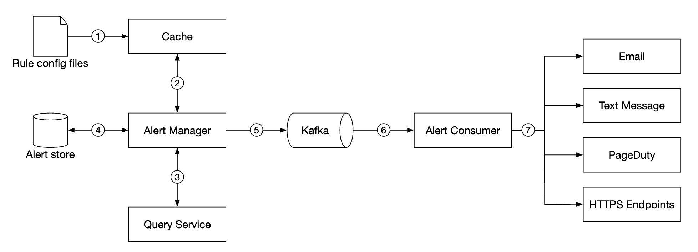
</div>

Configuration is loaded to cache servers. Rules are typically defined in YAML format. Here's an example:

```
- name: instance_down
  rules:

  # Alert for any instance that is unreachable for >5 minutes.
  - alert: instance_down
    expr: up == 0
    for: 5m
    labels:
      severity: page
```

The alert manager fetches alert configurations from cache. Based on configuration rules, it also calls the query service at a predefined interval.
If a rule is met, an alert event is created.

Other responsibilities of the alert manager are:
 - Filtering, merging and deduplicating alerts. Eg if an alert of a single instance is triggered multiple times, only one alert event is generated.
 - Access control - it is important to restrict alert-management operations to certain individuals only
 - Retry - the manager ensures that the alert is propagated at least once.

The alert store is a key-value database, like Cassandra, which keeps the state of all alerts. It ensures a notification is sent at least once.
Once an alert is triggered, it is published to Kafka.

Finally, alert consumers pull alerts data from Kafka and send notifications over to different channels - Email, text message, PagerDuty, webhooks.

In the real-world, there are many off-the-shelf solutions for alerting systems. It is difficult to justify building your own system in-house.

### **Visualization system**
The visualization system shows metrics and alerts over a time period. Here's an dashboard built with Grafana:

<div style="margin-left:3rem">
    
</div>

A high-quality visualization system is very hard to build. It is hard to justify not using an off-the-shelf solution like Grafana.

---

## Step 4: Wrap up
Here's our final design:

<div style="margin-left:3rem">
    
</div>

---

## Most Asked Interview Questions

**Q1. What are the four main metric types and when do you use each?**
> Counter: monotonically increasing value (total_requests, total_errors) — use for counting events over time; query as rate. Gauge: current snapshot value (cpu_usage_percent, queue_depth) — can go up or down; use for resource utilization. Histogram: samples observations and counts them in configurable buckets (request_duration_ms) — enables percentile calculation (p50, p99) at the cost of pre-defined buckets. Summary: similar to histogram but calculates quantiles client-side — accurate but can't be aggregated across instances.

**Q2. How does a pull-based model (Prometheus) compare to a push-based model (Graphite/StatsD)?**
> Pull: monitoring server scrapes `/metrics` endpoint of each target service on a schedule. Pros: monitoring system controls scrape rate, easy to detect dropped targets (no scrape = down), no need for agents. Cons: requires service discovery, struggles with ephemeral jobs (batch jobs that finish before scrape). Push: services send metrics to a central collector. Pros: works for short-lived jobs, simpler for services. Cons: collector may be overwhelmed, harder to detect if service stops sending. Prometheus supports both via Pushgateway for batch jobs.

**Q3. What is a time-series database (TSDB) and why is it better than a relational DB for metrics?**
> Time-series data: each row is `{metric_name, labels, timestamp, value}` — billions of rows, write-heavy, query pattern is time-range scans. TSDB optimizations: columnar storage + compression (gorilla compression for float64 timestamps can achieve 12x compression), automatic data downsampling, built-in retention policies, efficient range queries with inverted index on labels. Relational DB (PostgreSQL) lacks this compression, auto-aggregation, and native label indexing — don't scale beyond ~10M rows/day.

**Q4. How does Prometheus store and query data?**
> Prometheus uses a custom TSDB on local disk: data organized in 2-hour blocks (each block = set of immutable Parquet-like chunk files + index). Each series identified by metric name + label set → custom 64-bit hash. Query with PromQL: `rate(http_requests_total{service="api"}[5m])` = per-second rate over 5-minute window. Prometheus is designed for single-node (local TSDB); for long-term storage use remote_write to Thanos, Cortex, or VictoriaMetrics which provide horizontal scaling.

**Q5. How would you design an alerting system to avoid alert fatigue?**
> Alert on symptoms, not causes (alert when SLO is breached, not on every dependency failure). Suppress noise: use alert grouping (PagerDuty/Alertmanager groups related alerts into one incident), de-duplication, and inhibition rules (silence child alerts when parent is firing). Severity tiers: P1 = page on-call immediately; P2 = ticket created; P3 = logging only. Require alert to fire for `for: 5m` before sending (avoids transient spikes). Review alert-to-action ratio weekly — delete or silence any alert that repeatedly fires without requiring action.

**Q6. How do you handle data downsampling for long-term metric storage?**
> High-resolution data (10s interval) is kept for 15 days → consumes ~50 GB/metric at scale. After 15 days: roll up to 1-minute resolution; after 90 days: roll up to 1-hour; after 1 year: roll up to 1-day. Downsampling uses aggregation functions (min/max/avg/count) over the high-res data. Implemented as a background job or natively in Thanos (sidecar + Thanos Compactor). Queries automatically use the appropriate resolution based on the time range requested.

**Q7. What is Grafana's role and how does it fit into the monitoring architecture?**
> Grafana is a visualization and dashboarding platform. It connects to data sources (Prometheus, InfluxDB, CloudWatch, Elasticsearch) via plugins. Panels (graphs, gauges, tables) query the data source using the data source's query language (PromQL, SQL, InfluxQL). Dashboards are stored as JSON (versionable in Git). Grafana also has a built-in alerting engine that can evaluate queries on a schedule and send notifications. It does not store metric data — it's a read layer on top of TSDBs.

**Q8. How would you design a metrics ingestion pipeline for millions of data points per second?**
> Collection agents (Telegraf, collectd, or custom agent) on each host batch metrics → send to Kafka (topics by metric category). Stream processors (Flink/Spark Streaming) consume from Kafka → validate/enrich/aggregate → write to TSDB (InfluxDB, VictoriaMetrics, or Prometheus remote_write). Buffer layer (Kafka) prevents TSDB from being overwhelmed during write spikes. Scale: 1M data points/sec × 8 bytes = 8 MB/s write → 10M points/sec needs ~80 MB/s TSDB write throughput → 3–5 InfluxDB nodes easily handle this.

**Q9. How do you implement data retention and cost management in a large-scale metrics system?**
> Tiered storage: hot storage (local SSD, 15 days, fast queries), warm storage (object storage like S3 with downsampled data, 1 year, slower queries), cold archive (rarely queried, keep for compliance). Retention policies configured per metric prefix or team. Cost control: (1) Limit cardinality (don't use user_id or request_id as metric labels — exponential series explosion); (2) Delete unused metrics (identify series with 0 queries in 30 days); (3) Push low-cardinality aggregates, not raw traces.

**Q10. How do you implement anomaly detection in a metrics monitoring system?**
> Static thresholds: simple but miss gradual drifts and have false positives during normal seasonality. Dynamic thresholds: baseline = moving average ± N×stddev. Seasonal baselines: compare current value to the same time-of-day/day-of-week historically. ML-based: SARIMA, Facebook Prophet, or LSTM models trained on historical metric patterns. Implementation: Prometheus recording rules computing baselines → alerting rule fires when current value deviates >3σ from baseline. Or use commercial tools (Datadog Watchdog, AWS CloudWatch Anomaly Detection).

**Q11. What is cardinality in metrics and why is high cardinality a problem?**
> Cardinality = number of unique time series = product of unique values across all labels. Example: `http_requests_total{service, endpoint, status_code}` — 50 services × 200 endpoints × 10 status codes = 100,000 series. Now add `user_id` as a label: ×10M users = 1 trillion series — kills any TSDB. High cardinality increases: memory usage (each series has in-memory head block), index size, query time. Solution: never use unbounded labels (user_id, trace_id, IP address). Use distributed tracing (Jaeger) for per-request granularity, not metrics.

**Q12. How do you design SLOs (Service Level Objectives) and SLA monitoring?**
> SLO: concrete measurable target (99.9% of requests complete in <500ms). SLI: the metric measuring SLO (request latency p99). Error budget: (1 - SLO%) × total_requests = allowed failures. Monitor the error budget burn rate: if burning budget 14x faster than normal → page on-call. Prometheus: `histogram_quantile(0.99, rate(http_duration_bucket[5m])) < 0.5`. Alerting on SLO breach rather than individual component failures prevents alert fatigue and keeps focus on user impact.

**Q13. What is the difference between metrics, logs, and traces in observability?**
> Metrics: numerical time-series aggregates (CPU = 82%, request_rate = 500/sec) — low cost, great for dashboards and alerting, no per-request details. Logs: text lines emitted by code (ERROR 2024-01-15 user_id=123 failed to process) — high cost at scale, great for debugging specific errors. Traces: distributed request traces showing the path through microservices with timing (Jaeger, Zipkin) — correlates with logs via trace_id. Observability = metrics + logs + traces together. Pillars: "the three pillars of observability."

**Q14. How would you design a health-check system for detecting service outages within 30 seconds?**
> Synthetic health checks: external probe sends HTTP GET `/health` every 15s to each service replica — cheap, fast. Metrics-based: alert fires if `up{job="api"}` (Prometheus target up metric) = 0 for >1 scrape (30s). Dependency health: health endpoint checks DB connection, cache connection, and returns degraded vs. healthy. Black-box monitoring: probe tests user-visible flows end-to-end (login → search → checkout) every minute. On-call routing: P1 alert if >2 replicas unavailable (full outage), P2 if 1 replica down.

**Q15. How do you handle monitoring in a multi-cloud or multi-region environment?**
> Each region has its own Prometheus/metrics stack (avoid cross-region scraping latency). Central aggregation: Thanos Query or Cortex acts as a global query layer federating across regional Prometheus instances. Global dashboards query the federated layer. Alerts: each region has its own Alertmanager (avoids single point of failure in alerting). Global alert routing rules at a global Alertmanager cluster. Topology maps and region SLOs tracked centrally.

**Q16. What is the role of a metrics aggregation layer in a large-scale system?**
> Raw metrics often need pre-aggregation before storage (e.g., sum all requests across 100 pods → single series). Prometheus recording rules: `record: job:http_requests:rate5m; expr: sum(rate(http_requests_total[5m])) by (job)` — pre-computes expensive queries and stores results as new series. Reduces query time from O(N pods) to O(1). Stream aggregation in Flink/Spark: aggregate before writing to TSDB (reduces points by 10–100x). Critical for keeping TSDB write rate manageable.

**Q17. How do you design alert routing in a large engineering organization?**
> Alert routing matches alert labels to team ownership rules. Alertmanager: `routes` config matches `service="payment"` → routes to `payments-oncall` receiver (PagerDuty team). Match `severity="P1"` → page immediately; `severity="P2"` → create ticket + email. Group by `alertname` + `cluster` to batch related alerts. Inhibition rules: if `cluster_down` alert is firing, suppress all individual service alerts for that cluster (avoid 50 alerts from 1 root cause). Escalation: P1 unacknowledged for 15 min → page manager.

**Q18. What are the key differences between Prometheus, InfluxDB, and VictoriaMetrics?**
> Prometheus: pull-based, built-in service discovery, PromQL, single-node TSDB, best for Kubernetes-native monitoring. InfluxDB 2.0: push-based, line protocol ingestion, Flux query language, supports higher cardinality than Prometheus, built-in downsampling. VictoriaMetrics: drop-in Prometheus replacement with Prometheus remote_write, better compression (10x vs Prometheus 4x), horizontal clustering mode, 10x lower RAM usage — preferred for large-scale deployments. Thanos/Cortex: add long-term storage + global query to Prometheus.

**Q19. How do you instrument a microservice to emit metrics correctly?**
> Use a client library (Prometheus client_go, micrometer for Java). Define metrics at startup: `var requestDuration = prometheus.NewHistogramVec(prometheus.HistogramOpts{Name: "http_request_duration_seconds", Buckets: prometheus.DefBuckets}, []string{"method", "path", "status"})`. Observe at request completion: `requestDuration.WithLabelValues("GET", "/api/users", "200").Observe(elapsed)`. Expose at `/metrics`. Label cardinality rule: `path` should be parameterized (`/api/users/:id` not `/api/users/12345`).

**Q20. How do you monitor Kubernetes infrastructure with Prometheus?**
> kube-state-metrics: exposes Kubernetes object state (pod status, deployment replica counts, node conditions) as Prometheus metrics. node-exporter: exposes host-level metrics (CPU, memory, disk, network) per node. cAdvisor: exposes container-level metrics (container CPU, memory per pod). ServiceMonitor CRD (Prometheus Operator): auto-discovers services to scrape based on labels. Standard dashboards: Kubernetes Cluster Overview, Node Metrics, Pod Metrics available as Grafana dashboard imports.

**Q21. What is a metrics pipeline and why do you need it?**
> Raw metric data flows: source → agent (collect + buffer) → transport (Kafka) → processor (validate, enrich, route) → storage (TSDB) → query layer → visualization. Pipeline benefits: (1) Decouples collection from storage — storage can be changed without re-instrumenting all services; (2) Kafka buffer absorbs ingestion spikes; (3) Processors can add tags, filter, downsample before storage; (4) Route same metrics to multiple destinations (Prometheus + S3 archive). Without a pipeline, all services write directly to TSDB creating tight coupling.

**Q22. How do you prevent a monitoring system from becoming a single point of failure?**
> Monitoring HA: run 2 Prometheus instances scraping the same targets (identical config) — both store the same data, either can answer queries. Alertmanager cluster (3 nodes): uses mesh gossip to deduplicate alerts across the cluster. PagerDuty/OpsGenie is external SaaS with its own SLA. "Who watches the watchmen": use a separate uptime check service (UptimeRobot, Pingdom) that externally validates the monitoring system itself is up. Alert if Prometheus has 0 scrape targets (indicates Prometheus is down).

**Q23. How do you track and alert on business metrics, not just infrastructure metrics?**
> Business metrics: orders_per_minute, payment_success_rate, checkout_conversion_rate, DAU. Emitted by application code (Prometheus counter/gauge) or computed via SQL queries on OLTP DB (Prometheus sql_exporter). Dashboard in Grafana shows real-time business KPIs. Alerts: `payment_success_rate < 0.99` → P1 alert. Combine with infrastructure metrics for correlation: CPU spike + payment_rate_drop at same timestamp = root cause hint. A/B test metrics tracked as labeled counters (`experiment_id` label with bounded values).

**Q24. What is exemplar support in Prometheus and how does it bridge metrics and traces?**
> Exemplars: optional metadata attached to metric observations that link to a specific trace ID. Example: a histogram bucket observation (request took 450ms) can carry `{trace_id="abc123"}` as an exemplar. In Grafana, clicking on a high-latency spike in the histogram shows a button "View Trace in Jaeger" — navigates directly to the distributed trace for that request. Bridges the "I see a spike in p99 latency" metric → the specific distributed trace for root cause analysis. Enabled in Prometheus 2.26+.

**Q25. How do you monitor and alert on database performance metrics?**
> Key DB metrics: (1) Query latency (p50/p99) via `pg_stat_statements` → Prometheus postgres_exporter; (2) Active connections vs. max_connections (alert at 80%); (3) Lock wait time and deadlock count; (4) Replication lag in seconds (alert if replica is >30s behind primary); (5) Disk I/O utilization; (6) Cache hit ratio (alert if below 90% — indicates insufficient shared_buffers). Slow query log → parse + alert on queries with `duration > 1s`. These metrics feed the same Grafana stack as application metrics.

**Q26. How do you handle monitoring for serverless functions (AWS Lambda)?**
> Lambda metrics from CloudWatch: invocation count, duration, error count, throttle count, concurrent executions. Custom metrics: use `aws-embedded-metrics` library to emit structured JSON logs parsed by CloudWatch Logs Insights into metrics (no SDK calls, no cost per metric). Trace: AWS X-Ray auto-instrumentation. Alert: Lambda error rate > 1% → SNS → PagerDuty. Cold start tracking: Lambda extension or custom metric measuring time from handler init to first request. Dashboards via Grafana CloudWatch plugin.

**Q27. What is the difference between black-box and white-box monitoring?**
> Black-box monitoring: test the system from the outside (HTTP probe, synthetic transaction) — verifies user-visible behavior without knowing internals. Detects: outage, SLA breach, SSL certificate expiry. Simple to implement, language-agnostic. White-box monitoring: instrument application internals (code-level metrics, logs, traces) — verifies internal component health, helps find root cause. Requires instrumentation but provides much richer signal. Best practice: use both — black-box for SLO alerting (did the user experience break?), white-box for root cause investigation.
