# Chapter 21: Ad Click Event Aggregation

## Introduction
**Digital advertising** is a big industry with the rise of Facebook, YouTube, TikTok, etc.

Hence, tracking ad click events is important. In this chapter, we explore how to design an **ad click event aggregation** system at Facebook/Google scale.

Digital advertising has a process called **real-time bidding (RTB)**, where digital advertising inventory is bought and sold:

<div style="margin-left:3rem">
    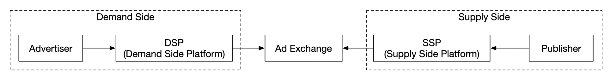
</div>

Speed of RTB is important as it usually occurs within a second.
Data accuracy is also very important as it impacts how much money advertisers pay.

Based on ad click event aggregations, advertisers can make decisions such as adjust target audience and keywords.

---

## Step 1: Understand the Problem and Establish Design Scope
 - C: What is the format of the input data?
 - I: 1bil ad clicks per day and 2mil ads in total. Number of ad-click events grows 30% year-over-year.
 - C: What are some of the most important queries our system needs to support?
 - I: Top queries to take into consideration:
   - Return number of click events for ad X in last Y minutes
   - Return top 100 most clicked ads in the past 1min. Both parameters should be configurable. Aggregation occurs every minute.
   - Support data filtering by `ip`, `user_id`, `country` for the above queries
 - C: Do we need to worry about edge cases? Some of the ones I can think of:
   - There might be events that arrive later than expected
   - There might be duplicate events
   - Different parts of the system might be down, so we need to consider system recovery
 - I: That's a good list, take those into consideration
 - C: What is the latency requirement?
 - I: A few minutes of e2e latency for ad click aggregation. For RTB, it is less than a second. It is ok to have that latency for ad click aggregation as those are usually used for billing and reporting.

### **Functional requirements**
 - Aggregate the number of clicks of `ad_id` in the last Y minutes
 - Return top 100 most clicked `ad_id` every minute
 - Support aggregation filtering by different attributes
 - Dataset volume is at Facebook or Google scale

### **Non-functional requirements**
 - Correctness of the aggregation result is important as it's used for RTB and ads billing
 - Properly handle delayed or duplicate events
 - Robustness - system should be resilient to partial failures
 - Latency - a few minutes of e2e latency at most

### **Back-of-the-envelope estimation**
 - 1bil DAU
 - Assuming user clicks 1 ad per day -> 1bil ad clicks per day
 - Ad click QPS = 10,000
 - Peak QPS is 5 times the number = 50,000
 - A single ad click occupies 0.1KB storage. Daily storage requirement is 100gb
 - Monthly storage = 3tb

---

## Step 2: Propose High-Level Design and Get Buy-In
In this section, we discuss query API design, data model and high-level design.

### **Query API Design**
The API is a contract between the client and the server. In our case, the client is the dashboard user - data scientist/analyst, advertiser, etc.

Here's our functional requirements:
 - Aggregate the number of clicks of `ad_id` in the last Y minutes
 - Return top N most clicked `ad_id` in the last M minutes
 - Support aggregation filtering by different attributes

We need two endpoints to achieve those requirements. Filtering can be done via query parameters on one of them.

**Aggregate number of clicks of ad_id in the last M minutes**:

```
GET /v1/ads/{:ad_id}/aggregated_count
```

Query parameters:
 - from - start minute. Default is now - 1 min
 - to - end minute. Default is now
 - filter - identifier for different filtering strategies. Eg 001 means "non-US clicks".

Response:
 - ad_id - ad identifier
 - count - aggregated count between start and end minutes

**Return top N most clicked ad_ids in the last M minutes**

```
GET /v1/ads/popular_ads
```

Query parameters:
 - count - top N most clicked ads
 - window - aggregation window size in minutes
 - filter - identifier for different filtering strategies

Response:
 - list of ad_ids

### **Data model**
In our system, we have raw and aggregated data.

Raw data looks like this:

```
[AdClickEvent] ad001, 2021-01-01 00:00:01, user 1, 207.148.22.22, USA
```

Here's an example in a structured format:
| ad_id | click_timestamp     | user  | ip            | country |
|-------|---------------------|-------|---------------|---------|
| ad001 | 2021-01-01 00:00:01 | user1 | 207.148.22.22 | USA     |
| ad001 | 2021-01-01 00:00:02 | user1 | 207.148.22.22 | USA     |
| ad002 | 2021-01-01 00:00:02 | user2 | 209.153.56.11 | USA     |

Here's the aggregated version:
| ad_id | click_minute | filter_id | count |
|-------|--------------|-----------|-------|
| ad001 | 202101010000 | 0012      | 2     |
| ad001 | 202101010000 | 0023      | 3     |
| ad001 | 202101010001 | 0012      | 1     |
| ad001 | 202101010001 | 0023      | 6     |

The `filter_id` helps us achieve our filtering requirements.
| filter_id | region | IP        | user_id |
|-----------|--------|-----------|---------|
| 0012      | US     | *         | *       |
| 0013      | *      | 123.1.2.3 | *       |

To support quickly returning top N most clicked ads in the last M minutes, we'll also maintain this structure:
| most_clicked_ads   |           |                                                  |
|--------------------|-----------|--------------------------------------------------|
| window_size        | integer   | The aggregation window size (M) in minutes       |
| update_time_minute | timestamp | Last updated timestamp (in 1-minute granularity) |
| most_clicked_ads   | array     | List of ad IDs in JSON format.                   |

What are some pros and cons between storing raw data and storing aggregated data?
 - Raw data enables using the full data set and supports data filtering and recalculation
 - On the other hand, aggregated data allows us to have a smaller data set and a faster query
 - Raw data means having a larger data store and a slower query
 - Aggregated data, however, is derived data, hence there is some data loss.

In our design, we'll use a combination of both approaches:
 - It's a good idea to keep the raw data around for debugging. If there is some bug in aggregation, we can discover the bug and backfill.
 - Aggregated data should be stored as well for faster query performance.
 - Raw data can be stored in cold storage to avoid extra storage costs.

When it comes to the database, there are several factors to take into consideration:
 - What does the data look like? Is it relational, document or blob?
 - Is the workload read-heavy, write-heavy or both?
 - Are transactions needed?
 - Do the queries rely on OLAP functions like SUM and COUNT?

For the raw data, we can see that the average QPS is 10k and peak QPS is 50k, so the system is write-heavy.
On the other hand, read traffic is low as raw data is mostly used as backup if anything goes wrong.

Relational databases can do the job, but it can be challenging to scale the writes. 
Alternatively, we can use Cassandra or InfluxDB which have better native support for heavy write loads.

Another option is to use Amazon S3 with a columnar data format like ORC, Parquet or AVRO. Since this setup is unfamiliar, we'll stick to Cassandra.

For aggregated data, the workload is both read and write heavy as aggregated data is constantly queried for dashboards and alerts.
It is also write-heavy as data is aggregated and written every minute by the aggregation service. 
Hence, we'll use the same data store (Cassandra) here as well.

### **High-level design**
Here's how our system looks like:

<div style="margin-left:3rem">
    
</div>

Data flows as an unbounded data stream on both inputs and outputs.

In order to avoid having a synchronous sink, where a consumer crashing can cause the whole system to stall, 
we'll leverage asynchronous processing using message queues (Kafka) to decouple consumers and producers.

<div style="margin-left:3rem">
    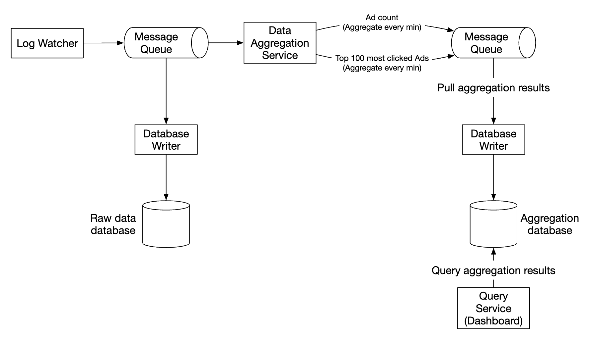
</div>

The first message queue stores ad click event data:
| ad_id | click_timestamp | user_id | ip | country |
|-------|-----------------|---------|----|---------|

The second message queue contains ad click counts, aggregated per-minute:
| ad_id | click_minute | count |
|-------|--------------|-------|

As well as top N clicked ads aggregated per minute:
| update_time_minute | most_clicked_ads |
|--------------------|------------------|

The second message queue is there in order to achieve end to end exactly-once atomic commit semantics:

<div style="margin-left:3rem">
    
</div>

For the aggregation service, using the MapReduce framework is a good option:

<div style="margin-left:3rem">
    
</div>

<div style="margin-left:3rem">
    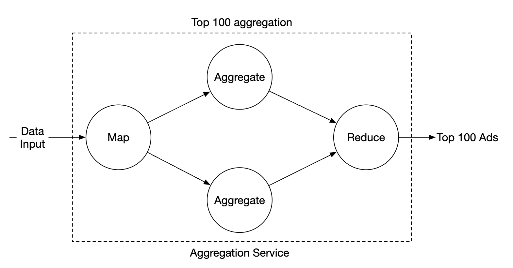
</div>

Each node is responsible for one single task and it sends the processing result to the downstream node.

The map node is responsible for reading from the data source, then filtering and transforming the data.

For example, the map node can allocate data across different aggregation nodes based on the `ad_id`:

<div style="margin-left:3rem">
    
</div>

Alternatively, we can distribute ads across Kafka partitions and let the aggregation nodes subscribe directly within a consumer group.
However, the mapping node enables us to sanitize or transform the data before subsequent processing.

Another reason might be that we don't have control over how data is produced, 
so events related to the same `ad_id` might go on different partitions.

The aggregate node counts ad click events by `ad_id` in-memory every minute.

The reduce node collects aggregated results from aggregate node and produces the final result:

<div style="margin-left:3rem">
    
</div>

This DAG model uses the MapReduce paradigm. It takes big data and leverages parallel distributed computing to turn it into regular-sized data.

In the DAG model, intermediate data is stored in-memory and different nodes communicate with each other using TCP or shared memory.

Let's explore how this model can now help us to achieve our various use-cases.

**Use-case 1 - aggregate the number of clicks**:

<div style="margin-left:3rem">
    
</div>

 - Ads are partitioned using `ad_id % 3`

**Use-case 2 - return top N most clicked ads**:

<div style="margin-left:3rem">
    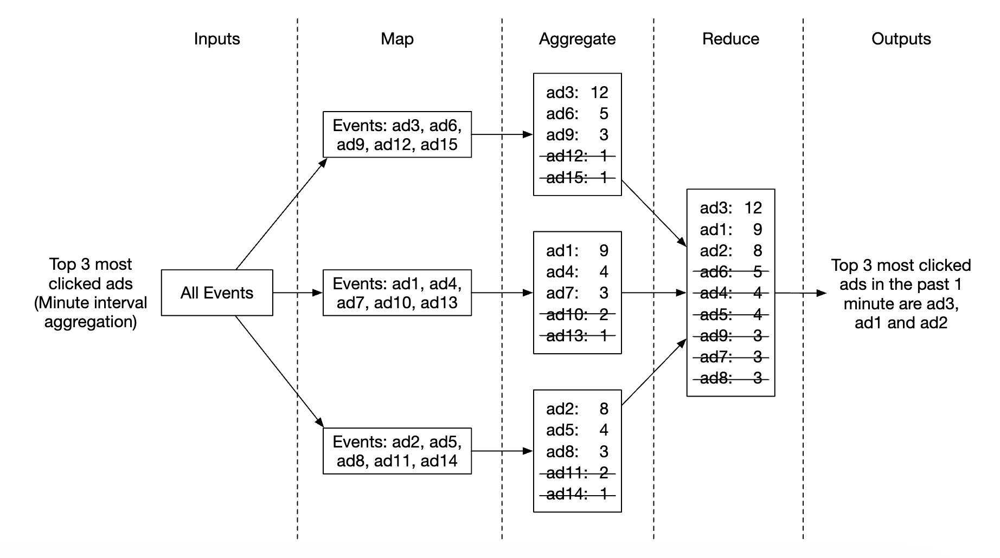
</div>

 - In this case, we're aggregating the top 3 ads, but this can be extended to top N ads easily
 - Each node maintains a heap data structure for fast retrieval of top N ads

**Use-case 3 - data filtering**:
To support fast data filtering, we can predefine filtering criterias and pre-aggregate based on it:
| ad_id | click_minute | country | count |
|-------|--------------|---------|-------|
| ad001 | 202101010001 | USA     | 100   |
| ad001 | 202101010001 | GPB     | 200   |
| ad001 | 202101010001 | others  | 3000  |
| ad002 | 202101010001 | USA     | 10    |
| ad002 | 202101010001 | GPB     | 25    |
| ad002 | 202101010001 | others  | 12    |

This technique is called the **star schema** and is widely used in data warehouses.
The filtering fields are called **dimensions**.

This approach has the following benefits:
 - Simple to undertand and build
 - Current aggregation service can be reused to create more dimensions in the star schema.
 - Accessing data based on filtering criteria is fast as results are pre-calculated

A limitation of this approach is that it creates many more buckets and records, especially when we have lots of filtering criterias.

---

## Step 3: Design Deep Dive
Let's dive deeper into some of the more interesting topics.

### **Streaming vs. Batching**
The high-level architecture we proposed is a type of stream processing system. 
Here's a comparison between three types of systems:
|                         | Services (Online system)      | Batch system (offline system)                          | Streaming system (near real-time system)     |
|-------------------------|-------------------------------|--------------------------------------------------------|----------------------------------------------|
| Responsiveness          | Respond to the client quickly | No response to the client needed                       | No response to the client needed             |
| Input                   | User requests                 | Bounded input with finite size. A large amount of data | Input has no boundary (infinite streams)     |
| Output                  | Responses to clients          | Materialized views, aggregated metrics, etc.           | Materialized views, aggregated metrics, etc. |
| Performance measurement | Availability, latency         | Throughput                                             | Throughput, latency                          |
| Example                 | Online shopping               | MapReduce                                              | Flink [13]                                   |

In our design, we used a mixture of batching and streaming. 

We used streaming for processing data as it arrives and generates aggregated results in near real-time.
We used batching, on the other hand, for historical data backup.

A system which contains two processing paths - batch and streaming, simultaneously, this architecture is called lambda.
A disadvantage is that you have two processing paths with two different codebases to maintain.

Kappa is an alternative architecture, which combines batch and stream processing in one processing path.
The key idea is to use a single stream processing engine.

Lambda architecture:

<div style="margin-left:3rem">
    
</div>

Kappa architecture:

<div style="margin-left:3rem">
    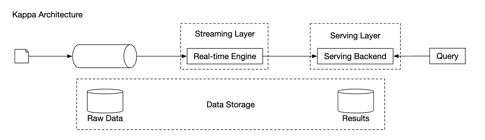
</div>

Our high-level design uses Kappa architecture as reprocessing of historical data also goes through the aggregation service.

Whenever we have to recalculate aggregated data due to eg a major bug in aggregation logic, we can recalculate the aggregation from the raw data we store.
 - Recalculation service retrieves data from raw storage. This is a batch job.
 - Retrieved data is sent to a dedicated aggregation service, so that the real-time processing aggregation service is not impacted.
 - Aggregated results are sent to the second message queue, after which we update the results in the aggregation database.

<div style="margin-left:3rem">
    
</div>

### **Time**
We need a timestamp to perform aggregation. It can be generated in two places:
 - event time - when ad click occurs
 - Processing time - system time when the server processes the event

Due to the usage of async processing (message queues) and network delays, there can be significant difference between event time and processing time.
 - If we use processing time, aggregation results can be inaccurate
 - If we use event time, we have to deal with delayed events

There is no perfect solution, we need to consider trade-offs:
|                 | Pros                                  | Cons                                                                                 |
|-----------------|---------------------------------------|--------------------------------------------------------------------------------------|
| Event time      | Aggregation results are more accurate | Clients might have the wrong time or timestamp might be generated by malicious users |
| Processing time | Server timestamp is more reliable     | The timestamp is not accurate if event is late                                       |

Since data accuracy is important, we'll use the event time for aggregation.

To mitigate the issue of delayed events, a technique called "watermark" can be leveraged.

In the example below, event 2 misses the window where it needs to be aggregated:

<div style="margin-left:3rem">
    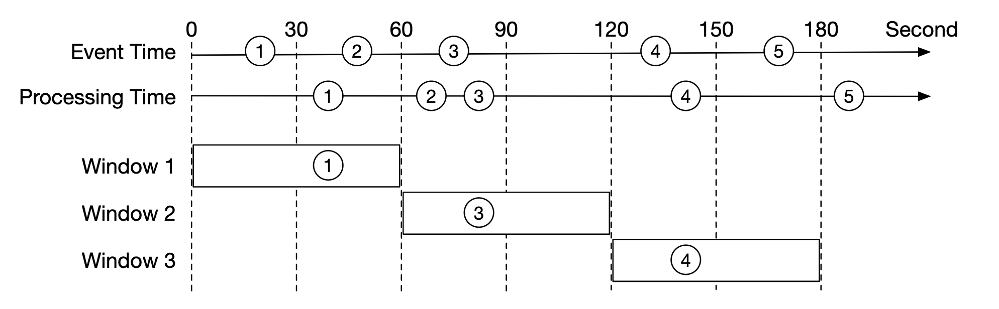
</div>

However, if we purposefully extend the aggregation window, we can reduce the likelihood of missed events.
The extended part of a window is called a "watermark":

<div style="margin-left:3rem">
    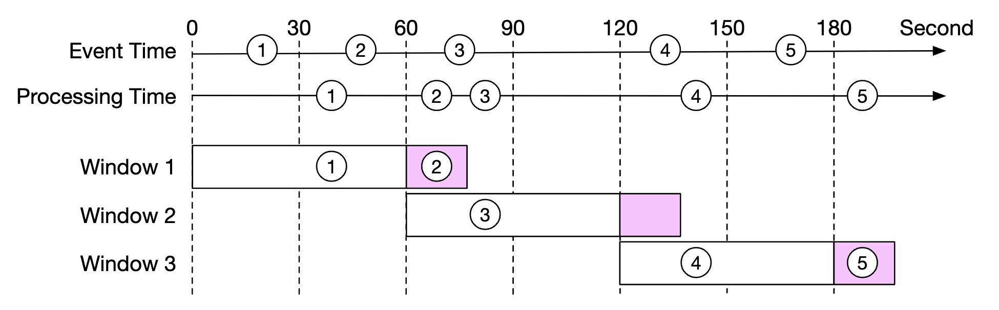
</div>

 - Short watermark increases likelihood of missed events, but reduces latency
 - Longer watermark reduces likelihood of missed events, but increases latency

There is always likelihood of missed events, regardless of the watermark's size. But there is no use in optimizing for such low-probability events.

We can instead resolve such inconsistencies by doing end-of-day reconciliation.

### **Aggregation window**
There are four types of window functions:
 - Tumbling (fixed) window
 - Hopping window
 - Sliding window
 - Session window

In our design, we leverage a tumbling window for ad click aggregations:

<div style="margin-left:3rem">
    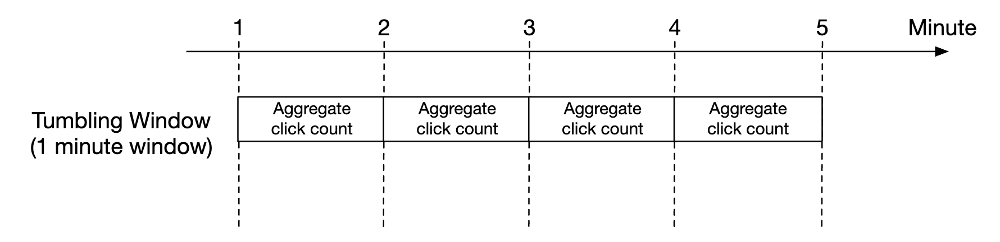
</div>

As well as a sliding window for the top N clicked ads in M minutes aggregation:

<div style="margin-left:3rem">
    
</div>

### **Delivery guarantees**
Since the data we're aggregating is going to be used for billing, data accuracy is a priority.

Hence, we need to discuss:
 - How to avoid processing duplicate events
 - How to ensure all events are processed

There are three delivery guarantees we can use - at-most-once, at-least-once and exactly once.

In most circumstances, at-least-once is sufficient when a small amount of duplicates is acceptable.
This is not the case for our system, though, as a difference in small percent can result in millions of dollars of discrepancy.
Hence, we'll need to use exactly-once delivery semantics.

### **Data deduplication**
One of the most common data quality issues is duplicated data.

It can come from a wide range of sources:
 - Client-side - a client might resend the same event multiple times. Duplicated events sent with malicious intent are best handled by a risk engine.
 - Server outage - An aggregation service node goes down in the middle of aggregation and the upstream service hasn't received an acknowledgment so event is resent.

Here's an example of data duplication occurring due to failure to acknowledge an event on the last hop:

<div style="margin-left:3rem">
    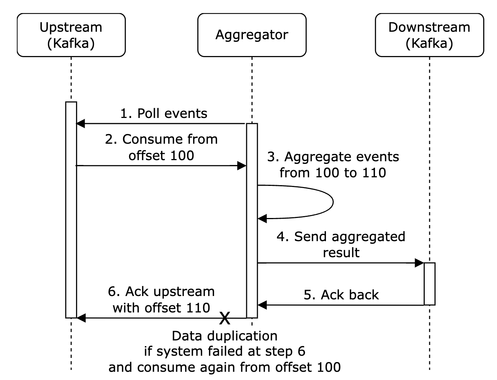
</div>

In this example, offset 100 will be processed and sent downstream multiple times.

One option to try and mitigate this is to store the last seen offset in HDFS/S3, but this risks the result never reaching downstream:

<div style="margin-left:3rem">
    
</div>

Finally, we can store the offset while interacting with downstream atomically. To achieve this, we need to implement a distributed transaction:

<div style="margin-left:3rem">
    
</div>

**Personal side-note**: Alternatively, if the downstream system handles the aggregation result idempotently, there is no need for a distributed transaction.

### **Scale the system**
Let's discuss how we scale the system as it grows.

We have three independent components - message queue, aggregation service and database.
Since they are decoupled, we can scale them independently.

How do we scale the message queue:
 - We don't put a limit on producers, so they can be scaled easily
 - Consumers can be scaled by assigning them to consumer groups and increasing the number of consumers.
 - For this to work, we also need to ensure there are enough partitions created preemptively
 - Also, consumer rebalancing can take a while when there are thousands of consumers so it is recommended to do it off peak hours
 - We could also consider partitioning the topic by geography, eg `topic_na`, `topic_eu`, etc.

<div style="margin-left:3rem">
    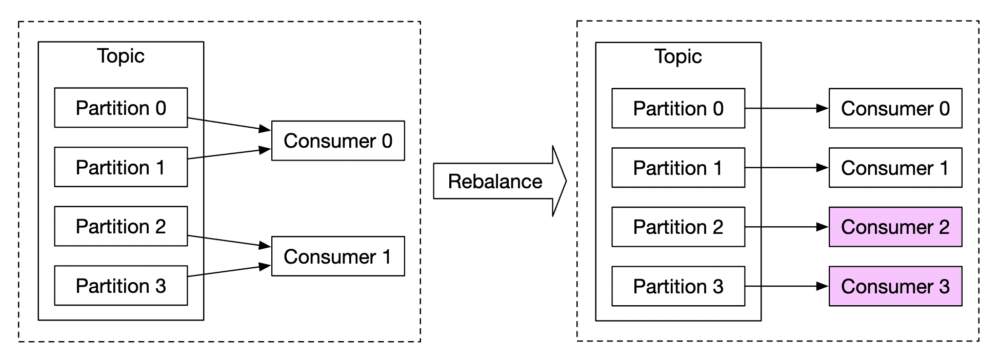
</div>

How do we scale the aggregation service:

<div style="margin-left:3rem">
    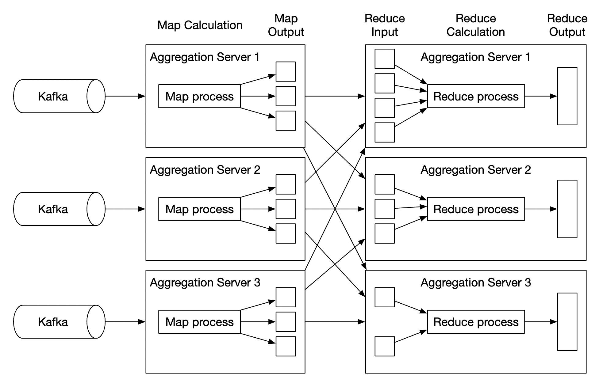
</div>

 - The map-reduce nodes can easily be scaled by adding more nodes
 - The throughput of the aggregation service can be scaled by by utilising multi-threading
 - Alternatively, we can leverage resource providers such as Apache YARN to utilize multi-processing
 - Option 1 is easier, but option 2 is more widely used in practice as it's more scalable
 - Here's the multi-threading example:

<div style="margin-left:3rem">
    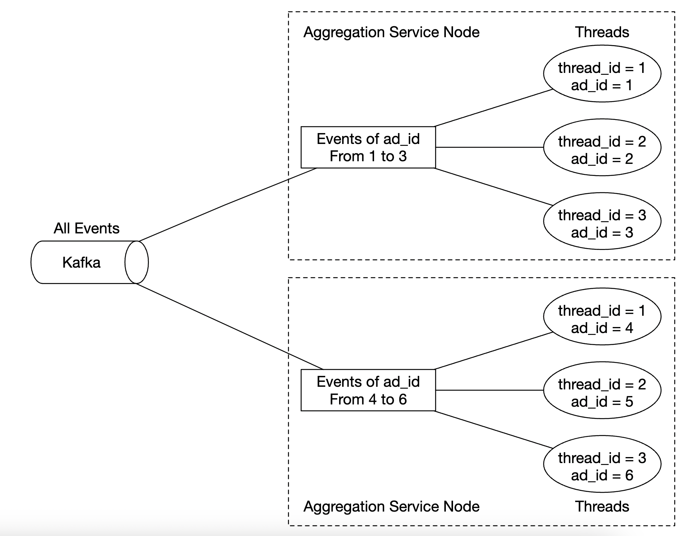
</div>

How do we scale the database:
 - If we use Cassandra, it natively supports horizontal scaling utilizing consistent hashing
 - If a new node is added to the cluster, data automatically gets rebalanced across all (virtual) nodes
 - With this approach, no manual (re)sharding is required

<div style="margin-left:3rem">
    
</div>

Another scalability issue to consider is the hotspot issue - what if an ad is more popular and gets more attention than others?

<div style="margin-left:3rem">
    
</div>

 - In the above example, aggregation service nodes can apply for extra resources via the resource manager
 - The resource manager allocates more resources, so the original node isn't overloaded
 - The original node splits the events into 3 groups and each of the aggregation nodes handles 100 events
 - Result is written back to the original aggregation node

Alternative, more sophisticated ways to handle the hotspot problem:
 - Global-Local Aggregation
 - Split Distinct Aggregation

### **Fault Tolerance**
Within the aggregation nodes, we are processing data in-memory. If a node goes down, the processed data is lost.

We can leverage consumer offsets in kafka to continue from where we left off once another node picks up the slack.
However, there is additional intermediary state we need to maintain, as we're aggregating the top N ads in M minutes.

We can make snapshots at a particular minute for the on-going aggregation:

<div style="margin-left:3rem">
    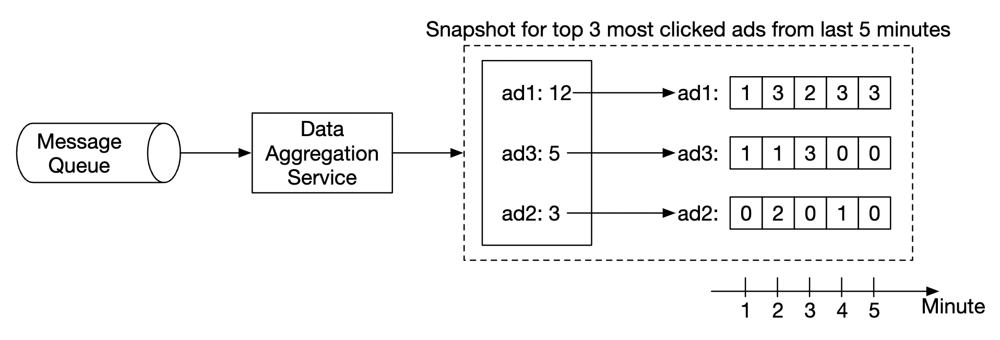
</div>

If a node goes down, the new node can read the latest committed consumer offset, as well as the latest snapshot to continue the job:

<div style="margin-left:3rem">
    
</div>

### **Data monitoring and correctness**
As the data we're aggregating is critical as it's used for billing, it is very important to have rigorous monitoring in place in order to ensure correctness.

Some metrics we might want to monitor:
 - **Latency**: Timestamps of different events can be tracked in order to understand the e2e latency of the system
 - **Message queue size**: If there is a sudden increase in queue size, we need to add more aggregation nodes. As Kafka is implemented via a distributed commit log, we need to keep track of records-lag metrics instead.
 - **System resources on aggregation nodes**: CPU, disk, JVM, etc.

We also need to implement a reconciliation flow which is a batch job, running at the end of the day. 
It calculates the aggregated results from the raw data and compares them against the actual data stored in the aggregation database:

<div style="margin-left:3rem">
    
</div>

### **Alternative design**
In a generalist system design interview, you are not expected to know the internals of specialized software used in big data processing.

Explaining the thought process and discussing trade-offs is more important than knowing specific tools, which is why the chapter covers a generic solution.

An alternative design, which leverages off-the-shelf tooling, is to store ad click data in Hive with an ElasticSearch layer on top built for faster queries.

Aggregation is typically done in OLAP databases such as ClickHouse or Druid.

<div style="margin-left:3rem">
    
</div>

---

## Step 4: Wrap up
Things we covered:
 - Data model and API Design
 - Using MapReduce to aggregate ad click events
 - Scaling the message queue, aggregation service and database
 - Mitigating the hotspot issue
 - Monitoring the system continuously
 - Using reconciliation to ensure correctness
 - Fault tolerance

The ad click event aggregation is a typical big data processing system.

It would be easier to understand and design it if you have prior knowledge of related technologies:
 - Apache Kafka
 - Apache Spark
 - Apache Flink

---

## Most Asked Interview Questions

**Q1. How do you design a system to aggregate ad click events at Facebook/Google scale?**
> High-level flow: Browser/App → Click Tracker (validates, stamps with event time) → Kafka (topic partitioned by `ad_id`) → Flink streaming aggregation (count clicks per `ad_id` per 1-minute window) → results written to ClickHouse/Druid/Cassandra → queried by advertiser dashboards. Kafka handles burst spikes; Flink provides stateful windowed aggregation; a columnar OLAP store (Druid/ClickHouse) handles fast range-scan queries by advertisers. Batch reprocessing layer (Spark on HDFS/S3) corrects historical data.

**Q2. What is the Lambda architecture and how does it apply to ad click aggregation?**
> Lambda architecture has three layers: (1) Batch layer: Spark reads all historical clicks from data lake (S3) → computes accurate aggregates → writes to batch views (Hive/BigQuery); (2) Speed layer: Flink reads real-time Kafka stream → computes approximate real-time aggregates → writes to speed views (Redis/Druid); (3) Serving layer: query merges batch + speed views to answer queries (batch = accurate but stale, speed = up-to-date but may miss late events). Lambda trades off accuracy vs. latency.

**Q3. How does Apache Flink handle time-based windowing?**
> Flink window types: Tumbling window (fixed, non-overlapping: count clicks in each 1-minute bucket), Sliding window (overlapping: 1-minute window sliding every 10 seconds for rolling aggregates), Session window (activity-based: group events within a gap of inactivity). For each window, Flink maintains a keyed state (e.g., click_count per ad_id) and emits a result when the window closes. Windows are keyed by `ad_id` so the state for ad_1 is separate from ad_2.

**Q4. What is the difference between event time and processing time?**
> Processing time: the wall-clock time when the Flink operator processes the event — simple but incorrect if events arrive out of order or late. Event time: the timestamp embedded in the event when it happened (e.g., the time the user clicked the ad) — correct even with reordering/delays; requires watermarks to handle lateness. For ad billing accuracy, always use event time (a click that happened at 11:59:58 PM should count in the 11 PM–12 AM window, not the next window).

**Q5. How do you handle late-arriving events in stream processing?**
> Watermark: a declaration that "no events older than T-10s will arrive." When the watermark advances past a window end time, that window fires. For events arriving after the window fired: (1) Configure `allowedLateness(60 seconds)` — Flink re-fires the window with the corrected aggregate for up to 60s after window close; (2) Events later than 60s go to a side output (dead letter stream) for batch reprocessing. The downstream store (Druid/Cassandra) must support upserts to accept late corrections.

**Q6. How do you achieve exactly-once processing in stream processing?**
> Flink's two-phase commit (2PC) transaction: Kafka consumer reads message → Flink processes → results buffered → at checkpoint time, Flink commits the Kafka offset AND the result write transactionally → if any step fails, rollback to last checkpoint (no partial results). Requires: (1) Kafka consumer in `read_committed` mode; (2) Transactional sink (Kafka producer with transactions, or database supporting upserts with idempotency key). Checkpoint interval = recovery time trade-off (1 min = re-process 1 min of events on failure).

**Q7. How do you deduplicate ad click events to prevent click fraud?**
> First-party deduplication: each click event carries a unique `click_id` (UUID). Flink or a Redis SET (`SADD click_ids {click_id}`) deduplicates within the streaming window. Fraud detection signals: same IP + user_agent clicks same ad >10x in 1 minute, bot traffic patterns (no mouse movement, abnormal click intervals), clicks from known bot IP ranges (blocklists). ML classifier trained on historical fraud patterns scores each click. Fraudulent clicks are not billed to advertiser and are removed from aggregates.

**Q8. What is Real-Time Bidding (RTB) and how does click aggregation support it?**
> RTB: when a user loads a webpage with an ad slot, an auction runs in <100ms to determine which ad to show. Advertisers bid based on targeting criteria. Click aggregation feeds RTB by: (1) Tracking CTR (click-through rate) per ad per segment → helps advertiser optimize bids; (2) Budget tracking: real-time click count × CPC (cost per click) = spend so far → stop bidding when budget exhausted (spend guardrails); (3) Conversion attribution: click → purchase funnel tracked via click aggregation pipeline.

**Q9. How would you reconcile streaming (near-real-time) vs. batch (accurate) results?**
> The streaming pipeline provides results within seconds but may miss late events or have approximation errors. The batch pipeline re-reads raw events from the data lake (S3) nightly → computes accurate aggregates → writes corrections to the serving store. Reconciliation: batch result for `ad_id=123, date=2024-01-15` overwrites the streaming result for the same key. Advertisers see streaming data in dashboards all day, then final accurate data is published at midnight. Delta = streaming vs. batch divergence is monitored; large deltas trigger investigation.

**Q10. How do you scale an ad click aggregation pipeline to handle 10M events per second?**
> Partitioning: Kafka topic with 500+ partitions (partitioned by `ad_id` hash). Flink parallelism = number of partitions = 500 Flink task slots (distributed across a Flink cluster). Each Flink task handles 20K events/sec — easily achievable. OLAP writes: Flink writes batched aggregated results (not raw events) to Druid/ClickHouse — reduces write volume by 99%. Data lake: Kafka → S3 sink (Kafka Connect S3 Sink) runs in parallel, no impact on main pipeline.

**Q11. What is a watermark in Flink and why is it necessary?**
> A watermark is a progress signal in the event time domain. `Watermark(T)` means "I believe all events with event_time ≤ T have been received." Flink uses watermarks to decide when to close and emit a time-based window. Without watermarks, Flink doesn't know when to finalize a "1-minute window" if events can arrive out-of-order. Watermark strategy: `WatermarkStrategy.forBoundedOutOfOrderness(Duration.ofSeconds(10))` — watermark is always 10 seconds behind the max event time seen so far.

**Q12. How do you design the data model for storing aggregated click counts?**
> Raw click events: `{click_id UUID, ad_id BIGINT, user_id BIGINT, timestamp BIGINT, ip VARCHAR, user_agent TEXT, ...}` stored in data lake (S3 Parquet). Aggregated table (Cassandra/ClickHouse): `{ad_id BIGINT, window_start TIMESTAMP, window_end TIMESTAMP, click_count BIGINT, unique_users BIGINT, spend DECIMAL}` — primary key `(ad_id, window_start)`. Query: total clicks for ad_123 on 2024-01-15 → range scan on `(ad_id=123, window_start BETWEEN ... AND ...)`.

**Q13. How would you scale to support different aggregation windows (1 min, 1 hour, 1 day)?**
> Multi-resolution aggregation: Flink outputs 1-minute aggregates to ClickHouse/Druid. ClickHouse materialized views auto-aggregate 1-minute rows into 1-hour and 1-day rollups. Alternatively: run three Flink pipelines in parallel with different window sizes (more compute but simpler code). Serving: advertiser queries for hourly/daily data hit the pre-aggregated rollup tables — fast queries regardless of time range. Avoid scanning 1-minute rows for a 30-day query.

**Q14. How does Flink handle state management and what happens on a crash?**
> Flink maintains operator state (e.g., click counts per ad_id per window) in a distributed state backend: HashMap (in-memory, fast, not fault-tolerant), RocksDB (on-disk, fault-tolerant, handles state larger than RAM). Checkpointing: Flink periodically snapshots all operator state to durable storage (S3). On crash → restart from last checkpoint → re-read Kafka from checkpointed offsets → re-apply events since checkpoint. Recovery time ≈ checkpoint interval (typically 1–5 minutes of data to re-process).

**Q15. What is the Kappa architecture and when is it preferred over Lambda?**
> Kappa architecture: eliminate the batch layer. Use only streaming (Flink/Kafka). Historical reprocessing is done by replaying Kafka topics (possible if retention is long enough). Simpler to operate (one codebase, one pipeline). Preferable when: event processing logic is simple + Kafka retention is long enough for full historical replay. Lambda is preferred when: batch layer produces significantly more accurate results, or historical data exceeds Kafka retention, or batch SQL is easier to maintain than streaming code.

**Q16. How do you track unique ad viewers (reach) across a large dataset cheaply?**
> Exact unique count requires storing all user_ids seen — too much memory for millions of ads × users. Approximate: HyperLogLog (HLL) data structure counts distinct values with ~1% error using only 12KB of memory per counter. Flink `HyperLogLogPlusPlus` or Redis HLL (`PFADD`/`PFCOUNT`). For ad reach reporting: HLL is standard industry practice. Can merge HLLs across time windows or servers (union operation) — enabling approximate unique viewer counts across weeks/months.

**Q17. What is a MapReduce approach for batch aggregation of ad clicks?**
> Map phase: read raw click log files from HDFS/S3 → emit `(ad_id, 1)` for each click. Reduce phase: for each `ad_id`, sum all counts → `(ad_id, total_clicks)`. One MapReduce job per day of historical data. Spark DataFrame version: `df.groupBy("ad_id", "date").agg(count("click_id").alias("clicks"))`. Runs as nightly batch → overwrites results in serving store. Map phase easily parallelized across thousands of nodes; network shuffle (map → reduce) is the bottleneck.

**Q18. How do you handle the case where an advertiser wants to query very high cardinality dimensions?**
> High cardinality: ad campaigns + publisher sites + device types + geo + time = query over billions of combinations. Solutions: (1) Column-oriented OLAP stores (ClickHouse, Druid, BigQuery) are optimized for this — scan only needed columns; (2) Pre-aggregate common combinations as materialized views; (3) Return approximate results for unusual queries; (4) Query with sampling (analyze a 10% sample, scale up by 10x) for exploratory queries. Avoid `GROUP BY user_id` on billions of rows in real-time dashboards.

**Q19. How do you design the database schema for an ad spend tracking system?**
> `campaigns` table: `{campaign_id, advertiser_id, daily_budget, total_budget, start_date, end_date}`. `ad_aggregates` table (ClickHouse): `{campaign_id, ad_id, window DATETIME, clicks BIGINT, impressions BIGINT, spend DECIMAL}`. `budget_tracker` (Redis): `{campaign_id → current_spend}` — updated on each aggregate write → compared to daily_budget → trigger spend-cap when exceeded. Real-time budget enforcement uses Redis; exact accounting uses ClickHouse/Cassandra.

**Q20. How do you monitor the streaming pipeline itself for anomalies?**
> Monitor: Kafka consumer lag (should be near 0 — lag spike = Flink is slow), Flink checkpointing success rate and duration, output record rate (sudden drop = bug), input vs. output click ratio (expected ~1:1 before aggregation), processing latency (time from Kafka read to Druid write). Alert: consumer lag >10K for >5 minutes. Dead-man's switch: if no clicks in 5 minutes during peak hours → alert (pipeline may be dead). Compare streaming totals vs. yesterday's value as a sanity check.

**Q21. What is click attribution and how is it modeled in the data pipeline?**
> Attribution: which ad click gets credit for a conversion (purchase/signup)? Models: last-click attribution (simplest: the last ad the user clicked before converting), first-click, linear (all clicks equally), time-decay, data-driven (ML model). Implementation: `conversions` event arrives → join with `ad_clicks` for the same user in a lookback window (30 days) via stream-stream join in Flink or batch join in Spark → apply attribution model → write `attributed_conversion` record. Attribution joins are complex due to out-of-order events.

**Q22. How do you handle time zone differences in ad click reporting?**
> Store all click events with UTC timestamps in the data lake. Advertiser queries specify their timezone offset. At query time, convert window boundaries to UTC: "clicks on 2024-01-15 in PST" = `window_start >= 2024-01-15 08:00:00 UTC AND window_start < 2024-01-16 08:00:00 UTC`. Pre-aggregated rollup tables are in UTC → per-timezone rollups computed on demand or materialized for each timezone separately (expensive but faster queries).

**Q23. How do you prevent the Flink aggregation job from blowing up memory when tracking state?**
> Flink state can grow unbounded if unmanaged. Limit state: (1) Use windowed aggregation (state is per-window, cleared when window closes); (2) If using keyed state outside windows, set a state TTL (`StateTtlConfig` with 1-day TTL); (3) Use RocksDB state backend (spills to disk when RAM is full — supports large state); (4) Limit the total number of distinct keys (don't use high-cardinality keys as Flink key — use bounded `ad_id`). Monitor Flink TaskManager heap and RocksDB disk usage.

**Q24. How does the system handle double-counting if a Kafka consumer restarts mid-window?**
> At-least-once: Kafka consumer may re-read events after restart → Flink re-processes some events → click counts may be too high. Solutions: (1) Exactly-once via Flink checkpointing + transactional sinks (2PC) — this is the gold standard; (2) Idempotent writes: each aggregated window result has a deterministic key `(ad_id, window_start)` → Cassandra/ClickHouse upserts on that key replace (not add to) the existing count; (3) Deduplication using `click_id` in a Bloom filter before counting.

**Q25. How would you design the system to support A/B testing of ad formats?**
> Each click event carries `{experiment_id, variant_id, ad_id, ...}`. Flink aggregates clicks grouped by `(experiment_id, variant_id, ad_id, window)`. Result: click-through rates and conversions by variant. Statistical significance: batch job (Spark) reads raw events and runs t-test or Bayesian inference on the aggregated data. Dashboard shows CTR per variant with confidence intervals. The pipeline needs no special changes — experiment metadata is just another dimension in the aggregation.

**Q26. How do you ensure data integrity between the real-time dashboard (Flink) and the billing system (batch)?**
> Billing must be exact (not approximate). Architecture: (1) Real-time dashboard reads from Flink aggregates (fast, may have slight errors from late events); (2) Billing reads from the nightly batch aggregation run on the immutable raw click log in S3 → reconciled exactly-once counts using batch deduplication; (3) End-of-day reconciliation: compare batch billing total vs. Flink day total → investigate if divergence >0.1%. Advertisers are charged from the batch result, not the streaming result.

**Q27. What are the most critical components of an ad click event aggregation system?**
> (1) Click Tracker: validates, deduplicates, stamps events with event_time → Kafka. (2) Kafka: durable backpressure-absorbing event backbone, partitioned by `ad_id`. (3) Flink: stateful exactly-once streaming aggregation with event-time windowing. (4) OLAP Store (Druid/ClickHouse/Cassandra): stores aggregated results, serves advertiser queries. (5) Data Lake (S3 + Parquet): stores raw click events for batch reprocessing. (6) Fraud Detection: ML-based classifier + rule-based deduplication. (7) Budget Guardrails: Redis-backed real-time spend tracker prevents overspend.
