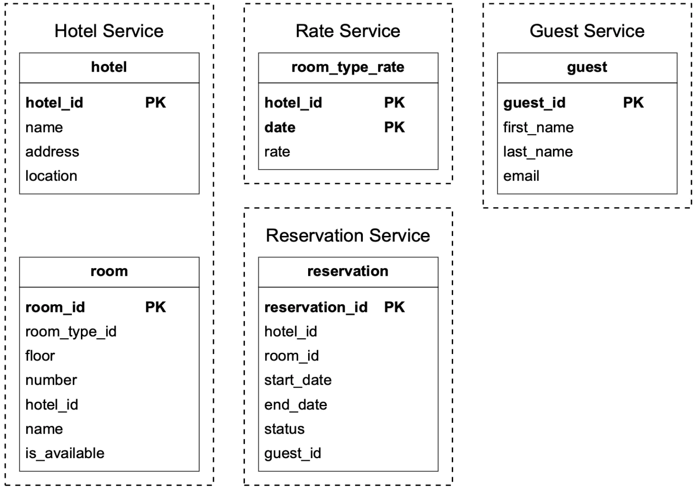
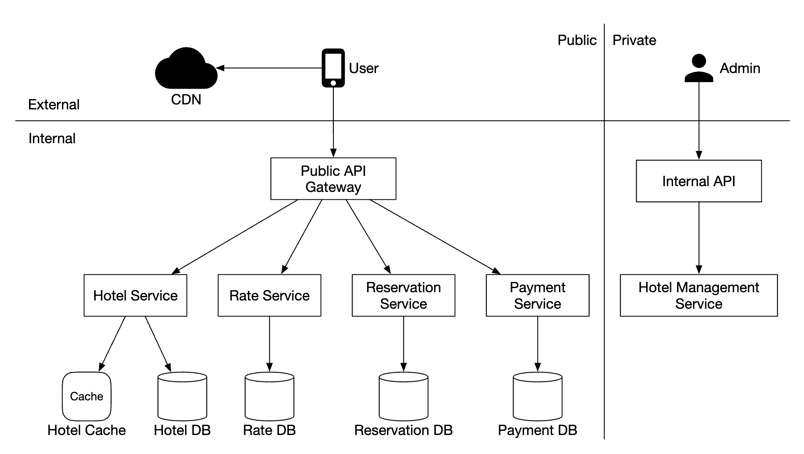
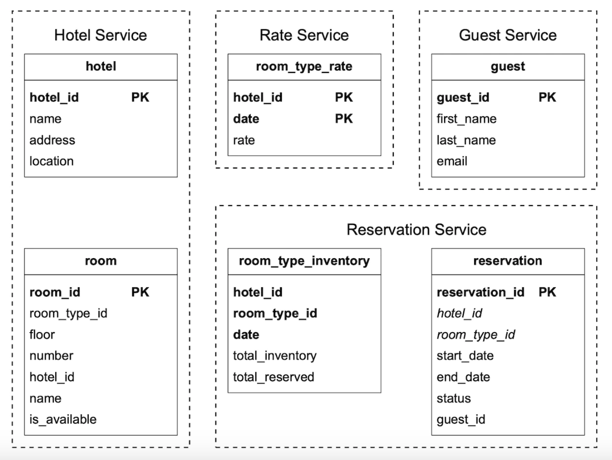
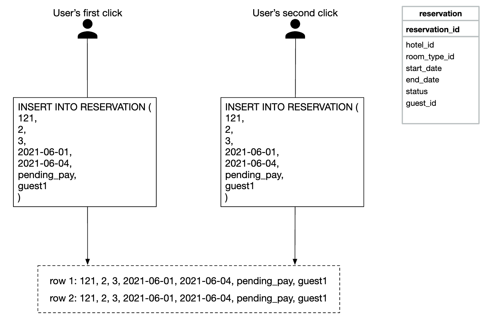
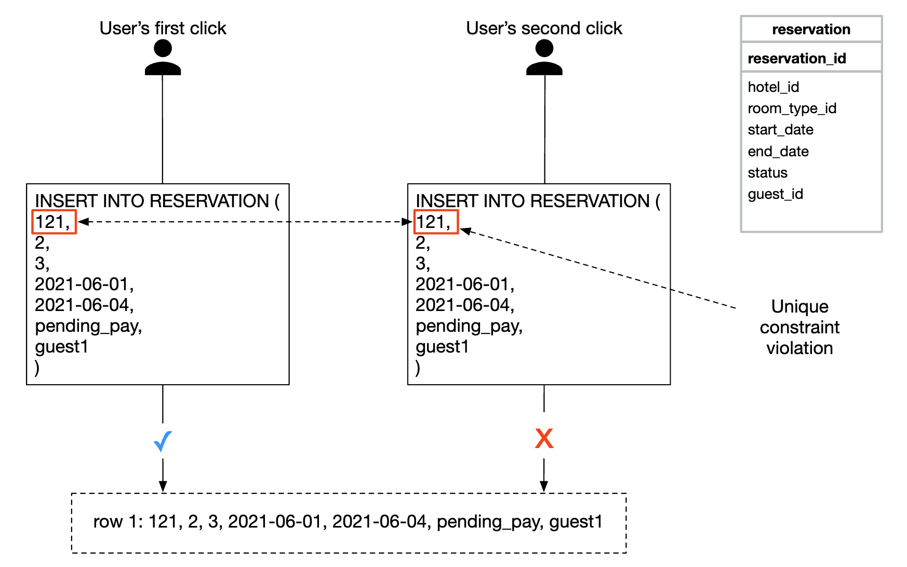
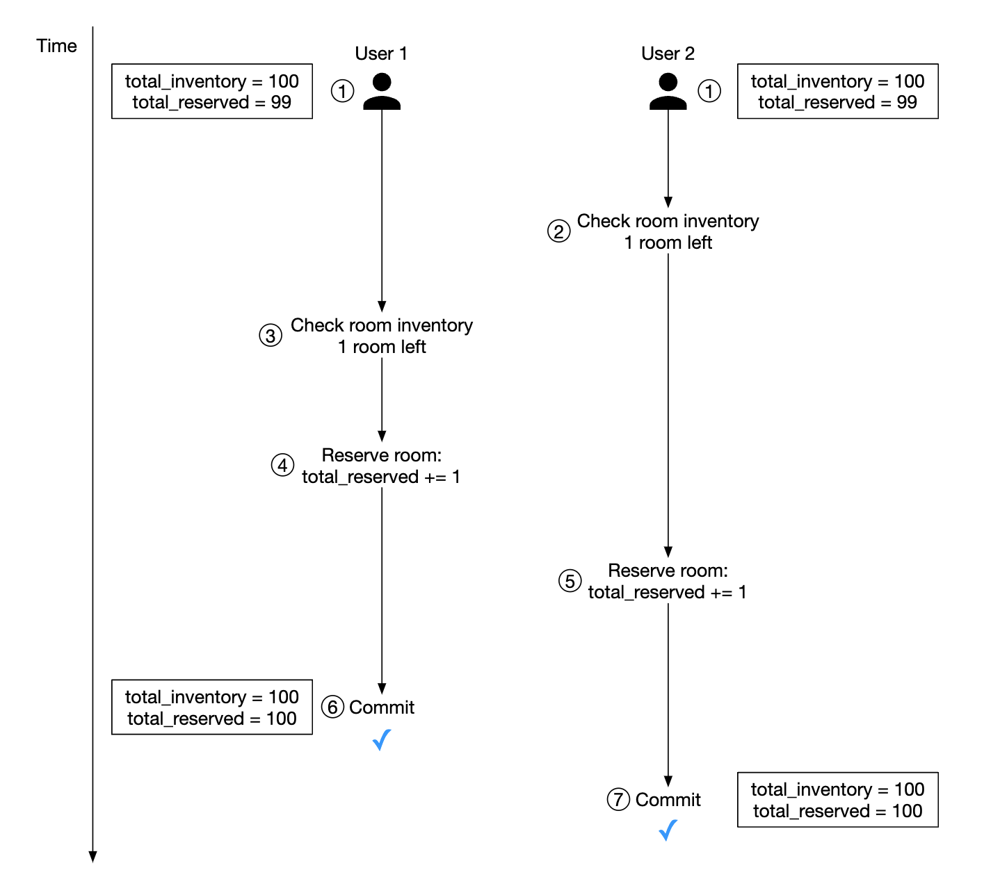
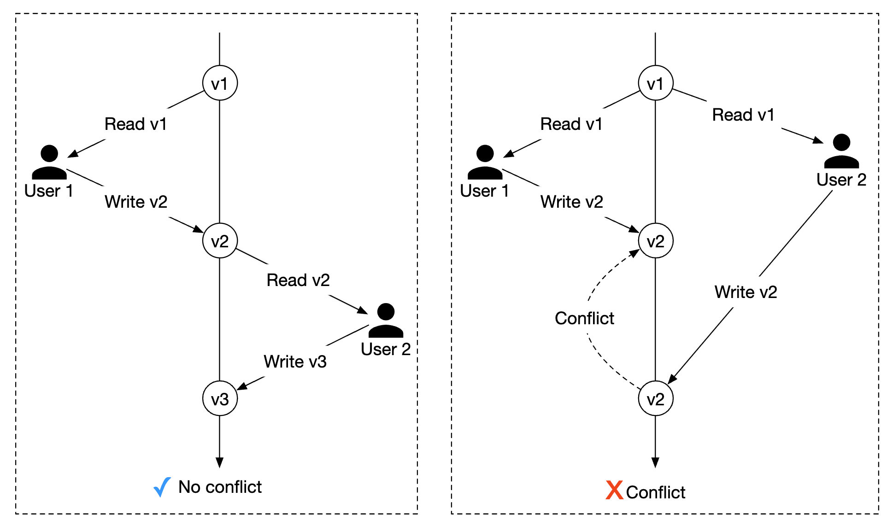
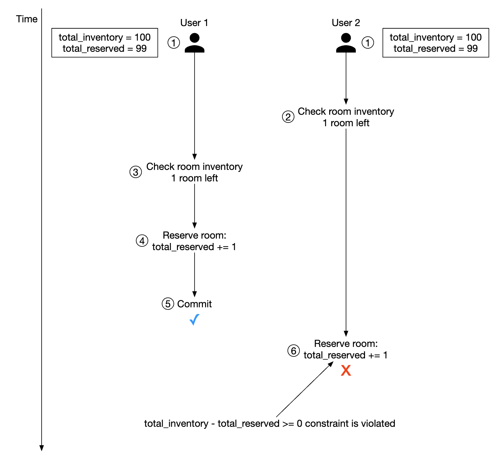
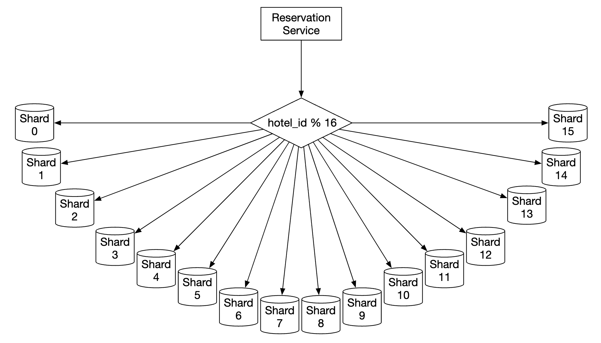
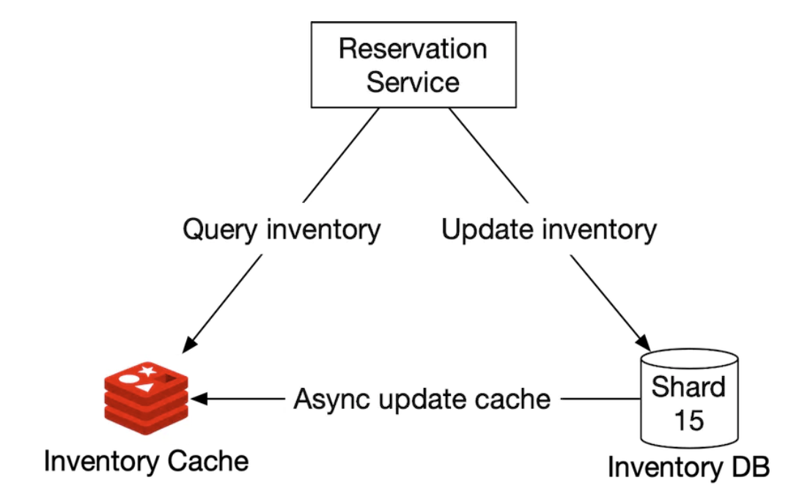

# Chapter 22: Hotel Reservation System

## Introduction
In this chapter, we're designing a **hotel reservation system**, similar to Marriott International.

Applicable to other types of systems as well - Airbnb, flight reservation, movie ticket booking.

---

## Step 1: Understand the Problem and Establish Design Scope
Before diving into designing the system, we should ask the interviewer questions to clarify the scope:
 - C: What is the scale of the system?
 - I: We're building a website for a hotel chain \w 5000 hotels and 1mil rooms
 - C: Do customers pay when they make a reservation or when they arrive at the hotel?
 - I: They pay in full when making reservations.
 - C: Do customers book hotel rooms through the website only? Do we have to support other reservation options such as phone calls?
 - I: They make bookings through the website or app only.
 - C: Can customers cancel reservations?
 - I: Yes
 - C: Other things to consider?
 - I: Yes, we allow overbooking by 10%. Hotel will sell more rooms than there actually are. Hotels do this in anticipation that clients will cancel bookings.
 - C: Since not much time, we'll focus on - show hotel-related page, hotel-room details page, reserve a room, admin panel, support overbooking.
 - I: Sounds good.
 - I: One more thing - hotel prices change all the time. Assume a hotel room's price changes every day.
 - C: OK.

### **Non-functional requirements**
 - Support high concurrency - there might be a lot of customers trying to book the same hotel during peak season.
 - Moderate latency - it's ideal to have low latency when a user makes a reservation, but it's acceptable if the system takes a few seconds to process it.

### **Back-of-the-envelope estimation**
 - 5000 hotels and 1mil rooms in total
 - Assume 70% of rooms are occupied and average stay duration is 3 days
 - Estimated daily reservations - 1mil * 0.7 / 3 = ~240k reservations per day
 - Reservations per second - 240k / 10^5 seconds in a day = ~3. Average reservation TPS is low.

Let's estimate the QPS. If we assume that there are three steps to reach the reservation page and there is a 10% conversion rate per page,
we can estimate that if there are 3 reservations, then there must be 30 views of reservation page and 300 views of hotel room detail page.

<div style="margin-left:3rem">
    
</div>

---

## Step 2: Propose High-Level Design and Get Buy-In
We'll explore - API Design, Data model, high-level design.

### **API Design**
This API Design focuses on the core endpoints (using RESTful practices), we'll need in order to support a hotel reservation system.

A fully-fledged system would require a more extensive API with support for searching for rooms based on lots of criteria, but we won't be focusing on that in this section.
Reason is that they aren't technically challenging, so they're out of scope.

**Hotel-related API**
 - `GET /v1/hotels/{id}` - get detailed info about a hotel
 - `POST /v1/hotels` - add a new hotel. Only available to ops
 - `PUT /v1/hotels/{id}` - update hotel info. Only available to ops
 - `DELETE /v1/hotels/{id}` - delete a hotel. API is only available to ops

**Room-related API**
 - `GET /v1/hotels/{id}/rooms/{id}` - get detailed information about a room
 - `POST /v1/hotels/{id}/rooms` - Add a room. Only available to ops
 - `PUT /v1/hotels/{id}/rooms/{id}` - Update room info. Only available to ops
 - `DELETE /v1/hotels/{id}/rooms/{id}` - Delete a room. Only available to ops

**Reservation-related API**
 - `GET /v1/reservations` - get reservation history of current user
 - `GET /v1/reservations/{id}` - get detailed info about a reservation
 - `POST /v1/reservations` - make a new reservation
 - `DELETE /v1/reservations/{id}` - cancel a reservation

Here's an example request to make a reservation:

```
{
  "startDate":"2021-04-28",
  "endDate":"2021-04-30",
  "hotelID":"245",
  "roomID":"U12354673389",
  "reservationID":"13422445"
}
```

Note that the `reservationID` is an idempotency key to avoid double booking. Details explained in [concurrency section](#concurrency-issues)

### **Data model**
Before we choose what database to use, let's consider our access patterns.

We need to support the following queries:
 - View detailed info about a hotel
 - Find available types of rooms given a date range
 - Record a reservation
 - Look up a reservation or past history of reservations

From our estimations, we know the scale of the system is not large, but we need to prepare for traffic surges.

Given this knowledge, we'll choose a relational database because:
 - Relational DBs work well with read-heavy and less write-heavy systems.
 - NoSQL databases are normally optimized for writes, but we know we won't have many as only a fraction of users who visit the site make a reservation.
 - Relational DBs provide ACID guarantees. These are important for such a system as without them, we won't be able to prevent problems such as negative balance, double charge, etc.
 - Relational DBs can easily model the data as the structure is very clear.

Here is our schema design:

<div style="margin-left:3rem">
    
</div>

Most fields are self-explanatory. Only field worth mentioning is the `status` field which represents the state machine of a given room:

<div style="margin-left:3rem">
    
</div>

This data model works well for a system like Airbnb, but not for hotels where users don't reserve a particular room but a room type.
They reserve a type of room and a room number is chosen at the point of reservation.

This shortcoming will be addressed in the [Improved Data Model](#improved-data-model) section.

### **High-level Design**
We've chosen a microservice architecture for this design. It has gained great popularity in recent years:

<div style="margin-left:3rem">
    
</div>

 - **Users**: book a hotel room on their phone or computer
 - **Admin**: perform administrative functions such as refunding/cancelling a payment, etc
 - **CDN**: caches static resources such as JS bundles, images, videos, etc
 - **Public API Gateway**: fully-managed service which supports rate limiting, authentication, etc.
 - **Internal APIs**: only visible to authorized personnel. Usually protected by a VPN.
 - **Hotel service**: provides detailed information about hotels and rooms. Hotel and room data is static, so it can be cached aggressively.
 - **Rate service**: provides room rates for different future dates. An interesting note about this domain is that prices depend on how full a hotel is at a given day.
 - **Reservation service**: receives reservation requests and reserves hotel rooms. Also tracks room inventory as reservations are made/cancelled.
 - **Payment service**: processes payments and updates reservation statuses on success.
 - **Hotel management service**: available to authorized personnel only. Allows certain administrative functions for managing and viewing reservations, hotels, etc.

Inter-service communication can be facilitated via a RPC framework, such as gRPC.

---

## Step 3: Design Deep Dive
Let's dive deeper into:
 - Improved data model
 - Concurrency issues
 - Scalability
 - Resolving data inconsistency in microservices

### **Improved data model**
As mentioned in a previous section, we need to amend our API and schema to enable reserving a type of room vs. a particular one.

For the reservation API, we no longer reserve a `roomID`, but we reserve a `roomTypeID`:

```
POST /v1/reservations
{
  "startDate":"2021-04-28",
  "endDate":"2021-04-30",
  "hotelID":"245",
  "roomTypeID":"12354673389",
  "roomCount":"3",
  "reservationID":"13422445"
}
```

Here's the updated schema:

<div style="margin-left:3rem">
    
</div>

 - **room**: contains information about a room
 - **room_type_rate**: contains information about prices for a given room type
 - **reservation**: records guest reservation data
 - **room_type_inventory**: stores inventory data about hotel rooms. 

Let's take a look at the `room_type_inventory` columns as that table is more interesting:
 - **hotel_id**: id of hotel
 - **room_type_id**: id of a room type
 - **date**: a single date
 - **total_inventory**: total number of rooms minus those that are temporarily taken off the inventory.
 - **total_reserved**: total number of rooms booked for given (hotel_id, room_type_id, date)

There are alternative ways to design this table, but having one room per (hotel_id, room_type_id, date) enables easy 
reservation management and easier queries.

The rows in the table are pre-populated using a daily CRON job.

Sample data:
| hotel_id | room_type_id | date       | total_inventory | total_reserved |
|----------|--------------|------------|-----------------|----------------|
| 211      | 1001         | 2021-06-01 | 100             | 80             |
| 211      | 1001         | 2021-06-02 | 100             | 82             |
| 211      | 1001         | 2021-06-03 | 100             | 86             |
| 211      | 1001         | ...        | ...             |                |
| 211      | 1001         | 2023-05-31 | 100             | 0              |
| 211      | 1002         | 2021-06-01 | 200             | 16             |
| 2210     | 101          | 2021-06-01 | 30              | 23             |
| 2210     | 101          | 2021-06-02 | 30              | 25             |

Sample SQL query to check the availability of a type of room:

```
SELECT date, total_inventory, total_reserved
FROM room_type_inventory
WHERE room_type_id = ${roomTypeId} AND hotel_id = ${hotelId}
AND date between ${startDate} and ${endDate}
```

How to check availability for a specified number of rooms using that data (note that we support overbooking):

```
if (total_reserved + ${numberOfRoomsToReserve}) <= 110% * total_inventory
```

Now let's do some estimation about the storage volume.
 - We have 5000 hotels.
 - Each hotel has 20 types of rooms.
 - 5000 * 20 * 2 (years) * 365 (days) = 73mil rows

73 million rows is not a lot of data and a single database server can handle it.
It makes sense, however, to setup read replication (potentially across different zones) to enable high availability.

Follow-up question - if reservation data is too large for a single database, what would you do?
 - Store only current and future reservation data. Reservation history can be moved to cold storage.
 - Database sharding - we can shard our data by `hash(hotel_id) % servers_cnt` as we always select the `hotel_id` in our queries.

### **Concurrency issues**
Another important problem to address is double booking.

There are two issues to address:
 - Same user clicks on "book" twice
 - Multiple users try to book a room at the same time

Here's a visualization of the first problem:

<div style="margin-left:3rem">
    
</div>

There are two approaches to solving this problem:
 - Client-side handling - front-end can disable the book button once clicked. If a user disabled javascript, however, they won't see the button becoming grayed out.
 - Idemptent API - Add an idempotency key to the API, which enables a user to execute an action once, regardless of how many times the endpoint is invoked:

<div style="margin-left:3rem">
    
</div>

Here's how this flow works:
 - A reservation order is generated once you're in the process of filling in your details and making a booking. The reservation order is generated using a globally unique identifier.
 - Submit reservation 1 using the `reservation_id` generated in the previous step.
 - If "complete booking" is clicked a second time, the same `reservation_id` is sent and the backend detects that this is a duplicate reservation.
 - The duplication is avoided by making the `reservation_id` column have a unique constraint, preventing multiple records with that id being stored in the DB.

<div style="margin-left:3rem">
    
</div>

What if there are multiple users making the same reservation?

<div style="margin-left:3rem">
    
</div>

 - Let's assume the transaction isolation level is not serializable
 - User 1 and 2 attempt to book the same room at the same time.
 - Transaction 1 checks if there are enough rooms - there are
 - Transaction 2 check if there are enough rooms - there are
 - Transaction 2 reserves the room and updates the inventory
 - Transaction 1 also reserves the room as it still sees there are 99 `total_reserved` rooms out of 100.
 - Both transactions successfully commit the changes

This problem can be solved using some form of locking mechanism:
 - Pessimistic locking
 - Optimistic locking
 - Database constraints

Here's the SQL we use to reserve a room:

```sql
# step 1: check room inventory
SELECT date, total_inventory, total_reserved
FROM room_type_inventory
WHERE room_type_id = ${roomTypeId} AND hotel_id = ${hotelId}
AND date between ${startDate} and ${endDate}

# For every entry returned from step 1
if((total_reserved + ${numberOfRoomsToReserve}) > 110% * total_inventory) {
  Rollback
}

# step 2: reserve rooms
UPDATE room_type_inventory
SET total_reserved = total_reserved + ${numberOfRoomsToReserve}
WHERE room_type_id = ${roomTypeId}
AND date between ${startDate} and ${endDate}

Commit
```

#### Option 1: Pessimistic locking
Pessimistic locking prevents simultaneous updates by putting a lock on a record while it's being updated.

This can be done in MySQL by using the `SELECT... FOR UPDATE` query, which locks the rows selected by the query until the transaction is committed.

<div style="margin-left:3rem">
    
</div>

Pros:
 - Prevents applications from updating data that is being changed
 - Easy to implement and avoids conflict by serializing updates. Useful when there is heavy data contention.

Cons:
 - Deadlocks may occur when multiple resources are locked.
 - This approach is not scalable - if transaction is locked for too long, this has impact on all other transactions trying to access the resource.
 - The impact is severe when the query selects a lot of resources and the transaction is long-lived.

The author doesn't recommend this approach due to its scalability issues.

#### Option 2: Optimistic locking
Optimistic locking allows multiple users to attempt to update a record at the same time.

There are two common ways to implement it - version numbers and timestamps. Version numbers are recommended as server clocks can be inaccurate.

<div style="margin-left:3rem">
    
</div>

 - A new `version` column is added to the database table
 - Before a user modifies a database row, the version number is read
 - When the user updates the row, the version number is increased by 1 and written back to the database
 - Database validation prevents the insert if the new version number doesn't exceed the previous one

Optimistic locking is usually faster than pessimistic locking as we're not locking the database. 
Its performance tends to degrade when concurrency is high, however, as that leads to a lot of rollbacks.

Pros:
 - It prevents applications from editing stale data
 - We don't need to acquire a lock in the database
 - Preferred option when data contention is low, ie rarely are there update conflicts

Cons:
 - Performance is poor when data contention is high

Optimistic locking is a good option for our system as reservation QPS is not extremely high.

#### Option 3: Database constraints
This approach is very similar to optimistic locking, but the guardrails are implemented using a database constraint:

```
CONSTRAINT `check_room_count` CHECK((`total_inventory - total_reserved` >= 0))
```

<div style="margin-left:3rem">
    
</div>

Pros:
 - Easy to implement
 - Works well when data contention is small

Cons:
 - Similar to optimistic locking, performs poorly when data contention is high
 - Database constraints cannot be easily version-controlled like application code
 - Not all databases support constraints

This is another good option for a hotel reservation system due to its ease of implementation.

### **Scalability**
Usually, the load of a hotel reservation system is not high. 

However, the interviewer might ask you how you'd handle a situation where the system gets adopted for a larger, popular travel site such as booking.com
In that case, QPS can be 1000 times larger.

When there is such a situation, it is important to understand where our bottlenecks are. All the services are stateless, so they can be easily scaled via replication.

The database, however, is stateful and it's not as obvious how it can get scaled.

One way to scale it is by implementing database sharding - we can split the data across multiple databases, where each of them contain a portion of the data.

We can shard based on `hotel_id` as all queries filter based on it. 
Assuming, QPS is 30,000, after sharding the database in 16 shards, each shard handles 1875 QPS, which is within a single MySQL cluster's load capacity.

<div style="margin-left:3rem">
    
</div>

We can also utilize caching for room inventory and reservations via Redis. We can set TTL so that old data can expire for days which are past.

<div style="margin-left:3rem">
    
</div>

The way we store an inventory is based on the `hotel_id`, `room_type_id` and `date`:

```
key: hotelID_roomTypeID_{date}
value: the number of available rooms for the given hotel ID, room type ID and date.
```

Data consistency happens async and is managed by using a CDC streaming mechanism - database changes are read and applied to a separate system.
Debezium is a popular option for synchronizing database changes with Redis.

Using such a mechanism, there is a possibility that the cache and database are inconsistent for some time.
This is fine in our case because the database will prevent us from making an invalid reservation.

This will cause some issue on the UI as a user would have to refresh the page to see that "there are no more rooms left", 
but that is something which can happen regardless of this issue if eg a person hesitates a lot before making a reservation.

Caching pros:
 - Reduced database load
 - High performance, as Redis manages data in-memory

Caching cons:
 - Maintaining data consistency between cache and DB is hard. We need to consider how the inconsistency impacts user experience.

### **Data consistency among services**
A monolithic application enables us to use a shared relational database for ensuring data consistency.

In our microservice design, we chose a hybrid approach where some services are separate, 
but the reservation and inventory APIs are handled by the same servicefor the reservation and inventory APIs.

This is done because we want to leverage the relational database's ACID guarantees to ensure consistency.

However, the interviewer might challenge this approach as it's not a pure microservice architecture, where each service has a dedicated database:

<div style="margin-left:3rem">
    
</div>

This can lead to consistency issues. In a monolithic server, we can leverage a relational DBs transaction capabilities to implement atomic operations:

<div style="margin-left:3rem">
    
</div>

It's more challenging, however, to guarantee this atomicity when the operation spans across multiple services:

<div style="margin-left:3rem">
    
</div>

There are some well-known techniques to handle these data inconsistencies:
 - **Two-phase commit**: a database protocol which guarantees atomic transaction commit across multiple nodes. 
   It's not performant, though, since a single node lag leads to all nodes blocking the operation.
 - **Saga**: a sequence of local transactions, where compensating transactions are triggered if any of the steps in a workflow fail. This is an eventually consistent approach.

It's worth noting that addressing data inconsistencies across microservices is a challenging problem, which raise the system complexity.
It is good to consider whether the cost is worth it, given our more pragmatic approach of encapsulating dependent operations within the same relational database.

---

## Step 4: Wrap Up
We presented a design for a hotel reservation system.

These are the steps we went through:
 - Gathering requirements and doing back-of-the-envelope calculations to understand the system's scale
 - We presented the API Design, Data Model and system architecture in the high-level design
 - In the deep dive, we explored alternative database schema designs as requirements changed
 - We discussed race conditions and proposed solutions - pessimistic/optimistic locking, database constraints
 - Ways to scale the system via database sharding and caching
 - Finally we addressed how to handle data consistency issues across multiple microservices

---

## Most Asked Interview Questions

**Q1. How do you prevent double-booking when multiple users book the same room simultaneously?**
> The classic race condition: two threads both read `available_count=1`, both check `>0`, both decrement — result: `-1` (overbooking). Solution: database-level optimistic locking — add a `version` column to the inventory row. Update statement: `UPDATE room_inventory SET available_count = available_count - 1, version = version + 1 WHERE room_id = ? AND date = ? AND available_count > 0 AND version = ?`. If 0 rows updated, another transaction won the race → retry. This avoids pessimistic locks (which serialize all bookings for that room).

**Q2. What is the difference between optimistic and pessimistic locking and when do you use each?**
> Pessimistic locking: `SELECT ... FOR UPDATE` → DB-level exclusive lock held until transaction commits. Prevents all concurrent access to the row. Use when: high contention (many concurrent users booking same room), short transactions. Downside: reduced throughput under load, risk of deadlock. Optimistic locking: no lock held; use version/CAS check at update time; retry on conflict. Use when: low-to-medium contention, transactions may take longer, better read throughput. Hotel booking: use optimistic (most rooms have low contention most of the time).

**Q3. How would you design the database schema for a hotel reservation system?**
> `hotels(hotel_id, name, location, ...)`. `room_types(room_type_id, hotel_id, name, capacity, price)`. `rooms(room_id, hotel_id, room_type_id, floor, number)`. `room_inventory(hotel_id, room_type_id, date DATE, total_count INT, reserved_count INT, version INT)` — one row per room-type per date, updated atomically for availability checks. `reservations(reservation_id, user_id, hotel_id, room_type_id, check_in DATE, check_out DATE, status, total_price, idempotency_key UNIQUE)`. Indexes: `(hotel_id, date)` on room_inventory; `(user_id)` on reservations.

**Q4. How do you design room availability search for date-range queries?**
> User queries: "available rooms in Paris, check-in Jan 15, check-out Jan 18." SQL approach: expand date range into individual dates Jan 15, 16, 17 → `WHERE hotel_id IN (Paris hotels) AND date IN (Jan 15, 16, 17) AND (total_count - reserved_count) > 0 GROUP BY room_type_id HAVING COUNT(DISTINCT date) = 3`. This finds room types available on all 3 nights. Precomputed cache: Redis hash `{hotel_id:room_type_id:date → available_count}` for fast availability checks without DB queries.

**Q5. What caching strategies do you use for availability lookups?**
> Read-through Redis cache: `HGET hotel:123:room_type:2:2024-01-15 available_count`. On booking: decrement Redis AND update DB transactionally (write-through). Cache TTL: 5 minutes (eventual consistency acceptable for browsing; final availability check always hits DB). Cache invalidation: on cancellation, increment cache. Pre-warm cache for popular hotels/dates. High-traffic periods: serve availability from Redis; DB is source of truth for the final booking transaction.

**Q6. What is an idempotency key and why is it essential in hotel bookings and payment?**
> Network timeouts can cause duplicate requests: user's browser sends a booking request → server processes it → response times out → browser retries. Without idempotency key: two reservations created, user charged twice. With idempotency key: client generates a unique UUID for the action → server stores `(idempotency_key, result)` in a `idempotency_cache` table with UNIQUE constraint. On retry, server finds existing key → returns cached result instead of processing again. Prevents duplicate bookings and double-charges.

**Q7. How do you handle the payment step in the reservation flow to avoid inconsistency?**
> Two-phase approach: (1) Reserve room (decrement inventory, create pending reservation) — hold for 15 minutes; (2) Charge payment via payment gateway; (3) On payment success: mark reservation as confirmed; on failure: release room inventory + cancel reservation. Out-of-order failure: if crash between step 2 and 3, a background reconciliation job checks pending reservations with completed payments → marks them confirmed. Saga pattern: each step has a compensating action (cancel reservation cancels the hold, not the charge).

**Q8. How would you shard the reservations database to scale horizontally?**
> Shard by `hotel_id`: all data for a hotel stays on one shard → no cross-shard joins for within-hotel queries. Consistent hashing distributes hotels across shards. Hotspot mitigation: popular hotels (e.g., a Vegas resort with 5,000 rooms) may overload a single shard → dedicated shard for large hotels. User's past reservations (cross-hotel) are served by a separate user service with read replica, or a search index (Elasticsearch) aggregating reservations across shards.

**Q9. How do you handle reservation cancellations and partial refunds?**
> Cancellation states: CONFIRMED → CANCELLATION_REQUESTED → CANCELLED. Cancellation policy: cancel >7 days before check-in = full refund; 3–7 days = 50%; <3 days = no refund. Implementation: cancellation service validates policy → calls payment service to initiate refund via gateway → marks reservation CANCELLED → increments room_inventory. Async: payment refund is async (takes 3–5 days) — track refund status separately. Compensating transaction pattern: cancellation + inventory release + refund are three steps, each with rollback.

**Q10. How do you ensure data consistency across the reservation, inventory, and payment microservices?**
> Two approaches: (1) 2-Phase Commit (2PC): distributed transaction locks all services — strong consistency but high latency and single point of failure; (2) Saga pattern (preferred): sequence of local transactions, each publishing events, each with a compensating action. Reservation Saga: create reservation → charge payment → on payment fail: cancel reservation (compensation). Each service handles only its own DB transaction. Eventual consistency is acceptable: user sees "payment pending" briefly before "confirmed."

**Q11. How would you design the search index for hotel discovery (city + dates + filters)?**
> Hotel catalog: Elasticsearch index with `{name, location (geo_point), amenities[], rating, price_range, room_types[]}`. Query: geo_distance filter (50km from user) + availability filter + price range filter. Availability filter challenge: hotel availability changes with every booking — don't store available_count in Elasticsearch (stale). Instead: ES returns candidate hotels → availability microservice checks DB for each candidate → returns available ones. Pre-filter: only index hotels with any available rooms for the searched dates (updated via event streaming from reservation service).

**Q12. How does the system handle overbooking (like airlines sometimes do intentionally)?**
> Some hotels allow slight overbooking (strategy: book 105% of capacity assuming ~5% cancellations). Implementation: `available_count` can go to `-1` or `-2` by allowing bookings up to `total_count + overbooking_buffer`. The overbooking buffer is a configurable parameter per hotel/room_type. If a customer arrives and their room is unavailable: hotel management flow for walking the guest (upgrade them or find nearby hotel). System tracks walked guests and triggers compensation workflow.

**Q13. How would you implement a waitlist feature for fully booked rooms?**
> Data model: `waitlist(hotel_id, room_type_id, check_in, check_out, user_id, priority, created_at)`. When a booking is cancelled: room_inventory is incremented → event published → waitlist service receives event → queries top-priority waitlisted users for that room_type+dates → sends notifications + creates a 30-minute hold for the first user → if user confirms: full booking; if user doesn't confirm: move to next waitlisted user. Notify users via push notification/SMS with expires_at timestamp.

**Q14. How do you handle time zones in reservation systems?**
> Check-in/check-out dates are date-only (no time component) — a DATE is the same regardless of timezone. Check-in time (e.g., 3 PM) is interpreted in the hotel's local timezone. Store: `check_in DATE, check_in_time TIME, hotel_timezone VARCHAR(100)`. Cancellation windows: "cancel 7 days before check-in" is calculated in hotel's local timezone. Notifications: convert to user's local timezone for display. All backend calculations use UTC for epochal timestamps, but date-based reservation logic uses hotel timezone.

**Q15. How do you generate unique reservation IDs that are globally unique and sortable?**
> Options: (1) UUID v4: globally unique but not sortable, no sequential order; (2) UUIDv7 / ULID: time-based prefix + random suffix → sortable by creation time; (3) Snowflake ID (41-bit timestamp + datacenter + sequence): globally unique, time-sortable, fits in BIGINT; (4) DB auto-increment: simple but doesn't work across shards. For a distributed hotel system: Snowflake IDs or ULIDs are the right choice — sortable index helps range queries ("get all reservations for hotel 123 in January").

**Q16. How do you calculate pricing dynamically based on demand (dynamic pricing)?**
> Factors: time until check-in, current occupancy rate, day of week, nearby events, competitor pricing. ML model trained on historical booking + pricing + occupancy data predicts optimal price to maximize revenue. Implementation: nightly batch job (or real-time streaming) feeds factors into pricing model → price recommendation stored per `(hotel_id, room_type_id, date)` → updated in the pricing service DB. Search results use current price from pricing service (not static room_type.price).

**Q17. How would you design the reservation confirmation and notification flow?**
> On booking confirmation: publish `reservation.confirmed` event to Kafka → notification service consumes → sends email (SendGrid), SMS (Twilio), push notification (APNs/FCM) to user. Template-based rendering: confirmation email uses handlebars template with {reservation_id, hotel_name, room_type, check_in, check_out, price}. Reliability: notification attempts are stored in `notification_log` table; retry failed deliveries up to 3 times with exponential backoff. User preferences: respect opt-out for promotional messages.

**Q18. How do you handle peak booking periods (Black Friday hotel deals) without system overload?**
> Read replicas handle search/availability browsing (overwhelmingly read traffic). Queue the booking requests during extreme peaks: user submits booking → placed in a fair FIFO queue → processed at steady rate → user notified of success/failure asynchronously. Rate limiting: max N concurrent booking transactions per hotel per minute. Auto-scaling: booking service pods scale horizontally based on CPU/queue depth. Circuit breaker: if payment service is slow, pause accepting new bookings rather than accumulating timeouts.

**Q19. How do you design the review system for hotels?**
> Only verified guests (confirmed + completed reservation) can submit reviews. `reviews(review_id, hotel_id, reservation_id UNIQUE, user_id, rating INT 1-5, text TEXT, created_at)`. `UNIQUE(reservation_id)` prevents multiple reviews per stay. Hotel rating: computed aggregate `AVG(rating)` updated via: (1) Batch job nightly; (2) Running average maintained in Redis incremented on new review. Reviews stored in PostgreSQL; full-text indexed in Elasticsearch for search. Moderation: ML classifier flags inappropriate content.

**Q20. How does the loyalty points/rewards program integrate with the reservation system?**
> On reservation confirmation: `reservation.confirmed` event → points service reads `(hotel_id, room_price)` → applies earn rate (1 point per $10 spent) → credits `users.points_balance`. On cancellation: reverse the points (debit). Points redemption at booking: user applies points → booking service calls points service to hold points (deduction) → on confirmation: consume hold. Distributed consistency: 2PC or Saga between reservation + points service. Points balance stored in Redis for fast reads, durable DB for source of truth.

**Q21. How do you test the booking system for concurrency correctness?**
> Concurrency tests in CI: launch N threads simultaneously all trying to book the last room → assert exactly 1 booking succeeds, N-1 get "unavailable." Test with: (1) In-process concurrency test (Java ExecutorService / Go goroutines); (2) Integration test using Docker Compose with real DB; (3) Production-like load test (k6, Locust) simulating peak DAU. Property-based testing: available_count should never go below 0 regardless of concurrent transactions. Chaos engineering: kill DB replica mid-transaction → verify no data corruption.

**Q22. How do you handle group bookings (e.g., booking 50 rooms for a conference)?**
> Group booking creates a block: `room_blocks(block_id, hotel_id, room_type_id, start_date, end_date, block_size, organizer_id)`. Inventory impact: decrement `available_count` by `block_size` per date atomically. Block can be partially released as participants book: participant books → decrements block + creates individual reservation. Corporate billing: all block reservations billed to organizer's account. Dedicated API: group booking flow is separate from consumer booking flow with higher size limits and contract pricing.

**Q23. How do you log and audit all reservation state changes for compliance?**
> Append-only audit log: every state transition (`PENDING → CONFIRMED → CANCELLED`) is written to an `audit_events` table: `{event_id, reservation_id, from_state, to_state, actor_id, reason, timestamp, metadata_json}`. Never mutate this table (append-only). Serves compliance, debugging, and dispute resolution ("I cancelled 8 days before, I should get a full refund"). Stored in Cassandra (append-optimized) or S3 (as Parquet for batch analytics). Retention: 7 years for financial records per regulatory requirements.

**Q24. How do you implement geo-distributed reservation serving for global customers?**
> Multi-region active-active: each region has its own hotel inventory replica (synced via CDC from primary). Reservation writes go to the nearest region. Conflict resolution: two regions simultaneously booking the last room — use global distributed locking (Google Spanner TrueTime, or optimistic locking with global version on the inventory row). Simpler: active-passive per hotel basis (hotel's "home region" is master for that hotel's inventory; bookings route to that region). Latency trade-off: European hotel bookings may still go to a European DB.

**Q25. How do you track and report revenue and occupancy metrics for hotel managers?**
> Events: `reservation.confirmed`, `reservation.cancelled`, `payment.charged` → Kafka → stream processor aggregates → OLAP store (ClickHouse). Dashboard metrics: occupancy rate `(reserved_rooms / total_rooms) × 100` per date, RevPAR (Revenue Per Available Room), ADR (Average Daily Rate), booking pace (how far in advance rooms are being booked). Hotel manager dashboard: Grafana/custom UI querying ClickHouse. Real-time vs. daily batch? Occupancy = near-real-time; revenue reporting = end-of-day accurate batch.

**Q26. How would you support multi-currency and multi-language for an international system?**
> Currency: store all prices in USD (or a single base currency) in the DB. Display currency: convert at query time using exchange rates fetched from a currency service (updated hourly). Payment charged in user's local currency via payment gateway (Stripe supports multi-currency). Accept/Reject: user sees price in EUR, charged in EUR, system records USD equivalent for accounting. Language: hotel names, room descriptions stored in a `translations` table `(entity_type, entity_id, language_code, field_name, translated_value)`. UI renders the appropriate language from user's `Accept-Language` header.

**Q27. What is the overall architecture of a scalable hotel reservation system?**
> Client → API Gateway (auth, rate limit, routing) → Search Service (Elasticsearch + availability cache) → Reservation Service (PostgreSQL + optimistic locking) + Payment Service (3rd-party gateway + idempotency) + Inventory Service (room counts with Redis cache + DB) → all communicating via events on Kafka. Supporting services: Notification Service (email/SMS), Loyalty Points Service, Pricing Service, Analytics Service (ClickHouse). Data layer: PostgreSQL (sharded by hotel_id) + Redis (availability cache) + Cassandra (audit log) + Elasticsearch (hotel search).
