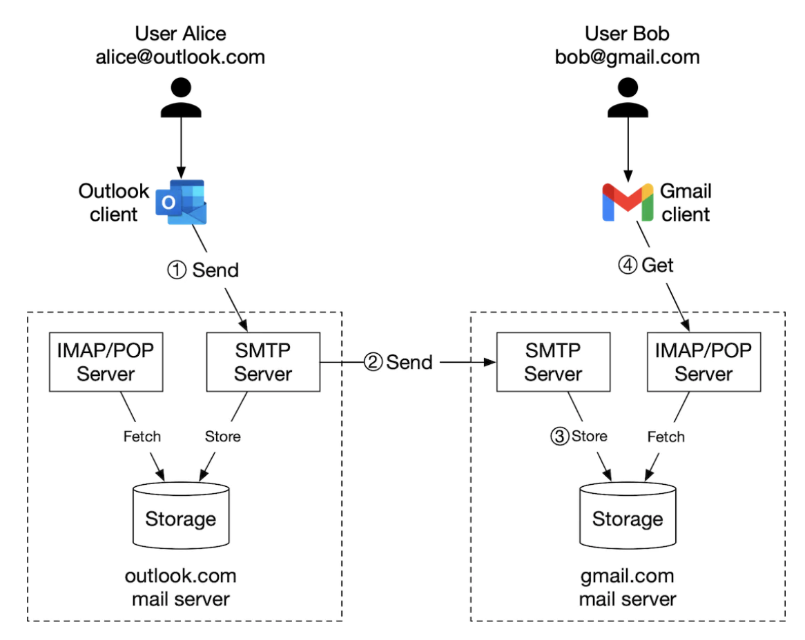
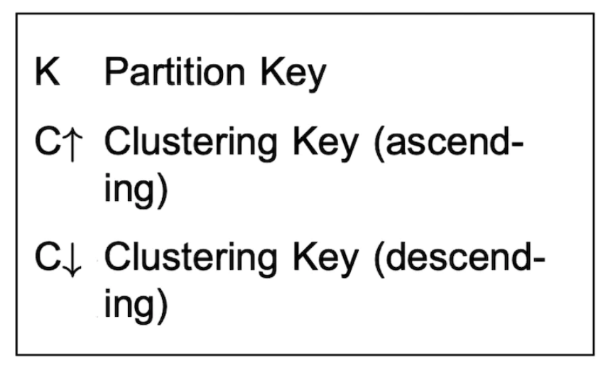
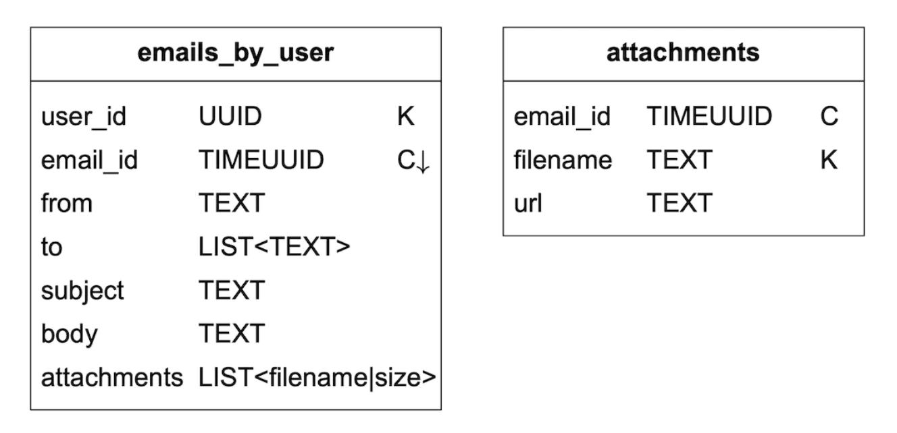
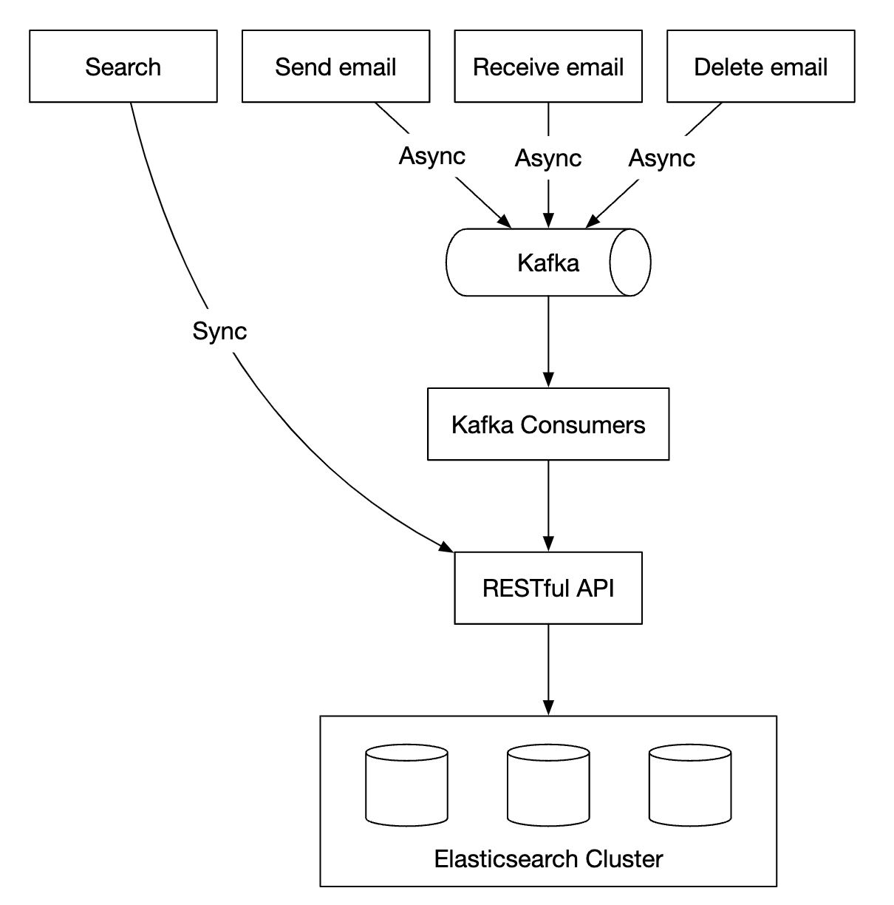
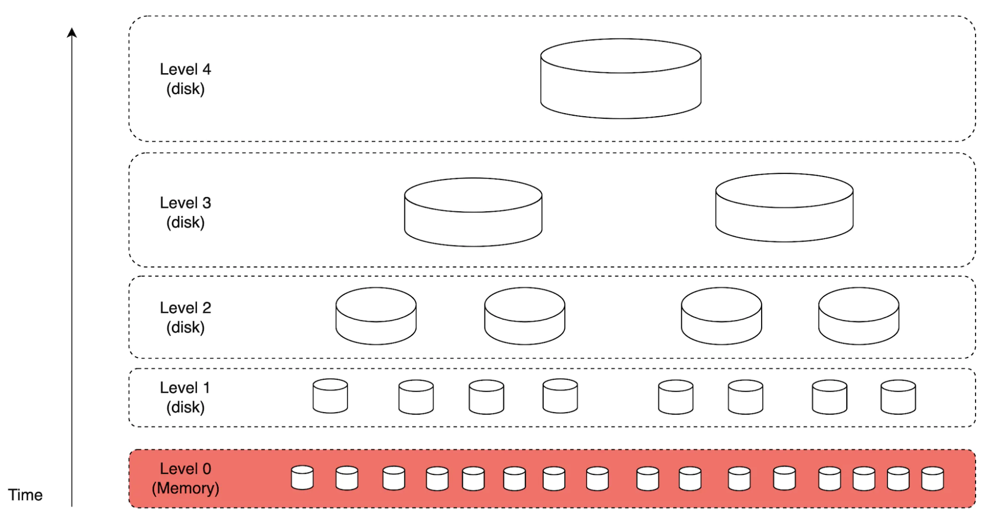

# Chapter 23: Distributed Email Service

## Introduction

We'll design a **distributed email service**, similar to **Gmail** in this chapter.

In 2020, **Gmail** had 1.8bil active users, while **Outlook** had 400mil users worldwide.

---

## Step 1: Understand the Problem and Establish Design Scope

- C: How many users use the system?
- I: 1bil users
- C: I think following features are important - auth, send/receive email, fetch email, filter emails, search email, anti-spam protection.
- I: Good list. Don't worry about auth for now.
- C: How do users connect \w email servers?
- I: Typically, email clients connect via SMTP, POP, IMAP, but we'll use HTTP for this problem.
- C: Can emails have attachments?
- I: Yes

### **Non-functional requirements**

- **Reliability** - we shouldn't lose data
- **Availability** - We should use replication to prevent single points of failure. We should also tolerate partial system failures.
- **Scalability** - As userbase grows, our system should be able to handle them.
- **Flexibility and extensibility** - system should be flexible and easy to extend with new features. One of the reasons we chose HTTP over SMTP/other mail protocols.

### **Back-of-the-envelope estimation**

- **1bil users**
- Assuming one person sends 10 emails per day -> **100k emails per second**.
- Assuming one person receives 40 emails per day and each email on average has 50kb metadata -> **730pb storage per year**.
- Assuming 20% of emails have storage attachments and average size is 500kb -> **1,460pb per year**.

---

## Step 2: Propose High-Level Design and Get Buy-In

### **Email knowledge 101**

There are various protocols used for sending and receiving emails:
- **SMTP** - standard protocol for sending emails from one server to another.
- **POP** - standard protocol for receiving and downloading emails from a remote mail server to a local client. Once retrieved, emails are deleted from remote server.
- **IMAP** - similar to POP, it is used for receiving and downloading emails from a remote server, but it keeps the emails on the server-side.
- **HTTPS** - not technically an email protocol, but it can be used for web-based email clients.

Apart from the mailing protocol, there are some DNS records we need to configure for our email server - the MX records:

<div style="margin-left:3rem">
    
</div>

Email attachments are sent base64-encoded and there is usually a size limit of 25mb on most mail services.
This is configurable and varies from individual to corporate accounts.

### **Traditional mail servers**

Traditional mail servers work well when there are a limited number of users, connected to a single server.

<div style="margin-left:3rem">
    
</div>

- Alice logs into her Outlook email and presses "send". Email is sent to Outlook mail server. Communication is via SMTP.
- Outlook server queries DNS to find MX record for gmail.com and transfers the email to their servers. Communication is via SMTP.
- Bob fetches emails from his gmail server via IMAP/POP.

In traditional mail servers, emails were stored on the local file system. Every email was a separate file.

<div style="margin-left:3rem">
    
</div>

As the scale grew, disk I/O became a bottleneck. Also, it doesn't satisfy our high availability and reliability requirements.
Disks can be damaged and server can go down.

### **Distributed mail servers**

Distributed mail servers are designed to support modern use-cases and solve modern scalability issues.

These servers can still support IMAP/POP for native email clients and SMTP for mail exchange across servers.

But for rich web-based mail clients, a RESTful API over HTTP is typically used.

Example APIs:
- `POST /v1/messages` - sends a message to recipients in To, Cc, Bcc headers.
- `GET /v1/folders` - returns all folders of an email account

Example response:

```
[{id: string        Unique folder identifier.
  name: string      Name of the folder.
                    According to RFC6154 [9], the default folders can be one of
                    the following: All, Archive, Drafts, Flagged, Junk, Sent,
                    and Trash.
  user_id: string   Reference to the account owner
}]
```

- `GET /v1/folders/{:folder_id}/messages` - returns all messages under a folder \w pagination
- `GET /v1/messages/{:message_id}` - get all information about a particular message

Example response:

```
{
  user_id: string                      // Reference to the account owner.
  from: {name: string, email: string}  // <name, email> pair of the sender.
  to: [{name: string, email: string}]  // A list of <name, email> paris
  subject: string                      // Subject of an email
  body: string                         //  Message body
  is_read: boolean                     //  Indicate if a message is read or not.
}
```

Here's the high-level design of the distributed mail server:

<div style="margin-left:3rem">
    
</div>

- **Webmail** - users use web browsers to send/receive emails
- **Web servers** - public-facing request/response services used to manage login, signup, user profile, etc.
- **Real-time servers** - Used for pushing new email updates to clients in real-time. We use websockets for real-time communication but fallback to long-polling for older browsers that don't support them.
- **Metadata db** - stores email metadata such as subject, body, from, to, etc.
- **Attachment store** - Object store (eg Amazon S3), suitable for storing large files.
- **Distributed cache** - We can cache recent emails in Redis to improve UX.
- **Search store** - distributed document store, used for supporting full-text searches.

Here's what the email sending flow looks like:

<div style="margin-left:3rem">
    
</div>

- User writes an email and presses "send". Email is sent to load balancer.
- Load balancer rate limits excessive mail sends and routes to one of the web servers.
- Web servers do basic email validation (eg email size) and short-circuits outbound flow if domain is same as sender. But does spam check first.
- If basic validation passes, email is sent to message queue (attachment is referenced from object store)
- If basic validation fails, email is sent to error queue
- SMTP outgoing workers pull messages from outgoing queue, do spam/virus checks and route to destination mail server.
- Email is stored in the "Sent Emails" folder

We need to also monitor size of outgoing message queue. Growing too large might indicate a problem:
- Recipient's mail server is unavailable. We can retry sending the email at a later time using exponential backoff.
- Not enough consumers to handle the load, we might have to scale the consumers.

Here's the email receiving flow:

<div style="margin-left:3rem">
    
</div>

- Incoming emails arrive at the SMTP load balancer. Mails are distributed to SMTP servers, where mail acceptance policy is done (eg invalid emails are directly discarded).
- If attachment of email is too large, we can put it in object store (s3).
- Mail processing workers do preliminary checks, after which mails are forwarded to storage, cache, object store and real-time servers.
- Offline users get their new emails once they come back online via HTTP API.

---

## Step 3: Design Deep Dive

Let's now go deeper into some of the components.

### **Metadata database**

Here are some of the characteristics of email metadata:
- headers are usually small and frequently accessed
- Body size ranges from small to big, but is typically read once
- Most mail operations are isolated to a single user - eg fetching email, marking as read, searching.
- Data recency impacts data usage. Users typically read only recent emails
- Data has high-reliability requirements. Data loss is unacceptable.

At gmail/outlook scale, the database is typically custom made to reduce input/output operations per second (IOPS).

Let's consider what database options we have:
- **Relational database** - we can build indexes for headers and body, but these DBs are typically optimized for small chunks of data.
- **Distributed object store** - this can be a good option for backup storage, but can't efficiently support searching/marking as read/etc.
- **NoSQL** - Google BigTable is used by gmail, but it's not open-sourced.

Based on above analysis, very few existing solutions seems to fit our needs perfectly.
In an interview setting, it's infeasible to design a new distributed database solution, but important to mention characteristics:
- Single column can be a single-digit MB
- Strong data consistency
- Designed to reduce disk I/O
- Highly available and fault tolerant
- Should be easy to create incremental backups

In order to partition the data, we can use the `user_id` as a partition key, so that one user's data is stored on a single shard.
This prohibits us from sharing an email with multiple users, but this is not a requirement for this interview.

Let's define the tables:
- Primary key consists of partition key (data distribution) and clustering key (sorting data)
- Queries we need to support - get all folders for a user, display all emails for a folder, create/get/delete an email, fetch read/unread email, get conversation threads (bonus)

Legend for tables to follow:

<div style="margin-left:3rem">
    
</div>

Here is the folders table:

<div style="margin-left:3rem">
    
</div>

emails table:

<div style="margin-left:3rem">
    
</div>

- email_id is timeuuid which allows sorting based on timestamp when email was created

Attachments are stored in a separate table, identified by filename:

<div style="margin-left:3rem">
    
</div>

Supporting fetchin read/unread emails is easy in a traditional relational database, but not in Cassandra, since filtering on non-partition/clustering key is prohibited.
One workaround to fetch all emails in a folder and filter in-memory, but that doesn't work well for a big-enough application.

What we can do is denormalize the emails table into read/unread emails tables:

<div style="margin-left:3rem">
    
</div>

In order to support conversation threads, we can include some headers, which mail clients interpret and use to reconstruct a conversation thread:

```
{
  "headers" {
     "Message-Id": "<7BA04B2A-430C-4D12-8B57-862103C34501@gmail.com>",
     "In-Reply-To": "<CAEWTXuPfN=LzECjDJtgY9Vu03kgFvJnJUSHTt6TW@gmail.com>",
     "References": ["<7BA04B2A-430C-4D12-8B57-862103C34501@gmail.com>"]
  }
}
```

Finally, we'll trade availability for consistency for our distributed database, since it is a hard requirement for this problem.

Hence, in the event of a failover or network parititon, sync/update actions will be briefly unavailable to impacted users.

### **Email deliverability**

It is easy to setup a server to send emails, but getting the email to a receiver's inbox is hard, due to spam-protection algorithms.

If we just setup a new mail server and start sending mails through it, our emails will probably end up in the spam folder.

Here's what we can do to prevent that:
- **Dedicated IPs** - use dedicated IPs for sending emails, otherwise, recipient servers will not trust you.
- **Classify emails** - avoid sending marketing emails from the same servers to prevent more important email to be classified as spam
- **Warm up your IP address** slowly to build a good reputation with big email providers. It takes 2 to 6 weeks to warm up a new IP
- **Ban spammers** quickly to not deteriorate your reputation
- **Feedback processing** - setup a feedback loop with ISPs to keep track of complaint rate and ban spam accounts quickly.
- **Email authentication** - use common techniques to combat phishing such as Sender Policy Framework, DomainKeys Identified Mail, etc.

You don't need to remember all of this. Just know that building a good mail server requires a lot of domain knowledge.

### **Search**

Searching includes doing a full-text search based on email contents or more advanced queries based on from, to, subject, unread, etc filters.

One characteristic of email search is that it is local to the user and it has more writes than reads, because we need to re-index it on each operation, but users rarely use the search tab.

Let's compare google search with email search:

|               | Scope                | Sorting                               | Accuracy                                          |
|---------------|----------------------|---------------------------------------|---------------------------------------------------|
| Google search | The whole internet   | Sort by relevance                     | Indexing takes some time, so not instant results. |
| Email search  | User's own email box | Sort by attributes eg time, date, etc | Indexing should be quick and results accurate.    |

To achieve this search functionality, one option is to use an Elasticsearch cluster. We can use `user_id` as the partition key to group data under the same node:

<div style="margin-left:3rem">
    
</div>

Mutating operations are async via Kafka in order to decouple services from the reindexing flow.
Actually searching for data happens synchronously.

Elasticsearch is one of the most popular search-engine databases and supports full-text search for emails very well.

Alternatively, we can attempt to develop our own custom search solution to meet our specific requirements.

Designing such a system is out of scope. One of the core challenges when building it is to optimize it for write-heavy workloads.

To achieve that, we can use Log-Structured Merge-Trees (LSM) to structure the index data on disk. Write path is optimized for sequential writes only.
This technique is used in Cassandra, BigTable and RocksDB.

Its core idea is to store data in-memory until a predefined threshold is reached, after which it is merged in the next layer (disk):

<div style="margin-left:3rem">
    
</div>

Main trade-offs between the two approaches:
- Elasticsearch scales to some extent, whereas a custom search engine can be fine-tuned for the email use-case, allowing it to scale further.
- Elasticsearch is a separate service we need to maintain, alongside the metadata store. A custom solution can be the datastore itself.
- Elasticsearch is an off-the-shelf solution, whereas the custom search engine would require significant engineering effort to build.

### **Scalability and availability**

Since individual user operations don't collide with other users, most components can be independently scaled.

To ensure high availability, we can also use a multi-DC setup with leader-folower failover in case of failures:

<div style="margin-left:3rem">
    
</div>

---

## Step 4: Wrap Up

Additional talking points:
- **Fault tolerance** - Many parts of the system could fail. It is worthwhile how we'd handle node failures.
- **Compliance** - PII needs to be stored in a reasonable way, given Europe's GDPR laws.
- **Security** - email encryption, phishing protection, safe browsing, etc.
- **Optimizations** - eg preventing duplication of the same attachments, sent multiple times by different users.
---

## Most Asked Interview Questions

**Q1. What protocols are involved in sending and receiving emails and how do they differ?**
> SMTP (Simple Mail Transfer Protocol, port 25/587/465): used for sending emails — between client→sending server and sending server→receiving server. IMAP (Internet Message Access Protocol, port 993): used by email clients to read/sync mail stored on the server — supports folders, read/unread state, works across multiple devices. POP3 (Post Office Protocol, port 995): downloads mail and (often) deletes it from server — single-device oriented, older. Modern clients use IMAP; SMTP handles all outgoing delivery; POP3 is largely legacy.

**Q2. How does email delivery work end-to-end from sender to recipient?**
> (1) User's MUA (Mail User Agent, e.g., Gmail web) submits email to Gmail's MSA (Mail Submission Agent) via SMTP (port 587, authenticated). (2) Google's MTA (Mail Transfer Agent) looks up the recipient domain's MX records via DNS (e.g., `hotmail.com → outlook-com.olc.protection.outlook.com`). (3) Google's MTA opens a SMTP connection to Microsoft's MX server → delivers the email. (4) Microsoft's MDA (Mail Delivery Agent) stores the email in the recipient's mailbox. (5) Recipient's Outlook client fetches the email via IMAP.

**Q3. How would you design the email storage system at Gmail scale (1.8B users)?**
> Each user has a mailbox partition. Shard by `user_id`: all emails for user 123 go to shard S. Within a shard, emails stored in a column-family store (Bigtable at Google): row key = `user_id + reverse_timestamp` (newest emails sort first), columns = `subject, from, body_snippet, has_attachment, labels[]`. Email body + attachments stored separately in a blob store (GFS/Colossus). Content-addressed deduplication: `SHA256(attachment)` → same file hash → stored once; `email.attachment_hash` references the blob.

**Q4. How do you handle email attachments without duplicating storage?**
> Content-addressed storage: compute `SHA256(file_bytes)` as the storage key. On upload: if blob with that hash already exists, skip upload — just reference the hash. `attachments(hash, size, content_type, storage_uri)`. Email row: `attachment_hashes[] = ["abc123", ...]`. If 10,000 users forward the same 10MB PDF, it's stored once. When user deletes email: reference count decremented; blob deleted when ref_count reaches 0. This achieves 50%+ storage savings in practice.

**Q5. How does spam filtering work at scale?**
> Multi-layer approach: (1) IP/domain reputation: check sender IP against spam blocklists (Spamhaus, Barracuda); SPF/DKIM/DMARC record verification; (2) Content analysis: Naive Bayes or deep learning classifier trained on spam/ham emails — looks at words, patterns, URLs; (3) URL reputation: phishing links checked against Google Safe Browsing API; (4) Behavioral signals: high bounce rate from sender = spammer; (5) Ensemble model: combines all signals with a final ML classifier. Gmail uses TensorFlow-based deep learning models that process >100M signals.

**Q6. How do you implement full-text email search across billions of emails?**
> Inverted index: pre-index each email at ingest time. Word tokenizer extracts terms → each term maps to list of `(user_id, email_id)` pairs. Sharded by `user_id` (each user's index lives on one shard). Elasticsearch cluster or Google's custom Spanner-based search. Query: user searches "invoice from Amazon" → query user's shard index → get matching email_ids → fetch email summaries from Bigtable → return ranked results. Ranking: BM25 scoring + recency boost + attachment boost. Index updated asynchronously within seconds of receipt.

**Q7. How do you ensure at-least-once email delivery while avoiding duplicates?**
> SMTP retry with idempotency: if the receiving server doesn't respond, the sending MTA retries with exponential backoff (retry for up to 5 days, per RFC). To prevent duplicate delivery: message_id (unique identifier in email headers) — receiving server checks: `IF NOT EXISTS (SELECT 1 FROM delivered WHERE message_id=?)` before storing. If message_id already stored → discard (idempotent receive). Persistent message_id dedup store (Cassandra/Redis TTL 7 days) handles the retry window.

**Q8. How do you model email threads (conversation view)?**
> Threading algorithm: group emails by `In-Reply-To` and `References` headers (RFC 2822). Each email carries `Message-ID: <unique@domain.com>`, replies carry `In-Reply-To: <original@domain.com>`. Thread ID: `SHA256(sorted list of message IDs in the thread)` — or incrementally assigned. Data model: `thread_id → [email_id_1, email_id_2, ...]`, ordered by timestamp. Gmail's JWZ threading algorithm handles threads even without proper headers (by matching subject lines: "Re: X" matches "X").

**Q9. How do you encrypt emails at rest and in transit?**
> In transit: TLS 1.3 mandatory for all SMTP connections (STARTTLS upgrade). Server-to-server SMTP also uses TLS (opportunistic, or enforced via MTA-STS policy). At rest: encrypted at storage layer — AES-256 encryption with keys managed by a KMS (HSM-backed). Each user's mailbox encrypted with a unique data encryption key (DEK) wrapped by a master key. End-to-end encryption: S/MIME (certificate-based) or OpenPGP — encrypts message body before sending, decrypted only by recipient's private key (email provider cannot read it). Gmail's default is server-side encryption only.

**Q10. How do you design inbox synchronization across multiple devices?**
> IMAP IDLE command: client maintains a long-lived TCP connection to the IMAP server; server pushes `EXISTS` notification when new email arrives — no polling needed. On phone, use APNs/FCM push notifications (IMAP idle can't run on mobile background due to OS restrictions). Server sends push notification → app wakes → syncs delta via IMAP. Delta sync: track per-device `last_sync_sequence` — server returns only changed emails (new, read, deleted) since last sync sequence number. IMAP CONDSTORE extension provides `MODSEQ` (modification sequence) for efficient delta sync.

**Q11. What are SPF, DKIM, and DMARC and why are they important?**
> SPF (Sender Policy Framework): DNS TXT record listing authorized IP addresses allowed to send email for a domain. Receiving server checks: did this IP send with permission? DKIM (DomainKeys Identified Mail): sender's MTA signs email headers/body with private key. Receiver verifies signature using public key from DNS. Proves email wasn't tampered. DMARC (Domain-based Message Authentication, Reporting & Conformance): policy specifying what to do if SPF/DKIM fail (`reject`, `quarantine`, `none`) and where to send reports. Together: prevent email spoofing and phishing.

**Q12. How would you design the sending infrastructure to avoid IP blacklisting?**
> Dedicated sending IPs per customer/reputation tier: new senders use a "warm-up pool" (low volume, high quality) to build reputation; established senders use high-reputation IPs. IP rotation: rotate across a pool of IPs to distribute reputation. Bounce handling: hard bounces (invalid address) → immediately remove from sending list. DKIM signing on all outbound mail. Feedback loops: register with ISPs' FBL (Feedback Loop) to receive complaint signals. Rate limiting: don't send more than ISP-recommended volumes per IP per hour.

**Q13. How do you handle email bounces and manage the recipient list?**
> Bounce categories: hard bounce (address doesn't exist — `550 User unknown`) → remove permanently from list; soft bounce (mailbox full, server temporarily unavailable — `452`, `421`) → retry up to 72 hours. Bounce processing: receive bounce DSN (Delivery Status Notification) emails at a dedicated bounce mailbox → parse bounce codes → update `email_addresses` table: `{address, status: active/hard_bounced, bounce_count, last_bounced_at}`. Suppression list: hard-bounced addresses are never emailed again. Reduces bounce rate → protects IP reputation.

**Q14. How would you implement email scheduling (send at a specific time in the future)?**
> User schedules email for Jan 15 at 3 PM. Implementation: (1) Store in `scheduled_emails(email_id, user_id, send_at, recipient, content, status=PENDING)` table; (2) Background scheduler (Quartz, Celery beat, or cron-based) polls for `WHERE send_at <= NOW() AND status=PENDING` every minute → enqueues to the sending queue (Kafka); (3) Sending workers consume from Kafka → send via SMTP. Exactly-once: mark as `SENT` before sending (or use DB atomic CAS update to claim the job — only one worker sends it). Handle timezone: store `send_at` in UTC.

**Q15. How do you handle large-scale bulk email sending (marketing campaigns)?**
> Campaign: send 100M emails in 24 hours = ~1,150 sends/sec average. Architecture: campaign engine splits into batches (1,000 recipients/batch) → publishes batches to Kafka. Sending workers (100+) consume batches → personalize template (merge first name, etc.) → send via SMTP. Rate limiting per domain: send to Gmail users at max 1,000/sec to avoid being throttled. Tracking: embed unique pixel URL per email for open tracking; unique click-tracking URL per link. Unsubscribe link mandatory by law (CAN-SPAM, GDPR).

**Q16. How do you implement the unsubscribe mechanism to comply with regulations?**
> One-click unsubscribe: include `List-Unsubscribe: <https://service.com/unsubscribe?token=xyz>` header + unsubscribe link in email body. Token is an HMAC-signed `(user_id, list_id)` — server verifies signature, no login required. On unsubscribe: add `(user_id, list_id)` to suppression table → all future sends to that user for that list check suppression first. Global unsubscribe: user can opt out of all emails. Compliance: process unsubscribe requests within 10 business days (CAN-SPAM); immediately for GDPR. Audit trail: log all unsubscribes.

**Q17. How would you design the email search to support complex queries (has:attachment, from:boss, before:2024)?**
> Search filters map to index fields: `has:attachment` → `attachment_count > 0` (indexed boolean); `from:boss@company.com` → `from_address` exact match (inverted index); `before:2024-01-01` → `received_at` range query; `subject:invoice` → full-text search on subject field. Combine with boolean AND/OR/NOT operators. Elasticsearch query DSL naturally supports all these. Performance: each user's emails in their own Elasticsearch routing key → shard-local query → fast even at Gmail's scale. Auto-complete in search bar: prefix trie for sender addresses and subject prefixes.

**Q18. How do you prevent email header injection attacks?**
> Header injection: attacker submits form with newline characters in the "name" field → injects extra headers like `BCC: attacker@evil.com`. Prevention: strict validation and sanitization of all user inputs used in email headers — strip or reject `\r\n` characters in From, To, Subject, Reply-To fields. Use a well-tested email library (PHPMailer, nodemailer with parameterized headers, Python's `email.message.EmailMessage`) that handles escaping. Never concatenate user input directly into raw SMTP commands.

**Q19. How would you design the folder/label management for email organization?**
> Labels (Gmail model): many-to-many (`email_labels(email_id, label_id)`) — one email can have multiple labels. Folders (traditional): `email_folder_id` FK on email row — one email in one folder. Label advantages: more flexible, better map to how users think. Label metadata: `labels(label_id, user_id, name, color, system_label: INBOX/SENT/TRASH/SPAM)`. System labels are auto-applied by rules. User-defined rules: `if from:amazon → apply label "Shopping"` (server-side filter). Apply labels efficiently: bulk update on arrival via rule-matching engine.

**Q20. How do you scale the SMTP receiving infrastructure to handle millions of inbound emails?**
> MX DNS record points to a load-balanced cluster of receiving MTAs (Postfix, OpenSMTPD). Each MTA is stateless — accepts the email, writes to a shared message queue (Kafka). Processing workers: (1) spam filter, (2) virus scan (ClamAV), (3) DKIM verify, (4) sort into user mailbox (Cassandra). Horizontal scaling: add more MTA servers and processing workers independently. DDoS protection: connection rate limiting per source IP at the network level. Greylisting: temporarily reject messages from unknown senders (most bots don't retry; legitimate servers do).

**Q21. What is a message queue's role in the email sending pipeline?**
> Queue decouples email generation from delivery. Email service writes `(recipient, content, priority)` to Kafka email topic. Sending workers: high-priority queue (transactional emails — password reset, receipt) consumed first; low-priority queue (newsletters) consumed only when high-priority queue is empty. Benefits: (1) Absorbs burst sends; (2) Retry logic in workers; (3) Multiple sending workers can process in parallel; (4) Sending rate can be throttled without blocking the application. Failed sends: dead letter queue with alerting.

**Q22. How do you implement email templates with dynamic personalization at scale?**
> Template stored in DB: `{template_id, subject_template, html_body_template, text_body_template}` using Handlebars/Mustache syntax: `Dear {{first_name}}, your order {{order_id}} has shipped.` At send time, merge context variables into template (in memory, microseconds). Pre-render templates server-side for HTML emails (not client-side). HTML email rendering quirks: inline CSS (email clients don't support `<style>` tags), use table-based layout for Outlook compatibility. Test rendering across 30+ email clients using Litmus or Email on Acid.

**Q23. How do you ensure high availability and disaster recovery for an email service?**
> Multi-region active-passive: primary region handles sending; standby region replicates mail queue and user data. Failover: DNS MX record TTL set to 5 minutes → change MX to standby region in <5 minutes during disaster. Message queue (Kafka) replicated across AZs in the primary region — survives single AZ failure without failover. Mailbox data: replicated to standby via async CDC → RPO of a few minutes. SLAs: inbound email acceptance: 99.99% uptime; message delivery: 99.9% within 5 minutes.

**Q24. How do you model and store email metadata vs. email body separately for performance?**
> Metadata (frequently read): `{email_id, thread_id, from, to, subject, received_at, labels[], has_attachment, size_bytes, body_snippet_200chars}` — stored in Bigtable/Cassandra, loaded for inbox list view. Body (loaded on open): stored separately in blob storage or a separate Cassandra column family. Benefit: listing 50 emails in inbox reads only metadata rows (small) — never loads bodies. Only when user opens an email: body is fetched from blob store. This is the exact model used by Gmail (Gmail's inbox list reads from metadata tablet, body reads from a separate system).

**Q25. How would you handle regulatory requirements like GDPR's right to erasure for emails?**
> User's right to erasure: delete all emails, attachments, metadata, search index entries, and audit logs associated with the user. Technical challenges: (1) Attachments may be shared with other users via content-addressed dedup — only delete the attachment blob if reference count drops to 0; (2) Search index: delete user's routing partition from Elasticsearch; (3) Audit logs: GDPR allows keeping audit logs for regulatory compliance (bank/financial records); (4) Emails sent to others: the sender's copy can be deleted; the recipient's copy is owned by the recipient. SLA: process erasure within 30 days.

**Q26. How do you design a robust email retry mechanism for failed deliveries?**
> Retry policy follows RFC 5321: first retry after 30 minutes, then 1 hour, then 4 hours, doubling up to 24-hour intervals, giving up after 5 days (configurable). Exponential backoff with jitter to avoid thundering herd on receiving server recovery. Per destination tracking: if `hotmail.com` is returning 452 (service unavailable), back off all retries to hotmail.com. Bounce handling: 4xx = temporary failure (retry), 5xx = permanent failure (bounce notification to sender, add to suppression list). Store retry state: `(message_id, recipient, retry_count, next_retry_at, status)`.

**Q27. What is the overall architecture of a distributed email service like Gmail?**
> Inbound: Internet → MX DNS → Receiving MTA cluster (Postfix) → spam/virus filter → Kafka → delivery workers → user mailbox (Bigtable) + search index (custom or Elasticsearch) + blob store (GCS) for bodies/attachments. Outbound: Gmail web/mobile → SMTP submission server → DKIM signing → sending MTA → DNS MX lookup → destination server via SMTP over TLS. Supporting services: SMTP auth (OAuth2), address book service, spam/phishing ML model service, push notification service (for mobile IMAP IDLE replacement), anti-abuse service, search service.