# Chapter 24: S3-like Object Storage

## Introduction

In this chapter, we'll be designing an **object storage** service, similar to **Amazon S3**.

Storage systems fall into three broad categories:
- **Block storage**
- **File storage**
- **Object storage**

**Block storage** are devices, which came out in 1960s. HDDs and SSDs are such examples.
These devices are typically physically attached to a server, although they can also be network-attached via high-speed network protocols.
Servers can format the raw blocks and use them as a file system or it can hand control of them to servers directly.

**File storage** is built on top of block storage. It provides a higher level of abstraction, making it easier to manage folders and files.

**Object storage** sacrifices performance for high durability, vast scale and low cost.
It targets "cold" data and is mainly used for archival and backup.
There is no hierarchical directory structure, all data is stored as objects in a flat structure.
It is relatively slow compared to other storage types. Most cloud providers have an object storage offering - Amazon S3, Google GCS, etc.

<div style="margin-left:3rem">
    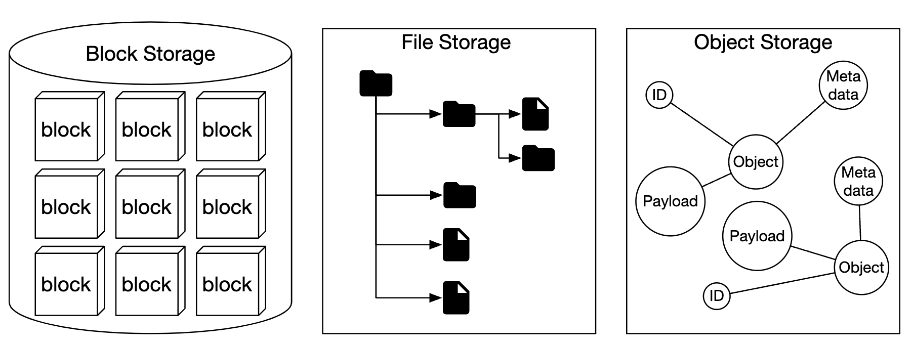
</div>

|                 | Block Storage                    | File Storage                            | Object Storage                 |
|-----------------|----------------------------------|-----------------------------------------|--------------------------------|
| Mutable Content | Y                                | Y                                       | N (has object versioning）     |
| Cost            | High                             | Medium to high                          | Low                            |
| Performance     | Medium to high, very high        | Medium to high                          | Low to medium                  |
| Consistency     | Strong consistency               | Strong consistency                      | Strong consistency [5]         |
| Data access     | SAS/iSCSI/FC                     | Standard file access, CIFS/SMB, and NFS | RESTful API                    |
| Scalability     | Medium scalability               | High scalability                        | Vast scalability               |
| Good for        | Virtual machines (VM), databases | General-purpose file system access      | Binary data, unstructured data |

Some terminology, related to object storage:
- **Bucket** - logical container for objects. Name is globally unique.
- **Object** - An individual piece of data, stored in a bucket. Contains object data and metadata.
- **Versioning** - A feature keeping multiple variants of an object in the same bucket.
- **Uniform Resource Identifier (URI)** - each resource is uniquely identified by a URI.
- **Service-level Agreement (SLA)** - contract between service provider and client.

Amazon S3 Standard-Infrequent Access storage class SLAs:
- Durability of 99.999999999% across multiple Availability Zones
- Data is resilient in the event of entire Availability Zone being destroyed
- Designed for 99.9% availability

---

## Step 1: Understand the Problem and Establish Design Scope

- C: Which features should be included?
- I: Bucket creation, Object upload/download, versioning, Listing objects in a bucket
- C: What is the typical data size?
- I: We need to store both massive objects and small objects efficiently
- C: How much data do we store in a year?
- I: 100 petabytes
- C: Can we assume 6 nines of data durbility (99.9999%) and service availability of 4 nines (99.99%)?
- I: Yes, sounds reasonable

### **Non-functional requirements**

- **100 PB of data**
- **6 nines of data durability**
- **4 nines of service availability**
- Storage efficiency. Reduce storage cost while maintaining high reliability and performance

### **Back-of-the-envelope estimation**

Object storage is likely to have bottlenecks in disk capacity or IO per second (IOPS).

Assumptions:
- we have 20% small (less than 1mb), 60% mid-size (1-64mb) and 20% large objects (greater than 64mb),
- One hard disk (SATA, 7200rpm) is capable of doing 100-150 random seeks per second (100-150 IOPS)

Given the assumptions, we can estimate the total number of objects the system can persist.
- Let's use median size per object type to simplify calculation - 0.5mb for small, 32mb for medium, 200mb for large.
- Given 100PB of storage (10^11 MB) and 40% of storage usage results in 0.68bil objects
- If we assume metadata is 1kb, then we need 0.68tb space to store metadata info

---

## Step 2: Propose High-Level Design and Get Buy-In

Let's explore some interesting properties of object storage before diving into the design:
- **Object immutability** - objects in object storage are immutable (not the case in other storage systems). We may delete them or replace them, but no update.
- **Key-value store** - an object URI is its key and we can get its contents by making an HTTP call
- **Write once, read many times** - data access pattern is writing once and reading many times. According to some Linkedin research, 95% of operations are reads
- Support both small and large objects

Design philosophy of object storage is similar to UNIX - when we save a file, it creates the filename in a data structure, called inode and file data is stored in different disk locations.
The inode contains a list of file block pointers, which point to different locations on disk.

When accessing a file, we first fetch its metadata from the inode, prior to fetching the file contents.

Object storage works similarly - metadata store is used for file information, but contents are stored on disk:

<div style="margin-left:3rem">
    
</div>

By separating metadata from file contents, we can scale the different stores independently:

<div style="margin-left:3rem">
    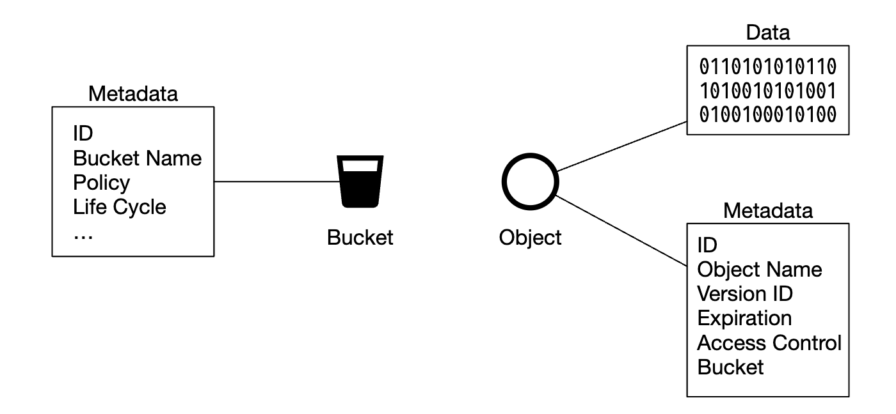
</div>

### **High-level design**

<div style="margin-left:3rem">
    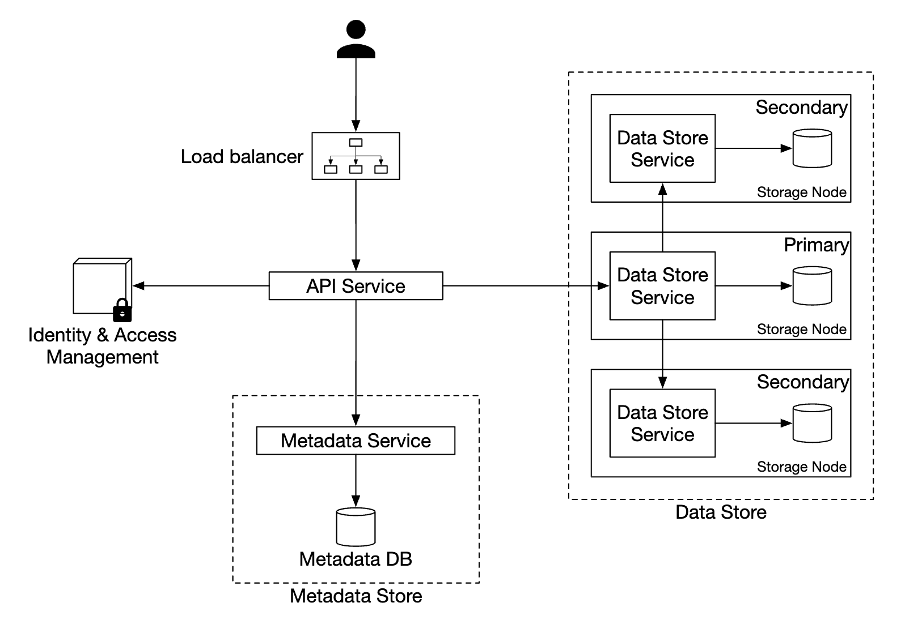
</div>

- **Load balancer** - distributes API requests across service replicas
- **API service** - Stateless server, orchestrating calls to metadata and object store, as well as IAM service.
- **Identity and access management (IAM)** - central place for auth, authz, access control.
- **Data store** - stores and retrieves actual data. Operations are based on object ID (UUID).
- **Metadata store** - stores object metadata

### **Uploading an object**

<div style="margin-left:3rem">
    
</div>

- Create a bucket named "bucket-to-share" via HTTP PUT request
- API service calls IAM to ensure user is authorized and has write permissions
- API service calls metadata store to create a bucket entry. Once created, success response is returned.
- After bucket is created, HTTP PUT is sent to create an object named "script.txt"
- API service verifies user identity and ensures user has write permissions
- Once validation passes, object payload is sent via HTTP PUT to the data store. Data store persists it and returns a UUID.
- API service calls metadata store to create a new entry with object_id, bucket_id and bucket_name, among other metadata.

Example object upload request:

```
PUT /bucket-to-share/script.txt HTTP/1.1
Host: foo.s3example.org
Date: Sun, 12 Sept 2021 17:51:00 GMT
Authorization: authorization string
Content-Type: text/plain
Content-Length: 4567
x-amz-meta-author: Alex

[4567 bytes of object data]
```

### **Downloading an object**

Buckets have no directory hierarchy, buy we can create a logical hierarchy by concatenating bucket name and object name to simulate a folder structure.

Example GET request for fetching an object:

```
GET /bucket-to-share/script.txt HTTP/1.1
Host: foo.s3example.org
Date: Sun, 12 Sept 2021 18:30:01 GMT
Authorization: authorization string
```

<div style="margin-left:3rem">
    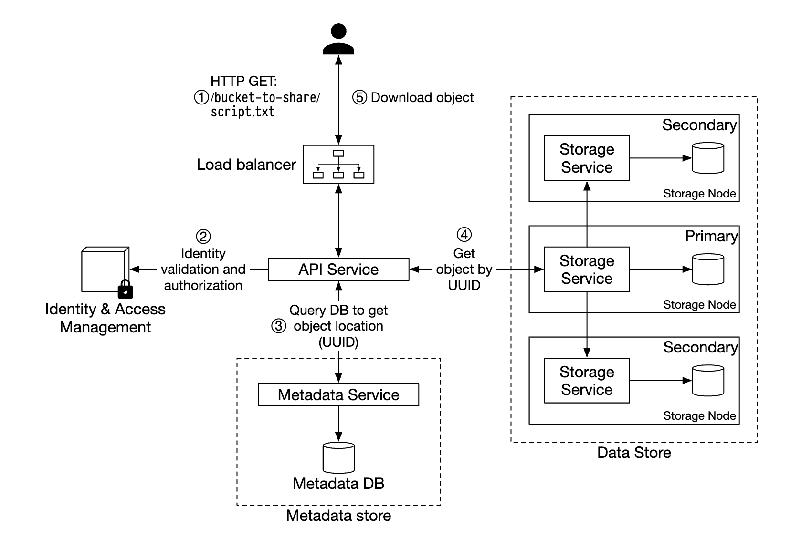
</div>

- Client sends an HTTP GET request to the load balancer, ie `GET /bucket-to-share/script.txt`
- API service queries IAM to verify the user has correct permissions to read the bucket
- Once validated, UUID of object is retrieved from metadata store
- Object payload is retrieved from data store based on UUID and returned to the client

---

// sprint 1

## Step 3: Design Deep Dive

### **Data store**

Here's how the API service interacts with the data store:

<div style="margin-left:3rem">
    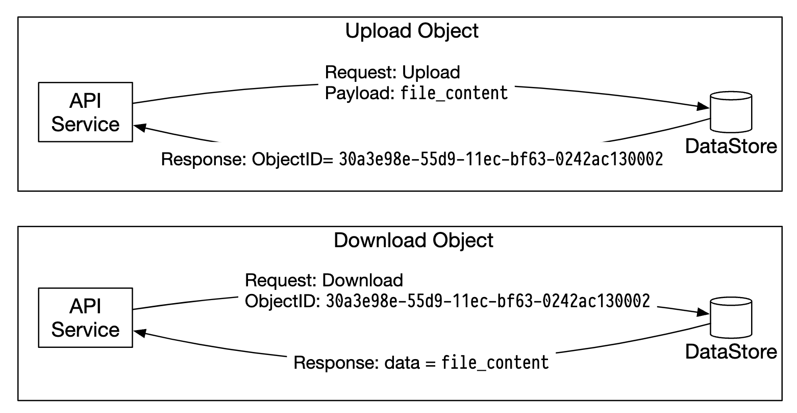
</div>

The data store's main components:

<div style="margin-left:3rem">
    
</div>

The data routing service provides a RESTful or gRPC API to access the data node cluster.
It is a stateless service, which scales by adding more servers.

It's main responsibilities are:
- querying the placement service to get the best data node to store data
- reading data from data nodes and returning it to the API service
- Writing data to data nodes

The placement service determines which data nodes should store an object.
It maintains a virtual cluster map, which determines the physical topology of a cluster.

<div style="margin-left:3rem">
    
</div>

The service also sends heartbeats to all data nodes to determine if they should be removed from the virtual cluster.

Since this is a critical service, it is recommended to maintain a cluster of 5 or 7 replicas, synchronized via Paxos or Raft consensus algorithms.
Eg a 7 node cluster can tolerate 3 nodes failing.

Data nodes store the actual object data.
Reliability and durability is ensured by replicating data to multiple data nodes.

Each data node has a daemon running, which sends heartbeats to the placement service.

The heartbeat includes:
- How many disk drives (HDD or SSD) does the data node manage?
- How much data is stored on each drive?

#### Data persistence flow

<div style="margin-left:3rem">
    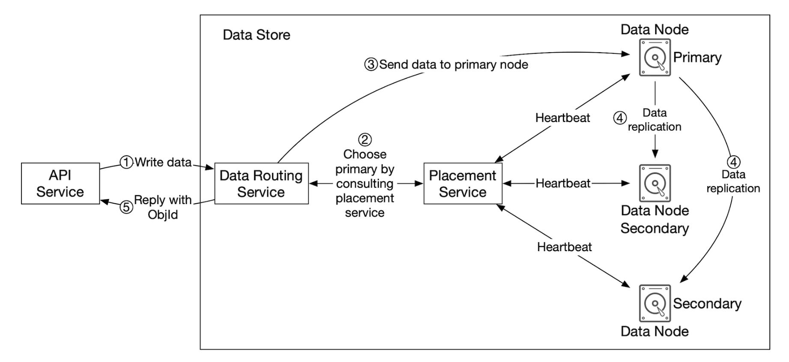
</div>

- API service forwards the object data to data store
- Data routing service sends the data to the primary data node
- Primary data node saves the data locally and replicates it to two secondary data nodes. Response is sent after successful replication.
- The UUID of the object is returned to the API service.

Caveats:
- Given an object UUID, it's replication group is deterministically chosen by using consistent hashing
- In step 4, the primary data node replicates the object data before returning a response. This favors strong consistency over higher latency.

<div style="margin-left:3rem">
    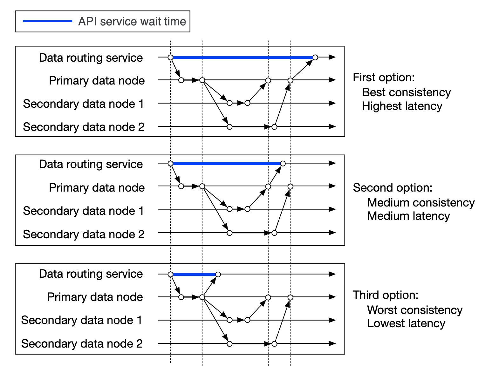
</div>

#### How data is organized

One simple approach to managing data is to store each object in a separate file.

This works, but is not performant with many small files in a file system:
- Data blocks on HDD are wasted, because every file uses the whole block size. Typical block size is 4kb.
- Many files means many inodes. Operating systems don't deal well with too many inodes and there is also a max inode limit.

These issues can be addressed by merging many small files into bigger ones via a write-ahead log (WAL). Once the file reaches its capacity (typically a few GB), a new file is created:

<div style="margin-left:3rem">
    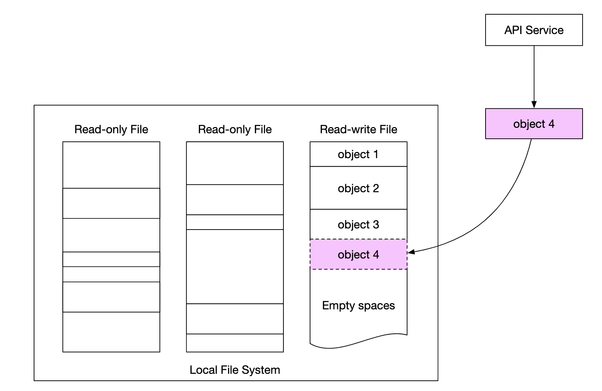
</div>

The downside of this approach is that write access to the file needs to be serialized. Multiple cores accessing the same file must wait for each other.
To fix this, we can confine files to specific cores to avoid lock contention.

#### Object lookup

To support storing multiple objects in the same file, we need to maintain a table, which tells the data node:
- `object_id`
- `filename` where object is stored
- `file_offset` where object starts
- `object_size`

We can deploy this table in a file-based db like RocksDB or a traditional relational database.
Since the access pattern is low write+high read, a relational database works better.

How should we deploy it?
We could deploy the db and scale it separately in a cluster, accessed by all data nodes.

Downsides:
- we'd need to aggressively scale the cluster to serve all requests
- there's additional network latency between data node and db cluster

An alternative is to take advantage of the fact that data nodes are only interested to data related to them,
so we can deploy the relational db within the data node itself.

SQLite is a good option as it's a lightweight file-based relational database.

#### Updated data persistence flow

<div style="margin-left:3rem">
    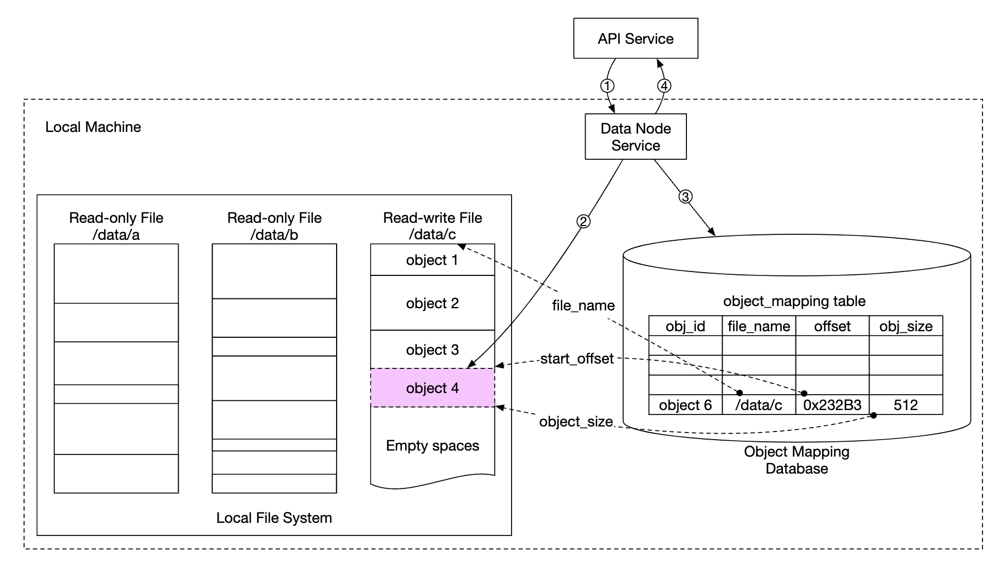
</div>

- API Service sends a request to save a new object
- Data node service appends the new object at the end of a file, named "/data/c"
- A new record for the object is inserted into the object mapping table

#### Durability

Data durability is an important requirement in our design. In order to achieve 6 nines of durability, every failure case needs to be properly examined.

First problem to address is hardware failures. We can achieve that by replicating data nodes to minimize probability of failure.
But in addition to that, we also ought to replicate across different failure domains (cross-rack, cross-dc, separate networks, etc).
A critical event can cause multiple hardware failures within the same domain:

<div style="margin-left:3rem">
    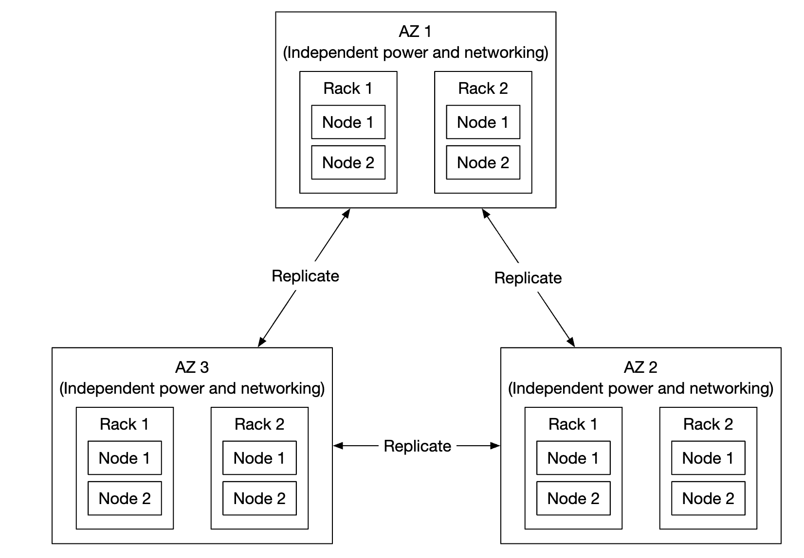
</div>

Assuming annual failure rate of a typical HDD is 0.81%, making three copies gives us 6 nines of durability.

Replicating the data nodes like that grants us the durability we want, but we could also leverage erasure coding to reduce storage costs.

Erasure coding enables us to use parity bits, which allow us to reconstruct lost bits in the event of a failure:

<div style="margin-left:3rem">
    
</div>

Imagine those bits are data nodes. If two of them go down, they can be recovered using the remaining four ones.

There are different erasure coding schemes. In our case, we could use 8+4 erasure coding, split across different failure domains to maximize reliability:

<div style="margin-left:3rem">
    
</div>

Erasure coding enables us to achieve a much lower storage cost (50% improvement) at the expense of access speed due to the data routing service having to collect data from multiple locations:

<div style="margin-left:3rem">
    
</div>

Other caveats:
- Replication requires 200% storage overhead (in case of 3 replicas) vs. 50% via erasure coding
- Erasure coding [gives us 11 nines of durability](https://github.com/Backblaze/erasure-coding-durability) vs 6 nines via replication
- Erasure coding requires more computation to calculate and store parities

In sum, replication is more useful for latency-sensitive applications, whereas erasure coding is attractive for storage cost efficiency and durability.
Erasure coding is also much harder to implement.

#### Correctness verification

If a disk fails entirely, then the failure is easy to detect. This is less straightforward in the event part of the disk memory gets corrupted.

To detect this, we can use checksums - a hash of the file contents, which can be used to verify the file's integrity.

In our case, we'll store checksums for each file and each object:

<div style="margin-left:3rem">
    
</div>

In the case of erasure coding (8+4), we'll need to fetch each of the 8 pieces of data separately and verify each of their checksums.

// sprint 2

### **Metadata data model**

Table schemas:

<div style="margin-left:3rem">
    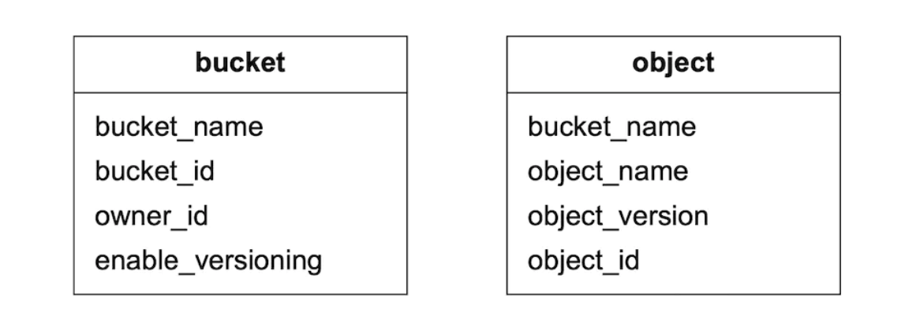
</div>

Queries we need to support:
- Find an object ID by name
- Insert/delete object based on name
- List objects in a bucket sharing the same prefix

There is usually a limit on the number of buckets a user can create, hence, the size of the buckets table is small and can fit into a single db server.
But we still need to scale the server for read throughput.

The object table will probably not fit into a single database server, though. Hence, we can scale the table via sharding:
- Sharding by bucket_id will lead to hotspot issues as a bucket can have billions of objects
- Sharding by bucket_id makes the load more evenly distributed, but our queries will be slow
- We choose sharding by `hash(bucket_name, object_name)` since most queries are based on the object/bucket name.

Even with this sharding scheme, though, listing objects in a bucket will be slow.

### **Listing objects in a bucket**

In a single database, listing an object based on its prefix (looks like a directory) works like this:

```
SELECT * FROM object WHERE bucket_id = "123" AND object_name LIKE `abc/%`
```

This is challenging to fulfill when the database is sharded. To achieve it, we can run the query on every shard and aggregate the results in-memory.
This makes pagination challenging though, since different shards contain a different result size and we need to maintain separate limit/offset for each.

We can leverage the fact that typically object stores are not optimized for listing objects, so we can sacrifice listing performance.
We can also create a denormalized table for listing objects, sharded by bucket ID.
That would make our listing query sufficiently fast as it's isolated to a single database instance.

### **Object versioning**

Versioning works by having another `object_version` column which is of type TIMEUUID, enabling us to sort records based on it.

Each new version produces a new `object_id`:

<div style="margin-left:3rem">
    
</div>

Deleting an object creates a new version with a special `object_id` indicating that the object was deleted. Queries for it return 404:

<div style="margin-left:3rem">
    
</div>

### **Optimizing uploads of large files**

Uploading large files can be optimized by using multipart uploads - splitting a big file into several chunks, uploaded independently:

<div style="margin-left:3rem">
    
</div>

- Client calls service to initiate a multipart upload
- Data store returns an upload ID which uniquely identifies the upload
- Client splits the large file into several chunks, uploaded independently using the upload id
- When a chunk is uploaded, the data store returns an etag, which is a md5 checksum, identifying that upload chunk
- After all parts are uploaded, client sends a complete multipart upload request, which includes upload_id, part numbers and all etags
- Data store reassembles the object from its parts. The process can take a few minutes. After that, success response is returned to the client.

Old parts, which are no longer useful can be removed at this point. We can introduce a garbage collector to deal with it.

### **Garbage collection**

Garbage collection is the process of reclaiming storage space, which is no longer used. There are a few ways data becomes garbage:
- **lazy object deletion** - object is marked as deleted without actually getting deleted
- **orphan data** - eg an upload failed mid-flight and old parts need to be deleted
- **corrupted data** - data which failed checksum verification

The garbage collector is also responsible for reclaiming unused space in replicas.
With replication, data is deleted from both primaries and replicas. With erasure coding (8+4), data is deleted from all 12 nodes.

To facilitate the deletion, we'll use a process called compaction:
- Garbage collector copies objects which are not deleted from "data/b" to "data/d"
- `object_mapping` table is updated once copying is complete using a database transaction
- To avoid making too many small files, compaction is done on files which grow beyond a certain threshold

<div style="margin-left:3rem">
    
</div>

---

## Step 4: Wrap Up

Things we covered:
- Designing an S3-like object storage
- Comparing differences between object, block and file storages
- Covered uploading, downloading, listing, versioning of objects in a bucket
- Deep dived in the design - data store and metadata store, replication and erasure coding, multipart uploads, sharding

---

## Most Asked Interview Questions

**Q1. What is the difference between object, block, and file storage? When do you use each?**
> Block storage: raw disk blocks exposed as volumes, managed by OS filesystem — used for databases, VMs, boot disks (AWS EBS, GCP PD). File storage: hierarchical directory/file tree accessed via NFS/SMB — used for shared filesystem access across multiple servers (AWS EFS, NFS). Object storage: flat namespace, key→blob, accessed via HTTP API — used for static assets, backups, data lakes, arbitrary large files (S3, GCS, Azure Blob). Object storage: cheapest, most scalable, no directory operations; block: lowest latency, POSIX compliance; file: shared access, directory semantics.

**Q2. How does Amazon S3 store and retrieve objects internally?**
> Objects identified by `(bucket, key)`. Internally: metadata service maps `(bucket, key)` → `{data_node_cluster, offset}`. Data nodes store the raw bytes as flat files (no filesystem — directly written to raw disk via O_DIRECT to avoid OS page cache overhead). On read: `GET /bucket/key` → metadata lookup → route to data node holding the object → stream bytes to client. Data nodes organized in groups (rack-aware); objects replicated across racks or erasure-coded across nodes.

**Q3. How does multipart upload work and why is it important?**
> Single-part upload: entire object uploaded in one PUT request — if network fails at 99%, restart from 0. Multipart upload: (1) `CreateMultipartUpload` → returns `upload_id`; (2) `UploadPart(upload_id, part_number, data)` × N parts (min 5MB each, max 10,000 parts) — each part uploaded independently, can retry failed parts only; (3) `CompleteMultipartUpload(upload_id, [part_ETags])` → server reassembles object. Benefits: resume on failure, parallel uploads (multiple parts concurrently), upload from multiple sources. Required for objects >5GB in S3.

**Q4. What is erasure coding and how does it compare to replication?**
> Replication: store 3 copies of each object (3× storage overhead) — simple, fast reads, can lose 2 of 3 copies. Erasure coding (Reed-Solomon): split object into `k` data shards + `m` parity shards — can reconstruct the object from any `k` of the `k+m` shards. Example: 6+3 erasure coding stores 9 shards (1.5× storage overhead vs 3× for replication) — can lose any 3 shards and still reconstruct. Tradeoff: erasure coding uses ~50% less storage but requires more CPU (encoding/decoding) and higher read latency (must fetch `k` shards). S3 uses both approaches for different storage tiers.

**Q5. How does object versioning work, and how do you manage the associated storage cost?**
> Versioning enabled at bucket level. Each `PUT /key` creates a new version with a unique `version_id` (UUID) — old versions are preserved, not overwritten. `GET /key` returns the latest version; `GET /key?versionId=abc` returns a specific version. Lifecycle policies manage cost: `NoncurrentVersionExpiration: 30 days` automatically deletes non-current versions after 30 days. `DELETE /key` creates a "delete marker" — doesn't actually delete; `DELETE /key?versionId=xyz` permanently removes a specific version. Cost: storage charged for all stored versions.

**Q6. How would you design the metadata service for billions of objects?**
> Metadata schema: `{bucket_id, object_key, version_id, size_bytes, checksum, storage_location, created_at, content_type, user_metadata_json, is_delete_marker}`. Primary key: `(bucket_id, object_key, version_id)`. Sharding strategy: consistent hash on `SHA256(bucket_id + object_key)` → routes to a shard. Shard count: 1000 shards × 10M objects/shard = 10B objects capacity. Hot key problem: a bucket with millions of objects that all have the same prefix (e.g., `logs/2024-01-15/`) → shard the bucket key space, not the bucket itself. Use distributed SQL (CockroachDB, Google Spanner) or Cassandra for the metadata store.

**Q7. How do you shard the metadata store to avoid hot spots?**
> Naive sharding: `shard = hash(bucket_name) % N` — all objects in a huge bucket go to one shard (hot). Better: `shard = hash(bucket_name + "/" + object_key) % N` — objects in the same bucket spread across all shards. Even better: virtual buckets / prefix-based sharding — Amazon DynamoDB uses automatic shard splitting when a partition gets hot. Metadata for `LIST bucket` requires scatter-gather across all shards → sort + merge results. To speed up LIST: use a separate sorted manifest service (S3 Inventory, or a separate B-tree index per bucket sorted by key).

**Q8. How does a data node manage raw object storage?**
> Data nodes store object data in large files called "volumes" (e.g., Haystack-style: one 100GB logical volume file contains many small objects). Object stored as: `(offset, size)` within the volume. Volume allocation: data node pre-allocates volumes; new objects appended sequentially to the current active volume. Benefits: append-only = sequential disk writes (fast); object reads = single seek (offset + read). Compaction: background process removes deleted objects, rewrites volume. Filesystem: XFS or raw disk (bypassing OS filesystem for better durability control).

**Q9. How do you ensure durability and consistency in an object storage system?**
> Durability (11 nines = 99.999999999%): encrypt + store on 3+ AZs via replication or erasure coding across AZs. Write durability: write is only acknowledged after `min_replicas` (e.g., 2) confirm receipt. Checksums: `MD5 / SHA256` computed on upload, verified on read — detected bit rot, storage errors. Consistency model: S3 has strong read-after-write consistency (since 2020) for all operations — after a successful PUT, a GET immediately returns the new version.

**Q10. How does a presigned URL work and what are its security implications?**
> Presigned URL: server generates `https://bucket.s3.amazonaws.com/key?X-Amz-Signature=xxx&X-Amz-Expires=3600` — the URL encodes the time-limited signature. Client can use this URL to GET or PUT an object directly with S3, without the server being in the data path. Security: URL is valid only until `X-Amz-Expires`; signature covers specific bucket, key, method, and expiry. Risks: URL can be shared/leaked and used by anyone before expiry; limit expiry to minimum necessary (15 minutes for uploads, 1 hour for downloads); use HTTPS to prevent interception.

**Q11. How would you design the S3 bucket access control system?**
> Two main mechanisms: (1) Bucket Policy: JSON-based IAM policy attached to bucket — defines who (Principal) can do what (Action: s3:GetObject, s3:PutObject) on which resources; evaluated for all requests. (2) Object ACLs: per-object ACL (legacy, being deprecated). Identity-based policies: IAM user/role policy grants `s3:GetObject` on `arn:aws:s3:::my-bucket/*`. Public access: `BlockPublicAccess` setting at account/bucket level blocks all public policies. Evaluation order: deny takes precedence → then bucket policy + IAM policy must both allow.

**Q12. How do you implement server-side encryption in object storage?**
> SSE-S3: S3 manages keys; AES-256 encryption at rest, transparent to users. SSE-KMS: encryption key stored in AWS KMS (auditable, rotatable, access-controlled); can restrict who can decrypt with IAM policies on the KMS key. SSE-C: customer provides their own encryption key per request; S3 encrypts with it but never stores the key. In-transit: HTTPS enforcement via bucket policy (`aws:SecureTransport: true`). Default encryption: bucket-level policy enforces encryption on all objects (even if uploader forgets to specify).

**Q13. How does S3 handle large-scale list operations efficiently?**
> `LIST bucket` API returns at most 1,000 keys per request with a continuation token for pagination. Internal scan: scatter-gather across all metadata shards → merge-sort results. For fast listing: S3 Inventory delivers scheduled flat files (CSV/ORC/Parquet) listing all objects in a bucket — better for bulk processing than live LIST API. S3 Select: server-side filtering on stored CSV/JSON/Parquet objects — pushes down WHERE clause to S3, returns only matching rows (reduces transfer). Delimiter parameter: `LIST key-prefix/` + `delimiter=/` provides folder-like navigation.

**Q14. What is the S3 Glacier storage class and how is tiered storage designed?**
> S3 Standard: low latency, high durability, highest cost. S3 Standard-IA (Infrequent Access): lower storage cost, retrieval fee. S3 Glacier Instant Retrieval: archived data with millisecond retrieval. S3 Glacier Flexible: 1–12 hour retrieval, very cheap storage. S3 Glacier Deep Archive: 12–48h retrieval, cheapest storage. Lifecycle policies auto-transition objects: `Standard → Standard-IA after 30 days → Glacier after 90 days → Deep Archive after 365 days`. Internal: Glacier stores on tape libraries (physically). S3 Intelligent-Tiering: ML-based auto-tiering moves objects based on access patterns.

**Q15. How do you design the upload pipeline to handle concurrent uploads reliably?**
> Client → API server → generates `upload_id`, creates pending metadata record → returns upload credentials (presigned URL or STS token). Client uploads directly to data node (or via API server for small files). Data node: write to temporary buffer → flush to durable storage → return checksum. API server: verify checksum = ETag → finalize metadata record (atomic CAS: `UPDATE object_metadata SET status='COMPLETE' WHERE upload_id=? AND status='PENDING' AND checksum=?`). Cleanup job: delete metadata and data for abandoned incomplete multipart uploads older than 24h.

**Q16. How do you handle cross-region replication in object storage?**
> Source bucket → replication rule (destination bucket, IAM role, optional object filter). On PUT: source region writes object → after durability confirmed, publishes replication event → async replication worker reads the event + streams object bytes to destination region API. Replication lag: typically seconds, at most minutes. Conflict resolution: last-writer-wins (by version_id timestamp). Use cases: disaster recovery, compliance (data residency requirements), latency reduction (serve users from nearest region). Replication does not have strong consistency guarantees — it is asynchronous.

**Q17. What is object key naming best practice and why does it affect performance?**
> S3 (and similar systems) shard the internal index based on key prefix hash. If all keys start with the same prefix e.g., `logs/2024-01-15/` — all go to the same shard = hot spot → throttling. Best practice: add a random prefix hash to distribute: `{hash}/{date}/{filename}` or use a UUID prefix. Changed in S3 (2018): S3 automatically partitions based on request rate — key naming best practice is less critical now but still advisable for predictable performance. For user-facing keys: use meaningful names but add partition-friendly prefixes for bulk ingestion.

**Q18. What is an S3 event notification and how is it used?**
> S3 can emit events (ObjectCreated, ObjectDeleted, ObjectRestore) to: SNS topic, SQS queue, or Lambda function. Event schema: `{event_type, bucket, key, size, etag, sequencer}`. Use cases: trigger image resize Lambda on upload, fanout to downstream consumers (Kafka via SQS), build real-time data pipelines (S3 → SQS → Lambda → DynamoDB). Ordering: events may arrive out of order (use `sequencer` field to order). Delivery: at-least-once. For guaranteed ordering, use S3 + Kafka connector (stream all S3 events to Kafka).

**Q19. How do you design the garbage collection process for deleted and old versions?**
> On DELETE: object metadata marked as deleted (soft delete), data not immediately removed. Version DELETE: version metadata removed but data stays until GC. GC process (async batch): (1) Scan metadata for objects with `status=DELETED` + `deleted_at < now()-7_days`; (2) For each, check ref count = 0 (no other versions reference same data blocks — for deduplication); (3) Send delete commands to data nodes to free storage. Data nodes reclaim disk via compaction (rewrite volume without deleted objects). Ensures no data loss within the recovery window.

**Q20. How do you implement object storage deduplication?**
> Content-addressed storage: compute `SHA256(object_content)` on upload. Lookup: `IF EXISTS (data_hash in chunk_store)` → store only metadata pointing to existing chunk (don't write data again). Increases storage efficiency for duplicate uploads (backup systems especially). Security concern: hash-based deduplication allows an attacker to probe whether content exists without seeing it (they provide the hash of known content → don't upload → check if dedup kicks in). Mitigate by deduplicating only within a single account, not cross-account.

**Q21. How would you design the health monitoring for a distributed object storage cluster?**
> Data node health: heartbeat every 5s to metadata service; if missed for 30s → mark node as unavailable. Bit rot detection: periodic background scrub — each data node reads all stored objects, verifies checksum + recomputes — any mismatch = silent corruption → re-replicate from another copy. Replication lag monitor: track count of under-replicated objects — alert if count > 0. Disk failure detection: SMART health signals + read/write error rate per disk. Capacity management: alert when any shard is >80% full → trigger rebalancing.

**Q22. How does object lock (WORM — Write Once Read Many) work?**
> Compliance use case: financial records must not be deleted or modified for 7 years (SEC rule 17a-4). S3 Object Lock implements WORM at object level. Two modes: Governance (users with special permission can override) and Compliance (no one, not even root, can delete before retention period). Implementation: metadata field `{retention_until_date, lock_mode}`. On DELETE or overwrite attempt: check `if retention_until_date > NOW() → reject with 403`. Legal hold: additional flag preventing deletion regardless of retention period.

**Q23. How do you handle network partitions and split-brain scenarios in a distributed metadata store?**
> Metadata store uses Raft or Paxos consensus (e.g., CockroachDB, etcd, or Google Spanner). On network partition: majority partition (quorum) continues accepting writes; minority partition rejects writes (protects consistency). After network heal: minority replays WAL from the leader. Split-brain prevention: write only succeeds if acknowledged by quorum (>50% of replicas). No split-brain = no two nodes think they're the leader simultaneously. Trade-off: availability is sacrificed in the minority partition (CP system per CAP).

**Q24. How do you measure and guarantee object storage durability (eleven 9s)?**
> 11 nines = 99.999999999% = lose 1 object per 100 billion per year. Achieve via: (1) 3 copies in 3 AZs (or 6+3 erasure coding) — probability of losing all copies = (probability of losing 1 AZ)³ — astronomically small; (2) Checksum verification on every read + background scrub; (3) Bit rot detection: periodic re-read + checksum verification — silent hardware failures caught early; (4) Replication monitoring: replication lag and under-replicated objects alerts. AWS publishes 11-nines durability SLA in their S3 service terms.

**Q25. What is a data lake and how does object storage fit into it?**
> Data lake: central repository storing raw structured + semi-structured + unstructured data at any scale. S3 is the foundation: cheap, scalable, schema-agnostic → perfect for storing raw CSVs, JSON, Parquet, Avro, images, logs. Processing layer: Spark/Flink reads directly from S3 (no ETL copy needed). Formats: Parquet (columnar compression, fast analytics), Delta Lake/Apache Iceberg/Apache Hudi (add ACID transactions + schema evolution + time travel on top of Parquet in S3). Query engines: Athena, Presto, BigQuery Omni query S3 directly.

**Q26. How would you implement rate limiting per user in an object storage system?**
> Rate limit dimensions: requests/sec (API call rate) and throughput MB/s (bandwidth). Implementation: Redis token bucket per `(user_id, operation_type)`. On each API call: `EVAL lua_script` to check+decrement bucket atomically → if empty → return 429 Too Many Requests. Throttle separately: PUT rate (write-heavy tenants), GET rate (read-heavy tenants), bandwidth (large file downloads). Quotas: max storage per account (soft quota → email warning at 80%; hard quota → reject at 100%). Admin API to override limits for enterprise customers.

**Q27. What is the overall architecture of a distributed object storage system like S3?**
> Client → API Gateway (auth, rate limit, routing) → API Service (handles HTTP requests, presigned URL verification) → Metadata Service (sharded Cassandra/CockroachDB storing `(bucket, key → location)`) → Data Service (data nodes organized in clusters, raw object storage with replication/erasure coding). Supporting systems: Identity Service (IAM/ACL checks), Replication Service (async cross-region), GC Service (cleanup deleted objects), Lifecycle Service (tier transitions), Event Notification Service (S3 events). All writes WAL-logged for crash recovery.
